# Databricks Compute Optimization Product
## High-Level Architecture (HLA)

**Document ID:** `HLA-DBX-COMPUTE-OPT`  
**Version:** **2.0.0**  
**Status:** **Gate 2 approved; reconciled through Gates 3–5; Gate 6 final review candidate**  
**Date:** 2026-08-14  
**Parent PRD:** `PRD-DBX-COMPUTE-OPT` v2.0.0 — Gate 1 approved by user on 2026-08-13  
**Product architecture scope:** Reusable Databricks Compute Optimization Product  
**Current normative implementation scope:** **SQL Warehouse Capability Pack only**  
**Predecessor:** `databricks_sql_warehouse_optimization_high_level_architecture_v1.1.1.md`  
**Current downstream gate:** Gate 4 component/runtime/data reconciliation → Gate 5 SQL Warehouse Release Plan + Golden E2E v2.0.0

---

# 1. Purpose

This document defines the target architecture for the **Databricks Compute Optimization Product**. The product is intentionally designed as a reusable **Shared Optimization Kernel** plus independently governed **Compute Capability Packs**.

The architecture exists to solve a specific enterprise problem: convert heterogeneous Databricks operational, configuration, financial, predictive, policy, and diagnostic evidence into **one safe, financially defensible optimization decision**, while preserving deterministic authority and enabling bounded ML and LLM intelligence.

The architecture adopts a hybrid model:

1. **Deterministic authoritative plane** — facts, rules, applicability, candidate generation, configuration decisions, financial calculations, final selection, lifecycle consequences, and realized value.
2. **Statistical/ML predictive plane** — counterfactual and future quantities, uncertainty, risk and demand forecasts; never final configuration or authoritative money.
3. **LLM Intelligence Review Plane** — investigates evidence adequacy, independently challenges the selected decision, identifies durable capability gaps, and explains outcomes; never owns authoritative state.
4. **Capability-learning control plane** — converts validated repeated unknowns into versioned deterministic capabilities through a governed design/test/release lifecycle.

The **SQL Warehouse Capability Pack is the only normative implementation pack in v2.0.0**. Job Compute, All-Purpose Compute, Lakeflow Pipelines, and Serverless compute are architecture-aligned analysis workstreams only until their own source studies, ADRs, TSDs, release plans, and golden scenarios are explicitly approved.

---

# 2. Architecture Status and Source of Truth

The document hierarchy is:

```text
Approved Product PRD v2.0.0
        ↓
High-Level Architecture v2.0.0       ← this document
        ↓
Architecture Decision Records
        ↓
Shared-Kernel + SQLWH Technical Specifications
        ↓
SQL Warehouse Product Release Plan v2.0.0
        ↓
SQL Warehouse Golden E2E Scenarios v2.0.0
        ↓
Implementation / release certification
```

The HLA owns logical component boundaries, integration contracts, deployment evolution, cross-compute extensibility rules, and architecture-level invariants. Detailed formulas, JSON schemas, SQL mappings, prompts, Delta DDL, and release-specific thresholds belong downstream.

Traceability identifier families:

| Artifact | Convention | Example |
|---|---|---|
| PRD | `PRD-*` | `PRD-FR-PROD-051` |
| Architecture | `ARC-*` | `ARC-CAP-001` |
| ADR | `ADR-*` | `ADR-010` |
| Technical spec | `TS-*` | `TS-CTX-001` |
| Component release | `REL-*` | `REL-LLM-3.4.0` |
| Golden test | `GT-*` | `GT-CTX-001` |

---

# 3. Architectural Drivers

## 3.1 Business drivers

- Produce defensible annual current cost, projected savings, validated savings, and realized value.
- Protect correctness, performance/SLA, reliability, security, compliance, and financial integrity before maximizing savings.
- Present concrete configuration recommendations, not generic advice or candidate dumps.
- Concentrate deeper deterministic/modeling/LLM effort where economic exposure or risk justifies it.
- Reduce review burden through evidence-backed explanations and explicit why-not-selected rationale.
- Accumulate reusable optimization knowledge rather than repeatedly solving the same unknown with probabilistic reasoning.
- Extend to multiple Databricks compute types without silently reusing SQL-specific telemetry or algorithms.

## 3.2 Engineering drivers

- Same authoritative context and versions must produce the same deterministic execution set and authoritative result.
- Every **applicable registered analyzer and optimizer executes** according to deterministic capability/dependency rules. Workload tier may change candidate/modeling depth, not silently omit an otherwise applicable capability.
- Same `authoritative_context_hash` means no authoritative recomputation.
- ML is optional and must have statistical fallback where it influences safety-relevant decisions.
- LLM output alone must have zero ability to mutate authoritative context, money, configuration, lifecycle state, or production systems.
- Source adapters remain infrastructure, not decision-authority components.
- Runtime evolution must preserve business semantics across local pandas and PySpark/Delta backends.
- Capability gaps must be durable, deduplicated, governable state rather than dependent on repeated LLM rediscovery.

---

# 4. Architecture Principles

| ID | Principle | Consequence |
|---|---|---|
| `ARC-PRN-001` | **One owner per concern** | Analyzer=facts; Modeler=projections; Optimizer=technique decisions; Estimator=money; Orchestrator=workflow/search; Decision=final plan; Lifecycle=state/realization; Capability Registry=capability inventory/gaps. |
| `ARC-PRN-002` | **Deterministic authority** | ML/LLM cannot directly own authoritative values or lifecycle effects. |
| `ARC-PRN-003` | **Same context, same execution, same decision** | Applicable capability set and deterministic result are reproducible. |
| `ARC-PRN-004` | **No pointless rerun** | Unchanged authoritative context hash suppresses authoritative recomputation. |
| `ARC-PRN-005` | **All applicable registered capabilities execute** | LLM cannot request an existing analyzer/optimizer rerun merely to seek a different answer. |
| `ARC-PRN-006` | **Policy is immutable runtime data** | YAML resolves to one versioned `PolicySnapshot`; components do not read mutable policy files mid-run. |
| `ARC-PRN-007` | **PlanState is internal search state** | It is not product scope, lifecycle state, review state, or agent memory. |
| `ARC-PRN-008` | **Prediction is bounded** | Statistical/ML outputs expose uncertainty/applicability; deterministic rules consume them. |
| `ARC-PRN-009` | **LLM reviews, not decides** | Agents may request evidence/policy/fallback/block consideration or gaps, but cannot author authoritative changes. |
| `ARC-PRN-010` | **Unknown becomes governed capability** | Validated recurring gaps move through design/test/release before execution. |
| `ARC-PRN-011` | **No double counting** | Independent savings and sequenced portfolio savings have separate semantics. |
| `ARC-PRN-012` | **Safety before economics** | Hard gates precede savings maximization. |
| `ARC-PRN-013` | **No hidden reasoning dependency** | Structured contracts/evidence are sufficient to reproduce authoritative behavior. |
| `ARC-PRN-014` | **Capability-pack isolation** | Cross-compute reuse requires explicit applicability and tests. |
| `ARC-PRN-015` | **Compute-specific diagnostics** | Phase-4 evidence is adapted per compute type; SQLWH does not assume Spark event logs. |
| `ARC-PRN-016` | **Human control** | Production mutation remains HITL until a separate approved release changes authorization. |
| `ARC-PRN-017` | **Fast value, then scale** | SQLWH Phase 1 proves value locally; Phase 2 introduces DAB/PySpark/Delta + ML only after parity gates. |
| `ARC-PRN-018` | **AI versions do not redefine authoritative truth** | Prompt/model changes may refresh review/narrative, not invalidate deterministic recommendations by themselves. |

---

# 5. Product Scope Model

## 5.1 Product architecture

```text
Databricks Compute Optimization Product
│
├── Shared Optimization Kernel
│
├── SQL Warehouse Capability Pack        [ACTIVE / NORMATIVE]
├── Job Compute Capability Pack          [ANALYSIS TODO]
├── All-Purpose Capability Pack          [ANALYSIS TODO]
├── Lakeflow Pipeline Capability Pack    [ANALYSIS TODO]
└── Serverless Capability Pack           [ANALYSIS TODO]
```

Cross-compute migration/portfolio optimization is a future explicit capability. No individual Capability Pack may silently mutate another compute service.

**Architecture ID:** `ARC-PLAT-001`  
**PRD trace:** `PRD-FR-PROD-046`, `PRD-FR-PROD-070`, `PRD-FR-PACK-001..004`, `PRD-NFR-PROD-015`, `044`.

## 5.2 SQL Warehouse normative boundary

The active pack retains:

- `WAREHOUSE` as the top-level optimization entity;
- SQLWH A00–A16 taxonomy, with A15 Phase 5 only;
- SQLWH M01–M08 semantics, with M06 Phase 5 only;
- SQLWH O1–O7 taxonomy, with O6 Phase 5 only;
- T1–T4 workload/value tiering;
- SQL Warehouse source and cost-attribution contracts;
- SQL Warehouse runtime/performance/reliability guardrails;
- SQL Warehouse recommendation/lifecycle/application semantics;
- SQL Warehouse release plan and golden scenarios.

Existing SQL-specific IDs remain stable for traceability. Capability Registry aliases may add namespaced forms such as `SQLWH-A07` without renumbering the implementation artifacts.

## 5.3 Future-pack rule

A future pack is not implementation-ready until it has, at minimum:

```text
source + diagnostic assessment
→ identity/configuration domain
→ analyzer taxonomy
→ model/counterfactual design
→ optimizer catalog
→ financial attribution
→ policy/guardrail design
→ ADRs
→ TSDs
→ release plan
→ golden scenarios
```

---

# 6. Canonical System Context

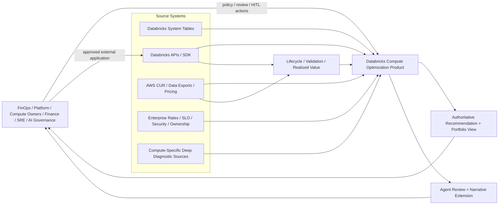

Source systems provide evidence; they do not own optimization decisions.

**Architecture ID:** `ARC-SYS-001`.

---

# 7. Mature Logical Architecture

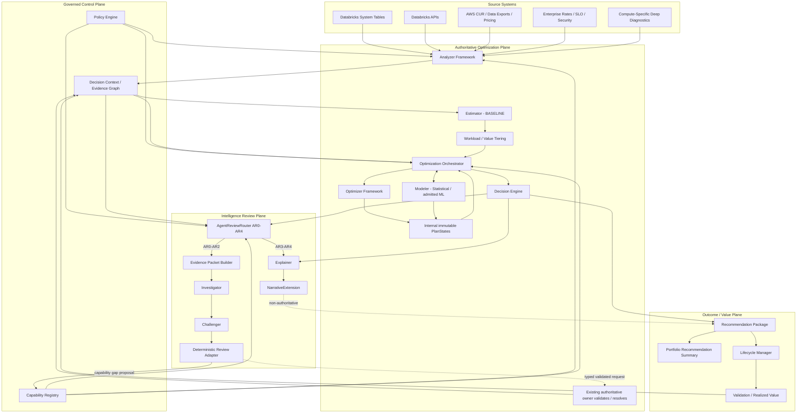

The Review Adapter never mutates `DecisionContext`. It may persist a non-executable gap proposal to Capability Registry or route a validated typed request to the **existing authoritative owner** (for example Policy, source/evidence handling, or Modeler fallback governance). Only that owner can establish new authoritative state; Context Builder then produces a new context/hash if the authoritative state materially changed.

**Architecture ID:** `ARC-PLAT-002`.

---

# 8. Component Ownership Matrix

| Architecture ID | Component | Owns | Does not own |
|---|---|---|---|
| `ARC-CMP-001` | Policy Engine | policy schema, precedence, resolution, hard guardrails, `PolicySnapshot`, `PolicyDiff` | facts, projections, money, configuration decision |
| `ARC-CMP-002` | Analyzer Framework | observed/derived deterministic facts, signals, findings, blockers, data quality | future prediction, config recommendation |
| `ARC-CMP-003` | Estimator | all authoritative dollar/economic calculations and modes | predicted quantities, candidate selection |
| `ARC-CMP-004` | Workload Tiering | deterministic T1–T4 priority/depth | LLM routing, optimization decision |
| `ARC-CMP-005` | Modeler | statistical/ML projections, uncertainty, applicability, fallback | final configuration, money |
| `ARC-CMP-006` | Optimizer Framework | technique-specific candidate generation/evaluation and one technique result | portfolio sequencing, final plan money |
| `ARC-CMP-007` | Optimization Orchestrator | execution, dependency ordering, bounded search, PlanStates, selective reevaluation | domain formulas, final plan ranking |
| `ARC-CMP-008` | Decision Engine | hard-gate final plan validation/ranking and material alternatives | optimizer execution, LLM routing |
| `ARC-CMP-009` | Recommendation Package | immutable consumer artifact from authoritative results | changing decisions/economics |
| `ARC-CMP-010` | Lifecycle Manager | lifecycle, lightweight change detection, application/drift, validation/realization coordination | Analyzer/Modeler/Estimator formulas |
| `ARC-CMP-011` | Capability Registry | executable capability inventory, applicability/version/dependency metadata, non-executable gap lifecycle | executable code creation, runtime recommendation decisions |
| `ARC-CMP-012` | AgentReviewRouter | deterministic AR0–AR4 classification, reasons, budgets, review reuse eligibility | LLM reasoning, workload T-tier |
| `ARC-CMP-013` | Evidence Packet Builder | bounded immutable review context and redaction/minimization | source-of-truth computation |
| `ARC-CMP-014` | Review Adapter | validate agent output/request semantics and route to existing authoritative owners | second Decision Engine, direct context mutation |
| `ARC-CMP-015` | Explainer | non-authoritative narrative from supplied structured context | new facts, configs, money |

---

# 9. Source and Adapter Architecture

The product has no standalone Source/Data Plane business component. Source access is infrastructure behind typed adapters.

```text
adapters/
├── DatabricksSystemTableAdapter
├── DatabricksComputeApiAdapter
├── AwsCurAdapter
├── AwsPricingAdapter
├── CommercialRateAdapter
├── WorkloadSloAdapter
├── SecurityEligibilityAdapter
└── DeepDiagnosticAdapter
      └── compute-pack-specific implementation
```

## 9.1 Source classes

| Source class | Shared-kernel expectation | SQLWH implementation |
|---|---|---|
| system tables | bounded, versioned query/extraction + provenance | warehouses, warehouse events, query history, billing usage/prices |
| APIs | point-in-time config/capability evidence | SQL Warehouses API/current fields |
| cloud economics | normalized financial evidence | AWS CUR/Data Exports/pricing for attributable Pro/Classic economics |
| enterprise metadata | explicit typed inputs | effective rates, SLO, security/network/ownership |
| deep diagnostics | common diagnostic evidence envelope | Phase-4 SQL query-execution/profile evidence |

## 9.2 Deep diagnostic distinction

Phase 4 is named **Deep Diagnostic Intelligence**, not Spark-event intelligence. Current Databricks documentation exposes SQL Warehouse analysis through query history and Query Profile/warehouse monitoring, while all-purpose/jobs compute expose separate compute/Spark metrics and Lakeflow pipelines expose a pipeline event log. Each pack therefore requires its own diagnostic adapter and source validation.

The HLA does **not** claim that every SQL Query Profile field is programmatically available to the product. The Phase-4 SQLWH TSD must validate the supported access/ingestion mechanism and fall back cleanly when deep diagnostic evidence is unavailable.

**Architecture IDs:** `ARC-SRC-001`, `ARC-DIAG-001`  
**PRD trace:** `PRD-FR-PROD-044`, `068`, `PRD-NFR-PROD-045`.

---

# 10. Shared Optimization Kernel

The kernel shares **contracts, governance, orchestration semantics, evaluation rules, and lifecycle patterns**. It does not force compute-specific algorithms into one implementation.

## 10.1 Shared vs pack-owned boundary

| Concern | Shared Kernel | Capability Pack |
|---|---|---|
| source contract | envelope, provenance, adapter interface | exact tables/APIs/fields/retention/fallback |
| identity/config | common resource envelope | service configuration schema |
| analyzer | result contract + execution framework | metrics/formulas/analyzers |
| estimator | financial arithmetic/modes | billable quantity attribution |
| tiering | deterministic priority interface | optional service factors |
| modeler | prediction/fallback/governance contract | features/models/statistical methods |
| optimizer | result/search protocol | optimization techniques/candidate domains |
| orchestration | dependency/search/PlanState/selective reevaluation | service dependency graph |
| decision | gates/ranking framework | service compatibility constraints |
| review | AR classes/roles/contracts/evaluation | service evidence payload |
| recommendation | common envelope | target config/actions |
| lifecycle | state/invalidation/realization framework | service config fingerprint/validation specifics |
| diagnostics | `DiagnosticEvidence` envelope | SQL/Spark/pipeline/serverless adapter |
| golden | invariant/evaluation framework | service fixtures/scenarios |

## 10.2 Normative implementation boundary — one implementation, no duplicate services

The Kernel/Pack split is a **composition boundary, not a request to implement the product twice**.

> **Kernel defines reusable engines/contracts. A Capability Pack supplies only compute-specific implementations or extension providers. A capability ID has exactly one executable implementation in a release.**

| Rule | Requirement |
|---|---|
| `KERNEL-PACK-01` | Kernel MUST contain no SQL Warehouse-specific analyzer formula, optimizer technique, SQL/source mapping, or warehouse configuration rule. |
| `KERNEL-PACK-02` | SQL Warehouse A00–A16 and O1–O7 implementations live only under `packs/sql_warehouse/`; they MUST NOT have mirror implementations under `kernel/`. |
| `KERNEL-PACK-03` | Shared services such as Capability Registry, DecisionContext hashing, Orchestrator, Decision Engine, Lifecycle state machine, and Intelligence Review runtime are implemented once in Kernel. |
| `KERNEL-PACK-04` | Where a shared service needs SQLWH behavior, the pack supplies a narrowly named provider/profile/adapter, not a second copy of the shared service. |
| `KERNEL-PACK-05` | The SQL Warehouse capability manifest is co-located at `packs/sql_warehouse/manifest.yaml` and points to each executable capability implementation exactly once. No parallel `capabilities/sql_warehouse/` implementation tree exists. |
| `KERNEL-PACK-06` | Runtime composition discovers pack implementations through the released manifest/Registry; Kernel business modules MUST NOT statically import concrete SQL Warehouse implementation modules. |
| `KERNEL-PACK-07` | A pack may depend only on published Kernel contracts/interfaces plus approved infrastructure libraries; it MUST NOT depend on Kernel internals. |
| `KERNEL-PACK-08` | Packs MUST NOT import or call another pack directly. Future cross-compute optimization requires a separately approved cross-compute capability. |
| `KERNEL-PACK-09` | Shared Investigator/Challenger/Explainer execution infrastructure is implemented once. The SQLWH pack contributes its evidence projection/service profile; it does not implement duplicate agents. |
| `KERNEL-PACK-10` | Adding a new compute type SHOULD require a new pack and manifest, not modification of Kernel business logic unless a genuinely reusable Kernel contract is missing. |

**Architecture ID:** `ARC-KERNEL-001`.

---

# 11. Capability Registry Architecture

Capability Registry is a first-class Shared-Kernel component from Phase 1.

## 11.1 Two authorities

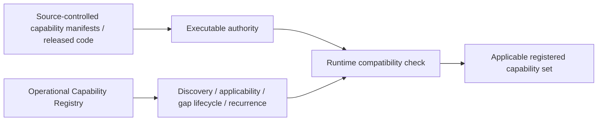

A runtime database row cannot make code executable. Source-controlled/released artifacts establish executable authority; the operational registry records applicability, versions, gaps, lifecycle, recurrence, and links to released implementations.

## 11.2 Capability categories

```text
REGISTERED_CAPABILITY
├── ANALYZER
├── OPTIMIZER
├── MODELER_CAPABILITY
├── SOURCE_EVIDENCE_CAPABILITY
└── other explicitly approved extension

CAPABILITY_GAP
├── ANALYZER
├── OPTIMIZER
├── SOURCE_EVIDENCE
└── POLICY
```

Policy gaps are tracked in the registry, while resolved policy values remain owned by Policy Engine.

## 11.3 Gap lifecycle

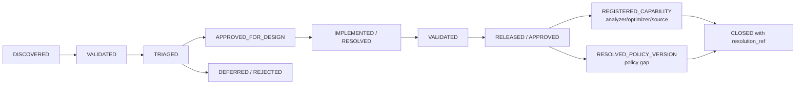

## 11.4 Durable gap behavior

An open material gap is **deterministic durable context**. Subsequent review packets include the gap reference. A structured `gap_signature` deduplicates semantically equivalent observations using fields such as:

```text
compute_type
+ gap_type
+ decision_domain
+ missing_capability_semantic
+ affected_optimizer/capability IDs
```

New observations attach evidence, affected-resource count, recurrence, and value/risk exposure to the existing gap rather than creating duplicate gaps.

If the known gap already fully explains the unresolved concern, routing policy may reuse the prior review or suppress duplicate deep review unless materially new evidence/context appears.

## 11.5 Gap closure and optimization impact

A gap has no effect on executable optimizer logic at discovery time. Analyzer/optimizer/source-evidence gaps may close through a designed, implemented, tested, released, and registered capability. A policy gap closes through an approved versioned Policy change and records that policy version as its `resolution_ref`. When a newly released capability or resolved policy is applicable to previously affected decisions:

```text
registry version changes
→ applicable capability set changes
→ DecisionContext changes
→ authoritative_context_hash changes
→ Orchestrator selectively reevaluates affected decisions
```

**Architecture ID:** `ARC-CAP-001`  
**PRD trace:** `PRD-FR-PROD-047..049`, `061..062`, `PRD-FR-CAP-001..009`, `PRD-NFR-PROD-031..032`.

---

# 12. Decision Context and Evidence Graph

## 12.1 DecisionContext

`DecisionContext` is the canonical authoritative envelope for one optimization decision scope.

```text
DecisionContext
├── context_id / schema_version
├── resource identity
├── observation window / source snapshot refs
├── current effective configuration
├── PolicySnapshot ref/hash
├── applicable RegisteredCapability set + versions
├── AnalyzerResult refs
├── admitted statistical/ML ModelerResult refs
├── financial basis / Estimator refs
├── candidate-domain definition
├── prior material validation/realization refs where applicable
└── dependency/version lineage
```

The full internal candidate search is not duplicated inside DecisionContext; PlanState lineage is linked from it.

## 12.2 Authoritative context hash

```text
authoritative_context_hash = deterministic_digest(
    canonical resource/config/source state,
    relevant PolicySnapshot fields/version,
    applicable capability set/versions,
    deterministic facts,
    admitted predictive result refs/versions,
    financial basis,
    candidate domain,
    material prior validation state
)
```

LLM findings, narratives, prose, hidden reasoning, and unvalidated agent requests are excluded.

```text
if new_authoritative_context_hash == previous_authoritative_context_hash:
    authoritative_recompute = false
```

A model/prompt/schema change may change `agent_review_fingerprint` without changing `authoritative_context_hash`.

## 12.3 Evidence Graph

Evidence Graph is a logical lineage model, not a graph-database mandate:

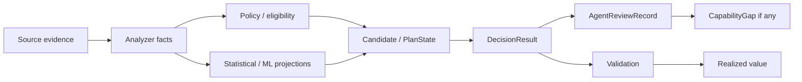

## 12.4 Valid context changes

Examples:

- material new source evidence;
- validated source/input correction;
- effective configuration change;
- workload/regime change;
- material financial/rate basis change;
- policy resolution/change affecting valid domain;
- approved statistical fallback replacing an ML signal for the decision;
- relevant validation/realized outcome change;
- newly released applicable capability.

An LLM request alone is **not** a context change.

**Architecture ID:** `ARC-DCTX-001`  
**PRD trace:** `PRD-FR-PROD-051..052`, `058`, `060`, `062`, `PRD-FR-CTX-001..006`, `PRD-NFR-PROD-033`.

---

# 13. Deterministic Execution Semantics

## 13.1 Applicable means execute

The runtime computes the applicable capability set from:

```text
Capability Registry
+ PolicySnapshot
+ compute type
+ current configuration
+ phase/feature gates
+ dependency rules
+ source availability / blockers
```

For each registered analyzer/optimizer:

```text
APPLICABLE       → execute
NOT_APPLICABLE   → persist deterministic reason
BLOCKED          → persist blocker/evidence
FEATURE_GATED    → persist deterministic gate reason
```

An otherwise applicable analyzer/optimizer is not silently omitted to save compute. T1–T4 may change **candidate breadth, model depth, optional ML invocation, or search caps**, but every applicable optimization technique still reaches a deterministic technique result.

## 13.2 Why selective reevaluation is still valid

Selective reevaluation after a context change is not “skip capabilities.” It means the dependency graph identifies which prior results remain valid and which require recomputation.

Example:

```text
commercial rate only changes
→ Analyzer operational facts remain valid
→ Modeler quantities remain valid
→ Estimator affected
→ Decision ranking may be affected
```

A weekly full refresh may re-establish the complete applicable result set; context-driven runs reuse valid immutable results when their dependency inputs are unchanged.

**Architecture ID:** `ARC-EXEC-001`.

---

# 14. Internal PlanState and Orchestrator

## 14.1 PlanState meaning

`PlanState` remains an **internal Orchestrator search construct**, retained from the SQL Warehouse architecture because portfolio sequencing and incremental economics require a complete candidate effective configuration.

```text
PlanState
├── plan_state_id
├── parent_plan_state_id
├── complete effective target configuration
├── applied optimizer decisions
├── Analyzer/Modeler refs
├── candidate economics refs
├── guardrail status
├── dependencies / invalidations
└── lineage/config hash
```

It is not a lifecycle state, user-facing scope, agent state, or durable “memory.”

## 14.2 SQLWH PlanState sequence

```text
PS-000 baseline
  ↓ O1 Warehouse Type
PS-010
  ↓ O5 Photon
PS-020
  ↓ O2 Capacity Bundle
PS-030
  ↓ O4 Spot
PS-040
  ↓ O3 Auto-Stop
PS-050 candidate final plan

O7 remains protective/separate.
Phase 5 inserts O6 as the structural predecessor.
```

## 14.3 Orchestrator responsibilities

- establish the applicable capability set;
- execute all applicable analyzers/optimizers under deterministic rules;
- coordinate Modeler/Estimator calls;
- build immutable PlanStates;
- run standalone and portfolio lanes;
- enforce dependency order;
- bound candidate search deterministically;
- apply feasibility/dominance/branch-and-bound pruning;
- maintain complete evaluation and why-not-selected lineage;
- perform dependency-directed selective reevaluation after genuine context changes;
- reject no-context-change recomputation requests.

## 14.4 T1–T4 behavior

Workload/value tiering may control:

- number of deterministic candidates within an optimizer's valid domain;
- search beam/cap limits;
- depth of statistical counterfactual analysis;
- eligibility for optional admitted ML;
- scheduling/parallelism priority.

It does **not** mean “do not run O4 because this is T4” when O4 is otherwise applicable. The optimizer may execute with a minimal bounded candidate domain and return `NO_CHANGE`/`NOT_APPLICABLE`/`BLOCKED` deterministically.

**Architecture IDs:** `ARC-STATE-001`, `ARC-CMP-007`  
**PRD trace:** `PRD-FR-KORCH-001..005`, `PRD-FR-ORCH-*`, `PRD-FR-PROD-015..018`, `049`.

---

# 15. Statistical / ML Predictive Plane

The Modeler is one logical component with a stable contract.

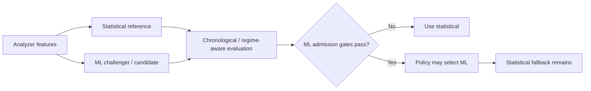

The Modeler predicts quantities/outcomes. Estimator prices quantities. Optimizer/Decision Engine own configuration selection.

Phase-3 review may issue `REQUEST_STATISTICAL_FALLBACK` only when cited evidence identifies a material ML applicability/calibration/OOD concern. Review Adapter validates the concern; Modeler policy determines whether fallback is reevaluated. The LLM cannot edit model predictions or select a replacement model.

**Architecture ID:** `ARC-AI-ML-001`.

---

# 16. Estimator and Financial Authority

Estimator remains the single owner of authoritative money.

Modes retained:

```text
BASELINE
CANDIDATE
INDEPENDENT
SEQUENCED
AUTHORITATIVE_PLAN
FORWARD
REALIZED
PROTECTIVE
```

Key invariants:

```text
IndependentSavings(Ri)
= Cost(CurrentState) - Cost(ApplyOnly(Ri, CurrentState))
```

```text
IncrementalSavings(i)
= Cost(PlanState[i-1]) - Cost(PlanState[i])
```

```text
TotalPlanSavings
= Cost(Baseline) - Cost(FinalTarget)
= SUM(IncrementalSavings)
```

Economic savings, cash-realizable savings, and commitment capacity freed remain distinct where material. LLM output never supplies cost or savings values.

**Architecture ID:** `ARC-CMP-003`.

---

# 17. Decision Engine

Decision Engine receives fully evaluated surviving PlanStates and authoritative Estimator results.

```text
1. hard gates
   eligibility
   security/compliance
   performance/SLA
   reliability
   headroom
   minimum evidence/confidence

2. among valid plans
   maximize authoritative annual net economic savings

3. near-equivalent tie break
   lower risk
   → higher confidence
   → lower effort
   → lower disruption
   → stable deterministic identity
```

The Decision Engine publishes structured decision/risk/confidence/alternative evidence consumed by AgentReviewRouter. It does not decide LLM invocation itself.

A Phase-3 `REQUEST_BLOCK` is advisory. Review Adapter validates it and routes the cited concern to deterministic Policy/Decision logic. Only the authoritative plane can convert it into a blocker.

**Architecture ID:** `ARC-CMP-008`.

---

# 18. Intelligence Review Plane

## 18.1 Architectural placement

Review starts **after an authoritative DecisionResult exists** and before/alongside reviewer-facing recommendation issuance. Initial Phase-3 deep review is shadow/advisory; progressive trust may later gate reviewer readiness for policy-selected high-risk classes, but deterministic computation never depends on LLM availability.

## 18.2 AgentReviewRouter

Agent routing is deterministic and policy-driven.

| Class | Meaning | Default flow |
|---|---|---|
| `AR0 DEEP_CRITICAL` | extreme value / critical safety exposure | Investigator → Challenger → Review Adapter → Explainer |
| `AR1 DEEP_MATERIAL` | material + meaningful complexity/risk/conflict | Investigator → Challenger → Review Adapter → Explainer |
| `AR2 DEEP_STANDARD` | standard deep review / explicit escalation | Investigator → Challenger → Review Adapter → Explainer |
| `AR3 EXPLAIN_ONLY` | no deep review justified | Explainer |
| `AR4 NO_CHANGE_OR_BLOCKED` | deterministic no-change/no-op/blocked | Explainer |

Default policy shape:

```text
deep_review =
    EXTREME_VALUE
 OR (MATERIAL_VALUE AND (
        AMBIGUITY
     OR CONFLICTING_EVIDENCE
     OR ELEVATED_RISK
     OR ML_UNCERTAINTY
     OR PRIOR_FAILURE))
 OR SAFETY_ESCALATION
 OR HUMAN_ESCALATION
```

T1–T4 workload/value tier is one possible routing input; it is not an alias for AR0–AR4.

## 18.3 Evidence packet

Phase 3 is packet-only. Packet structure:

```text
AgentEvidencePacket
├── common envelope
│   ├── DecisionResult
│   ├── DecisionContext ref/hash
│   ├── current + selected target config
│   ├── authoritative economics
│   ├── AnalyzerResult summaries
│   ├── statistical/ML summaries + uncertainty/applicability
│   ├── material alternatives + why-not-selected
│   ├── standalone optimizer outcomes
│   ├── relevant resolved Policy fields
│   ├── prior relevant validation/realization
│   └── known open CapabilityGaps
└── service_evidence
    └── SQLWarehouseEvidence in current implementation
```

Raw SQL/log/user text is minimized/redacted by default. Phase 3 exposes no callable tools and no autonomous long-term memory.

## 18.4 Investigator

Investigator asks: **is this selected deterministic decision adequately supported?**

It may identify:

- missing/contradictory evidence;
- representativeness/regime concerns;
- ML applicability/calibration/OOD concerns;
- policy/source uncertainty;
- safety/validation focus;
- analyzer/optimizer/source/policy capability gaps.

It may not generate replacement configuration, savings, policy thresholds, or numeric final confidence.

## 18.5 Challenger

Challenger receives both the original immutable packet and the validated Investigator output, and is instructed to independently attempt falsification rather than simply critique the Investigator.

## 18.6 Allowed request semantics

```text
REQUEST_MORE_EVIDENCE
REQUEST_INPUT_CORRECTION
REQUEST_POLICY_RESOLUTION
REQUEST_STATISTICAL_FALLBACK
REQUEST_BLOCK
ANALYZER_CAPABILITY_GAP
OPTIMIZER_CAPABILITY_GAP
SOURCE_EVIDENCE_GAP
POLICY_GAP
NO_CHANGE
```

Explicitly prohibited:

```text
GENERIC_RERUN
RUN_EXISTING_ANALYZER
RUN_EXISTING_OPTIMIZER
```

## 18.7 Review Adapter vs authoritative recomputation

Two separate operations exist:

**A. Review validation** — validates schema/evidence/provenance/prohibited mutation/request/materiality/known-gap behavior. This does not rerun optimization.

**B. Selective authoritative reevaluation** — occurs only after an existing authoritative owner accepts a change that produces a new context hash.

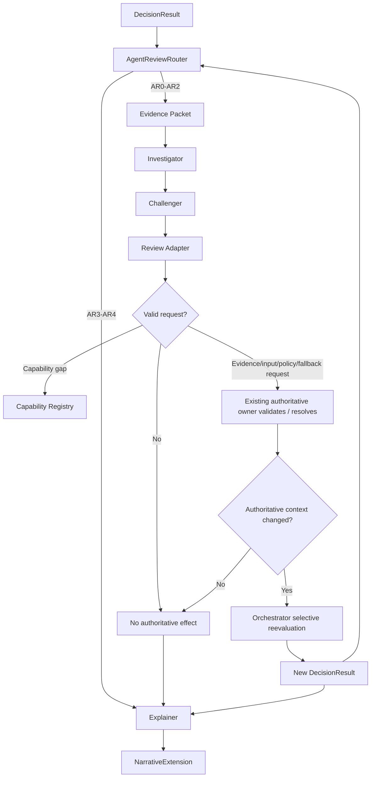

## 18.8 Review state separation

```text
LifecycleState       = recommendation/application/value lifecycle
AgentReviewStatus    = LLM review workflow
CapabilityGapStatus  = missing-capability lifecycle
PlanState            = internal deterministic candidate state
ModelLifecycle       = ML model governance
```

They must never be overloaded into one status enum.

## 18.9 Explanation

Explainer consumes only authoritative structured explanation context plus validated review summaries. `NarrativeExtension` is separately versioned and may be regenerated without modifying the immutable authoritative values.

**Architecture IDs:** `ARC-AI-LLM-001`, `ARC-FLOW-AGENT-001`  
**PRD trace:** `PRD-FR-PROD-053..067`, `PRD-FR-ARR-*`, `PRD-FR-AEP-*`, `PRD-FR-INV-*`, `PRD-FR-CH-*`, `PRD-FR-RA-*`, `PRD-FR-EXP-*`, `PRD-FR-AIGOV-*`.

---

# 19. Recommendation and Portfolio Architecture

`RecommendationPackage` remains the immutable authoritative consumer artifact. Phase 3 adds linked, non-authoritative review metadata rather than embedding LLM prose as decision truth.

```text
RecommendationPackage
├── authoritative plan
├── standalone recommendations
├── material alternatives
├── protective recommendations
├── blocked/no-change results
├── current/target config
├── authoritative economics
├── confidence/risk/effort/savings labels
├── evidence + why-not-selected
├── apply/validate/rollback metadata
├── lineage
├── agent_review_status
├── agent_review_record_id          # optional
└── narrative_extension_id          # optional
```

The portfolio summary remains a deterministic read model derived from warehouse packages and may display:

```text
recommendation_status
agent_review_status
agent_review_class
material review finding indicator
narrative availability
```

It does not recompute money or recommendations.

**Architecture ID:** `ARC-CMP-009`, `ARC-VIEW-001`.

---

# 20. Lifecycle, Validation, and Realized Value

Lifecycle Manager retains the approved state machine and lightweight change-detection ownership.

LLM review status remains orthogonal. A pending/failed LLM review cannot corrupt lifecycle state.

Realized-value flow:

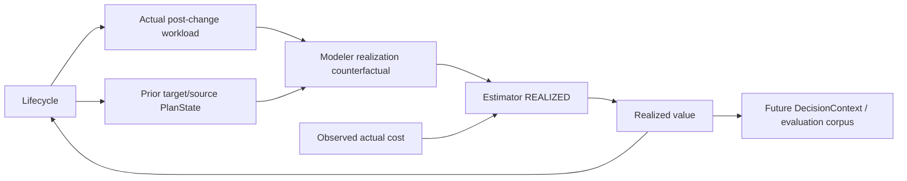

A recommendation cannot become `REALIZED` simply because spend decreased; required performance/reliability validation must pass.

**Architecture ID:** `ARC-CMP-010`.

---

# 21. SQL Warehouse End-to-End Flow by Phase

## 21.1 Phase 1 — deterministic + statistical fast value

```mermaid
sequenceDiagram
    autonumber
    participant SRC as SQLWH Sources / Adapters
    participant POL as Policy
    participant CAP as Capability Registry
    participant ANA as Analyzer
    participant EST as Estimator
    participant T as Tiering
    participant OR as Orchestrator
    participant MOD as Statistical Modeler
    participant OPT as Optimizers
    participant DEC as Decision
    participant REC as Recommendation

    POL->>POL: Resolve PolicySnapshot
    CAP->>OR: Released/applicable capability metadata
    SRC->>ANA: Bounded source evidence
    ANA->>ANA: Execute all applicable SQLWH analyzers
    ANA-->>EST: CostEvidence
    EST->>EST: BASELINE TTM-365
    EST-->>T: Authoritative baseline
    ANA-->>OR: AnalyzerResults
    T-->>OR: T1-T4 depth
    loop every applicable SQLWH optimizer
        OR->>OPT: Evaluate against PlanState / baseline lane
        OPT->>MOD: Counterfactual when required
        MOD-->>OPT: Statistical result
        OPT->>EST: Candidate economics
        EST-->>OPT: CostEstimate
        OPT-->>OR: CHANGE / NO_CHANGE / BLOCKED / NOT_APPLICABLE
    end
    OR-->>DEC: Fully evaluated PlanStates + standalone results
    DEC->>EST: Authoritative/sequenced economics
    EST-->>DEC: Final economics
    DEC-->>REC: DecisionResult
    REC->>REC: Package + portfolio read model
```

## 21.2 Phase 2 — DAB/PySpark/Delta + ML

- migrate product-owned state/results to UC managed Delta;
- preserve pandas↔PySpark semantic parity;
- use Lakeflow Jobs through Declarative Automation Bundles;
- retain query-in-place system tables by default;
- admit ML selectively behind Modeler only after quality gates;
- keep statistical fallback operational.

## 21.3 Phase 3 — Intelligence Review Plane

```text
DecisionResult
→ AgentReviewRouter
→ AR0-AR2: packet → Investigator → Challenger → Review Adapter
→ AR3-AR4: Explainer
→ NarrativeExtension
→ Recommendation/portfolio review metadata
```

Shadow/advisory mode is first. Later safety-gating eligibility requires explicit evaluation evidence and policy.

## 21.4 Phase 4 — Deep Diagnostic Intelligence

SQLWH deep diagnostic evidence is normalized through an approved SQL-specific adapter before deterministic Analyzer enrichment or LLM diagnostic review. Core system-table path remains a fallback unless policy declares the diagnostic evidence mandatory for a specific capability.

## 21.5 Phase 5 — Warehouse topology

A15 → M06 → O6 evaluates split/merge/placement, then target warehouses run through O1→O5→O2→O4→O3. O7 remains protective/separate.

## 21.6 Phase 6 — Portfolio Copilot + bounded tools

Interactive read-only Copilot and optional bounded typed evidence tools may be introduced only through separate feature gates/evaluation. Tools do not inherit authority from the scheduled review plane.

**Architecture ID:** `ARC-MIG-002`.

---

# 22. Six-Phase Runtime Evolution

| Phase | SQLWH capability | Runtime / persistence | Intelligence boundary |
|---|---|---|---|
| 1 | deterministic A00–A14/A16, O1–O5/O7, statistical Modeler, portfolio report, Registry baseline | SQL Warehouse + bounded Arrow/pandas + local StateRepository | no ML/LLM dependency |
| 2 | distributed parity + governed ML | DAB + Lakeflow Jobs classic jobs compute + PySpark + UC managed Delta | ML optional; statistical fallback |
| 3 | AgentReviewRouter, packets, Investigator, Challenger, Review Adapter, Explainer, gap lifecycle | Phase-2 runtime + governed model access + MLflow tracing/eval | packet-only, no tools/memory |
| 4 | SQLWH Deep Diagnostic Intelligence | governed diagnostic evidence | deterministic enrichment + bounded LLM review |
| 5 | A15/M06/O6 topology | multi-warehouse Delta state/results | existing review plane may review O6 result |
| 6 | Portfolio Copilot + bounded tools | governed app/tool transport | read-only, independently gated |

The prior five-phase ADR-006 is superseded at the **product sequencing level** by PRD/HLA v2.0.0. Its underlying decision to defer topology remains preserved as Phase 5. The packaged ADR-006 carries an explicit v2 disposition: its five-phase sequence is superseded; the Phase-5 topology deferral remains retained.

---

# 23. Persistence Architecture

## 23.1 Phase 1

Local pluggable `StateRepository` persists compact authoritative artifacts:

- run/source manifests;
- `PolicySnapshot`;
- executable capability manifest snapshot;
- Analyzer/Estimator/Tier/Modeler/Optimizer/PlanState/Decision results needed for replay;
- immutable RecommendationPackage per warehouse;
- PortfolioRecommendationSummary JSON/CSV/Markdown;
- lifecycle/realized-value state.

No mandatory intermediate Delta layer.

## 23.2 Phase 2+

Unity Catalog managed Delta is the default product-owned durable store. System tables remain query-in-place by default rather than being copied merely for architectural symmetry.

New v2 persistence families to add downstream:

| Logical family | Phase | Purpose |
|---|---:|---|
| capability registry | 2 persistence / Phase-1 logical | released capability snapshot + operational metadata |
| capability gap | 3 | durable gap lifecycle/recurrence/evidence |
| decision context | 2 | canonical context + hash/dependency metadata |
| evidence graph edge/index | 2 | logical lineage indexes where useful |
| agent routing decision | 3 | AR class/reasons/budget/policy |
| agent evidence packet manifest | 3 | packet digest/refs/redaction metadata |
| agent review result | 3 | Investigator/Challenger structured outputs + validation |
| agent action/request | 3 | typed request + Review Adapter disposition |
| narrative extension | 3 | separately versioned explanation |
| agent evaluation/outcome feedback | 3 | quality/cost/safety feedback |
| diagnostic evidence | 4 | compute-specific normalized deep diagnostics |

Physical DDL belongs to `TS-DATA` during Gate 4.

**Architecture ID:** `ARC-DATA-003`.

---

# 24. Runtime and Deployment Architecture

## 24.1 Phase 1

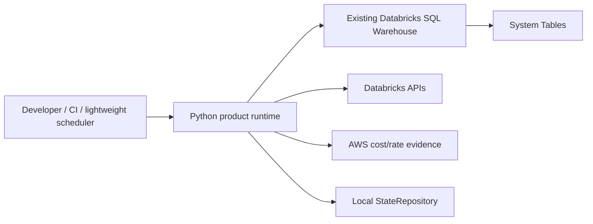

Use SQL pushdown first, bounded Arrow/pandas second. Do not materialize unbounded raw query history locally.

## 24.2 Phase 2+

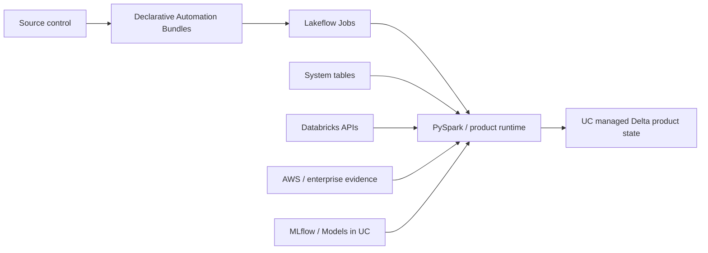

Databricks currently documents Declarative Automation Bundles as a source-controlled mechanism for describing Databricks resources and CI/CD workflows; exact resource definitions remain TSD/release concerns.

## 24.3 Phase 3 model access

```text
AgentModelClient
→ policy-selected governed model route
→ structured output when supported
→ local JSON Schema/Pydantic validation
→ semantic/evidence validation
→ MLflow trace/evaluation
```

Provider/model names are policy/configuration, not embedded in business contracts.

**Architecture IDs:** `ARC-RUN-001`, `ARC-RUN-002`, `ARC-RUN-003`.

---

# 25. Repository Architecture

The repository MUST make the implementation boundary obvious to an engineer reading the tree.

There is **one shared Kernel implementation** and **one SQL Warehouse Capability Pack implementation**. The pack is plugged into the Kernel; it is not a copy of the Kernel.

```text
databricks-compute-optimizer/
├── pyproject.toml
├── README.md
├── CLAUDE.md
│
├── src/databricks_compute_optimizer/
│   ├── kernel/
│   │   ├── contracts/                     # public Python contracts/interfaces
│   │   ├── capability_registry/           # shared registry + gap lifecycle engine
│   │   ├── decision_context/              # canonicalization/hash/diff/evidence graph
│   │   ├── policy/                        # shared Policy engine/resolution mechanics
│   │   ├── analyzer_framework/            # analyzer execution protocol only
│   │   ├── financial/                     # shared Estimator engine/modes/Decimal math
│   │   ├── tiering/                       # shared deterministic tiering engine
│   │   ├── modeler_framework/             # model admission/fallback interfaces
│   │   ├── optimizer_framework/           # optimizer protocol/result semantics
│   │   ├── orchestrator/                  # shared dependency/search/PlanState engine
│   │   ├── decision/                      # shared constraint/ranking engine
│   │   ├── recommendation/                # shared package assembly framework
│   │   ├── lifecycle/                     # shared state machine/realization coordination
│   │   ├── intelligence_review/           # router/role runner/review adapter/model client
│   │   └── evaluation/                    # shared deterministic/golden/AI eval framework
│   │
│   ├── packs/
│   │   └── sql_warehouse/
│   │       ├── manifest.yaml              # sole SQLWH executable capability manifest
│   │       ├── contracts/                 # SQLWH-only config/evidence extensions
│   │       ├── adapters/                  # SQLWH system tables/API/AWS source adapters
│   │       ├── analyzers/                 # A00–A16 implementations
│   │       ├── modeler/                   # SQLWH statistical/ML capability implementations
│   │       ├── optimizers/                # O1–O7 implementations
│   │       ├── financial/                 # SQLWH quantity/cost-attribution provider
│   │       ├── policy/                    # SQLWH policy schema extensions/default profile
│   │       ├── recommendation/            # SQLWH config delta/application serialization
│   │       ├── lifecycle/                 # SQLWH config match/validation provider
│   │       ├── diagnostics/               # Phase-4 SQLWH diagnostic adapter/extractors
│   │       └── intelligence_review/       # SQLWH evidence projection/service profile only
│   │
│   ├── repositories/                      # local + Delta infrastructure implementations
│   └── runtime/                           # composition root / CLI / DAB job entrypoints
│
├── contracts/                             # JSON Schemas / wire contracts; no business impl
│   ├── capability/
│   ├── decision_context/
│   └── intelligence_review/
│
├── sql/
│   └── sql_warehouse/                     # versioned SQL templates used by SQLWH adapters
│
├── deploy/databricks/
│
├── tests/
│   ├── architecture/                      # import-boundary + manifest uniqueness tests
│   ├── unit/
│   ├── contract/
│   ├── component/
│   ├── integration/
│   ├── golden/
│   ├── adversarial/
│   └── parity/
│
└── docs/
    ├── prd/
    ├── architecture/
    ├── adr/
    ├── tech-specs/
    ├── releases/
    └── golden-tests/
```

### 25.1 How composition works

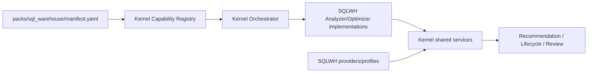

The manifest is metadata that points to the actual implementation in `packs/sql_warehouse/*`; it is **not** another code implementation.

Example:

```yaml
pack:
  id: SQL_WAREHOUSE
  version: 2.0.0

capabilities:
  - id: SQLWH-A07
    type: ANALYZER
    implementation:
      module: databricks_compute_optimizer.packs.sql_warehouse.analyzers.a07_queue_capacity
      symbol: QueueCapacityAnalyzer

  - id: SQLWH-O02
    type: OPTIMIZER
    implementation:
      module: databricks_compute_optimizer.packs.sql_warehouse.optimizers.o02_capacity_bundle
      symbol: CapacityBundleOptimizer
```

Exactly one released manifest entry may resolve to an executable implementation for a `(capability_id, semantic_version)`.

### 25.2 What is implemented now

Only `kernel/` and `packs/sql_warehouse/` are implementation scope. Do **not** create empty future-pack directories merely to mirror the product vision.

**Architecture ID:** `ARC-REPO-003`.

---

# 26. Code Dependency and Anti-Duplication Rules

```text
kernel public contracts      ← importable by packs/runtime
kernel services              ← depend on contracts/interfaces, never concrete pack modules
pack implementations         ← depend on Kernel public contracts/interfaces
repositories                 ← infrastructure; implement Kernel repository ports
runtime/composition          ← may load the selected pack manifest and wire implementations
pack A                       ← MUST NOT import pack B
```

### 26.1 Required CI architecture tests

Build MUST fail when any of the following occurs:

1. a Kernel business module imports `packs.sql_warehouse` directly;
2. a SQLWH Analyzer/Optimizer implementation exists outside `packs/sql_warehouse`;
3. two manifest entries resolve the same `(capability_id, semantic_version)` to different implementations;
4. a manifest references a missing implementation symbol;
5. a pack imports another compute pack;
6. SQL Warehouse-specific source/table/config identifiers leak into Kernel modules except intentionally generic test fixtures;
7. a pack reimplements a shared Kernel service instead of implementing its published provider/interface;
8. a future pack is marked `RELEASED` without approved source-study/ADR/TSD/release/golden provenance.

Suggested tests:

```text
tests/architecture/test_kernel_does_not_import_packs.py
tests/architecture/test_pack_dependency_boundaries.py
tests/architecture/test_capability_manifest_uniqueness.py
tests/architecture/test_manifest_symbols_resolve.py
tests/architecture/test_no_duplicate_capability_implementation.py
```

### 26.2 Shared Intelligence Review rule

`kernel/intelligence_review/` owns router mechanics, role runner/orchestration, model client, Review Adapter mechanics, budgets/caching, and common validation/evaluation.

`packs/sql_warehouse/intelligence_review/` owns only SQLWH-specific evidence projection, service terminology/profile, optional prompt-context additions, and diagnostic evidence mapping.

There is no separate SQLWH Investigator/Challenger/Explainer implementation.

**Architecture ID:** `ARC-REPO-004`.

---

# 27. Security and AI Governance

## 27.1 General

- least-privilege identities;
- governed secrets; no credentials in prompts/artifacts;
- explicit system-table/API permissions;
- source-query/result minimization;
- production mutation remains HITL;
- Preview/Beta features policy-gated.

## 27.2 Phase-3 LLM controls

- packet-only Investigator/Challenger;
- no callable tools;
- no arbitrary SQL/shell/code execution;
- evidence treated as untrusted data, never instructions;
- raw query/log/user text minimized/redacted;
- model routes allowlisted by policy;
- structured outputs validated locally even when provider supports schema constraints;
- all accepted material findings cite governed evidence refs;
- hidden chain-of-thought is neither stored nor required;
- prompt/model/schema/router versions pinned per review;
- per-review and portfolio budgets enforced before invocation;
- malformed/prohibited output has zero authoritative effect.

## 27.3 Phase 6 tools

Any future tool access uses bounded typed read-only capabilities, ideally over curated views/functions. Copilot tool permissions and scheduled Investigator/Challenger tool permissions are separately feature-gated; one does not automatically grant the other.

**Architecture ID:** `ARC-SEC-002`.

---

# 28. Observability and Evaluation

Every authoritative invocation carries correlation and version fields such as:

```text
run_id
resource_id
DecisionContext_id
authoritative_context_hash
policy_snapshot_id
capability_registry_version
capability_id/version
plan_state_id
DecisionResult_id
RecommendationPackage_id
agent_review_id / agent_review_fingerprint
model/prompt/schema/router versions where applicable
```

## 28.1 Deterministic/ML telemetry

- source quality/coverage;
- applicable capabilities and statuses;
- candidates generated/pruned/evaluated;
- Modeler/Estimator calls;
- context hash changes/suppressed recomputation;
- runtime/cost;
- lifecycle/realized metrics;
- ML calibration/OOD/fallback/drift.

## 28.2 LLM telemetry

- AR class/reasons;
- packet digest/size;
- model/prompt/schema versions;
- tokens/latency/cost/retries;
- schema/evidence/semantic validation;
- request type and Review Adapter disposition;
- false-block / missed-risk / unsafe-pass outcomes;
- gap discoveries/duplicates;
- narrative echo/grounding score.

Databricks currently documents MLflow Tracing as end-to-end observability for GenAI applications and MLflow evaluation/monitoring as building on tracing. These platform services are implementation candidates; core correctness does not depend on preview-only monitoring features.

**Architecture ID:** `ARC-OBS-002`.

---

# 29. Reliability, Idempotency, and Failure Boundaries

| Failure | Required behavior |
|---|---|
| source missing/stale | explicit blocker/degraded state; no fabricated facts |
| one warehouse fails | isolate failure; unrelated warehouse recommendations remain valid |
| ML unavailable/OOD | statistical fallback according to Policy |
| LLM unavailable | deterministic recommendation persists; review/explanation pending/failed |
| invalid agent JSON/schema | reject; zero authoritative effect |
| invalid evidence ref | reject material finding/request |
| `REQUEST_BLOCK` unsupported | advisory request rejected/no authoritative block |
| same context hash | no authoritative recomputation |
| duplicate capability gap | attach occurrence/evidence to existing gap |
| capability registry/code mismatch | run compatibility failure; do not execute unverified capability |
| model/prompt changes mid-review | pin original versions; do not mix in one review chain |
| Phase-4 diagnostic source unavailable | fall back to earlier evidence path unless specific capability requires it |

Idempotency keys must prevent duplicate authoritative state, duplicate gap records, duplicate agent action requests, and double-counted realized value.

**Architecture ID:** `ARC-REL-002`.

---

# 30. Scalability and Cost Governance

Scaling principles:

- SQL pushdown and bounded extraction;
- per-resource partitioning;
- deterministic candidate caps/branch-and-bound;
- T1–T4 controls candidate/model depth, not capability omission;
- Phase-2 PySpark for data-intensive transformations;
- batch-first ML/LLM paths;
- AR0–AR4 controls LLM review intensity;
- agent review caching/reuse by fingerprint where policy permits;
- known open-gap reuse to avoid repeated deep reasoning without new evidence;
- per-review and portfolio LLM budgets;
- selective reevaluation by dependency graph after context change.

Optimization overhead must be measurable relative to validated/realized savings and risk reduction.

**Architecture ID:** `ARC-SCL-002`.

---

# 31. Technology Evolution

| Layer | Phase 1 | Phase 2 | Phase 3+ |
|---|---|---|---|
| language | Python | Python + PySpark | same |
| source SQL | existing SQL Warehouse | SQL Warehouse and/or Spark reads as approved | same + diagnostics |
| local tabular | pandas/Arrow | Spark DataFrames + bounded pandas | same |
| statistical | Python statistical libraries | retained | retained |
| ML | none required | MLflow/Models in UC governed implementations | reviewed by LLM only as evidence |
| LLM | none | none | governed model routes through provider-neutral client |
| state | local JSON/Parquet | UC managed Delta | Delta + agent/registry/diagnostic extensions |
| orchestration | CLI/lightweight scheduler | Lakeflow Jobs | Lakeflow Jobs + agent tasks |
| deployment | package/CI | Declarative Automation Bundles | same |
| tracing | structured logs | structured logs + ML lineage | MLflow GenAI tracing/eval + product state |
| tools | none | none | Phase 3 none; Phase 6 bounded read-only tools |

**Architecture ID:** `ARC-TECH-002`.

---

# 32. Contract Map

| Contract | Producer | Consumers | Authority |
|---|---|---|---|
| `PolicySnapshot` | Policy | all relevant components | authoritative policy |
| `PolicyDiff` | Policy | Lifecycle/Orchestrator/Context | authoritative change description |
| `CapabilityManifestSnapshot` | Capability Registry/release | runtime/context | executable metadata authority |
| `CapabilityGap` | Registry after validated proposal | governance/review | non-executable durable gap |
| `DecisionContext` | Context Builder | authoritative pipeline/review | authoritative input envelope |
| `AnalyzerResult` | Analyzer | Modeler/Optimizer/Context | authoritative observed facts |
| `CostEvidence` | Analyzer/source adapters | Estimator | authoritative financial input evidence |
| `TierResult` | Tiering | Orchestrator/AgentReviewRouter | authoritative T1–T4 classification |
| `ModelerResult` | Modeler | Optimizer/Estimator/Context | predictive evidence |
| `PlanState` | Orchestrator | optimizer/modeler/estimator/Decision | internal immutable search state |
| `OptimizerResult` | Optimizer | Orchestrator/Recommendation | deterministic technique result |
| `CostEstimate` | Estimator | optimizer/Decision/Recommendation/Lifecycle | authoritative money |
| `DecisionResult` | Decision | Review Router/Recommendation | authoritative final plan |
| `AgentRoutingDecision` | AgentReviewRouter | agent runtime/Recommendation | deterministic review routing |
| `AgentEvidencePacket` | Packet Builder | Investigator/Challenger | bounded review evidence |
| `InvestigationResult` | Investigator | Challenger/Review Adapter | non-authoritative structured finding |
| `ChallengeResult` | Challenger | Review Adapter | non-authoritative structured finding |
| `AgentRequest` | Investigator/Challenger | Review Adapter | advisory request only |
| `ReviewDisposition` | Review Adapter | context/capability/policy/model owners | deterministic validation/routing |
| `NarrativeExtension` | Explainer | Recommendation/UI | non-authoritative explanation |
| `RecommendationPackage` | Recommendation | users/Lifecycle | immutable authoritative consumer artifact |
| `PortfolioRecommendationSummary` | Recommendation/reporting | users | deterministic read model |
| `LifecycleRecord` | Lifecycle | reporting/value | authoritative lifecycle |
| `RealizedValueRecord` | Lifecycle/Estimator | reporting/evaluation/context | authoritative realized value |
| `DiagnosticEvidence` | pack diagnostic adapter | Analyzer/Modeler/review packet | governed evidence, pack-specific payload |

**Architecture ID:** `ARC-INT-002`.

---

# 33. Future Compute Workstreams

| Pack | v2 status | Shared assets reusable immediately | Must be independently designed |
|---|---|---|---|
| SQL Warehouse | **normative** | full kernel | current pack is implementation baseline |
| Job Compute | analysis TODO | Policy/Registry/Context/Estimator framework/Orchestrator/Decision/Review/Lifecycle contracts | Spark/job sources, config, analyzers, optimizers, model features, diagnostics, financial attribution, tests |
| All-Purpose | analysis TODO | same kernel | shared-compute workload identity, libraries/interactive behavior, analyzers/optimizers/diagnostics/tests |
| Lakeflow Pipelines | analysis TODO | same kernel | pipeline update identity, pipeline event log/query profile evidence, freshness/quality constraints, optimizers/tests |
| Serverless Jobs/Notebooks | analysis TODO | same kernel | supported telemetry/economics, performance modes, config/action domain, diagnostics/tests |
| Cross-compute | deferred | may reuse kernel | separate scope/decision model, migration semantics, financial attribution, conflicts, ADR/TSD/release/golden |

The roadmap may run these analysis workstreams in parallel, but no pack becomes implementation scope through HLA wording alone.

**Architecture ID:** `ARC-PACK-001`.

---

# 34. Architecture Decision Register

Existing ADRs remain part of the lineage unless noted:

| ADR | Decision | v2 disposition |
|---|---|---|
| ADR-001 | SQLWH Phase-1 SQL Warehouse+pandas before PySpark/Delta | retained for SQLWH |
| ADR-002 | deterministic authority + statistical/ML projection | retained; extended by Intelligence Review ADR |
| ADR-003 | one Modeler + one Estimator, multiple modes | retained |
| ADR-004 | immutable PolicySnapshot + internal PlanState | retained; DecisionContext added, PlanState remains internal |
| ADR-005 | Lifecycle owns lightweight change detection | retained |
| ADR-006 | five-phase sequencing | **product sequencing superseded by v2 six-phase model**; topology deferral remains Phase 5 |
| ADR-007 | Phase-2 UC managed Delta, no default raw system-table copy | retained |
| **ADR-008** | Shared Optimization Kernel + Capability Packs | **Accepted in v2 design baseline** |
| **ADR-009** | Capability Registry from Phase 1 + governed gap lifecycle | **Accepted in v2 design baseline** |
| **ADR-010** | DecisionContext/Evidence Graph + authoritative context hash | **Accepted in v2 design baseline** |
| **ADR-011** | Intelligence Review Plane around existing authority | **Accepted in v2 design baseline** |
| **ADR-012** | Deep Diagnostic Intelligence with compute-specific adapters | **Accepted in v2 design baseline** |

The five new ADRs accompany this HLA.

**Architecture ID:** `ARC-ADR-002`.

---

# 35. PRD → Architecture Traceability

## 35.1 New v2 product requirements

| PRD requirement | Architecture realization |
|---|---|
| `PRD-FR-PROD-046` | `ARC-PLAT-001`, `ARC-KERNEL-001` Shared Kernel + Capability Packs |
| `PRD-FR-PROD-047..049` | `ARC-CAP-001`, `ARC-EXEC-001` executable registry + all-applicable execution |
| `PRD-FR-PROD-050` | `ARC-AI-LLM-001` prohibited rerun semantics |
| `PRD-FR-PROD-051..052` | `ARC-DCTX-001` DecisionContext/hash/no-recompute invariant |
| `PRD-FR-PROD-053..055` | `ARC-CMP-012`, `ARC-AI-LLM-001` AR routing and roles |
| `PRD-FR-PROD-056` | `ARC-AI-LLM-001` orthogonal AgentReviewStatus |
| `PRD-FR-PROD-057` | `ARC-AI-LLM-001`, `ARC-SEC-002` packet-only/no tools/no memory |
| `PRD-FR-PROD-058..060` | `ARC-CMP-014`, `ARC-DCTX-001`, `ARC-AI-ML-001` Review Adapter and validated fallback/block semantics |
| `PRD-FR-PROD-061..062` | `ARC-CAP-001` known-gap reuse and released-capability reevaluation |
| `PRD-FR-PROD-063..064` | `ARC-CMP-015`, `ARC-AI-LLM-001` NarrativeExtension/review fingerprint separation |
| `PRD-FR-PROD-065..067` | `ARC-RUN-003`, `ARC-OBS-002`, `ARC-SEC-002` model routing/tracing/evaluation |
| `PRD-FR-PROD-068` | `ARC-DIAG-001` common diagnostics contract + pack adapter |
| `PRD-FR-PROD-069` | `ARC-RUN-003`, `ARC-SEC-002` Phase-6 Copilot/bounded tools boundary |
| `PRD-FR-PROD-070` | `ARC-PACK-001` future packs remain analysis-only |

## 35.2 Shared-kernel groups

| PRD group | Architecture |
|---|---|
| `PRD-FR-CAP-*` | `ARC-CMP-011`, `ARC-CAP-001` |
| `PRD-FR-CTX-*` | `ARC-DCTX-001` |
| `PRD-FR-KORCH-*` | `ARC-CMP-007`, `ARC-STATE-001`, `ARC-EXEC-001` |
| `PRD-FR-PACK-*` | `ARC-PLAT-001`, `ARC-KERNEL-001`, `ARC-PACK-001` |
| `PRD-FR-ARR-*` | `ARC-CMP-012`, `ARC-AI-LLM-001` |
| `PRD-FR-AEP-*` | `ARC-CMP-013` |
| `PRD-FR-INV-*` | `ARC-AI-LLM-001` |
| `PRD-FR-CH-*` | `ARC-AI-LLM-001` |
| `PRD-FR-RA-*` | `ARC-CMP-014`, `ARC-DCTX-001` |
| `PRD-FR-EXP-*` | `ARC-CMP-015` |
| `PRD-FR-AIGOV-*` | `ARC-OBS-002`, `ARC-SEC-002` |

## 35.3 Existing SQLWH component groups

| PRD group | Architecture owner |
|---|---|
| `PRD-FR-POL-*` | `ARC-CMP-001` |
| `PRD-FR-ANA-*` | `ARC-CMP-002`, SQLWH pack |
| `PRD-FR-EST-*` | `ARC-CMP-003` |
| `PRD-FR-TIER-*` | `ARC-CMP-004` |
| `PRD-FR-MOD-*` | `ARC-CMP-005`, `ARC-AI-ML-001` |
| `PRD-FR-OPT-*` | `ARC-CMP-006`, SQLWH pack |
| `PRD-FR-ORCH-*` | `ARC-CMP-007`, `ARC-STATE-001` |
| `PRD-FR-DEC-*` | `ARC-CMP-008` |
| `PRD-FR-REC-*` | `ARC-CMP-009`, `ARC-VIEW-001` |
| `PRD-FR-LIFE-*` | `ARC-CMP-010` |

---

# 36. Platform Validation Notes

Architecture assumptions were rechecked against current Databricks AWS documentation on 2026-08-13:

1. `system.query.history` includes query records for SQL warehouses and serverless compute for notebooks/jobs and is regional in scope.
2. SQL Query Profile provides query execution/operator metrics and diagnostic detail; exact programmatic ingestion must be validated in the SQLWH Phase-4 TSD.
3. All-purpose/jobs compute have a separate compute metrics surface; Lakeflow pipelines have a pipeline event log. This supports compute-specific diagnostic adapters rather than one universal Spark-event abstraction.
4. Declarative Automation Bundles describe Databricks project resources in source control and support software-engineering/CI-CD workflows.
5. MLflow Tracing provides GenAI application/agent observability; MLflow evaluation/monitoring builds on tracing.

Official reference set:

- https://docs.databricks.com/aws/en/admin/system-tables/query-history
- https://docs.databricks.com/aws/en/sql/user/queries/query-profile
- https://docs.databricks.com/aws/en/compute/cluster-metrics
- https://docs.databricks.com/aws/en/ldp/monitor-event-logs
- https://docs.databricks.com/aws/en/dev-tools/bundles/
- https://docs.databricks.com/aws/en/mlflow3/genai/tracing/
- https://docs.databricks.com/aws/en/mlflow3/genai/eval-monitor/

These external facts must be revalidated by implementation TSDs when their platform behavior materially affects design.

---

# 37. Architecture Acceptance Criteria

Gate 2 is acceptable when the reviewer agrees that:

1. Shared Kernel vs Capability Pack responsibilities are explicit and not over-generalized.
2. SQL Warehouse remains the only current normative implementation pack.
3. Capability Registry is a first-class Phase-1 control-plane capability and gaps are non-executable durable state from Phase 3.
4. Source-controlled/released code remains the executable authority; registry state cannot create runtime code.
5. DecisionContext and `authoritative_context_hash` define when authoritative reevaluation is legitimate.
6. LLM output cannot itself change authoritative context.
7. every applicable registered SQLWH analyzer/optimizer executes deterministically; T1–T4 only adjusts bounded search/model depth.
8. `RUN_EXISTING_ANALYZER`, `RUN_EXISTING_OPTIMIZER`, and generic rerun are absent from Phase-3 LLM semantics.
9. AgentReviewRouter is deterministic and AR0–AR4 is separate from workload T1–T4.
10. Investigator/Challenger/Explainer remain non-authoritative and Phase 3 is packet-only/no-tools/no-memory.
11. Review Adapter validates requests but is not a second Decision Engine.
12. `REQUEST_BLOCK` remains advisory until deterministic rules act.
13. known open gaps are supplied to future reviews and deduplicated independently of LLM wording.
14. a released gap fix changes registry/context versions and triggers only legitimate dependency-directed reevaluation.
15. NarrativeExtension is separately versioned from authoritative RecommendationPackage values.
16. Phase 4 is Deep Diagnostic Intelligence with compute-specific source adapters; SQLWH does not assume Spark event logs.
17. Phase 6 Copilot/tools is deferred and independently gated.
18. Future compute packs remain analysis workstreams requiring their own TSD/ADR/release/golden artifacts.
19. HLA references the five new ADRs and all five ADRs conform to PRD v2.0.0.
20. structural audit and semantic consistency checks pass before approval request.

---

# 38. Gate-2 Decision

This document is **Draft for Review**. No downstream TSD/release/golden artifact is modified by Gate 2 until the user explicitly approves the HLA and accompanying ADR-008 through ADR-012.
