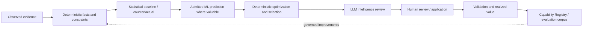
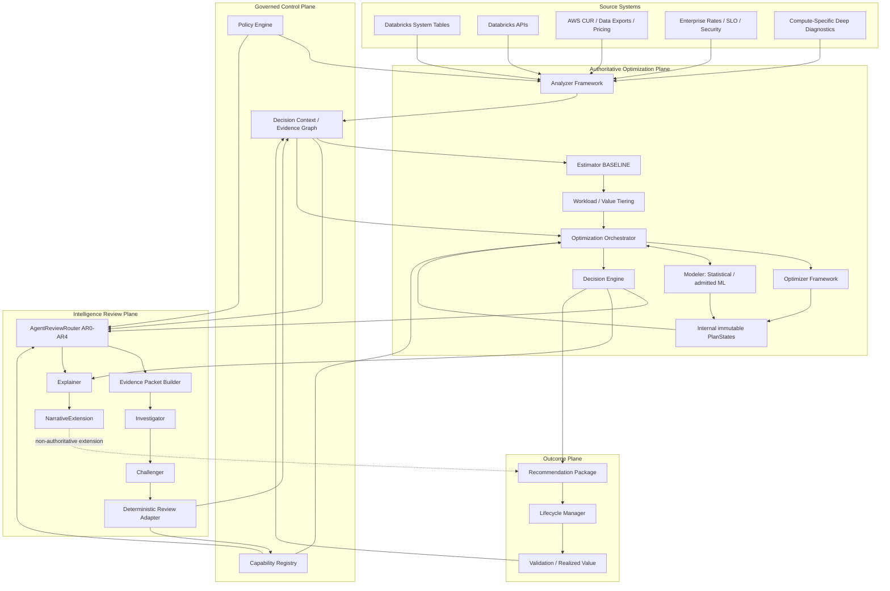
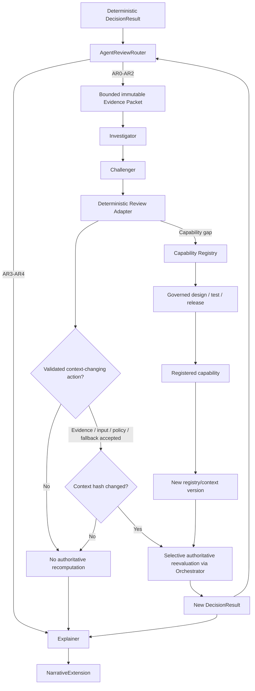
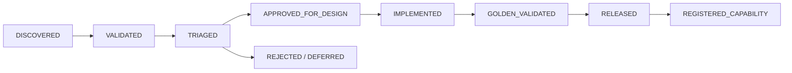
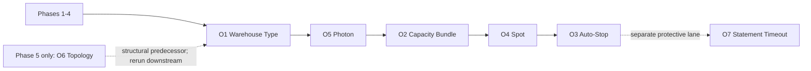
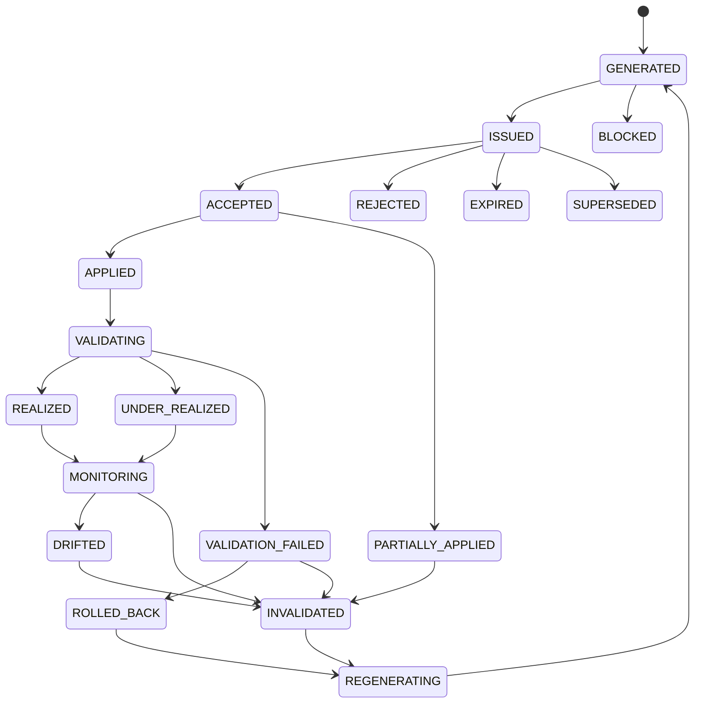
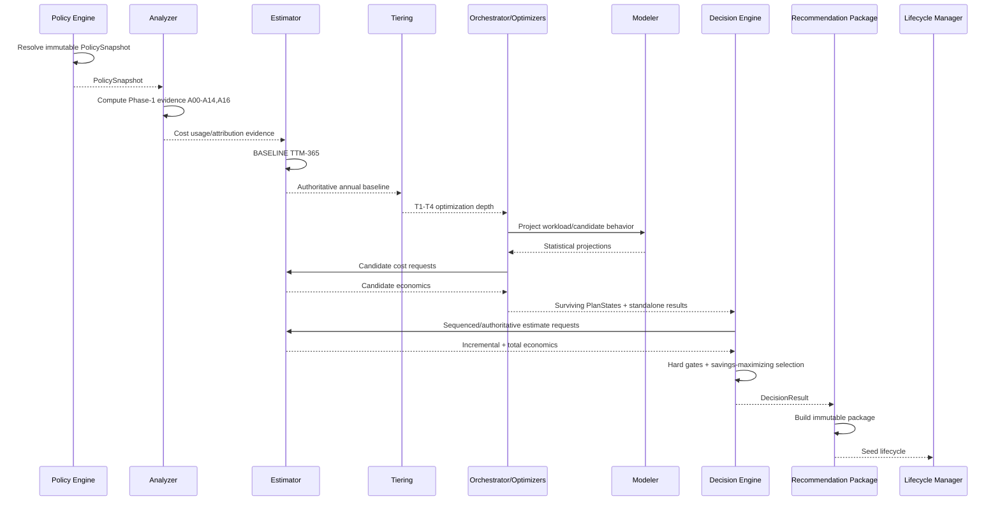
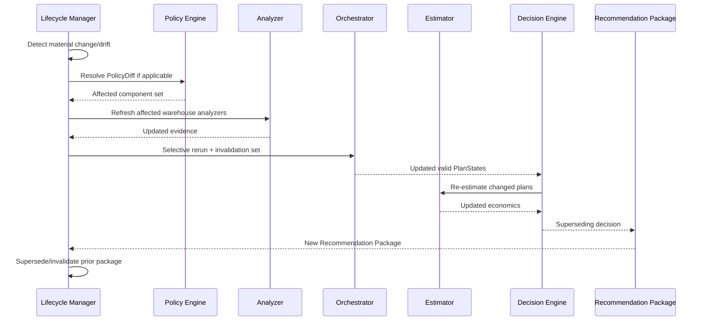
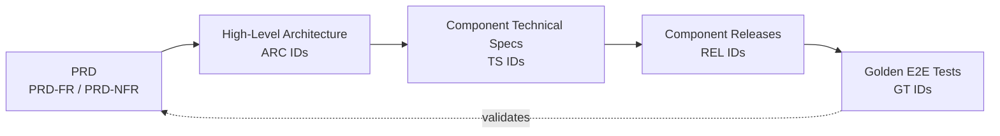

# Databricks Compute Optimization Product
## Product Requirements Document (PRD)

**Document ID:** `PRD-DBX-COMPUTE-OPT`  
**Version:** **2.0.0**  
**Status:** **Draft for Review — Gate 1**  
**Date:** 2026-08-13  
**Platform:** Databricks on AWS  
**Product architecture scope:** Reusable Databricks compute optimization platform with a Shared Optimization Kernel and compute-specific Capability Packs  
**Current normative implementation scope:** **Databricks SQL Warehouse Capability Pack only**  
**Predecessor:** `databricks_sql_warehouse_optimization_prd_v1.1.1.md`  
**Supersession intent:** On approval, this PRD supersedes the product-level framing of PRD v1.1.1 while preserving the approved SQL Warehouse requirements unless explicitly revised below.  
**Downstream sequence after approval:** HLA v2.0.0 → Architecture ADRs → Shared-Kernel/SQLWH Technical Specifications → SQL Warehouse Product Release Plan v2.0.0 → SQL Warehouse Golden E2E Scenarios v2.0.0

---

# 1. Executive Summary

The **Databricks Compute Optimization Product** is a governed decision system for discovering, proving, recommending, validating, and measuring compute-cost optimization opportunities across Databricks compute types. The product is designed around a reusable **Shared Optimization Kernel** plus independently designed and validated **Compute Capability Packs**.

The **SQL Warehouse Capability Pack is the only normative implementation scope for this release family**. Job Compute, All-Purpose Compute, Lakeflow Pipelines, and Serverless compute are parallel analysis workstreams only; they do not inherit SQL Warehouse telemetry, analyzer semantics, optimizer logic, release commitments, or golden-test claims until their own artifacts are approved.

The product uses a deliberate **hybrid deterministic + statistical/ML + LLM architecture** because these mechanisms solve different classes of problems:

| Mechanism | Primary question | Authority | Product value |
|---|---|---|---|
| **Deterministic evidence and optimization** | What happened, what is allowed, what configuration is valid, and what are the authoritative dollars? | **Authoritative** | Reproducibility, financial integrity, policy enforcement, stable configuration decisions, auditability. |
| **Statistical modeling** | What is the likely counterfactual behavior using observed historical evidence? | Predictive input only | Fast Phase-1 value, interpretable uncertainty, robust reference path, mandatory fallback for later ML. |
| **Governed ML** | What is likely to happen under future demand or candidate configurations when learned patterns materially improve prediction? | Predictive input only | Better forecasts, regime sensitivity, candidate-risk estimation, while remaining subject to applicability/calibration/OOD gates and statistical fallback. |
| **LLM Intelligence Review** | What evidence, assumption, risk, contradiction, or capability gap might the deterministic/predictive system have missed? | **Non-authoritative reviewer** | Blind-spot discovery, adversarial falsification, explanation, capability-gap discovery, and trust improvement without allowing probabilistic text to own money/configuration. |
| **Capability Registry + realized outcomes** | How does the product convert repeated unknowns into durable product intelligence? | Governed control plane | Converts validated gaps into versioned deterministic capabilities and accumulates reusable, testable optimization IP. |

The core control rule is:

> **Deterministic components own authoritative facts, policy application, candidate generation, configuration decisions, financial calculations, lifecycle effects, and realized value. Statistical/ML components predict. LLM agents investigate, challenge, and explain. An LLM output alone can never change the authoritative decision context or recommendation.**

The SQL Warehouse implementation retains the previously approved planning hypothesis of approximately **$32.5M/year** ($25.0M Databricks + illustrative 30% AWS component) strictly as a planning sensitivity. The product MUST replace that assumption with authoritative TTM-365 warehouse-level evidence before publishing authoritative savings.

The product's ultimate outcome is not a recommendation count or an LLM narrative. It is:

> **Defensible realized compute savings with no material correctness, performance/SLA, reliability, security, compliance, or financial-integrity regression.**

---

# 2. Purpose, Value, and Benefits of the Hybrid Approach

## 2.1 Problem the product solves

Enterprise Databricks cost optimization is difficult because observed cost, effective configuration, workload behavior, performance outcomes, cloud economics, policy constraints, and future demand are distributed across heterogeneous sources. A cheaper configuration is not necessarily a cheaper **business outcome** if it increases runtime, retries, queueing, failures, or operational risk.

No single technique is sufficient:

- **rules alone** are reproducible but can become brittle and can only reason over conditions explicitly encoded;
- **statistical models alone** quantify counterfactual uncertainty but cannot enforce enterprise policy or choose authoritative configurations safely;
- **ML alone** can improve prediction but may be poorly calibrated, out of domain, or opaque in unusual regimes;
- **LLMs alone** are flexible but are unsuitable as authoritative financial/configuration decision makers because outputs are probabilistic and can hallucinate or overreach.

The hybrid design deliberately composes their strengths while bounding their weaknesses.

## 2.2 Value chain



## 2.3 Benefits

| Benefit | How the architecture provides it |
|---|---|
| Trust | Authoritative decisions and dollars remain deterministic and replayable. |
| Safety | Hard policy/performance/reliability/security gates cannot be relaxed by ML or LLM output. |
| Predictive robustness | Statistical and admitted ML models expose uncertainty, applicability, calibration, and fallback. |
| Better scrutiny | Investigator/Challenger attempt to expose material blind spots after the deterministic plan exists. |
| Lower AI risk | LLM agents receive bounded evidence, no callable tools in Phase 3, strict schemas, and no direct write/decision authority. |
| Learning | Repeated validated gaps become governed analyzer/optimizer/source/policy capability candidates instead of recurring free-form reasoning. |
| Financial credibility | Estimator remains the sole authoritative money owner; estimated, forward, validated, and realized savings remain distinct. |
| Extensibility | Shared kernel contracts can support additional compute types while each Capability Pack retains service-specific telemetry and logic. |
| Cost proportionality | Workload tiering controls deterministic/modeling depth; AgentReview routing separately controls LLM review depth. |
| Operational resilience | Deterministic/statistical operation remains available when ML or LLM services are unavailable. |

## 2.4 Strategic product value

The defensible asset is not the use of an LLM. The product is designed to accumulate a proprietary corpus of:

1. versioned deterministic analyzers and optimizers;
2. compute-specific source and compatibility knowledge;
3. candidate/decision/evidence lineage;
4. statistical/ML counterfactual performance;
5. adversarial agent-review outcomes;
6. validated capability gaps and their resolution history;
7. golden/adversarial failure cases; and
8. applied configuration, validation, rollback, and realized-savings outcomes.

This creates a controlled flywheel in which **unknown conditions may be discovered by LLM review, but recurring validated unknowns are converted into deterministic, tested product capabilities**.

---

# 3. Product Vision

> Build a trusted Databricks Compute Optimization Product that identifies the safest lowest-cost valid operating state for supported Databricks compute, explains and challenges its own recommendation using governed intelligence, proves the financial value, and continuously learns from validated outcomes without surrendering deterministic authority.

The product will evolve as a reusable platform:

```text
Databricks Compute Optimization Product
  = Shared Optimization Kernel
  + SQL Warehouse Capability Pack        [ACTIVE / NORMATIVE]
  + Job Compute Capability Pack          [ANALYSIS WORKSTREAM]
  + All-Purpose Capability Pack          [ANALYSIS WORKSTREAM]
  + Lakeflow Pipeline Capability Pack    [ANALYSIS WORKSTREAM]
  + Serverless Capability Pack           [ANALYSIS WORKSTREAM]
```

Cross-compute migration/portfolio optimization is a future explicit capability and MUST NOT be implicitly introduced by an individual Capability Pack.

---

# 4. Hybrid Operating Model and Authority Boundaries

## 4.1 Deterministic authoritative plane

The deterministic plane owns:

- source coverage/freshness/schema checks;
- canonical resource identity and effective configuration;
- deterministic source/derived metrics, signals, findings, and blockers;
- policy, security, compatibility, and eligibility rules;
- execution of every **applicable registered analyzer and optimizer** for the decision context;
- candidate generation and internal candidate search;
- financial calculations and reconciliation;
- deterministic tiering and search-depth controls;
- final compatible plan selection;
- recommendation configuration and application preconditions;
- validation gates and lifecycle consequences;
- realized-value calculation and invalidation; and
- authoritative `DecisionContext` construction and hashing.

**Deterministic does not mean “rerun until different.”** For the same authoritative context, registry versions, policy, and component versions, the same applicable execution set and same authoritative result MUST be produced.

## 4.2 Statistical and ML predictive plane

The Modeler owns projections and counterfactual quantities. Phase 1 uses statistical implementations. Phase 2 may admit ML implementations only when governed quality/applicability gates pass; the statistical implementation remains the mandatory reference/fallback path.

ML never owns final configuration, authoritative savings, policy thresholds, lifecycle state, or application.

## 4.3 Intelligence Review Plane

Beginning in Phase 3, the LLM plane contains exactly these scheduled review roles:

- **Investigator** — checks whether the authoritative selected decision is adequately supported and identifies material missing/contradictory evidence, assumptions, risks, or capability gaps.
- **Challenger** — independently attempts to falsify the selected decision using the same immutable evidence plus the Investigator result.
- **Explainer** — generates a reviewer narrative from authoritative structured values without changing them.

Phase 3 is **packet-only**. Investigator and Challenger have **no callable tools** and no autonomous long-term memory. They may issue typed evidence/capability requests; bounded governed tools are deferred to Phase 6.

The LLM plane MUST NOT:

- calculate authoritative current/annual/realized cost or savings;
- author a replacement warehouse configuration;
- create a production optimizer algorithm at runtime;
- alter Policy thresholds;
- directly create a blocker or lifecycle transition;
- directly alter deterministic confidence/risk numbers;
- ask to rerun an already applicable analyzer/optimizer against the same context;
- make an LLM finding itself part of the authoritative context hash; or
- execute production configuration changes.

## 4.4 Valid Phase-3 agent requests

The allowed semantic request set is:

```text
REQUEST_MORE_EVIDENCE
REQUEST_INPUT_CORRECTION
REQUEST_POLICY_RESOLUTION
REQUEST_STATISTICAL_FALLBACK
REQUEST_BLOCK
ANALYZER_CAPABILITY_GAP
OPTIMIZER_CAPABILITY_GAP
SOURCE_EVIDENCE_GAP
POLICY_GAP
NO_CHANGE
```

`RUN_EXISTING_ANALYZER` and `RUN_EXISTING_OPTIMIZER` are explicitly prohibited from Phase-3 agent contracts because the deterministic workflow already executes all applicable registered capabilities for the same context.

## 4.5 Context-change invariant

> **Authoritative recomputation may occur only after a validated action produces a materially new authoritative DecisionContext.**

```text
if new_authoritative_context_hash == prior_authoritative_context_hash:
    authoritative_recompute = false
```

Examples of legitimate changes include validated new source evidence, a validated source/input correction, resolved policy that changes the allowed domain, approved statistical fallback replacing an ML signal for the decision, material configuration/workload/price changes, or release of a newly registered capability.

---

# 5. Product Principles

| ID | Principle | Requirement |
|---|---|---|
| PRD-PRIN-001 | Facts before recommendations | No recommendation may be issued without traceable evidence. |
| PRD-PRIN-002 | One owner per concern | Analyzer owns facts; Modeler projections; Optimizer technique decisions; Estimator money; Policy rules; Orchestrator workflow/search; Decision Engine final plan; Recommendation Package consumer artifact; Lifecycle state/realization; Capability Registry governed capability inventory/gaps. |
| PRD-PRIN-003 | Deterministic authority | Final eligibility, configuration selection, guardrails, financial formulas, sequencing, lifecycle consequences, and policy application are deterministic. |
| PRD-PRIN-004 | Predictive intelligence is bounded | Statistical/ML outputs are versioned inputs to deterministic rules, never autonomous recommendations. |
| PRD-PRIN-005 | LLM reviews, not decides | LLM agents investigate, challenge, and explain; they cannot directly alter authoritative values or context. |
| PRD-PRIN-006 | Same context, same decision | Same authoritative context + registry/policy/component versions yields the same applicable execution set and authoritative output. |
| PRD-PRIN-007 | No pointless recomputation | Same `authoritative_context_hash` means no authoritative recomputation. |
| PRD-PRIN-008 | Capability gaps become governed IP | LLM-discovered gaps enter Capability Registry and cannot execute until designed, tested, released, and registered. |
| PRD-PRIN-009 | Performance-preserving optimization | Default SQLWH P95 runtime regression guardrail is <=5%, policy-configurable tighter; service-specific packs define equivalent outcome guardrails. |
| PRD-PRIN-010 | Financial integrity | Independent optimizer savings are never summed as total plan savings. |
| PRD-PRIN-011 | No-change is valid | The product may conclude current state is optimal or blocked. |
| PRD-PRIN-012 | Evidence over unsupported heuristics | Critical decisions use observed/derived evidence, approved projections, policy, and explicit blockers. |
| PRD-PRIN-013 | Version everything | Policies, capabilities, contracts, models, prompts, schemas, routing, evidence packets, and releases are versioned. |
| PRD-PRIN-014 | Closed-loop value | Product success is measured through validation and realized value, not estimated savings alone. |
| PRD-PRIN-015 | Bound complexity by value | Deterministic/modeling depth and agent-review depth are policy-controlled but remain separate concepts. |
| PRD-PRIN-016 | Production conservatism | Preview/Beta capabilities are centrally policy-gated and off by default for authoritative production use unless explicitly approved. |
| PRD-PRIN-017 | Explainable decisions | Evidence, projections, rules, economics, rejected material alternatives, review findings, and lifecycle outcomes remain reconstructable. |
| PRD-PRIN-018 | Capability-pack isolation | A capability is not assumed portable across compute types merely because names or concepts appear similar. Reuse requires explicit applicability and tests. |
| PRD-PRIN-019 | Human control | Production changes remain HITL until a separately approved future release changes authorization policy. |
| PRD-PRIN-020 | No hidden reasoning dependency | Authoritative behavior relies on structured contracts/evidence, never hidden chain-of-thought. |

---

# 6. Business Problem and Opportunity

Databricks compute cost is driven by interacting configuration, runtime, workload, scaling, platform, cloud-economic, and governance decisions. Visibility products can show spend, but the enterprise problem is deciding **what to change, why it is safe, what it will save, how to validate it, and whether the savings were realized**.

The product must address:

- fragmented system-table/API/cloud-cost evidence;
- configuration dependency and mutually exclusive alternatives;
- workload seasonality, peaks, regime changes, and uncertain future demand;
- performance and reliability regression risk;
- differences among Databricks compute services and diagnostic surfaces;
- overlapping/non-realizable savings estimates;
- stale recommendations after configuration/policy/workload/price changes;
- model uncertainty and out-of-domain behavior;
- blind spots not represented by current deterministic capabilities; and
- the need for enterprise review evidence rather than opaque advice.

For SQL Warehouses specifically, type, Photon, size, minimum/maximum clusters, Spot behavior, auto-stop, concurrency, queueing, cold starts, workload placement, reliability, and AWS economics interact. Query telemetry is infrastructure evidence; query-code rewriting remains outside the current SQL Warehouse pack.

---

# 7. Business Objectives

| ID | Objective | Product expectation |
|---|---|---|
| PRD-OBJ-001 | Maximize defensible savings | Identify and realize material compute savings while preserving required outcomes. |
| PRD-OBJ-002 | Protect workload outcomes | Correctness/performance/SLA/reliability/security/compliance gates outrank savings. |
| PRD-OBJ-003 | Make savings financially credible | Reconcile actual cost and separate economic, cash-realizable, commitment-freed, forward, validated, and realized value as applicable. |
| PRD-OBJ-004 | Reduce decision burden | Present one authoritative plan per supported decision scope, plus bounded standalone/material alternatives. |
| PRD-OBJ-005 | Realize SQL Warehouse value first | Phase 1 must prove end-to-end value on SQL Warehouse + pandas + statistical methods before later phases are required. |
| PRD-OBJ-006 | Scale without semantic drift | Phase 2 migration to DAB/PySpark/Delta must preserve Phase-1 business meaning through parity gates. |
| PRD-OBJ-007 | Add ML only where useful | ML is admitted only when it improves or complements the statistical baseline under explicit governance, with fallback retained. |
| PRD-OBJ-008 | Add LLM where reasoning adds value | Phase 3 reviews material/high-risk/high-complexity cases, finds blind spots/capability gaps, and explains outcomes without becoming authoritative. |
| PRD-OBJ-009 | Convert unknowns into product capability | Repeated validated gaps are deduplicated, prioritized, governed, implemented, golden-tested, and released. |
| PRD-OBJ-010 | Close the feedback loop | Detect application/drift, validate outcomes, calculate realized value, and selectively reevaluate changed contexts. |
| PRD-OBJ-011 | Build a reusable optimization platform | Shared contracts/governance enable future compute packs without copying SQL-specific semantics into them. |
| PRD-OBJ-012 | Preserve implementation traceability | PRD → HLA → ADR/TSD → component release → golden scenario remains explicit. |

---

# 8. Planning Value Hypothesis — Current SQL Warehouse Workstream

The current SQL Warehouse planning sensitivity remains illustrative only:

| Planning case | % of $32.5M planning baseline | Illustrative annual value |
|---|---:|---:|
| Downside | 5% | $1.625M |
| Base planning hypothesis | 15% | $4.875M |
| Upside | 30% | $9.750M |

**Requirement:** authoritative savings MUST use warehouse-level TTM-365 evidence and target-state counterfactuals, not this planning multiplier.

No planning baseline for another compute type is established by this PRD.

---

# 9. Product Scope and Extensibility Model

## 9.1 Shared Optimization Kernel

The reusable kernel provides stable cross-service contracts/frameworks for:

- source/evidence envelopes and lineage;
- Policy Engine;
- Capability Registry;
- DecisionContext / Evidence Graph;
- Analyzer execution contract;
- Estimator financial framework;
- workload/value tiering framework;
- Modeler statistical/ML governance interface;
- Optimizer and immutable internal PlanState framework;
- Orchestrator dependency/search/selective-recomputation framework;
- Decision Engine;
- AgentReviewRouter and Intelligence Review contracts;
- Recommendation envelope;
- Lifecycle/validation/realization framework;
- portfolio aggregation; and
- golden/evaluation framework.

A shared framework does not imply identical source fields, metrics, algorithms, policies, or optimizers across compute types.

## 9.2 SQL Warehouse Capability Pack — normative implementation

The SQL Warehouse pack remains the current implementation authority and retains:

- warehouse-centric product scope;
- SQL Warehouse types and configuration domain;
- A00–A16 analyzer taxonomy, with A15 activated only in Phase 5;
- M01–M08 Modeler capability semantics, with M06 topology activated in Phase 5;
- O1–O7 optimizer taxonomy, with O6 topology activated in Phase 5;
- SQL Warehouse system-table/API queries and source contracts;
- SQL Warehouse cost attribution and AWS economics;
- T1–T4 workload/value tiering;
- SQL Warehouse performance/reliability guardrails;
- SQL Warehouse application/validation/rollback payloads; and
- SQL Warehouse release plan and golden scenarios.

Capability aliases SHOULD be namespaced in the reusable registry (for example `SQLWH-A07`, `SQLWH-O3`) while preserving existing approved IDs in the SQL Warehouse implementation artifacts for traceability.

## 9.3 Future Capability Packs — parallel analysis workstreams only

| Capability Pack | v2.0.0 status | Required artifacts before implementation authority |
|---|---|---|
| SQL Warehouse | **ACTIVE / NORMATIVE** | Existing + v2 reconciled TSDs, release plan, golden scenarios |
| Job Compute | ANALYSIS TODO | source/diagnostic study → ADRs → capability taxonomy → TSDs → release plan → golden scenarios |
| All-Purpose Compute | ANALYSIS TODO | same sequence, independently validated |
| Lakeflow Pipelines | ANALYSIS TODO | pipeline/event/query evidence study → ADRs → TSDs → release plan → golden scenarios |
| Serverless Jobs/Notebooks | ANALYSIS TODO | supported telemetry/economics study → ADRs → TSDs → release plan → golden scenarios |
| Cross-compute optimization | DEFERRED | separate product decision/ADR/technical design; no implicit cross-pack mutation |

## 9.4 Sources

The architecture recognizes source-system classes including:

- Databricks system tables;
- Databricks APIs/SDK-supported current configuration and metadata;
- AWS CUR/Data Exports, pricing, and commitment/economic inputs where applicable;
- enterprise effective rates, SLO, security/compliance, ownership, and business metadata; and
- compute-specific deep diagnostic sources introduced only through approved adapters.

Source adapters own access/normalization, not recommendation authority.

---

# 10. Product Phases

The phase sequence is normative for the **SQL Warehouse Capability Pack**. Future packs may reuse the philosophy but require their own release plans.

| Phase | SQL Warehouse scope | Intelligence | Runtime / persistence |
|---|---|---|---|
| **1 — Deterministic + Statistical Fast Value** | Single-warehouse A00–A14/A16; O1–O5/O7; statistical M01–M05/M07/M08; portfolio report; Capability Registry baseline | Deterministic + statistical | Existing SQL Warehouse for source SQL + bounded local pandas/state |
| **2 — DAB/PySpark/Delta + ML** | Migrate proven semantics; product-owned managed Delta; governed ML behind Modeler | ML where admitted; statistical fallback mandatory | DAB + Lakeflow Jobs classic jobs compute + PySpark + UC managed Delta |
| **3 — Intelligence Review Plane** | AR0–AR4 routing, packet builder, Investigator, Challenger, Review Adapter, Explainer/NarrativeExtension, gap lifecycle | LLM packet-only; no tools; no memory; no authority | Phase-2 runtime + governed model routes + MLflow tracing/evaluation |
| **4 — Deep Diagnostic Intelligence** | SQL Warehouse query-execution/profile diagnostic adapter, deterministic enrichment, bounded LLM diagnostic reasoning | Deterministic diagnostics + approved LLM analysis | Governed diagnostic evidence persisted through product data contracts |
| **5 — Warehouse Topology** | A15/M06/O6 split/merge/placement + downstream single-warehouse reoptimization | Existing statistical/ML/LLM review applies to O6 result | DAB/PySpark/Delta multi-warehouse state/results |
| **6 — Portfolio Copilot + Bounded Tools** | Governed read-only copilot and optional bounded tools for agents; separate feature gates | Interactive LLM + curated typed tools | Governed UC functions/MCP-compatible transport as approved |

## 10.1 Phase 1

Phase 1 MUST be independently valuable without DAB, PySpark, Delta persistence, ML, LLM, deep diagnostics, topology, or Copilot. It MUST prove the complete SQL Warehouse path through portfolio recommendation reporting and value lifecycle foundations.

The Capability Registry exists in Phase 1 for released executable SQL Warehouse capabilities even though agent-discovered gaps activate in Phase 3.

## 10.2 Phase 2

Phase 2 first proves pandas↔PySpark/Delta parity, then admits ML. ML is not a prerequisite for deterministic/statistical operation and cannot become the only implementation of a safety-relevant Modeler capability.

## 10.3 Phase 3 — Intelligence Review

### Agent review classes

`T1–T4` remains the SQL Warehouse workload/value tier. **Agent review uses a different domain**:

| Review class | Meaning | Default execution |
|---|---|---|
| `AR0 — DEEP_CRITICAL` | Highest scrutiny / extreme value / critical safety exposure | Investigator → Challenger → deterministic Review Adapter → Explainer |
| `AR1 — DEEP_MATERIAL` | Material opportunity with meaningful complexity/risk/conflict | Investigator → Challenger → Review Adapter → Explainer |
| `AR2 — DEEP_STANDARD` | Standard deep review, explicit escalation, or material unresolved concern | Investigator → Challenger → Review Adapter → Explainer |
| `AR3 — EXPLAIN_ONLY` | Deep review not economically/safety justified | Explainer only |
| `AR4 — NO_CHANGE_OR_BLOCKED` | Deterministic no-change/no-op/blocked outcome | Explainer only |

Review intensity and routing reason are separate fields. Routing reasons include `EXTREME_VALUE`, `MATERIAL_VALUE`, `AMBIGUITY`, `CONFLICTING_EVIDENCE`, `ELEVATED_RISK`, `ML_UNCERTAINTY`, `PRIOR_FAILURE`, `SAFETY_ESCALATION`, and `HUMAN_ESCALATION`.

The default policy shape is:

```text
deep_review_required =
    EXTREME_VALUE
 OR (MATERIAL_VALUE AND (AMBIGUITY OR CONFLICTING_EVIDENCE OR ELEVATED_RISK OR ML_UNCERTAINTY OR PRIOR_FAILURE))
 OR SAFETY_ESCALATION
 OR HUMAN_ESCALATION
```

Exact numeric thresholds remain Policy.

### Progressive trust

Initial Phase-3 releases run Investigator/Challenger in shadow/advisory mode. The deterministic recommendation remains available with an orthogonal `agent_review_status`. A later Phase-3 release may make agent review a reviewer-readiness gate for policy-selected high-risk classes only after quality/safety gates demonstrate value; deterministic computation itself never depends on LLM availability.

## 10.4 Phase 4 — Deep Diagnostic Intelligence

Phase 4 is a **cross-product architecture concept with compute-specific diagnostic adapters**, not a universal Spark-event assumption.

For SQL Warehouses, Phase 4 uses approved SQL Warehouse diagnostic evidence such as Query Profile/query-execution evidence, Query History, warehouse events/monitoring, and performance insights where programmatically supported and contractually validated. It MUST NOT invent Spark event telemetry for SQL Warehouses.

For future packs, the source may differ: Jobs/All-Purpose may use Spark-event/Spark UI-derived evidence; Pipelines may use pipeline event logs/query profiles; each requires its own source/retention/permission TSD.

## 10.5 Phase 5 — SQL Warehouse Topology

A15/M06/O6 enables warehouse split/merge/placement while preserving `WAREHOUSE` as the SQLWH top-level entity. O6 carries explicit participating source/target IDs internally and triggers downstream O1/O5/O2/O4/O3 reevaluation on generated target warehouses.

## 10.6 Phase 6 — Copilot and bounded tools

Phase 6 may add:

- governed read-only Portfolio Copilot;
- bounded typed evidence functions;
- MCP-compatible tool transport where approved;
- optional feature-gated tool access for Investigator/Challenger only after independent evaluation.

Copilot/tool authority remains read-only by default. Unrestricted SQL, arbitrary code/shell execution, policy mutation, deployment, and direct compute configuration changes are not implied.

---

# 11. Primary Users and Stakeholders

| Persona | Primary need |
|---|---|
| FinOps / Cloud Economics | Defensible identified, projected, validated, cash-realizable, and realized savings. |
| Databricks Platform Engineering | Safe, exact compute recommendations and evidence. |
| SQL Warehouse Owner | Understand why a warehouse change is recommended, expected performance, effort, risk, and rollback. |
| Future Compute Owners | A consistent product framework without false assumptions that SQL telemetry/logic applies to their compute type. |
| Engineering/Application Owner | Assurance that workload outcomes/SLOs remain acceptable. |
| Finance | Reconciled baseline, savings attribution, commitment impact, realized-value reporting. |
| Engineering Leadership | Portfolio opportunity, realized savings, adoption, risk, and capability maturity. |
| Product/Optimization Engineering | Versioned capability contracts, registry/gap backlog, deterministic lineage, evaluation and release traceability. |
| Security/Compliance | Non-overridable eligibility/policy controls and governed AI boundaries. |
| AI/Model Risk | ML/LLM lineage, evaluation, fallback, prompt/model/tool governance, and proof that AI is non-authoritative. |

---

# 12. Canonical Product Terms

| Term | Definition |
|---|---|
| `Shared Optimization Kernel` | Reusable cross-compute contracts/frameworks for governance, evidence, cost, optimization, decision, review, lifecycle, realization, and evaluation. |
| `Capability Pack` | Compute-service-specific source adapters, analyzers, optimizers, model features, policies, validation rules, and golden fixtures built against Shared Kernel contracts. |
| `Capability Registry` | Governed inventory of released executable capabilities plus discovered capability gaps and their lifecycle. Source-controlled release artifacts establish what may execute; operational persistence tracks registry/gap state. |
| `RegisteredCapability` | Versioned analyzer/optimizer/model/evidence capability approved, released, and executable for explicitly declared compute types/conditions. |
| `CapabilityGap` | Evidence-backed missing analyzer, optimizer, source evidence, or policy capability. It is non-executable until governed design/test/release completes. |
| `DecisionContext` | Canonical authoritative context for a resource/decision: source/config/policy snapshots, deterministic facts, admitted predictive results, evaluated capability set, candidate domain, and required lineage. |
| `authoritative_context_hash` | Deterministic digest of authoritative decision inputs/versions. LLM output is excluded. Same hash means no authoritative recomputation. |
| `agent_review_fingerprint` | Digest used to decide whether a prior agent review can be reused; may include decision ID, evidence packet, routing policy, model/prompt/schema versions without changing authoritative recommendation validity. |
| `Evidence Graph` | Logical lineage linking source evidence → facts → policies → projections → candidates → decision → review → validation → realized outcome. It does not require a graph database. |
| `PlanState` | **Internal Orchestrator construct:** immutable complete candidate effective configuration and associated evaluated evidence/economics used during search. It is not a product scope and not a lifecycle state. |
| `LifecycleState` | Recommendation/application/validation/realization status; separate from PlanState and AgentReviewStatus. |
| `AgentReviewStatus` | Orthogonal status such as `NOT_REQUIRED`, `PENDING`, `INVESTIGATING`, `CHALLENGING`, `REVIEWED`, `ACTION_REQUESTED`, `MORE_EVIDENCE`, `BLOCK_REQUESTED`, `FAILED`, `SHADOW_ONLY`. |
| `AgentReviewClass` | `AR0–AR4`; controls LLM review depth and is distinct from workload/value `T1–T4`. |
| `NarrativeExtension` | Separately versioned LLM explanation linked to an authoritative recommendation/outcome; it may be regenerated without invalidating the recommendation. |
| `Standalone recommendation` | One optimizer evaluated independently against the original current state. |
| `Authoritative plan` | Best valid compatible plan selected deterministically from evaluated candidate states. |
| `Material alternative` | Valid non-winning plan presented only when it provides meaningful risk/effort/economic trade-off. |
| `TTM-365` | Trailing 365-day observed financial/workload evidence window. |
| `TTM replay` | Counterfactual target cost evaluated against actual historical workload. |
| `Forward-365` | Next-365-day statistical/admitted-ML projection. |
| `Economic savings` | Reduction in attributable economic cost/consumption. |
| `Cash-realizable savings` | Expected reduction in actual payable cost given discounts/commitments. |
| `Commitment freed` | Commitment capacity released without necessarily reducing immediate cash spend. |
| `Realized savings` | Validated post-application savings normalized for actual post-change workload. |

For the SQL Warehouse Capability Pack, the top-level optimization entity remains `WAREHOUSE`; Phase 5 O6 multi-warehouse inputs remain internal topology cardinality, not a new generic scope type.

---

# 13. High-Level Product Workflow

## 13.1 Mature reusable architecture



## 13.2 Agent review and authoritative recomputation seam



## 13.3 Capability-gap lifecycle



An unresolved gap is durable registry state. Future agent packets include known open gaps, and deduplication MUST use structured gap signatures rather than relying on probabilistic rediscovery or exact prose matching.

---

# 14. Product-Level Functional Requirements

Existing SQL Warehouse requirement IDs are preserved where possible for downstream traceability; revised wording scopes SQL-specific requirements explicitly.

| ID | Functional requirement | Acceptance intent |
|---|---|---|
| PRD-FR-PROD-001 | The SQL Warehouse pack MUST inventory all in-scope SQL warehouses across configured workspaces/regions. | Every active in-scope warehouse has canonical identity. |
| PRD-FR-PROD-002 | The SQL Warehouse pack MUST reconstruct current effective core warehouse configuration from supported system-table/API evidence. | Current configuration is deterministic/auditable. |
| PRD-FR-PROD-003 | The SQL Warehouse pack MUST analyze configurable historical windows including 7/30/90/365-day views where source retention permits. | Recent, operating, trend, annual behavior is available. |
| PRD-FR-PROD-004 | The product MUST compute relevant P50/P95/P99 statistics where sample size permits. | Decisions are not average-only. |
| PRD-FR-PROD-005 | AnalyzerResults MUST contain source/derived metrics, percentiles, signals, findings, blockers, and data-quality evidence. | Decisions trace to facts. |
| PRD-FR-PROD-006 | Authoritative corrected TTM-365 financial evidence MUST exist before cost tiering/authoritative recommendation economics. | Baseline suitable for savings claims. |
| PRD-FR-PROD-007 | SQLWH MUST assign configurable workload/value tier T1–T4 from authoritative baseline evidence. | Optimization depth proportional to value. |
| PRD-FR-PROD-008 | SQLWH MUST support a statistical Modeler in Phase 1. | E2E value without ML. |
| PRD-FR-PROD-009 | Phase 2 MUST migrate proven SQLWH semantics to DAB + Lakeflow Jobs classic jobs compute + PySpark + managed Delta and admit ML only behind the Modeler contract with statistical fallback. | Scale/intelligence without authority drift. |
| PRD-FR-PROD-010 | Deterministic optimizers MUST generate reproducible candidates from versioned context/policy/capabilities. | Candidate set is repeatable. |
| PRD-FR-PROD-011 | Candidate outcome impact MUST use Modeler counterfactuals when observed facts alone cannot establish safety. | Performance/reliability risk considered. |
| PRD-FR-PROD-012 | Candidate economics MUST be evaluated before winner selection. | Money affects optimization, not display only. |
| PRD-FR-PROD-013 | Each applicable optimizer/search decision MUST produce a deterministic winner or `NO_CHANGE/BLOCKED/NOT_APPLICABLE` according to contract. | No unresolved user-facing candidate dump. |
| PRD-FR-PROD-014 | SQLWH MUST support standalone optimizer evaluation against original current state. | Independent technique value visible. |
| PRD-FR-PROD-015 | SQLWH MUST support dependency-aware portfolio search through internal immutable PlanStates. | Combined savings evaluated correctly. |
| PRD-FR-PROD-016 | SQLWH phase-appropriate hierarchy/dependencies MUST remain deterministic: Phases 1–4 O1→O5→O2→O4→O3 with O7 separate; Phase 5 adds O6 first. | No stale output combined. |
| PRD-FR-PROD-017 | Internal PlanState lineage MUST be immutable/reconstructable. | Incremental economics and search decisions auditable. |
| PRD-FR-PROD-018 | Invalid/dominated/noncompetitive candidates MUST be pruned using explicit deterministic search rules. | Bounded search without hidden heuristics. |
| PRD-FR-PROD-019 | Decision Engine MUST apply hard gates before economic optimization. | Safety cannot be traded for savings. |
| PRD-FR-PROD-020 | Near-equivalent valid plans MUST use deterministic risk/confidence/effort/disruption tie-breaking from Policy. | Explainable stable selection. |
| PRD-FR-PROD-021 | Independent savings MUST be calculated for standalone recommendations. | One-off economics visible. |
| PRD-FR-PROD-022 | Incremental/cumulative savings MUST be calculated for authoritative sequence. | Sequenced economics visible. |
| PRD-FR-PROD-023 | Total plan savings MUST equal baseline minus final target and reconcile to incremental savings within tolerance. | No double counting. |
| PRD-FR-PROD-024 | TTM replay and Forward projections MUST remain separate. | Historical and future value not conflated. |
| PRD-FR-PROD-025 | Material AWS commitment effects MUST distinguish economic, cash-realizable, and commitment-freed value. | Credible financial claims. |
| PRD-FR-PROD-026 | SQLWH MUST generate one immutable Recommendation Package per analyzed warehouse and an all-warehouse Portfolio Recommendation Summary by the Phase-1 value-proof gate. | Estate-wide recommendations inspectable without second authority. |
| PRD-FR-PROD-027 | The package MUST include exact source/target configuration deltas and application preconditions. | Actionable and stale-safe. |
| PRD-FR-PROD-028 | The package MUST expose evidence, blockers, labels, validation, rollback, and lineage. | Review-ready artifact. |
| PRD-FR-PROD-029 | Realized value MUST remain distinct from estimated/projected value. | No premature savings claim. |
| PRD-FR-PROD-030 | Lifecycle MUST detect applied/partial/drifted states from actual effective configuration. | Recommendation state grounded in reality. |
| PRD-FR-PROD-031 | Realized evaluation MUST normalize material workload changes through approved counterfactuals. | Workload change not misattributed. |
| PRD-FR-PROD-032 | SQLWH MUST support a weekly full refresh across all in-scope warehouses. | Portfolio remains current. |
| PRD-FR-PROD-033 | Selective reevaluation MUST be dependency/context driven after material config/workload/policy/financial/validation/registry changes. | Avoid unnecessary full recomputation. |
| PRD-FR-PROD-034 | Materially equivalent weekly recommendations MUST be suppressed according to Policy. | Avoid churn. |
| PRD-FR-PROD-035 | Preview/Beta capabilities MUST be centrally policy-gated. | No silent experimental dependency. |
| PRD-FR-PROD-036 | Complete lineage MUST connect source evidence/Policy/Capability versions to recommendation and realized outcome. | Auditable/replayable. |
| PRD-FR-PROD-037 | Blocked/no-change opportunities MUST remain visible with machine-readable reasons. | Unknowns not hidden. |
| PRD-FR-PROD-038 | SQLWH MUST keep `WAREHOUSE` as its top-level optimization entity; Phase-5 O6 may carry explicit multi-warehouse inputs internally without creating a generic product scope type. | Preserve SQLWH scope model. |
| PRD-FR-PROD-039 | Material alternatives MUST expose why they were not selected. | Trust without raw search dump. |
| PRD-FR-PROD-040 | Component/capability version compatibility MUST be checked before an authoritative run is accepted. | Prevent mixed incompatible state. |
| PRD-FR-PROD-041 | Phase 2 MUST persist normative product-owned SQLWH state/results in approved managed Delta schemas and preserve pandas↔PySpark semantic parity before cutover. | Backend migration does not alter meaning. |
| PRD-FR-PROD-042 | Phase-2 ML MUST use governed model lineage and fall back to statistical implementations when admission/OOD/calibration/availability/runtime checks fail. | ML cannot become a single point of failure. |
| PRD-FR-PROD-043 | Phase 3 MUST implement the governed Intelligence Review Plane defined in this PRD without changing deterministic authority. | LLM value is review, not decision ownership. |
| PRD-FR-PROD-044 | Phase 4 MUST implement SQL Warehouse Deep Diagnostic Intelligence using supported SQLWH diagnostic adapters; Spark-event terminology MUST NOT be assumed for SQLWH. | Correct compute-specific evidence model. |
| PRD-FR-PROD-045 | Phase 5 MUST introduce SQLWH A15/M06/O6 topology with downstream reoptimization and multi-warehouse savings deduplication. | Topology after single-WH maturity. |
| PRD-FR-PROD-046 | Product architecture MUST use Shared Optimization Kernel + independently governed Compute Capability Packs. | Future-proof without scope leakage. |
| PRD-FR-PROD-047 | Capability Registry MUST exist from Phase 1 and enumerate every executable capability with type, service applicability, version, status, dependencies, and release provenance. | Runtime executes only governed capabilities. |
| PRD-FR-PROD-048 | Beginning Phase 3, Capability Registry MUST persist analyzer/optimizer/source/policy gaps with structured signature, evidence, materiality, affected resources, recurrence, lifecycle, and linked released capability when closed. | Unknowns become durable/governed. |
| PRD-FR-PROD-049 | The deterministic pipeline MUST execute every applicable registered analyzer/optimizer required by the versioned capability/dependency rules for the same DecisionContext. | LLM need not request existing capability reruns. |
| PRD-FR-PROD-050 | Phase-3 LLM contracts MUST prohibit generic rerun, `RUN_EXISTING_ANALYZER`, and `RUN_EXISTING_OPTIMIZER` requests. | No pointless deterministic reruns. |
| PRD-FR-PROD-051 | Every authoritative decision MUST carry a versioned DecisionContext and `authoritative_context_hash`; LLM outputs MUST NOT be inputs to that hash. | Explicit authority boundary. |
| PRD-FR-PROD-052 | No authoritative recomputation may occur when the authoritative context hash is unchanged. | Determinism and compute efficiency. |
| PRD-FR-PROD-053 | AgentReviewRouter MUST deterministically assign AR0–AR4 from approved policy using authoritative structured features; LLM MUST NOT decide its own invocation. | Governed review cost/depth. |
| PRD-FR-PROD-054 | Workload/value T1–T4 and AgentReview AR0–AR4 MUST remain separate contracts; T-tier may be a routing input but not an alias. | Avoid policy/API ambiguity. |
| PRD-FR-PROD-055 | Investigator and Challenger MUST run for AR0–AR2 according to progressive-trust policy; Explainer MUST support AR0–AR4 outcomes. | Deep review where justified; explanation everywhere. |
| PRD-FR-PROD-056 | Agent review status MUST be orthogonal to recommendation lifecycle status. | LLM availability cannot corrupt deterministic lifecycle semantics. |
| PRD-FR-PROD-057 | Phase 3 MUST use bounded immutable evidence packets and MUST provide no callable Investigator/Challenger tools or autonomous long-term agent memory. | Minimize attack/cost/reproducibility risk. |
| PRD-FR-PROD-058 | Review Adapter MUST validate agent schema, evidence refs, prohibited value mutation, request semantics, materiality, known gaps, and context-change eligibility before any downstream consequence. | Agent output cannot directly act. |
| PRD-FR-PROD-059 | `REQUEST_BLOCK` is advisory until deterministic policy/Decision logic converts it to an authoritative block. | Preserve authority. |
| PRD-FR-PROD-060 | `REQUEST_STATISTICAL_FALLBACK` may cause Modeler reevaluation only after deterministic validation of the cited ML applicability/calibration/OOD concern. | Second-line ML safety. |
| PRD-FR-PROD-061 | Open CapabilityGaps MUST be included as governed known context for subsequent relevant reviews; duplicate gap observations MUST attach to the existing gap by structured signature rather than depend on LLM rediscovery. | Durable non-probabilistic memory. |
| PRD-FR-PROD-062 | A newly released capability that is material/applicable to prior affected decisions MUST change Registry/DecisionContext version and trigger selective authoritative reevaluation. | Gap fixes actually influence recommendations. |
| PRD-FR-PROD-063 | NarrativeExtension MUST be separately versioned/re-generable and MUST NOT invalidate or mutate the immutable authoritative Recommendation Package values. | Explanation lifecycle independent of decision. |
| PRD-FR-PROD-064 | Phase-3 model/prompt/schema changes alone MUST NOT invalidate the authoritative recommendation; review/explanation may be reevaluated using `agent_review_fingerprint` policy. | AI evolution does not falsify deterministic state. |
| PRD-FR-PROD-065 | Phase 3 MUST use role/value-based model routing through a provider-neutral model-client abstraction and governed Databricks model access by default. | Cost/quality portability. |
| PRD-FR-PROD-066 | Agent output MUST be strict structured data plus concise rationale/evidence refs; hidden chain-of-thought is neither required nor a product dependency. | Auditable safe contracts. |
| PRD-FR-PROD-067 | Phase-3 evaluation MUST include deterministic hard scorers, adversarial cases, safety metrics, agent cost/latency, and realized/validation outcome feedback. | AI retained only if it adds measurable value safely. |
| PRD-FR-PROD-068 | Phase 4 diagnostic architecture MUST expose a common diagnostic-evidence contract with compute-specific adapters; each future pack requires its own source/TSD validation. | Reusable architecture without fabricated telemetry. |
| PRD-FR-PROD-069 | Phase 6 MAY introduce governed read-only Copilot and bounded typed evidence tools; tool enablement MUST be separately feature-gated and evaluated. | Interactive intelligence deferred safely. |
| PRD-FR-PROD-070 | Future compute packs MUST NOT be treated as implemented/supported until their source studies, ADRs, TSDs, release plans, and golden scenarios are separately approved. | Future-proofing does not overclaim scope. |

---

# 15. Product-Level Non-Functional Requirements

| ID | Category | Requirement |
|---|---|---|
| PRD-NFR-PROD-001 | Determinism | Same authoritative input/context + Policy/Capability/component versions + fixed seed where applicable MUST produce the same deterministic execution set, decisions, configuration, and money. |
| PRD-NFR-PROD-002 | Reproducibility | Authoritative outputs MUST preserve source windows, hashes, capability/policy/component/model versions, internal PlanState lineage, and estimator basis. |
| PRD-NFR-PROD-003 | Correctness | Financial formulas, config reconstruction, percentiles, sequencing, hashes, and guardrails MUST be automated-testable. |
| PRD-NFR-PROD-004 | Financial integrity | Missing/unreconciled material economics MUST block/qualify claims; no fabricated precision. |
| PRD-NFR-PROD-005 | Safety | Required outcome/security/compliance gates cannot be weakened by savings, ML, LLM, or lower-precedence policy. |
| PRD-NFR-PROD-006 | Data quality | Material evidence gaps that can reverse a decision MUST become blockers/known gaps, not optimistic defaults. |
| PRD-NFR-PROD-007 | Scalability | Kernel and packs MUST support partitioned portfolio runs, bounded search, and selective context-driven reevaluation. |
| PRD-NFR-PROD-008 | Efficiency | Optimization/model/review cost MUST be measured; identical authoritative contexts MUST not be needlessly recomputed. |
| PRD-NFR-PROD-009 | Idempotency | Same run/review keys MUST not create duplicate authoritative state, gap records, or realized value. |
| PRD-NFR-PROD-010 | Observability | Every stage MUST emit correlation IDs, timing/count/status/error/version metrics. |
| PRD-NFR-PROD-011 | Auditability | A reviewer MUST reconstruct why a recommendation existed, what reviewed it, why it changed, and what value was realized. |
| PRD-NFR-PROD-012 | Security | Least privilege, governed secrets, source access, model endpoints, and tool boundaries are mandatory. |
| PRD-NFR-PROD-013 | Policy safety | Enterprise hard guardrails cannot be relaxed by lower-precedence overrides, ML, or LLM. |
| PRD-NFR-PROD-014 | Schema resilience | Source evolution must not silently change semantics; material field incompatibility blocks affected capability. |
| PRD-NFR-PROD-015 | Extensibility | New compute packs/capabilities integrate through explicit contracts and applicability, never implicit reuse. |
| PRD-NFR-PROD-016 | Backward compatibility | Breaking contract changes require major version/migration plan. |
| PRD-NFR-PROD-017 | ML governance | Versioned features/training/evaluation/calibration/OOD/drift/fallback/promotion are required. |
| PRD-NFR-PROD-018 | Explainability | Authoritative evidence and decisions must remain understandable without hidden model reasoning. |
| PRD-NFR-PROD-019 | Freshness | Material stale sources must block/warn according to Policy. |
| PRD-NFR-PROD-020 | Regional correctness | Regional/global source semantics must be explicit and source-specific. |
| PRD-NFR-PROD-021 | Fault isolation | Failure of one resource/capability/review must not corrupt unrelated resources. |
| PRD-NFR-PROD-022 | Testability | Every capability/contract supports fixture/golden testing without production mutation. |
| PRD-NFR-PROD-023 | Change safety | Application payloads use source-config hashes/preconditions. |
| PRD-NFR-PROD-024 | Stability | Immaterial recommendation changes are suppressed by Policy. |
| PRD-NFR-PROD-025 | Privacy | Query/log/user-generated text is minimized/redacted; structured features/IDs preferred. |
| PRD-NFR-PROD-026 | Uncertainty | Statistical/ML projections expose applicability/uncertainty and refuse unsupported extrapolation. |
| PRD-NFR-PROD-027 | No hidden Preview/Beta dependency | Core authoritative flow cannot require Preview/Beta capability unless explicitly approved. |
| PRD-NFR-PROD-028 | Optimization economics | Cost of deterministic search, ML and LLM review is measurable and governable relative to value/safety. |
| PRD-NFR-PROD-029 | Time semantics | Cross-source timestamps normalize to UTC while retaining needed local seasonality context. |
| PRD-NFR-PROD-030 | Precision | Currency/DBU/resource quantities use sufficient Decimal precision/deterministic rounding. |
| PRD-NFR-PROD-031 | Capability governance | Only source-controlled/released `RegisteredCapability` versions may execute; operational registry mutation alone cannot create executable code. |
| PRD-NFR-PROD-032 | Gap durability | Known unresolved gaps persist independently of probabilistic model output and deduplicate deterministically. |
| PRD-NFR-PROD-033 | Context integrity | LLM text/findings are excluded from authoritative context until supporting evidence/policy/capability is deterministically validated into authoritative state. |
| PRD-NFR-PROD-034 | LLM authority | No LLM output may directly mutate authoritative recommendation/configuration/cost/savings/lifecycle records. |
| PRD-NFR-PROD-035 | LLM grounding | Every material accepted agent finding/request MUST cite valid governed evidence refs. |
| PRD-NFR-PROD-036 | LLM schema reliability | Malformed/invalid/prohibited agent output MUST have zero authoritative effect. |
| PRD-NFR-PROD-037 | LLM availability | Deterministic/statistical computation remains operable during LLM outage; review/explanation status may be pending/failed. |
| PRD-NFR-PROD-038 | LLM cost | Per-review and portfolio hard budgets, token limits, retries, and routing costs are Policy controlled. |
| PRD-NFR-PROD-039 | LLM security | Phase 3 is packet-only; evidence content is untrusted data; prompt injection/adversarial cases are tested. |
| PRD-NFR-PROD-040 | LLM reproducibility semantics | LLM wording may vary, but accepted request domain, validation, context-change behavior, and authoritative outcomes remain deterministic. |
| PRD-NFR-PROD-041 | LLM evaluation | Promotion prioritizes unsafe-pass/missed-risk and false-block tolerances before usefulness, latency, and cost. |
| PRD-NFR-PROD-042 | Narrative integrity | Narrative authoritative-value echo must exactly match source structured values; mismatch suppresses narrative. |
| PRD-NFR-PROD-043 | Separation of states | PlanState, LifecycleState, AgentReviewStatus, CapabilityGap status, and model lifecycle MUST remain distinct typed concepts. |
| PRD-NFR-PROD-044 | Cross-compute correctness | A SQL-specific analyzer/optimizer/source claim cannot be generalized to another pack without explicit applicability/testing. |
| PRD-NFR-PROD-045 | Diagnostic correctness | Deep diagnostic adapters must use only documented/validated sources available to that compute type; unsupported telemetry is prohibited. |
| PRD-NFR-PROD-046 | Human control | Production mutation remains HITL until a separately approved product release explicitly changes authorization. |

---

# 16. Shared Optimization Kernel — Component-Level Requirements

## 16.1 Capability Registry

| ID | Requirement |
|---|---|
| PRD-FR-CAP-001 | MUST enumerate released executable capabilities and explicit service applicability/version/dependencies. |
| PRD-FR-CAP-002 | MUST distinguish `REGISTERED_CAPABILITY` from non-executable `CAPABILITY_GAP`. |
| PRD-FR-CAP-003 | MUST support gap types `ANALYZER`, `OPTIMIZER`, `SOURCE_EVIDENCE`, and `POLICY`. |
| PRD-FR-CAP-004 | MUST persist gap structured signature, evidence refs, recurrence, affected resources/capabilities, value-at-risk when determinable, severity, lifecycle, and linked implemented capability. |
| PRD-FR-CAP-005 | MUST deduplicate repeated semantically equivalent gap observations using deterministic signature/resolution rules rather than LLM prose. |
| PRD-FR-CAP-006 | MUST allow new evidence/occurrences to augment an open gap without creating duplicate executable semantics. |
| PRD-FR-CAP-007 | MUST require governed design → implementation → automated/golden validation → release before a gap can become registered/executable. |
| PRD-FR-CAP-008 | MUST cause relevant selective reevaluation after a new released capability changes the applicable capability set. |
| PRD-FR-CAP-009 | Executable definitions/version manifests MUST be release/source-control governed; Delta/operational records alone cannot authorize execution. |

## 16.2 Decision Context / Evidence Graph

| ID | Requirement |
|---|---|
| PRD-FR-CTX-001 | MUST define canonical DecisionContext containing resource identity, source/config/policy snapshots, deterministic results, admitted prediction refs, capability versions/applicability, candidate domain, and lineage. |
| PRD-FR-CTX-002 | MUST compute deterministic `authoritative_context_hash`. |
| PRD-FR-CTX-003 | MUST exclude LLM findings/narratives from authoritative hash unless independent validation converts supporting evidence/policy/capability into authoritative state. |
| PRD-FR-CTX-004 | MUST expose dependency/change dimensions sufficient for selective downstream reevaluation. |
| PRD-FR-CTX-005 | MUST preserve logical Evidence Graph lineage from source → fact → model → candidate → decision → review → validation → realization. |
| PRD-FR-CTX-006 | MUST treat unchanged hash as a no-authoritative-recompute condition. |

## 16.3 Orchestrator / PlanState Framework

| ID | Requirement |
|---|---|
| PRD-FR-KORCH-001 | Orchestrator MUST own deterministic workflow/search/dependency ordering and selective reevaluation. |
| PRD-FR-KORCH-002 | Internal PlanState MUST represent a complete candidate effective configuration, not a partial user-facing recommendation. |
| PRD-FR-KORCH-003 | PlanState MUST remain distinct from lifecycle/review/gap status. |
| PRD-FR-KORCH-004 | Orchestrator MUST execute every applicable capability determined by Registry/Policy/dependency rules; skipped/not-applicable status is deterministic and explicit. |
| PRD-FR-KORCH-005 | Orchestrator MUST reject requests to recompute when no authoritative context/capability/policy change can affect outputs. |

## 16.4 Capability Pack Contract

| ID | Requirement |
|---|---|
| PRD-FR-PACK-001 | Every pack MUST define source matrix, identity/configuration domain, analyzers, optimizers, model features/counterfactuals, financial attribution, guardrails, validation, diagnostics, and golden fixtures. |
| PRD-FR-PACK-002 | Every pack MUST declare which Shared Kernel contracts it implements and all service-specific extensions. |
| PRD-FR-PACK-003 | Cross-pack capability reuse requires explicit applicability and tests; conceptual similarity is insufficient. |
| PRD-FR-PACK-004 | A pack MUST NOT mutate another compute service unless an explicit cross-compute capability is separately designed/approved. |

---

# 17. Intelligence Review Plane — Component-Level Requirements

## 17.1 AgentReviewRouter

| ID | Requirement |
|---|---|
| PRD-FR-ARR-001 | MUST deterministically map authoritative structured inputs to AR0–AR4 using versioned Policy. |
| PRD-FR-ARR-002 | MUST keep review class separate from routing reasons and workload/value T-tier. |
| PRD-FR-ARR-003 | MUST support extreme-value, material+complexity/risk/conflict, safety escalation, and human escalation paths. |
| PRD-FR-ARR-004 | MUST persist routing decision/reasons/budget/policy/version and skipped-deep-review rationale. |
| PRD-FR-ARR-005 | MUST support reusable review via `agent_review_fingerprint` when policy permits and authoritative context has not materially changed; an already-known material open gap MAY deterministically suppress duplicate deep review unless new evidence/context requires it. |

## 17.2 Evidence Packet Builder

| ID | Requirement |
|---|---|
| PRD-FR-AEP-001 | MUST create bounded immutable packets from governed authoritative evidence only. |
| PRD-FR-AEP-002 | MUST include selected decision, material alternatives/why-not-selected summary, standalone optimizer outcomes, relevant Analyzer/Modeler/economic/policy evidence, prior validation/realization, and known open CapabilityGaps. |
| PRD-FR-AEP-003 | MUST minimize/redact raw SQL/log/user text by default and prefer deterministic summaries/evidence refs. |
| PRD-FR-AEP-004 | MUST contain a common envelope plus service-specific evidence payload rather than one universal nullable schema. |
| PRD-FR-AEP-005 | Phase 3 MUST not expose callable tools through the packet/runtime. |

## 17.3 Investigator

| ID | Requirement |
|---|---|
| PRD-FR-INV-001 | MUST assess evidence adequacy, contradiction, material missing evidence, risk, ML uncertainty, policy/source/capability gaps, and validation focus. |
| PRD-FR-INV-002 | MUST NOT author alternative authoritative configuration, cost, savings, thresholds, or numeric final confidence. |
| PRD-FR-INV-003 | MUST use only allowed typed requests from Section 4.4 and cited evidence refs. |
| PRD-FR-INV-004 | MUST reference known open gaps rather than create duplicates; materially new evidence may attach to existing gap. |

## 17.4 Challenger

| ID | Requirement |
|---|---|
| PRD-FR-CH-001 | MUST receive original immutable evidence plus validated Investigator result and independently attempt to falsify the decision. |
| PRD-FR-CH-002 | MUST evaluate baseline representativeness, evidence conflicts, financial/attribution weaknesses, policy/compatibility, ML applicability, performance/reliability risk, and known validation history. |
| PRD-FR-CH-003 | MUST NOT invent a new configuration/optimizer implementation; unknown optimization semantics become `OPTIMIZER_CAPABILITY_GAP`. |
| PRD-FR-CH-004 | MUST NOT request an existing analyzer/optimizer rerun against unchanged context. |

## 17.5 Deterministic Review Adapter

| ID | Requirement |
|---|---|
| PRD-FR-RA-001 | MUST validate schema, evidence refs, provenance, prohibited value mutation, allowed request enum, known-gap dedupe, and materiality. |
| PRD-FR-RA-002 | MUST classify whether a request can produce new authoritative context; if not, return no authoritative action/recompute. |
| PRD-FR-RA-003 | MUST route validated evidence/input/policy/model-fallback changes to their existing authoritative owner; it is not a second Decision Engine. |
| PRD-FR-RA-004 | MUST persist capability-gap proposals to Capability Registry without making them executable. |
| PRD-FR-RA-005 | MUST keep `REQUEST_BLOCK` advisory until deterministic policy/Decision rules establish authoritative effect. |

## 17.6 Explainer / NarrativeExtension

| ID | Requirement |
|---|---|
| PRD-FR-EXP-001 | MUST support every AR0–AR4 recommendation/no-change/blocked outcome. |
| PRD-FR-EXP-002 | MUST consume authoritative explanation context only, preserve exact values, and never introduce recommendations. |
| PRD-FR-EXP-003 | MUST persist separately versioned NarrativeExtension linked to authoritative package/outcome. |
| PRD-FR-EXP-004 | MUST support deterministic numeric/value echo validation; mismatch suppresses narrative. |

## 17.7 Evaluation / Governance

| ID | Requirement |
|---|---|
| PRD-FR-AIGOV-001 | Phase-3 agent runs MUST capture governed trace lineage for model/prompt/schema/evidence/routing/tokens/cost/latency/status. |
| PRD-FR-AIGOV-002 | Promotion MUST pass code-based hard scorers and adversarial/golden quality thresholds before use. |
| PRD-FR-AIGOV-003 | Safety metrics prioritize missed material risk/unsafe pass and false block before narrative preference. |
| PRD-FR-AIGOV-004 | Outcome feedback MUST be evaluation data, not autonomous prompt/memory mutation. |
| PRD-FR-AIGOV-005 | Role/value-based model routing MUST be policy-controlled and provider-neutral. |

---

# 18. SQL Warehouse Capability Pack — Component Functional Requirements

## 18.1 Policy Engine

**Purpose:** Define and resolve the deterministic operating rules under which all components execute.

| ID | Requirement |
|---|---|
| PRD-FR-POL-001 | MUST load versioned YAML policy and validate it against a versioned schema. |
| PRD-FR-POL-002 | MUST reject syntactically invalid, semantically contradictory, unsupported, or hard-guardrail-violating policy. |
| PRD-FR-POL-003 | MUST support deterministic scope precedence: enterprise hard guardrails → global → environment → workspace → warehouse type → cost tier → workload criticality → warehouse override → governed run override. |
| PRD-FR-POL-004 | MUST issue one immutable `PolicySnapshot` for a run/scope and preserve its hash/version. |
| PRD-FR-POL-005 | MUST provide component-specific policy views derived from the same snapshot. |
| PRD-FR-POL-006 | MUST configure analysis windows, required percentiles, evidence/sample thresholds, headroom, runtime/reliability guardrails, feature gates, optimizer applicability, search limits, estimator basis, labels, lifecycle thresholds, and refresh behavior. |
| PRD-FR-POL-007 | MUST centrally gate Preview/Beta/experimental targets, default OFF for production recommendations. |
| PRD-FR-POL-008 | MUST support statistical and future ML Modeler selection/fallback policy. |
| PRD-FR-POL-009 | MUST compute `PolicyDiff` and map changed keys to affected component invalidation sets. |
| PRD-FR-POL-010 | MUST prevent mid-run policy mutation; a run finishes/invalidates under its original snapshot. |
| PRD-FR-POL-011 | MUST preserve override lineage and validation warnings. |
| PRD-FR-POL-012 | MUST expose safe defaults without embedding those defaults into component source code. |

## 18.2 Analyzer Component — A00–A16

**Purpose:** Convert observed source data into deterministic, traceable facts used by Modeler, Optimizer, Estimator, Decision, Recommendation, and Lifecycle components.

### Common Analyzer requirements

| ID | Requirement |
|---|---|
| PRD-FR-ANA-001 | MUST emit source metrics, derived metrics, requested percentiles, signals, findings, blockers, data-quality metadata, and confidence inputs. |
| PRD-FR-ANA-002 | MUST preserve field/source lineage for every output metric used in a recommendation. |
| PRD-FR-ANA-003 | MUST use deterministic formulas/threshold evaluation under the PolicySnapshot. |
| PRD-FR-ANA-004 | MUST compute requested P50/P95/P99 distributions when sample size is sufficient and surface insufficiency otherwise. |
| PRD-FR-ANA-005 | MUST distinguish hard blockers from low-confidence evidence. |
| PRD-FR-ANA-006 | MUST operate against configurable 7/30/90/365-day windows and identified current workload regime. |
| PRD-FR-ANA-007 | MUST not infer undocumented CPU/memory telemetry from SQL warehouse system tables. |
| PRD-FR-ANA-008 | MUST be independently testable/versioned and runnable selectively by warehouse. Beginning in Phase 5, A15 may operate on an explicitly supplied set of warehouse IDs solely to support O6 topology evaluation. |

### Analyzer-specific requirements

| Analyzer | Requirement ID | Product requirement |
|---|---|---|
| **A00 Data Coverage & Attribution** | PRD-FR-ANA-A00-001 | MUST establish source coverage, freshness, regional completeness, join/attribution completeness, config-history completeness, material gaps, and data-quality blockers. |
| **A01 Cost Usage & Attribution** | PRD-FR-ANA-A01-001 | MUST reconcile corrected Databricks billable quantities, SKU/rate references, AWS attribution evidence, commitment characteristics, and financial coverage; MUST NOT own final dollar calculations. |
| **A02 Effective Warehouse Configuration** | PRD-FR-ANA-A02-001 | MUST reconstruct point-in-time warehouse configuration eras, using the latest `system.compute.warehouses` state for core effective current fields and supported supplemental sources for fields not represented there. |
| **A03 Demand & Concurrency** | PRD-FR-ANA-A03-001 | MUST compute workload arrival-rate/concurrency/burstiness distributions, source mix, temporal demand patterns, and demand-growth evidence. |
| **A04 Idle / Auto-Stop** | PRD-FR-ANA-A04-001 | MUST reconstruct running/busy/idle intervals, inter-query gaps, idle-running cost evidence, and candidate auto-stop replay inputs. |
| **A05 Runtime / SLA Baseline** | PRD-FR-ANA-A05-001 | MUST produce workload-normalized P50/P95/P99 total runtime, execution, provisioning wait, capacity wait, task time, variance, and SLO/headroom evidence. |
| **A06 Resource Pressure** | PRD-FR-ANA-A06-001 | MUST identify resource-pressure evidence from documented SQL telemetry such as spill, read/shuffle volume, task time, and volume-normalized runtime; Phase 4 MAY add governed SQL deep-diagnostic enrichment (for example Query Profile-derived execution evidence) without changing existing metric semantics. |
| **A07 Queue / Capacity** | PRD-FR-ANA-A07-001 | MUST distinguish capacity queueing from provisioning wait and produce queue distributions, cluster-at-max evidence, queue-at-max evidence, and capacity-headroom signals. |
| **A08 Scaling Efficiency** | PRD-FR-ANA-A08-001 | MUST reconstruct cluster-count state/scaling behavior and derive cluster-seconds, time at min/max, scale churn, scale-out efficiency, and low-demand scale-out evidence. |
| **A09 Cold-Start Sensitivity** | PRD-FR-ANA-A09-001 | MUST measure startup duration, restart frequency, provisioning-wait impact, cold-vs-warm performance, and auto-stop/type-change sensitivity. |
| **A10 Warehouse-Type Eligibility** | PRD-FR-ANA-A10-001 | MUST deterministically determine eligible target warehouse types using platform capability, policy, network/security/compliance, region, workload semantics, and Preview/Beta constraints. |
| **A11 Reliability** | PRD-FR-ANA-A11-001 | MUST calculate success/failure/cancel/retry distributions, classify failure causes only where evidence supports it, and surface unknown-cause risk. |
| **A12 Seasonality & Workload Regime** | PRD-FR-ANA-A12-001 | MUST detect intraday/weekly/monthly/quarterly/annual seasonality, trend, change points, current regime, peak recurrence, and representativeness of shorter windows. |
| **A13 Spot Economics** | PRD-FR-ANA-A13-001 | MUST provide Spot applicability, AWS economic evidence, price/interruptibility evidence where available, retry/reliability evidence, and explicit causal uncertainty. |
| **A14 Photon Effectiveness** | PRD-FR-ANA-A14-001 | MUST establish current/historical Photon state where available and matched workload/runtime/price-performance evidence needed by O5. |
| **A15 Workload Affinity / Topology — Phase 5** | PRD-FR-ANA-A15-001 | Beginning in Phase 5, MUST derive deterministic internal workload groups and cross-warehouse affinity/overlap/SLA/security/network compatibility/duplicate-idle/interference evidence for O6 topology optimization. A15 is not a Phase-1 prerequisite. |
| **A16 Runaway Query Tail** | PRD-FR-ANA-A16-001 | MUST identify anomalous long-tail behavior relative to workload class/volume/SLO and distinguish legitimate long-running work from plausible protective timeout candidates. |

## 18.3 Estimator Component

**Purpose:** Own all financial calculations through one component with multiple invocation modes.

| ID | Requirement |
|---|---|
| PRD-FR-EST-001 | MUST support `BASELINE`, `CANDIDATE`, `INDEPENDENT`, `SEQUENCED`, `AUTHORITATIVE_PLAN`, `FORWARD`, `REALIZED`, and `PROTECTIVE` modes. |
| PRD-FR-EST-002 | `BASELINE` MUST calculate corrected TTM-365 economic cost using Databricks usage and effective rate basis plus attributable AWS costs for Pro/Classic. |
| PRD-FR-EST-003 | MUST use configured negotiated/effective Databricks rates before list-price fallbacks. |
| PRD-FR-EST-004 | MUST distinguish deployment economics so Serverless target estimation does not blindly inherit current Pro/Classic customer-AWS compute cost. |
| PRD-FR-EST-005 | MUST calculate candidate economics from Modeler-projected quantities so Optimizers can compare candidates before final selection. |
| PRD-FR-EST-006 | MUST calculate independent savings against the original current state. |
| PRD-FR-EST-007 | MUST calculate incremental/cumulative savings against sequenced immutable PlanStates. |
| PRD-FR-EST-008 | MUST enforce `sum(incremental savings) == baseline - final target` within Policy tolerance. |
| PRD-FR-EST-009 | MUST calculate TTM replay and Forward-365 values separately. |
| PRD-FR-EST-010 | MUST expose financial uncertainty for modeled/counterfactual estimates. |
| PRD-FR-EST-011 | MUST distinguish AWS economic savings, cash-realizable savings, and commitment capacity freed when material. |
| PRD-FR-EST-012 | `REALIZED` MUST compare actual post-change cost with a Policy-approved normalized counterfactual where workload changes materially. |
| PRD-FR-EST-013 | `PROTECTIVE` MUST keep O7 avoided-waste economics separate from performance-preserving savings totals. |
| PRD-FR-EST-014 | MUST expose financial blockers/warnings and cost-quality basis. |
| PRD-FR-EST-015 | SHOULD support optional one-time transition cost, first-year net savings, and payback period for structural recommendations when reliable inputs are available. |

## 18.4 Workload Tiering Component

**Purpose:** Prioritize optimization depth based on value/cost.

| ID | Requirement |
|---|---|
| PRD-FR-TIER-001 | MUST consume authoritative Estimator `BASELINE` output rather than recalculate cost. |
| PRD-FR-TIER-002 | MUST assign T1–T4 using Policy-controlled thresholds. |
| PRD-FR-TIER-003 | Phase-1 primary tier basis MUST be transparent TTM annual economic cost; Policy MAY add opportunity/growth/topology factors later. |
| PRD-FR-TIER-004 | MUST output allowed optimization depth/search/modeling capabilities for the Orchestrator. |
| PRD-FR-TIER-005 | MUST be deterministic for the same baseline and PolicySnapshot. |

## 18.5 Modeler Component — Statistical Baseline (Phase 1) + Topology Extension (Phase 5)

**Purpose:** Project future/counterfactual behavior and quantities while remaining non-authoritative.

| ID | Requirement |
|---|---|
| PRD-FR-MOD-STAT-001 | MUST support a stable Modeler contract independent of implementation technique. |
| PRD-FR-MOD-STAT-002 | MUST support request modes for proactive projection, optimizer candidate counterfactuals, and realized-value counterfactuals. |
| PRD-FR-MOD-STAT-003 | MUST consume Analyzer observed features and PolicySnapshot. |
| PRD-FR-MOD-STAT-004 | MUST accept optimizer candidate/PlanState scenarios for counterfactual evaluation. |
| PRD-FR-MOD-STAT-005 | MUST project distributions/quantities required by applicable Optimizers/Estimator, including demand/concurrency, runtime, queueing, cluster/resource quantities, restart behavior, reliability risk where supported, and uncertainty. |
| PRD-FR-MOD-STAT-006 | MUST support empirical historical replay/backtesting for candidate evaluation where appropriate. |
| PRD-FR-MOD-STAT-007 | MUST support configurable seasonality and trend projection for Forward-365 demand/cost inputs. |
| PRD-FR-MOD-STAT-008 | MUST support auto-stop replay against historical arrival patterns. |
| PRD-FR-MOD-STAT-009 | Beginning in Phase 5, MUST support M06 topology scenario simulation for eligible higher-order searches; M06 is not a Phase-1 statistical requirement. |
| PRD-FR-MOD-STAT-010 | MUST report statistical method, sample size, applicability, uncertainty interval, and unsupported extrapolation. |
| PRD-FR-MOD-STAT-011 | MUST be deterministic given identical data, policy, method/version, and configured seed if resampling is used. |
| PRD-FR-MOD-STAT-012 | MUST NOT calculate dollar cost or issue final recommendations. |

### Required Phase-1 statistical methods/capabilities

The technical specification may choose the exact implementation, but Phase 1 MUST cover these modeling classes. **Topology/M06 is intentionally excluded and activates only in Phase 5:**

| Capability | Minimum acceptable Phase-1 approach |
|---|---|
| Demand distribution | Empirical distribution + temporal profiles + configurable trend projection |
| Seasonality | Calendar/time-bucket seasonal indices and change-point/current-regime handling |
| Uncertainty | Deterministic bootstrap/resampling or analytical intervals with fixed seed/version where applicable |
| Candidate capacity behavior | Historical replay / deterministic simulation using observed demand and candidate capacity rules |
| Runtime counterfactual | Matched-cohort empirical comparison, normalized statistical model, or canary evidence; unsupported candidates must be marked uncertain/blocked |
| Auto-stop | Historical inter-arrival replay including added starts and cold-start impact |
| Reliability | Empirical rates/intervals and candidate risk adjustment only where causal evidence is sufficient |
| Realization counterfactual | Old configuration evaluated against actual post-change workload features |

### Phase-5 statistical extension

| Capability | Minimum acceptable Phase-5 approach |
|---|---|
| M06 Topology | Combined workload replay using time-aligned internal workload-group demand, compatibility constraints, downstream target-warehouse reoptimization, and explicit uncertainty/unsupported-domain handling |

## 18.6 Modeler Component — ML Phase 2

| ID | Requirement |
|---|---|
| PRD-FR-MOD-ML-001 | MUST preserve the Phase-1 Modeler input/output contract. |
| PRD-FR-MOD-ML-002 | MUST support versioned training datasets/features, model artifacts, evaluation results, and model metadata. |
| PRD-FR-MOD-ML-003 | MUST benchmark every candidate ML model against the corresponding approved statistical baseline. |
| PRD-FR-MOD-ML-004 | MUST support deterministic train/evaluate procedures where feasible and fixed seeds/versioned dependencies. |
| PRD-FR-MOD-ML-005 | MUST expose calibrated prediction intervals/quantiles or equivalent uncertainty. |
| PRD-FR-MOD-ML-006 | MUST support applicability/out-of-distribution detection. |
| PRD-FR-MOD-ML-007 | MUST support champion/challenger evaluation and controlled promotion/rollback. |
| PRD-FR-MOD-ML-008 | MUST support model drift monitoring and trigger fallback/retraining/review. |
| PRD-FR-MOD-ML-009 | MUST automatically or policy-selectively fall back to statistical implementation when the ML model is unavailable, out-of-domain, insufficiently confident, or fails governance thresholds. |
| PRD-FR-MOD-ML-010 | MUST NOT bypass Optimizer, Policy, Estimator, or Decision Engine hard constraints. |
| PRD-FR-MOD-ML-011 | MUST support T1/T2 selective invocation so ML cost is proportional to opportunity. |
| PRD-FR-MOD-ML-012 | MUST capture prediction-vs-realized feedback for future evaluation/retraining. |

## 18.7 Optimizer Component — Common Requirements

**Purpose:** Generate/evaluate candidates and select one deterministic decision for a single optimization technique.

| ID | Requirement |
|---|---|
| PRD-FR-OPT-001 | MUST consume source/derived Analyzer metrics, percentiles, findings/signals/blockers, Modeler projections, Estimator candidate economics, PolicySnapshot, and current PlanState as applicable. |
| PRD-FR-OPT-002 | MUST include `NO_CHANGE` in the candidate set. |
| PRD-FR-OPT-003 | MUST apply hard eligibility/policy/performance/reliability/headroom constraints before cost-based winner selection. |
| PRD-FR-OPT-004 | MUST return one `CHANGE`, `NO_CHANGE`, `BLOCKED`, or `NOT_APPLICABLE` result per evaluated PlanState. |
| PRD-FR-OPT-005 | MUST expose current state, recommended state, candidate evidence, projection references, candidate cost reference, guardrail outcomes, dependencies/conflicts/invalidations/reruns, blockers, and confidence inputs. |
| PRD-FR-OPT-006 | MUST not own authoritative plan-level savings or final user-facing labels. |
| PRD-FR-OPT-007 | MUST be deterministic given the same candidate set/evidence/policy/model outputs. |

### O1–O7 product requirements

| Optimizer | Requirement ID | Purpose / optimization technique | Required product behavior |
|---|---|---|---|
| **O1 Warehouse Type** | PRD-FR-OPT-O1-001 | Optimize Classic/Pro/Serverless/eligible gated Real-Time deployment type. | Evaluate every eligible target type, target-type runtime/reliability/economics, and select the lowest-cost valid type or `NO_CHANGE`; must not blindly recommend Serverless. |
| **O2 Capacity Bundle** | PRD-FR-OPT-O2-001 | Jointly optimize `warehouse_size + min_clusters + max_clusters`. | Treat the three fields as an atomic bundle; use P95 primary/P99 risk distributions and Policy headroom; allow up-sizing if completed-work cost decreases; reject candidates breaching runtime/reliability. |
| **O3 Auto-Stop** | PRD-FR-OPT-O3-001 | Optimize idle timeout. | Simulate valid type-specific timeouts, avoidable idle cost, additional restarts, cold-start performance, and choose maximum net valid saving or `NO_CHANGE`. |
| **O4 Spot Policy** | PRD-FR-OPT-O4-001 | Optimize eligible Pro/Classic Spot policy. | Apply only where supported; evaluate AWS economics plus reliability/retry risk; Serverless must be `NOT_APPLICABLE`. |
| **O5 Photon** | PRD-FR-OPT-O5-001 | Optimize Photon price/performance state. | Retain/enable Photon based on current state and validated price/performance evidence; do not claim unsupported savings without comparison/canary/model evidence. |
| **O6 Warehouse Topology — Phase 5** | PRD-FR-OPT-O6-001 | Consolidate/split workload placement across warehouses. | **Not active before Phase 5.** Build only policy/ACL/security/network/SLO-compatible structural scenarios; evaluate combined demand/performance/cost; emit reoptimization dependencies for downstream O1–O5. |
| **O7 Statement Timeout** | PRD-FR-OPT-O7-001 | Protect against classified runaway/pathological long-tail SQL. | Remain separately policy-gated/protective; do not count avoided work as performance-preserving optimization savings; reject when valid long-running queries could be terminated. |

## 18.8 Optimization Orchestrator

**Purpose:** Execute dependency-aware, bounded optimization workflows.

| ID | Requirement |
|---|---|
| PRD-FR-ORCH-001 | MUST run both standalone and portfolio lanes when enabled by Policy. |
| PRD-FR-ORCH-002 | MUST create and preserve immutable PlanStates and parent-child lineage. |
| PRD-FR-ORCH-003 | MUST execute the phase-appropriate hierarchy: Phases 1–4 use O1 → O5 → O2 → O4 → O3 with O7 separately/protectively; Phase 5 uses O6 → O1 → O5 → O2 → O4 → O3. |
| PRD-FR-ORCH-004 | MUST apply dependency/invalidation rules when structural/tuning state changes. |
| PRD-FR-ORCH-005 | MUST support hard-feasibility pruning, analyzer-evidence pruning, dominance pruning, economic branch-and-bound, beam width, and candidate caps. |
| PRD-FR-ORCH-006 | MUST scale search depth according to T1–T4 Policy. |
| PRD-FR-ORCH-007 | MUST request Modeler/Estimator evaluations without duplicating their logic. |
| PRD-FR-ORCH-008 | MUST return surviving evaluated PlanStates and standalone OptimizerResults rather than a user-facing recommendation. |
| PRD-FR-ORCH-009 | MUST support selective rerun requests from Lifecycle/PolicyDiff. |
| PRD-FR-ORCH-010 | MUST bound and report search counts, pruned branches, evaluation failures, and elapsed cost/time. |

## 18.9 Decision Engine

**Purpose:** Select the authoritative compatible plan and small set of material alternatives.

| ID | Requirement |
|---|---|
| PRD-FR-DEC-001 | MUST reject PlanStates failing eligibility, security/compliance, runtime, reliability, headroom, or minimum evidence/confidence constraints. |
| PRD-FR-DEC-002 | MUST maximize authoritative annual net economic savings among valid plans. |
| PRD-FR-DEC-003 | MUST apply Policy-defined near-equivalent tolerance before tie-breaking. |
| PRD-FR-DEC-004 | MUST tie-break near-equivalent plans by lower risk → higher confidence → lower effort → lower disruption. |
| PRD-FR-DEC-005 | MUST derive structured confidence, risk, and effort decision metadata; MUST consume Estimator savings rather than recalculate dollars. |
| PRD-FR-DEC-006 | MUST select one authoritative PlanState and at most Policy-capped material alternatives. |
| PRD-FR-DEC-007 | MUST preserve rejected-plan reason summaries sufficient for `why-not-selected` presentation. |
| PRD-FR-DEC-008 | MUST request rerun/revalidation through the Orchestrator rather than directly executing Optimizers. |
| PRD-FR-DEC-009 | MUST not use an opaque weighted aggregate as the primary selection method. |

## 18.10 Recommendation Package

**Purpose:** Produce one immutable, actionable, explainable product artifact.

| ID | Requirement |
|---|---|
| PRD-FR-REC-001 | MUST contain one authoritative ordered plan. |
| PRD-FR-REC-002 | MUST contain independently actionable standalone recommendations with independent savings. |
| PRD-FR-REC-003 | MUST contain only material alternatives permitted by Policy. |
| PRD-FR-REC-004 | MUST contain O7/protective recommendations separately. |
| PRD-FR-REC-005 | MUST expose TTM baseline, TTM replay target, TTM savings, Forward-365 savings, and financial uncertainty as available. |
| PRD-FR-REC-006 | MUST expose independent, incremental, cumulative, and total savings without double counting. |
| PRD-FR-REC-007 | MUST expose Confidence, Risk, Effort, and Savings labels plus the numeric/structured basis. |
| PRD-FR-REC-008 | MUST include source/derived evidence, important percentiles, signals/findings/blockers, projections, policy thresholds, and why-not-selected rationale. |
| PRD-FR-REC-009 | MUST include exact current→recommended config deltas, atomicity, dependencies, and expected source/target config hashes. |
| PRD-FR-REC-010 | MUST include validation requirements and rollback state/instructions metadata. |
| PRD-FR-REC-011 | MUST include full lineage to Analyzer, Modeler, Optimizer, Estimator, Decision, Policy, and PlanState results. |
| PRD-FR-REC-012 | MUST initialize lifecycle metadata/state. |
| PRD-FR-REC-013 | MUST use `WAREHOUSE` as the top-level recommendation package entity. Beginning in Phase 5, O6 packages MUST carry explicit `source_warehouse_ids`, `target_warehouses`, and workload-placement metadata when a topology action spans warehouses; this does not create a separate top-level scope type. |
| PRD-FR-REC-014 | By `P1-R24`, MUST generate a deterministic all-warehouse `PortfolioRecommendationSummary` derived from immutable warehouse Recommendation Packages, including every analyzed warehouse, current annual cost, recommended annual cost when available, annual economic savings, savings percent, primary recommendation/actions, confidence, risk, recommendation/lifecycle status, and blocker reason when blocked. The summary is a view/report and MUST NOT become a second recommendation authority. |

## 18.11 Lifecycle Manager — Including Lightweight Change Detection

**Purpose:** Track recommendation state, detect changes, validate applied recommendations, coordinate realized-value calculation, and selectively retrigger optimization.

| ID | Requirement |
|---|---|
| PRD-FR-LIFE-001 | MUST own the recommendation lifecycle state machine. |
| PRD-FR-LIFE-002 | MUST include lightweight change detection; no separate source/change-detection business component is required. |
| PRD-FR-LIFE-003 | MUST reconstruct/compare current canonical warehouse config using latest system-table state plus API-only fields. |
| PRD-FR-LIFE-004 | MUST classify observed configuration as `NO_CHANGE`, `APPLIED`, `PARTIALLY_APPLIED`, or `DRIFTED` relative to recommendation hashes/config. |
| PRD-FR-LIFE-005 | MUST treat partial application of atomic bundles such as O2 as invalidating rather than successful. |
| PRD-FR-LIFE-006 | MUST coordinate post-change Analyzer validation without duplicating Analyzer calculations. |
| PRD-FR-LIFE-007 | MUST coordinate Modeler realization counterfactual and Estimator `REALIZED` calculation without implementing their logic itself. |
| PRD-FR-LIFE-008 | MUST support states including `GENERATED`, `ISSUED`, `ACCEPTED`, `REJECTED`, `APPLIED`, `PARTIALLY_APPLIED`, `VALIDATING`, `REALIZED`, `UNDER_REALIZED`, `VALIDATION_FAILED`, `ROLLED_BACK`, `MONITORING`, `DRIFTED`, `INVALIDATED`, `EXPIRED`, `SUPERSEDED`, and `REGENERATING`. |
| PRD-FR-LIFE-009 | MUST distinguish configuration, workload/regime, policy, financial, and data-quality drift. |
| PRD-FR-LIFE-010 | MUST trigger selective analyzer/optimizer reruns using the dependency matrix rather than always rerunning the full estate. |
| PRD-FR-LIFE-011 | MUST support weekly full refresh coordination across all active in-scope warehouses. |
| PRD-FR-LIFE-012 | MUST enforce validation minimum observation/sample/representative-regime policy before declaring success. |
| PRD-FR-LIFE-013 | MUST never mark a recommendation `REALIZED` when performance/reliability validation fails, even if cost falls. |
| PRD-FR-LIFE-014 | MUST calculate/store realization ratio and realized run-rate from Estimator results. |
| PRD-FR-LIFE-015 | MUST capture user actions/feedback such as accept, reject, defer, apply, rollback, and reason codes. |
| PRD-FR-LIFE-016 | MUST suppress equivalent recommendation churn and supersede only when material or invalidated. |
| PRD-FR-LIFE-017 | MUST distinguish freshness from validity. |
| PRD-FR-LIFE-018 | MUST expose portfolio lifecycle/value funnel metrics. |

---

# 19. SQL Warehouse Capability Pack — Component Non-Functional Requirements

| ID | Component | Requirement |
|---|---|---|
| PRD-NFR-POL-001 | Policy Engine | Policy resolution MUST be deterministic and side-effect free. |
| PRD-NFR-POL-002 | Policy Engine | Invalid policy MUST fail before any authoritative optimization run starts. |
| PRD-NFR-POL-003 | Policy Engine | Policy schema/version migration MUST be explicit and testable. |
| PRD-NFR-ANA-001 | Analyzer | Analyzer calculations MUST be pure/deterministic with explicit source/query versioning. |
| PRD-NFR-ANA-002 | Analyzer | Every material metric MUST retain source lineage and calculation metadata. |
| PRD-NFR-ANA-003 | Analyzer | Missing/insufficient samples MUST not produce fabricated percentiles. |
| PRD-NFR-ANA-004 | Analyzer | Analyzer execution MUST support selective scope reruns. |
| PRD-NFR-TIER-001 | Tiering | Tiering MUST be deterministic, cheap, and based on authoritative baseline output. |
| PRD-NFR-MOD-STAT-001 | Modeler Statistical | Statistical methods MUST be versioned, backtestable, reproducible, and uncertainty-aware. |
| PRD-NFR-MOD-STAT-002 | Modeler Statistical | Fixed seeds MUST be used for any resampling/bootstrap process used in authoritative runs. |
| PRD-NFR-MOD-STAT-003 | Modeler Statistical | The Modeler MUST refuse unsupported extrapolation rather than fabricate precision. |
| PRD-NFR-MOD-ML-001 | Modeler ML | Models MUST be versioned and promoted through offline evaluation gates. |
| PRD-NFR-MOD-ML-002 | Modeler ML | Training/serving feature definitions MUST be identical/versioned to prevent skew. |
| PRD-NFR-MOD-ML-003 | Modeler ML | Statistical fallback MUST remain available. |
| PRD-NFR-MOD-ML-004 | Modeler ML | Model drift and calibration MUST be monitored. |
| PRD-NFR-MOD-ML-005 | Modeler ML | ML compute/serving cost MUST be measurable and tier-governed. |
| PRD-NFR-OPT-001 | Optimizer | Optimizer rules/candidate domains MUST be registry/version controlled. |
| PRD-NFR-OPT-002 | Optimizer | An optimizer MUST not mutate current production state. |
| PRD-NFR-OPT-003 | Optimizer | Optimizer result MUST be reproducible from references in its contract. |
| PRD-NFR-EST-001 | Estimator | All money calculations MUST use deterministic decimal arithmetic/rounding policy. |
| PRD-NFR-EST-002 | Estimator | Candidate and authoritative modes MUST share financial semantics; candidate mode may only reduce reporting/reconciliation overhead. |
| PRD-NFR-EST-003 | Estimator | Financial source quality and fallback basis MUST be explicit in every authoritative estimate. |
| PRD-NFR-ORCH-001 | Orchestrator | Search MUST be bounded and observable; it must never perform unbounded combinatorial exploration. |
| PRD-NFR-ORCH-002 | Orchestrator | Branch/PlanState operations MUST be idempotent and resumable where implementation permits. |
| PRD-NFR-DEC-001 | Decision Engine | The primary selection path MUST remain rule/constraint based and explainable. |
| PRD-NFR-DEC-002 | Decision Engine | Decision results MUST preserve rejected-plan rationale without requiring private/hidden reasoning. |
| PRD-NFR-REC-001 | Recommendation Package | Packages MUST be immutable/versioned once issued; updates create a superseding package. |
| PRD-NFR-REC-002 | Recommendation Package | Package rendering/API must not change underlying economics or decision semantics. |
| PRD-NFR-LIFE-001 | Lifecycle | State transitions MUST be validated/idempotent and persisted. |
| PRD-NFR-LIFE-002 | Lifecycle | Polling/change detection MUST tolerate system-table update latency and not assume true real-time delivery. |
| PRD-NFR-LIFE-003 | Lifecycle | Selective reprocessing failures MUST not corrupt existing valid recommendations for unrelated warehouses. |
| PRD-NFR-LIFE-004 | Lifecycle | Realized-value accumulation MUST be idempotent and avoid double counting overlapping periods. |

---

# 20. Optimization Techniques and Product Behavior

| Technique | Product intent | Key constraint |
|---|---|---|
| Warehouse type | Select lowest-cost eligible architecture across Classic/Pro/Serverless/gated RT. | Eligibility/network/security/performance first. |
| Capacity bundle | Jointly optimize size/min/max. | Atomic bundle; P95 decision + P99 risk + Policy headroom. |
| Auto-stop | Remove unnecessary idle running time. | Include restart/cold-start cost and performance. |
| Spot policy | Reduce Pro/Classic AWS compute economics where acceptable. | Reliability evidence required; Serverless N/A. |
| Photon | Improve completed-work price/performance. | Evidence/canary/model support required for material savings claim. |
| Warehouse topology — **Phase 5** | Consolidate or split workloads for lower portfolio cost. | Not active before Phase 5; ACL/security/network/SLO compatibility; rerun downstream tuning. |
| Statement timeout | Avoid runaway/pathological waste. | Protective only; Beta/feature gate; legitimate work must not be killed. |

---

# 21. Approved Optimizer Dependency Model



### Invalidation expectations

| Applied change | O1 | O5 | O2 | O4 | O3 | O7 |
|---|---|---|---|---|---|---|
| O6 Topology **(Phase 5 only)** | RERUN | RERUN | RERUN | RERUN/N/A | RERUN | RERUN |
| O1 Type | — | REVALIDATE | RERUN | RERUN/N/A | RERUN | REVALIDATE |
| O5 Photon | NONE | — | RERUN | REVALIDATE | RERUN | RERUN |
| O2 Capacity | NONE | NONE | — | RERUN | RERUN | REVALIDATE |
| O4 Spot | NONE | NONE | NONE | — | REVALIDATE | NONE |
| O3 Auto-stop | NONE | NONE | NONE | NONE | — | NONE |
| O7 Timeout | NONE | NONE | NONE | NONE | NONE | — |

---

# 22. Performance, Threshold and Percentile Requirements

## 22.1 Percentiles

The product MUST compute percentile distributions rather than relying solely on averages.

Default semantic use:

- **P50:** central/normal behavior;
- **P95:** primary decision/sizing/performance guardrail input;
- **P99:** tail-risk/peak validation.

Applicable metrics include:

- total runtime;
- execution duration;
- provisioning wait;
- capacity wait;
- concurrency;
- inter-query gaps;
- startup duration;
- spill/read/shuffle volume;
- cluster/scaling state statistics;
- workload volume distributions.

## 22.2 Threshold ownership

```text
Policy defines thresholds
        ↓
Analyzer calculates evidence
        ↓
Modeler projects distributions
        ↓
Optimizer applies thresholds/headroom
        ↓
Decision Engine enforces plan-level gates
```

Example:

```text
Modeler projected P95 demand = 40
Policy headroom = 20%
Optimizer protected requirement = 48
```

The Analyzer and Modeler MUST NOT silently bake policy headroom into observed/projected facts.

## 22.3 Runtime guardrail

Default:

```text
P95 normalized runtime regression <= 5%
```

Policy may tighten this by criticality/scope but enterprise hard guardrails may prevent relaxing it.

---

# 23. Financial Product Requirements

## 23.1 Baseline

```text
TTM365CurrentCost
  = corrected Databricks SQL cost
  + attributable AWS economic cost for current Pro/Classic resources
  + other Policy-approved directly attributable variable costs
```

## 23.2 Standalone savings

```text
IndependentSavings(Ri)
  = Cost(S0) - Cost(S0 + only Ri)
```

Independent values MUST NOT be summed.

## 23.3 Sequenced savings

```text
S0 --R1--> S1 --R2--> S2 ... --Rn--> Sn

IncrementalSavings(i) = Cost(Si-1) - Cost(Si)
TotalPlanSavings      = Cost(S0) - Cost(Sn)
```

Invariant:

```text
SUM(IncrementalSavings) == TotalPlanSavings
```

within configured rounding tolerance.

## 23.4 Historical vs future

The Recommendation Package MUST distinguish:

- **TTM-365 replay savings:** target applied to actual historical workload;
- **Forward-365 projected savings:** target vs current under expected next-year workload.

## 23.5 AWS commitment-aware economics

When commitments are material, expose:

- economic savings;
- cash-realizable savings;
- commitment capacity freed.

The product MUST NOT claim that freed committed usage is necessarily immediate hard-dollar bill reduction.

---

# 24. Recommendation Product Requirements

The end user should see **decisions, not the search space**.

Example presentation contract:

```text
Warehouse WH-123 · T1

Current annual economic cost      $1.80M
Recommended target cost           $1.15M
TTM-365 estimated savings         $650K / 36.1%
Forward-365 projected savings     $710K

Confidence                        HIGH
Risk                              MEDIUM
Effort                            MEDIUM
Savings                           VERY HIGH

Recommended Plan
1. O1 Pro → Serverless            +$390K incremental
2. O2 Capacity bundle             +$170K incremental
3. O3 Auto-stop                   +$90K incremental
                                  -------
Total                             +$650K

Standalone
O1 only                           $390K
O2 only                           $260K
O3 only                            $90K

Material Alternative
Remain Pro + Capacity + Spot      $500K
```

All figures in this example are illustrative.

---

# 25. Label Requirements

| Label | Quantitative/structured source | Display requirement |
|---|---|---|
| Confidence | evidence coverage, statistical/ML uncertainty, estimator quality, validation evidence | Policy-mapped discrete label + underlying basis |
| Risk | performance/reliability/migration/blast-radius/rollback evidence | Policy-mapped label + risk factors |
| Effort | config/migration/routing/topology/change/validation complexity | Policy-mapped label + effort drivers |
| Savings | Estimator annual $/% | Policy-mapped label + exact dollars/% |

Label threshold changes that do not alter decision policy SHOULD require Recommendation Package rerender/reclassification only, not full reoptimization.

---

# 26. Recommendation Lifecycle Requirements



## 26.1 Change detection

Change detection is a lightweight internal Lifecycle Manager capability. It MUST compare observed canonical state to recommendation source/target state and consume Analyzer regime signals where necessary.

## 26.2 Realized value

Preferred normalized method:

```text
RealizedSavings
 = CounterfactualCost(old configuration, actual post-change workload)
 - ActualObservedCost(new configuration)
```

The Modeler supplies counterfactual quantities; the Estimator prices them.

## 26.3 Validation precedence

A recommendation cannot become `REALIZED` merely because spend decreased. Performance/reliability validation MUST pass.

---

# 27. Source and Platform Requirements

The detailed SQL/API mappings belong in component technical specifications, but the product requires these classes of evidence.

| Source | Phase | Product use |
|---|---|---|
| `system.compute.warehouses` | 1 | Historical/current core warehouse config |
| `system.compute.warehouse_events` | 1 | start/stop/running/scale state reconstruction |
| `system.query.history` | 1 | query runtime, wait, execution, spill/I/O/shuffle/source evidence |
| `system.billing.usage` | 1 | corrected billable usage/warehouse attribution |
| `system.billing.list_prices` | 1 fallback | historical list-price fallback/reference |
| Effective contract/invoice rate source | 1 | authoritative Databricks $ conversion |
| SQL Warehouses API | 1 | current API-only config, application payload target |
| AWS CUR/Data Exports | 1 | attributable AWS cost/commitment economics |
| AWS pricing/Spot history where required | 1 | target economics/risk reference |
| Enterprise SLO/security/network metadata | 1 conditional | eligibility/guardrails/topology |
| Query Profile | 1 optional/manual reference | non-core evidence for investigation; not required by Phase-1 authoritative flow |
| SQL Warehouse deep-diagnostic adapter | **4** | governed/normalized query-execution and Query Profile evidence; deterministic enrichment plus bounded LLM analysis |
| ML training feature tables/models | **2** | governed ML Modeler with statistical fallback |

## 27.1 Current Databricks platform facts that constrain the product

As revalidated for this package on 2026-08-13:

- Databricks SQL supports Serverless, Pro, and Classic warehouse types; Lakehouse Real-Time is a specialized Beta serverless type.
- Serverless supports Photon, Predictive I/O, and Intelligent Workload Management; Pro supports Photon and Predictive I/O; Classic supports Photon.
- `system.compute.warehouses` contains historical configuration snapshots and core fields including type, channel, size, min/max clusters, auto-stop, tags, and change/delete timestamps.
- `system.query.history` is currently Public Preview and has 365-day retention; `system.compute.warehouses`, `system.compute.warehouse_events`, and `system.billing.usage` also have 365-day free retention.
- System-table operational data is generally regional while billing usage/pricing are global; multi-region implementations must account for this explicitly.
- `system.query.history` separately exposes compute-provisioning wait and capacity-queue wait.
- Serverless SQL warehouse infrastructure/scaling behavior is materially different because of Intelligent Workload Management.
- Pro/Classic auto-stop has a documented 10-minute minimum; Serverless is 5 minutes in UI and can be configured as low as 1 minute through API.
- Warehouse-level statement timeout is currently Beta and API-only.
- Serverless SQL warehouses do not support cluster policies including Spot instance policies.

These facts MUST be revalidated in the technical specification/release implementation because Databricks capabilities can change.

---

# 28. User and System Flows

## 28.1 Weekly portfolio refresh



## 28.2 Selective refresh



---

# 29. Data Quality and Blocker Behavior

The product MUST use three distinct states for uncertain opportunities:

1. **Valid recommendation** — evidence sufficient and all gates pass.
2. **Reference/low-confidence estimate** — Policy explicitly allows a non-authoritative estimate with clearly disclosed limitations.
3. **Blocked** — missing/uncertain evidence could materially reverse the recommendation.

Examples that SHOULD block the relevant authoritative recommendation:

- material TTM cost cannot be reconciled;
- current effective config cannot be resolved;
- significant regional query-history gap;
- target type violates network/security/compliance/feature constraints;
- candidate runtime/reliability projection is unsupported/out-of-domain;
- target savings interval materially includes zero/loss where Policy requires positive savings;
- material Pro/Classic AWS cost cannot be attributed;
- partial application invalidates an atomic optimizer assumption.

---

# 30. Product Success Metrics

## 30.1 Financial

| ID | Metric |
|---|---|
| PRD-KPI-001 | TTM annual cost under management |
| PRD-KPI-002 | Annual identified performance-preserving opportunity |
| PRD-KPI-003 | Annual issued recommendation value |
| PRD-KPI-004 | Annual accepted recommendation value |
| PRD-KPI-005 | Annual applied recommendation value |
| PRD-KPI-006 | Annualized validated realized savings |
| PRD-KPI-007 | Realization ratio = annualized realized / originally projected savings |
| PRD-KPI-008 | Cash-realizable vs economic AWS savings |

## 30.2 Quality / trust

| ID | Metric |
|---|---|
| PRD-KPI-009 | % authoritative recommendations with fully reconciled financial basis |
| PRD-KPI-010 | % recommendations passing post-change performance/reliability validation |
| PRD-KPI-011 | Median/95th percentile prediction error for Forward-365/counterfactual model outputs |
| PRD-KPI-012 | Recommendation invalidation/drift rate |
| PRD-KPI-013 | Recommendation churn rate |
| PRD-KPI-014 | % recommendations with HIGH confidence |
| PRD-KPI-015 | Blocked-opportunity rate by blocker category |
| PRD-KPI-016 | % component/golden tests passing before release |

## 30.3 Operational

| ID | Metric |
|---|---|
| PRD-KPI-017 | Weekly full-refresh success rate |
| PRD-KPI-018 | Selective context-driven reevaluation success rate |
| PRD-KPI-019 | Median analysis-to-recommendation elapsed time by workload/value tier |
| PRD-KPI-020 | Optimization compute cost as % of identified/realized savings |
| PRD-KPI-021 | % authoritative reevaluation requests suppressed because `authoritative_context_hash` was unchanged |
| PRD-KPI-022 | Capability Registry/runtime version compatibility failure rate |

## 30.4 Capability Learning / Intelligence Review

| ID | Metric |
|---|---|
| PRD-KPI-023 | Agent deep-review coverage by AR0/AR1/AR2 |
| PRD-KPI-024 | Agent false-block rate and missed-material-risk/unsafe-pass rate |
| PRD-KPI-025 | % deep reviews that discover material new evidence/context requiring governed follow-up |
| PRD-KPI-026 | Validated CapabilityGap discovery rate and duplicate-gap suppression rate |
| PRD-KPI-027 | Median time from validated material gap → released RegisteredCapability |
| PRD-KPI-028 | Recurring open-gap count and annual value/risk exposure associated with unresolved material gaps |
| PRD-KPI-029 | LLM review cost/latency/token use by review class and as basis points of validated/realized value |
| PRD-KPI-030 | Agent-review reuse/cache rate for unchanged review fingerprints |
| PRD-KPI-031 | Explanation numeric-echo/grounding pass rate |
| PRD-KPI-032 | Incremental validation success/risk reduction attributable to Intelligence Review compared with deterministic-only baseline |

---

# 31. SQL Warehouse Phase-1 Readiness and Platform Guardrails

The SQL Warehouse Phase-1 capability is ready for implementation/release progression only when:

1. all core component contracts are versioned and golden-testable;
2. A00–A14 and A16 can execute against synthetic and representative system-table fixtures; A15 is a Phase-5 gate;
3. Baseline cost reconciles to expected test data and corrected billable records;
4. T1–T4 tiering is deterministic;
5. Statistical Modeler can project/replay representative demand and candidate scenarios with explicit uncertainty;
6. O1–O5 and O7 return deterministic `CHANGE/NO_CHANGE/BLOCKED/NOT_APPLICABLE` decisions for Phase-1 golden scenarios; O6 is a Phase-5 gate;
7. O2 bundle atomicity and dependency invalidation are enforced;
8. candidate economics influence optimizer winner selection;
9. independent savings are not double counted;
10. sequenced savings satisfy estimator invariants;
11. Decision Engine selects the expected authoritative PlanState for golden scenarios;
12. Recommendation Package contains complete evidence/config/savings/labels/validation/rollback/lineage;
13. Lifecycle detects full/partial/drifted application and issues expected selective rerun;
14. realized savings are normalized correctly in golden workload-change scenarios;
15. same snapshot/policy/versions reproduce the same authoritative decision;
16. no Phase-1 golden scenario requires DAB/PySpark/Delta, ML, LLM review, deep-diagnostic intelligence, A15/M06/O6 topology, or any later-phase capability to complete the core E2E flow.

In addition, v2 platform guardrails are accepted only when the reviewer agrees that: (a) Shared Kernel versus SQL Warehouse Capability Pack boundaries are explicit; (b) Capability Registry and DecisionContext are reusable control-plane contracts; (c) Phase-3 LLM review cannot request existing analyzer/optimizer reruns or directly modify authoritative context; (d) Phase-4 diagnostics are compute-specific; and (e) future compute packs are analysis workstreams, not current implementation claims.

---

# 32. Risks and Product Mitigations

| ID | Risk | Product mitigation |
|---|---|---|
| PRD-RISK-001 | System-table/API field or status changes | Versioned adapters, schema validation/evolution, release-time documentation revalidation. |
| PRD-RISK-002 | Query history remains Public Preview | Explicit availability/schema/permission checks and blocker/fallback strategy; do not invent unsupported telemetry. |
| PRD-RISK-003 | Serverless counterfactual uncertainty | Statistical/ML applicability/uncertainty + policy-required validation/benchmark for material migrations. |
| PRD-RISK-004 | AWS commitments overstate hard-dollar savings | Separate economic/cash/commitment-freed views. |
| PRD-RISK-005 | Candidate combinatorial explosion | Workload tiers + deterministic pruning/beam/branch-and-bound and search observability. |
| PRD-RISK-006 | Phase-5 structural recommendation invalidates single-warehouse tuning | O6 structural predecessor + dependency matrix + immutable PlanStates + mandatory downstream reevaluation. |
| PRD-RISK-007 | Weekly recommendation oscillation | Stability/materiality policy + equivalent-recommendation suppression. |
| PRD-RISK-008 | Partial configuration application | Source/target hashes + atomic optimizer semantics + lifecycle partial-application state. |
| PRD-RISK-009 | Statistical/ML extrapolation beyond evidence | Applicability/OOD/calibration gates + statistical fallback/validation. |
| PRD-RISK-010 | ML degrades trust | Champion/challenger admission, deterministic optimizer authority, statistical fallback. |
| PRD-RISK-011 | Realized savings distorted by demand/price changes | Workload-normalized counterfactual + explicit price basis. |
| PRD-RISK-012 | Missing enterprise SLO/security data | Conditional blockers and explicit eligibility uncertainty. |
| PRD-RISK-013 | Optimization compute cost grows too high | T1–T4 depth controls and compute-cost telemetry. |
| PRD-RISK-014 | Preview/Beta platform behavior changes | Central policy gate + release-time compatibility validation. |
| PRD-RISK-015 | `authoritative_context_hash` omits a material decision input | Canonical typed context contract, component dependency tests, golden mutation tests proving expected hash changes. |
| PRD-RISK-016 | Agent asks for pointless deterministic reruns | Contracts prohibit generic/existing-analyzer/existing-optimizer rerun requests; same hash suppresses recomputation. |
| PRD-RISK-017 | Probabilistic agent repeatedly rediscovers the same gap | Durable Capability Registry, deterministic gap signatures, known-gap injection, duplicate suppression, policy-controlled review reuse. |
| PRD-RISK-018 | Capability-gap backlog becomes unbounded/noisy | Validation/triage/materiality/recurrence/value-at-risk scoring, explicit rejected/deferred states, human approval. |
| PRD-RISK-019 | Runtime registry drifts from released executable code | Source-controlled release manifests are executable authority; runtime registry verifies digests/versions and cannot create executable code alone. |
| PRD-RISK-020 | LLM false block delays good recommendations | `REQUEST_BLOCK` is advisory; deterministic materiality/policy decides effect; progressive trust starts shadow-first. |
| PRD-RISK-021 | LLM misses a material risk | Challenger independent falsification, adversarial golden corpus, unsafe-pass/missed-risk metric as primary promotion gate. |
| PRD-RISK-022 | Prompt injection or sensitive query/log content manipulates review | Packet-first structured evidence, raw text minimization/redaction, no Phase-3 tools, injection tests, governed model access. |
| PRD-RISK-023 | Model/prompt change causes recommendation churn | AI version changes do not invalidate authoritative recommendation; separate agent-review fingerprint/NarrativeExtension lifecycle. |
| PRD-RISK-024 | SQL-specific semantics leak into future compute packs | Capability-pack isolation, namespaced applicability, separate source/TSD/release/golden approval for every pack. |
| PRD-RISK-025 | Deep-diagnostic architecture assumes unsupported telemetry | Compute-specific diagnostic adapter contract and official-source validation; SQLWH does not assume Spark event logs. |
| PRD-RISK-026 | Shared Kernel becomes over-generalized/overengineered | Share contracts/governance only; keep service algorithms/evidence in Capability Packs and require demonstrated reuse before abstraction. |

---

# 33. Assumptions and Preconditions

1. At least one Unity Catalog-enabled workspace can access required SQL Warehouse system tables.
2. Required regional source access is available for each in-scope SQL Warehouse region.
3. SQL Warehouse billing usage can be attributed by documented warehouse metadata such as `usage_metadata.warehouse_id`.
4. Effective Databricks commercial rates or invoice-derived effective rates can be supplied for authoritative dollar calculations; otherwise the fallback basis is disclosed.
5. AWS CUR/Data Exports with sufficient resource/tag detail can be provided for authoritative Pro/Classic AWS economics.
6. Required API permissions are available to read supplemental warehouse configuration.
7. Application/write permission is not required for Phase-1 analysis; generated application payloads remain HITL.
8. Security/network/SLO metadata can be supplied for target-type eligibility and Phase-5 topology compatibility.
9. Statistical approaches are the Phase-1 modeling baseline; ML is not required to prove value.
10. Phase 2 has a governed Unity Catalog and DAB/Lakeflow Jobs deployment target before cutover.
11. Phase 3 has enterprise-approved governed model routes and MLflow tracing/evaluation configuration before production LLM review is enabled.
12. Product engineering maintains source-controlled Capability manifests and a governed process to validate/triage/design/test/release CapabilityGaps.
13. Future compute packs are not implementation commitments from this PRD; each requires explicit analysis and artifact approval.
14. Cross-compute optimization is deferred and cannot be inferred from Shared Kernel reuse.

---

# 34. Current Databricks Platform Validation Notes

The PRD intentionally keeps detailed field-level contracts in downstream TSDs. The following platform assumptions were revalidated against current Databricks AWS documentation on **2026-08-13** and MUST be revalidated by the relevant TSD/release when material platform behavior changes:

- Databricks system tables provide governed account/workspace operational and billing evidence; source scope/retention/region semantics are table-specific.
- `system.billing.usage` remains the central billable-usage source for Databricks usage/cost attribution.
- `system.query.history` includes SQL Warehouse queries and serverless notebook/job query records; SQL Warehouse usage must follow documented regional/access semantics.
- Databricks SQL Warehouse monitoring and Query Profile provide SQL-specific performance/execution diagnostics; SQL Warehouse Phase-4 design must use supported SQL diagnostic surfaces rather than assume Spark event logs.
- Declarative Automation Bundles are the IaC/CI-CD deployment mechanism used by the Phase-2 runtime design.
- MLflow 3 tracing/evaluation is the preferred governed foundation for Phase-3 LLM trace/evaluation, subject to target-environment governance.

Official reference set:

1. System tables: https://docs.databricks.com/aws/en/admin/system-tables/
2. Billable usage: https://docs.databricks.com/aws/en/admin/system-tables/billing
3. Query history system table: https://docs.databricks.com/aws/en/admin/system-tables/query-history
4. SQL Warehouse monitoring: https://docs.databricks.com/aws/en/compute/sql-warehouse/monitor/
5. SQL Warehouse sizing/scaling/queueing: https://docs.databricks.com/aws/en/compute/sql-warehouse/warehouse-behavior
6. Query Profile: https://docs.databricks.com/aws/en/sql/user/queries/query-profile
7. Declarative Automation Bundles: https://docs.databricks.com/aws/en/dev-tools/bundles/
8. MLflow 3 GenAI evaluation/monitoring: https://docs.databricks.com/aws/en/mlflow3/genai/eval-monitor/
9. MLflow production tracing: https://docs.databricks.com/aws/en/mlflow3/genai/tracing/prod-tracing

---

# 35. Traceability Model

Every downstream artifact MUST preserve these PRD IDs rather than inventing unlinked requirements.



Example:

```text
PRD-FR-ANA-A07-001
  → ARC-COMP-ANA-001
  → TS-ANA-A07-001
  → REL-ANA-1.0
  → GT-CAPACITY-QUEUE-001
```

The High-Level Architecture must include a requirements-to-component mapping. Each detailed technical specification must list its upstream PRD/ARC IDs. Every golden scenario must list the PRD/TS requirements it validates.

The normative SQL Warehouse cross-component build sequence will be maintained in `databricks_sql_warehouse_product_release_plan_v2.0.1.md` for implementation. v2.0.1 is a downstream patch-level delivery/financial-evidence clarification and does not change this PRD's product scope. Component `REL-*` tables MUST align to that product release table; phase changes require synchronized PRD/HLA/TS/GT review.

---

---
