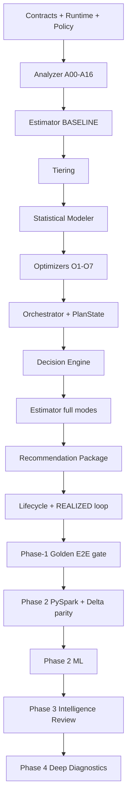

# Databricks Compute Optimization Product
## SQL Warehouse Capability Pack — Detailed Technical Specification Index

**Document ID:** TS-INDEX-001  
**Pack version:** `2.0.1`  
**Date:** 2026-08-14  
**Platform:** Databricks on AWS  
**Parent PRD:** `databricks_compute_optimization_product_prd_v2.0.0.md`  
**Parent HLA:** `databricks_compute_optimization_high_level_architecture_v2.0.0.md`  
**Status:** Draft for implementation review

---

# 0. v2.0.1 Implementation Baseline

This index is the implementation map for the **SQL Warehouse Capability Pack** running on the reusable Shared Optimization Kernel.

The implementation is intentionally split by responsibility, not duplicated:

```text
kernel/                         # reusable engines/contracts, implemented once
packs/sql_warehouse/            # SQLWH-specific implementations/providers
packs/sql_warehouse/manifest.yaml
                                # metadata pointing to the SQLWH executable implementations
```

There is no second `capabilities/sql_warehouse/` implementation tree. A released `(capability_id, semantic_version)` resolves to exactly one executable implementation.

Gate-3 Shared-Kernel/Intelligence Review specifications are normative dependencies:

- `TS-CAP-001` — Capability Registry;
- `TS-CTX-001` — DecisionContext / Evidence Graph;
- `TS-LLM-001` — SQL Warehouse Intelligence Review Plane.

The pre-v2 Phase-3 placeholder is superseded and MUST NOT appear in the v2 implementation tree. Phase 4 is renamed **Deep Diagnostic Intelligence**; SQL Warehouse does not assume Spark-event telemetry.

### v2.0.1 implementation patch

- `TS-EST-001`, `TS-RUNTIME-001`, and `TS-DATA-001` are v2.0.1.
- AWS CUR/Data Exports remains preferred actual AWS evidence.
- While CUR is unavailable, `config/pricing/aws_ec2_price_registry.yaml` is the approved planning-estimate fallback with `PRICE_REGISTRY_ESTIMATE` provenance.
- Phase-2 DAB storage is explicitly **Control + Bronze → Silver → Gold + ML**.
- Databricks system tables remain query-in-place sources; they are not copied into Bronze by default.
- SQL Warehouse Product Release Plan v2.0.1 and Golden catalog v2.0.1 (`GT-000..GT-077`) are the downstream implementation authority.

---

# 1. Purpose

This pack turns the approved product and architecture decisions into implementation-grade component specifications. It is the normative source for component behavior, contracts, algorithms, error semantics, observability, and component release sequencing. Golden end-to-end scenarios are intentionally a downstream artifact and must reference the stable `TS-*` identifiers defined here.

The implementation trace is:

```text
PRD requirement
   ↓
Architecture decision / component
   ↓
Technical specification requirement
   ↓
Component release
   ↓
Golden end-to-end scenario
   ↓
Code + test
```

---

# 2. Phase-1 Scope Clarification

The **single Phase-1 top-level optimization entity is `WAREHOUSE`**.

O1–O5 and O7 operate on one warehouse. Beginning in Phase 5, O6 Topology may evaluate and recommend a split or consolidation involving multiple source/target warehouse IDs, but this cardinality is carried inside the O6 result contract. `WORKLOAD_GROUP`, `WAREHOUSE_GROUP`, and `TOPOLOGY_GROUP` are not Phase-1 product-level optimization scope types.

```text
Top-level optimization entity
└── WAREHOUSE

O6 contract exception
└── source_warehouse_ids[]
└── target_warehouses[]
└── workload_placements[]
```

---

# 3. Technical Specification Documents

| Order | Spec | Placement | Responsibility |
|---:|---|---|---|
| 1 | `TS-CAP-001` | Shared Kernel | Capability Registry + gap lifecycle |
| 2 | `TS-CTX-001` | Shared Kernel | DecisionContext / Evidence Graph / context hashing |
| 3 | `TS-POL-001` | Kernel engine + SQLWH policy profile | deterministic Policy resolution |
| 4 | `TS-ANA-001` | SQLWH Pack on Kernel analyzer framework | A00–A16 deterministic facts |
| 5 | `TS-EST-001` | Kernel financial engine + SQLWH attribution provider | authoritative money |
| 6 | `TS-TIER-001` | Shared Kernel + SQLWH threshold profile | T1–T4 value/search depth |
| 7 | `TS-MOD-001` | Kernel Modeler framework + SQLWH implementations | statistical/ML prediction |
| 8 | `TS-OPT-001` | SQLWH Pack on Kernel optimizer framework | O1–O7 technique decisions |
| 9 | `TS-ORCH-001` | Shared Kernel | dependency/search/PlanState/selective reevaluation |
| 10 | `TS-DEC-001` | Shared Kernel + SQLWH constraint profile | final authoritative plan |
| 11 | `TS-REC-001` | Shared Kernel + SQLWH rendering/config provider | immutable recommendation |
| 12 | `TS-LIFE-001` | Shared Kernel + SQLWH config/validation provider | lifecycle/realization |
| 13 | `TS-RUNTIME-001` | Runtime/infrastructure | composition/adapters/persistence/deployment |
| 14 | `TS-DATA-001` | Runtime/data | Phase-2+ Delta schemas |
| 15 | `TS-LLM-001` | Shared Intelligence Review + SQLWH evidence profile | Phase-3 review/explanation |
| 16 | `TS-DIAG-001` | SQLWH Pack diagnostics | Phase-4 Deep Diagnostic Intelligence |

# 4. Frozen Component Ownership

| Concern | Owner |
|---|---|
| Operating rules, thresholds, feature gates | Kernel Policy Engine + SQLWH policy profile |
| Released executable capability inventory / gaps | Capability Registry |
| Authoritative input identity/hash/change classification | DecisionContext |
| Observed SQLWH facts and derived evidence | SQLWH Analyzers |
| T1–T4 value/search/model depth | Tiering |
| Projection/counterfactual quantities | Modeler |
| SQLWH single-technique configuration decision | SQLWH Optimizer |
| Money/economic calculations | Estimator |
| Search workflow/dependencies/PlanState/selective reevaluation | Kernel Orchestrator |
| Final compatible plan selection | Kernel Decision Engine |
| AR0–AR4 LLM review routing/review mechanics | Kernel Intelligence Review Plane |
| Immutable user/API recommendation artifact | Recommendation Package |
| Application/change detection/state/validation/value realization | Lifecycle Manager |
| SQL/API/AWS access, repositories, composition/deployment | Runtime |
| SQLWH Phase-4 deep diagnostic evidence | SQLWH diagnostic capability |

**Invariant:** no component may silently assume another component's concern, and no pack may clone a shared Kernel service.

# 4.1 Cross-spec source precedence

For SQL Warehouse analysis, all TSDs apply the same source precedence: **Databricks system tables first, deterministic derived metrics second, Databricks API only for unresolved/API-only fields or authorized apply-time operations.** External AWS/enterprise sources are used only for evidence Databricks does not own, principally infrastructure/commercial economics and enterprise controls.


# 5. Common Runtime Invariants

1. Same authoritative DecisionContext + same Policy/Capability/component versions + fixed seeds where applicable yields the same deterministic execution set and authoritative result.
2. Every applicable registered SQLWH Analyzer and Optimizer executes. T1–T4 may bound candidate breadth, beam width, modeling/ML depth, and compute budget; it cannot silently suppress an otherwise applicable Analyzer/Optimizer.
3. Statistical/ML predictions are non-authoritative inputs; statistical fallback remains available where specified.
4. LLM agents investigate/challenge/explain only. They cannot request generic rerun or `RUN_EXISTING_ANALYZER/OPTIMIZER`.
5. Same `authoritative_context_hash` means no authoritative recomputation.
6. A validated evidence/input/policy/fallback/capability change may create a new DecisionContext and dependency-directed reevaluation.
7. Capability gaps are durable, deduplicated, non-executable Registry state until designed/tested/released.
8. Analyzer never invents unsupported SQL Warehouse CPU/memory telemetry.
9. Modeler predicts quantities/behavior; Estimator prices quantities.
10. Independent optimizer savings are never summed to produce authoritative total savings.
11. O7 protective avoided-waste savings remain separate.
12. Recommendation packages are immutable; AgentReviewStatus and NarrativeExtension remain orthogonal/non-authoritative.
13. Lifecycle `REALIZED` requires financial realization and passing performance/reliability validation.
14. Phase 1 has no ML/LLM/Deep-Diagnostic dependency.
15. Phase 2 scales the proven semantics using DAB/Lakeflow Jobs/PySpark/Delta and admitted ML.
16. Phase 3 is packet-only LLM review with zero callable agent tools.
17. Phase 4 is SQLWH Deep Diagnostic Intelligence using only validated SQLWH diagnostic sources; Spark-event telemetry is not assumed.
18. Phase 6 is the earliest phase for optional bounded agent tools/Copilot.


# 6. Common Contract Envelope

All major component results use a common envelope:

```json
{
  "contract_version": "1.0.0",
  "run_id": "RUN-...",
  "workspace_id": "123...",
  "warehouse_id": "WH-...",
  "generated_at_utc": "2026-08-12T00:00:00Z",
  "policy_snapshot_id": "PSNAP-...",
  "policy_version": "1.0.0",
  "policy_hash": "sha256:...",
  "component_id": "ANA|MOD|OPT|EST|...",
  "component_version": "...",
  "source_snapshot": {
    "analysis_end_utc": "...",
    "source_versions": {}
  },
  "status": "SUCCESS|BLOCKED|PARTIAL|FAILED",
  "warnings": [],
  "errors": [],
  "lineage_refs": []
}
```

O6 may additionally carry `topology_evaluation_id` and an ordered set of participating warehouse IDs.

---

# 7. Common Error Taxonomy

| Code class | Meaning | Default behavior |
|---|---|---|
| `DATA_*` | missing/stale/ambiguous evidence | blocker if material; otherwise warning |
| `POLICY_*` | invalid/conflicting/forbidden policy | fail before authoritative run |
| `SOURCE_*` | SQL/API/AWS source failure | retry if transient; isolate warehouse if persistent |
| `MODEL_*` | unsupported/uncertain/out-of-domain prediction | fallback or block affected candidate |
| `OPT_*` | no valid candidate / candidate invariant failure | `NO_CHANGE` or `BLOCKED` as appropriate |
| `COST_*` | unreconciled/insufficient financial evidence | block authoritative savings if material |
| `DECISION_*` | no valid plan / incompatible results | block recommendation |
| `LIFECYCLE_*` | invalid transition / stale recommendation | reject transition; preserve prior valid state |
| `COMPAT_*` | contract/component version mismatch | reject run before authority |

---

# 8. Current Platform Source Register

Validated against official documentation on 2026-08-14.

| Source ID | Platform source | Key use | Authority / caveat |
|---|---|---|---|
| `SRC-DBX-001` | `system.compute.warehouses` | SCD-like warehouse config history | Core current/history config; 365-day regional retention |
| `SRC-DBX-002` | `system.compute.warehouse_events` | start/stop/run/scale events and cluster_count | 365-day regional retention |
| `SRC-DBX-003` | `system.query.history` | query runtime/queue/provisioning/task/read/spill/shuffle/source telemetry | Public Preview; 365-day regional retention |
| `SRC-DBX-004` | `system.billing.usage` | corrected billable usage and warehouse attribution | Global; 365-day retention |
| `SRC-DBX-005` | `system.billing.list_prices` | historical published list prices | Global; indefinite retention; fallback, not negotiated contract price |
| `SRC-DBX-006` | Warehouses API / SDK / CLI | API-only fields/operations and just-in-time apply verification | Fallback/write surface only; do not duplicate `system.compute.warehouses` fields such as type/size/min/max/auto-stop when the system-table contract resolves them |
| `SRC-DBX-007` | Audit events (`editWarehouse`) | optional who/when/change enrichment | Audit system table is Public Preview; enrichment only |
| `SRC-AWS-001` | AWS CUR 2.0 / Data Exports | Pro/Classic AWS actual economics | Require resource/tag attribution and commitment-aware cost basis |
| `SRC-COM-001` | enterprise negotiated Databricks rate table / invoice-derived effective rate | actual Databricks financial rate basis | Preferred over list price |
| `SRC-ORG-001` | security/network/eligibility adapter | policy and environment eligibility | enterprise source of truth |
| `SRC-ORG-002` | workload SLO/criticality adapter | runtime/reliability guardrails | enterprise source of truth |
| `SRC-DIAG-001` | SQL Warehouse Query History / warehouse monitoring / query diagnostic surfaces | Phase-4 deep diagnostic enrichment | programmatic source contract required before authoritative ingestion; Query Profile UI availability does not imply a stable extraction API |
| `SRC-DIAG-002` | Query Profile | Phase-4 optional deep diagnostic evidence | supported diagnostic surface; acquisition remains non-normative until a supported programmatic contract is validated |

Official references:

- https://docs.databricks.com/aws/en/admin/system-tables/
- https://docs.databricks.com/aws/en/admin/system-tables/warehouses
- https://docs.databricks.com/aws/en/admin/system-tables/warehouse-events
- https://docs.databricks.com/aws/en/admin/system-tables/query-history
- https://docs.databricks.com/aws/en/admin/system-tables/billing
- https://docs.databricks.com/aws/en/admin/system-tables/pricing
- https://docs.databricks.com/aws/en/compute/sql-warehouse/warehouse-types
- https://docs.databricks.com/aws/en/compute/sql-warehouse/warehouse-behavior
- https://docs.databricks.com/aws/en/compute/sql-warehouse/create
- https://docs.databricks.com/aws/en/admin/sql/serverless
- https://docs.databricks.com/aws/en/admin/account-settings/usage-detail-tags
- https://docs.databricks.com/aws/en/admin/account-settings/audit-logs
- https://docs.databricks.com/aws/en/dev-tools/cli/reference/warehouses-commands
- https://docs.aws.amazon.com/cur/latest/userguide/table-dictionary-cur2.html
- https://docs.aws.amazon.com/cur/latest/userguide/savingsplans-columns.html

---

# 9. Implementation Order and Integration Gates



A downstream component can be coded earlier behind mocks, but cannot be declared integrated-complete until its upstream contract/release gates pass.

---

# 10. Pack-Level Definition of Done

The technical-spec pack is implementation-ready when:

- every PRD component has a `TS-*` document;
- every component has stable input/output contracts and failure semantics;
- every relevant source field is mapped to an official source or enterprise adapter;
- SQL source/derived queries are bounded and parameterized;
- every optimizer has explicit candidate/guardrail/decision rules;
- statistical Phase-1 and ML Phase-2 Modeler behavior is separated;
- every component has a versioned `REL-*` plan;
- pandas Phase-1 and PySpark Phase-2 implementations share domain contracts;
- all open assumptions are marked, not silently encoded;
- the downstream golden-test document can refer to exact `TS-*` rules and contracts.

---

# 11. Product Requirement → Architecture → Technical Spec → Release Trace Matrix

Golden-test IDs are intentionally assigned only after this technical-spec pack is approved. The downstream Golden Test document MUST add the final `GT-*` column without changing the upstream IDs.

| PRD | HLA | Technical authority | Release family | Golden test |
|---|---|---|---|---|
| `PRD-FR-PROD-001` | `ARC-SRC-001`, `ARC-RUN-001` | `TS-ANA`, `TS-RUNTIME` | `REL-ANA-*`, `REL-RUNTIME-*` | downstream `GT-*` |
| `PRD-FR-PROD-002` | `ARC-CMP-002`, `ARC-CMP-010` | `TS-ANA`, `TS-LIFE` | `REL-ANA-*`, `REL-LIFE-*` | downstream `GT-*` |
| `PRD-FR-PROD-003` | `ARC-CMP-002`, `ARC-CMP-001` | `TS-POL`, `TS-ANA` | `REL-POL-*`, `REL-ANA-*` | downstream `GT-*` |
| `PRD-FR-PROD-004` | `ARC-CMP-002`, `ARC-CMP-001` | `TS-POL`, `TS-ANA` | `REL-POL-*`, `REL-ANA-*` | downstream `GT-*` |
| `PRD-FR-PROD-005` | `ARC-CMP-002`, `ARC-INT-002` | `TS-ANA` | `REL-ANA-*` | downstream `GT-*` |
| `PRD-FR-PROD-006` | `ARC-CMP-003`, `ARC-CMP-004` | `TS-EST`, `TS-TIER` | `REL-EST-*`, `REL-TIER-*` | downstream `GT-*` |
| `PRD-FR-PROD-007` | `ARC-CMP-004` | `TS-TIER` | `REL-TIER-*` | downstream `GT-*` |
| `PRD-FR-PROD-008` | `ARC-CMP-005`, `ARC-RUN-001` | `TS-MOD` | `REL-MOD-0.*`, `REL-MOD-1.0.0` | downstream `GT-*` |
| `PRD-FR-PROD-009` | `ARC-CMP-005`, `ARC-RUN-003` | `TS-MOD`, `TS-RUNTIME` | `REL-MOD-2.*`, `REL-RUNTIME-2.1.0` | downstream `GT-*` |
| `PRD-FR-PROD-010` | `ARC-CMP-006`, `ARC-EXEC-001` | `TS-OPT` | `REL-OPT-*` | downstream `GT-*` |
| `PRD-FR-PROD-011` | `ARC-CMP-005`, `ARC-EXEC-001` | `TS-MOD`, `TS-OPT` | `REL-MOD-*`, `REL-OPT-*` | downstream `GT-*` |
| `PRD-FR-PROD-012` | `ARC-CMP-003`, `ARC-EXEC-001` | `TS-EST`, `TS-OPT` | `REL-EST-*`, `REL-OPT-*` | downstream `GT-*` |
| `PRD-FR-PROD-013` | `ARC-CMP-006` | `TS-OPT` | `REL-OPT-*` | downstream `GT-*` |
| `PRD-FR-PROD-014` | `ARC-EXEC-001` | `TS-OPT`, `TS-ORCH`, `TS-EST` | `REL-OPT-*`, `REL-ORCH-*`, `REL-EST-*` | downstream `GT-*` |
| `PRD-FR-PROD-015` | `ARC-EXEC-001`, `ARC-STATE-001` | `TS-ORCH`, `TS-OPT` | `REL-ORCH-*`, `REL-OPT-*` | downstream `GT-*` |
| `PRD-FR-PROD-016` | `ARC-CMP-007` | `TS-ORCH`, `TS-OPT` | `REL-ORCH-*`, `REL-OPT-*` | downstream `GT-*` |
| `PRD-FR-PROD-017` | `ARC-STATE-001` | `TS-ORCH` | `REL-ORCH-*` | downstream `GT-*` |
| `PRD-FR-PROD-018` | `ARC-CMP-007` | `TS-ORCH`, `TS-DEC` | `REL-ORCH-*`, `REL-DEC-*` | downstream `GT-*` |
| `PRD-FR-PROD-019` | `ARC-CMP-008` | `TS-DEC` | `REL-DEC-*` | downstream `GT-*` |
| `PRD-FR-PROD-020` | `ARC-CMP-008` | `TS-DEC` | `REL-DEC-*` | downstream `GT-*` |
| `PRD-FR-PROD-021` | `ARC-CMP-003`, `ARC-EXEC-001` | `TS-EST`, `TS-REC` | `REL-EST-*`, `REL-REC-*` | downstream `GT-*` |
| `PRD-FR-PROD-022` | `ARC-CMP-003`, `ARC-STATE-001` | `TS-EST`, `TS-ORCH` | `REL-EST-*`, `REL-ORCH-*` | downstream `GT-*` |
| `PRD-FR-PROD-023` | `ARC-CMP-003` | `TS-EST` | `REL-EST-*` | downstream `GT-*` |
| `PRD-FR-PROD-024` | `ARC-CMP-003`, `ARC-CMP-009` | `TS-EST`, `TS-REC` | `REL-EST-*`, `REL-REC-*` | downstream `GT-*` |
| `PRD-FR-PROD-025` | `ARC-CMP-003` | `TS-EST` | `REL-EST-*` | downstream `GT-*` |
| `PRD-FR-PROD-026` | `ARC-CMP-009` | `TS-REC` | `REL-REC-*` | downstream `GT-*` |
| `PRD-FR-PROD-027` | `ARC-CMP-008`, `ARC-CMP-009`, `ARC-CMP-001` | `TS-DEC`, `TS-REC`, `TS-POL` | `REL-DEC-*`, `REL-REC-*`, `REL-POL-*` | downstream `GT-*` |
| `PRD-FR-PROD-028` | `ARC-CMP-009`, runtime apply boundary | `TS-REC`, `TS-RUNTIME` | `REL-REC-*`, `REL-RUNTIME-*` | downstream `GT-*` |
| `PRD-FR-PROD-029` | `ARC-CMP-010` | `TS-LIFE`, `TS-RUNTIME` | `REL-LIFE-*`, `REL-RUNTIME-*` | downstream `GT-*` |
| `PRD-FR-PROD-030` | `ARC-CMP-010` | `TS-LIFE`, `TS-ANA` | `REL-LIFE-*`, `REL-ANA-*` | downstream `GT-*` |
| `PRD-FR-PROD-031` | `ARC-CMP-005`, `ARC-CMP-003`, `ARC-CMP-010` | `TS-MOD`, `TS-EST`, `TS-LIFE` | `REL-MOD-*`, `REL-EST-*`, `REL-LIFE-*` | downstream `GT-*` |
| `PRD-FR-PROD-032` | `ARC-RUN-001` | `TS-LIFE`, `TS-RUNTIME` | `REL-LIFE-*`, `REL-RUNTIME-*` | downstream `GT-*` |
| `PRD-FR-PROD-033` | `ARC-DCTX-001`, `ARC-CMP-007`, `ARC-CMP-010` | `TS-LIFE`, `TS-ORCH`, `TS-OPT` | `REL-LIFE-*`, `REL-ORCH-*`, `REL-OPT-*` | downstream `GT-*` |
| `PRD-FR-PROD-034` | `ARC-CMP-010`, `ARC-CMP-001` | `TS-LIFE`, `TS-POL` | `REL-LIFE-*`, `REL-POL-*` | downstream `GT-*` |
| `PRD-FR-PROD-035` | `ARC-CMP-001` | `TS-POL`, `TS-RUNTIME` | `REL-POL-*`, `REL-RUNTIME-*` | downstream `GT-*` |
| `PRD-FR-PROD-036` | `ARC-INT-002`, `ARC-STATE-001` | all `TS-*` contract lineage; especially `TS-ORCH`, `TS-REC`, `TS-RUNTIME` | all relevant `REL-*` | downstream `GT-*` |
| `PRD-FR-PROD-037` | `ARC-CMP-002`, `ARC-CMP-009` | `TS-ANA`, `TS-REC` | `REL-ANA-*`, `REL-REC-*` | downstream `GT-*` |
| `PRD-FR-PROD-038` | `ARC-PLAT-002` | `TS-OPT` O6, `TS-REC`, `TS-ORCH` | `REL-OPT-*`, `REL-REC-*`, `REL-ORCH-*` | downstream `GT-*` |
| `PRD-FR-PROD-039` | `ARC-CMP-008`, `ARC-CMP-009` | `TS-DEC`, `TS-REC` | `REL-DEC-*`, `REL-REC-*` | downstream `GT-*` |
| `PRD-FR-PROD-040` | `ARC-CAP-001`, `ARC-INT-002`, `ARC-RUN-002` | `TS-POL`, `TS-RUNTIME` + all contract versions | `REL-POL-*`, `REL-RUNTIME-*` | downstream `GT-*` |

Component-level PRD families (`PRD-FR-POL-*`, `PRD-FR-ANA-*`, `PRD-FR-EST-*`, `PRD-FR-TIER-*`, `PRD-FR-MOD-*`, `PRD-FR-OPT-*`, `PRD-FR-ORCH-*`, `PRD-FR-DEC-*`, `PRD-FR-REC-*`, `PRD-FR-LIFE-*` and corresponding NFR families) map directly to their same-named `TS-*` document and `REL-*` family.

---

# 12. Golden-Test Traceability Contract

The downstream Golden E2E specification MUST define each scenario with:

```text
GT-ID
  -> PRD requirement IDs
  -> ARC IDs
  -> TS rule/contract/query IDs
  -> minimum component REL versions
  -> deterministic input fixture IDs
  -> exact/interval expected outputs
```

No Golden scenario may weaken an upstream requirement; if an implementation finding requires a rule change, update PRD/HLA/TS through review rather than silently changing the test expectation.
