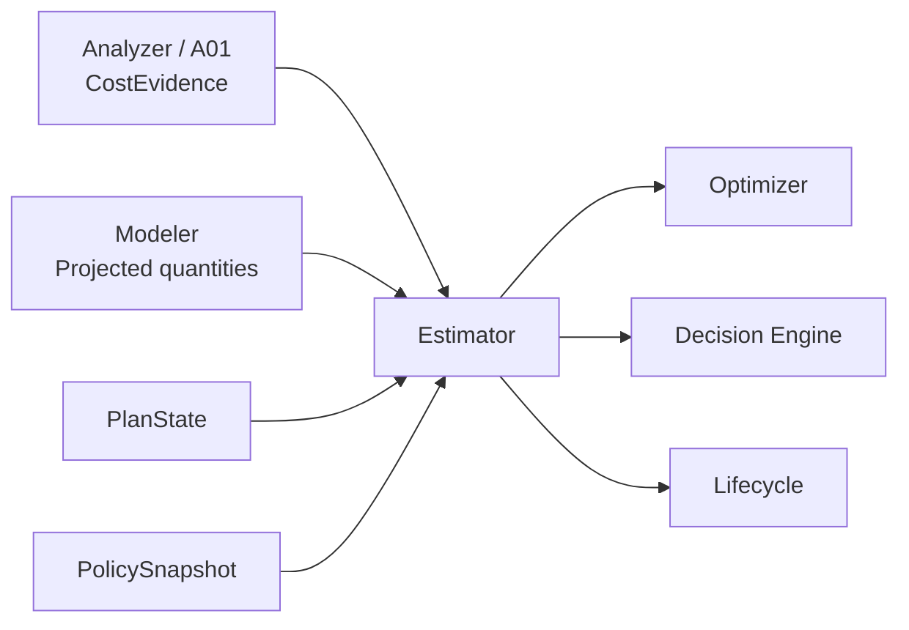

# Databricks Compute Optimization Product
## SQL Warehouse Estimator Detailed Technical Specification

**Document ID:** `TS-EST-001`  
**Version:** `2.0.1`
**Date:** 2026-08-14  
**Parent PRD:** `databricks_compute_optimization_product_prd_v2.0.0.md`  
**Parent HLA:** `databricks_compute_optimization_high_level_architecture_v2.0.0.md`  
**Status:** Draft for implementation review

---

# 0. v2.0.1 Implementation Hardening

This v2 reconciliation preserves the existing SQL Warehouse business semantics while adopting the Shared Kernel + SQL Warehouse Pack implementation boundary.

- Shared framework/engine code is implemented once under `src/databricks_compute_optimizer/kernel/`.
- SQL Warehouse-specific algorithms, sources, configuration semantics, and providers live under `src/databricks_compute_optimizer/packs/sql_warehouse/`.
- `packs/sql_warehouse/manifest.yaml` points to executable pack capabilities; it is metadata, not duplicate implementation code.
- No future compute pack is implemented by this document.

The authoritative Estimator engine/modes/Decimal arithmetic are shared Kernel code under `kernel/financial/`. SQL Warehouse supplies a `financial` provider for SQLWH billable-quantity attribution, Databricks/AWS rate evidence, and service-specific target economics. The provider is not a second Estimator.

Estimator outputs and decision-relevant financial-input digests participate in DecisionContext. LLM review never recalculates or replaces Estimator money.

### v2.0.1 AWS pricing fallback

AWS CUR/Data Exports remains the preferred source for actual attributable customer-cloud AWS economics. Until CUR is available, Policy may allow a **source-controlled, effective-dated AWS price registry** as a planning-estimate fallback.

This fallback:
- is versioned and digest-tracked;
- is labeled `PRICE_REGISTRY_ESTIMATE`;
- may support baseline/candidate/forward planning economics;
- does **not** make AWS cost actual/reconciled;
- does **not** authorize realized AWS cash savings or commitment-freed actuals;
- is superseded by CUR/actual billing evidence when available.

---

# 1. Purpose

The Estimator is the **single owner of money** in the product. It converts observed or projected quantities into financially consistent current cost, candidate cost, independent savings, sequenced savings, forward projections, protective avoided-waste estimates, and realized value.

It MUST NOT generate configuration recommendations or forecast workload behavior. The Modeler predicts quantities and behavior; the Estimator prices those quantities.

---

# 2. Traceability

| Requirement family | Architecture | Technical requirement |
|---|---|---|
| `PRD-FR-EST-*` | `ARC-CMP-003` | `TS-EST-*` |
| `PRD-FR-PROD-014..021` | `ARC-CMP-003`, `ARC-EXEC-001` | cost modes and savings semantics |
| `PRD-NFR-EST-*` | `ARC-REL-002`, `ARC-OBS-002` | determinism, reconciliation, precision |
| `PRD-FR-PROD-030..032` | `ARC-CMP-010` | realized-value economics |

---

# 3. Non-negotiable invariants

| ID | Invariant |
|---|---|
| `TS-EST-INV-001` | Estimator is the only component allowed to produce authoritative dollar savings. |
| `TS-EST-INV-002` | Current TTM-365 Databricks cost uses actual corrected usage. Attributable AWS cost uses CUR/actual evidence when available; if Policy permits `PRICE_REGISTRY_ESTIMATE`, total cost is explicitly mixed actual/estimated and MUST NOT be labeled fully actual/reconciled. |
| `TS-EST-INV-003` | Published Databricks list price is a fallback/reference rate, not a negotiated-rate substitute when an authoritative commercial rate exists. |
| `TS-EST-INV-004` | Serverless counterfactuals MUST NOT inherit a blanket percentage uplift for customer-side AWS warehouse compute. |
| `TS-EST-INV-005` | Independent savings MUST NOT be summed to calculate portfolio savings. |
| `TS-EST-INV-006` | `sum(incremental_savings)` MUST equal `baseline_cost - final_target_cost` within policy rounding tolerance. |
| `TS-EST-INV-007` | TTM replay and Forward-365 projections are separate financial perspectives. |
| `TS-EST-INV-008` | AWS economic savings, cash-realizable savings, and commitment-freed value remain distinguishable. |
| `TS-EST-INV-009` | `REALIZED` uses a workload-normalized counterfactual when policy requires it. |
| `TS-EST-INV-010` | O7 protective avoided-waste savings never enter the performance-preserving total. |
| `TS-EST-INV-011` | All monetary calculations use decimal arithmetic; binary floating point MUST NOT be authoritative. |

---

# 4. Component context



---

# 5. Estimator modes

| Mode | Question | Quantity basis | Consumer | Authority |
|---|---|---|---|---|
| `BASELINE` | What did the warehouse actually cost over TTM-365? | observed corrected usage | Tiering / reporting | authoritative current cost |
| `CANDIDATE` | What would this candidate approximately cost? | Modeler/candidate quantities | Optimizer | ranking-quality estimate |
| `INDEPENDENT` | What if only optimizer X were applied to baseline? | baseline + single change | Recommendation Package | authoritative standalone estimate |
| `SEQUENCED` | What is step N worth after steps 1..N-1? | adjacent PlanStates | Decision / Package | authoritative incremental estimate |
| `AUTHORITATIVE_PLAN` | What is final plan cost and total savings? | final sequenced PlanState | Decision / Package | authoritative recommendation estimate |
| `FORWARD` | What will current vs target cost over next 365 days? | Modeler forward projection | Package | projected, not observed |
| `REALIZED` | How much value was actually achieved? | counterfactual old-state + observed new-state | Lifecycle | realized-value authority |
| `PROTECTIVE` | What runaway waste could O7 avoid? | pathological-query replay | O7 / Package | separate protective category |

---

# 6. Input contracts

## 6.1 `CostEvidence`

Produced by A01. Minimum fields:

```json
{
  "contract_version": "1.0.0",
  "warehouse_id": "WH-123",
  "period": {"start_utc": "...", "end_utc": "..."},
  "databricks_usage": {
    "rows": [],
    "corrected_quantity_by_sku_period": []
  },
  "commercial_rates": {
    "basis": "CONTRACT|INVOICE_EFFECTIVE|SYSTEM_LIST|PUBLIC_LIST",
    "rows": []
  },
  "aws": {
    "applicable": true,
    "basis": "CUR_ACTUAL|PRICE_REGISTRY_ESTIMATE|DBX_ONLY|NOT_APPLICABLE",
    "attribution_pct": 99.2,
    "cur_rows": [],
    "price_registry_rows": [],
    "price_registry_version": null,
    "price_registry_sha256": null,
    "commitment_context": {}
  },
  "quality": {
    "billing_coverage_pct": 100.0,
    "aws_attribution_pct": 99.2,
    "databricks_reconciled": true,
    "aws_actual_available": false,
    "aws_estimate_coverage": "EC2_CORE_ONLY|EC2_EBS|FULL_MODELED|NOT_APPLICABLE",
    "total_cost_quality": "FULL_ACTUAL|MIXED_ACTUAL_ESTIMATED|DBX_ONLY"
  }
}
```

A01 prepares evidence and quality metadata. It MUST NOT return final annual dollar savings.

## 6.2 `PlanState`

Estimator consumes the immutable current/candidate/target PlanState defined in `TS-ORCH`.

Required financial-relevant fields:

- canonical warehouse type;
- size/min/max cluster settings;
- Photon setting;
- Spot policy where applicable;
- auto-stop;
- topology membership for O6 branches;
- state lineage/parent;
- Modeler result references;
- expected usage/resource quantities.

## 6.3 `ModelerResult`

Estimator consumes quantities only, including as applicable:

- projected DBUs or billable-unit driver quantities;
- projected running seconds / cluster-seconds;
- projected cluster-count timeline;
- projected AWS instance/resource-hours;
- projected starts/restarts;
- projected retry work;
- projected workload volume;
- uncertainty intervals.

Estimator MUST reject a request where the quantity contract is insufficient for the cost formula required by the target warehouse type.

## 6.4 `EstimatorRequest`

```json
{
  "contract_version": "1.0.0",
  "request_id": "ESTREQ-...",
  "mode": "BASELINE",
  "warehouse_id": "WH-123",
  "baseline_plan_state_id": "PS-BASE",
  "target_plan_state_id": null,
  "optimizer_id": null,
  "cost_evidence_ref": "CEVID-...",
  "modeler_result_refs": [],
  "period": {"basis": "TTM_365", "start_utc": "...", "end_utc": "..."},
  "policy_snapshot_id": "PSNAP-..."
}
```

---

# 7. Source financial semantics

## 7.1 Databricks billable usage

Authoritative observed usage comes from `system.billing.usage`, warehouse-attributed through `usage_metadata.warehouse_id` for SQL warehouse usage when populated.

Billing corrections MUST respect record semantics. A correction can contain original, retraction, and restatement records; the corrected quantity for an aggregation grain is the signed sum of `usage_quantity` after all records in the closed observation window are included.

### `Q-EST-001` — corrected Databricks usage by SKU/day

```sql
SELECT
    workspace_id,
    usage_metadata.warehouse_id AS warehouse_id,
    usage_date,
    sku_name,
    usage_unit,
    SUM(usage_quantity) AS corrected_usage_quantity,
    COUNT(*) AS billing_record_count
FROM system.billing.usage
WHERE usage_metadata.warehouse_id = :warehouse_id
  AND usage_start_time >= :start_ts
  AND usage_start_time < :end_ts
GROUP BY
    workspace_id,
    usage_metadata.warehouse_id,
    usage_date,
    sku_name,
    usage_unit;
```

Implementation notes:

1. `:start_ts`/`:end_ts` are closed-open and supplied by the run snapshot.
2. Do not filter out retractions/restatements before summing.
3. Preserve SKU and usage unit; do not assume every quantity is DBU without checking `usage_unit`.
4. Push `warehouse_id` and time predicates to the source.

## 7.2 Published list-price fallback

`system.billing.list_prices` is historical published list pricing. The Estimator uses it only according to configured rate precedence.

### `Q-EST-002` — effective list-price periods

```sql
SELECT
    sku_name,
    currency_code,
    usage_unit,
    price_start_time,
    price_end_time,
    pricing.default AS default_list_price,
    pricing.promotional.default AS promotional_price,
    pricing.effective_list.default AS effective_list_price
FROM system.billing.list_prices
WHERE sku_name IN (:sku_names)
  AND price_start_time < :end_ts
  AND (price_end_time IS NULL OR price_end_time > :start_ts);
```

The implementation MUST interval-join each usage record/aggregation grain to the applicable price period.

## 7.3 Commercial-rate precedence

Default precedence:

```text
1. Enterprise contract rate table
2. Invoice-derived effective rate
3. system.billing.list_prices effective/list price
4. Public list price adapter
```

The selected rate basis is persisted in every `CostEstimate`.

A fallback from 1/2 to 3/4 lowers financial quality according to Policy; it MUST NOT silently preserve the same confidence.

## 7.4 AWS cost evidence

For Pro/Classic, customer-side AWS infrastructure is included where attributable. The preferred attribution path uses AWS CUR 2.0/Data Exports plus resource IDs and/or Databricks-propagated warehouse tags such as `SqlEndpointId` on supported EC2/EBS resources.

AWS cost fields MUST be normalized into an internal `AwsCostLine`:

```json
{
  "usage_start_utc": "...",
  "service": "EC2|EBS|NETWORK|OTHER",
  "resource_id": "...",
  "warehouse_id": "WH-123",
  "usage_quantity": "...",
  "unblended_cost": "...",
  "amortized_or_effective_cost": "...",
  "net_effective_cost": "...",
  "savings_plan_covered": true,
  "reservation_covered": false,
  "attribution_method": "TAG|RESOURCE_MAP|OTHER"
}
```

The exact CUR column names vary by export schema and configuration; `TS-RUNTIME` owns adapter mapping. The Estimator consumes the normalized contract, not raw provider-specific names.

## 7.5 Source-controlled AWS price registry fallback

When CUR/Data Exports are unavailable and Policy permits planning estimates, the SQLWH financial provider may read `config/pricing/aws_ec2_price_registry.yaml`.

Required lookup dimensions include the rate-defining resource attributes needed for an unambiguous price, including as applicable:

```text
cloud
service
region
instance_type/resource_type
operating_system
tenancy
purchase_option
currency
unit
effective_start_utc
effective_end_utc
```

Every effective rate also carries `source_type`, `source_reference`, `source_retrieved_at_utc`, `registry_version`, and `registry_sha256`.

### On-Demand

Use a reviewed effective-dated rate derived from an approved AWS pricing source. Runtime optimization reads the reviewed registry, not the public pricing API directly.

### Spot

Spot pricing is time/AZ dependent. A static On-Demand rate MUST NOT be represented as Spot actual.

If Spot economics are estimated from the registry, persist:
- estimation method;
- observation window;
- region/AZ scope;
- source evidence;
- summary statistic/risk treatment.

The basis remains `PRICE_REGISTRY_ESTIMATE`.

### Precedence

```text
1. attributable CUR/Data Exports actual/effective economics
2. approved invoice/chargeback actual evidence
3. source-controlled price-registry planning estimate
4. DBX-only estimate if Policy permits
5. blocked total-cost result
```

### Reproducibility

The source file Git SHA and SHA-256 digest are part of financial evidence/DecisionContext. A registry-rate change is a financial-context change and may selectively invalidate Estimator/Decision outputs without rerunning unrelated workload Analyzers.

---

# 8. Cost basis and formulas

## 8.1 Decimal convention

Use `Decimal` with currency minor-unit precision plus internal calculation scale of at least 8 decimal places.

Recommended implementation:

```text
internal monetary scale >= 8 decimals
output USD = ROUND_HALF_EVEN to 2 decimals
percentage output = 4 decimal places
```

The exact rounding mode is policy/versioned and golden-tested.

## 8.2 Current TTM-365 Databricks cost

For corrected usage grains `g`:

```text
DatabricksActualCost365
  = Σ_g CorrectedUsageQuantity_g × EffectiveCommercialRate_g
```

## 8.3 Current TTM-365 AWS cost

For attributable normalized AWS line items `a`:

```text
AwsEconomicCost365 = Σ_a EconomicCostBasis_a
```

For Pro/Classic:

```text
CurrentEconomicCost365
  = DatabricksActualCost365
  + AwsEconomicCost365
```

Cost-quality label:

```text
CUR/actual AWS evidence        -> FULL_ACTUAL
PRICE_REGISTRY_ESTIMATE        -> MIXED_ACTUAL_ESTIMATED
AWS unavailable, DBX-only mode -> DBX_ONLY
```

`MIXED_ACTUAL_ESTIMATED` may be used for planning/value prioritization when Policy allows it, but it is not a fully reconciled actual-cost statement. Persist `aws_estimate_coverage` so EC2-only estimates cannot be mistaken for total AWS economics.

For Serverless:

```text
CurrentEconomicCost365
  = DatabricksActualCost365
  + RemainingDirectlyAttributableCustomerAwsCost365
```

The Estimator MUST NOT append a planning multiplier such as `+30% AWS` to Serverless merely because such a multiplier was used for early portfolio planning.

## 8.4 AWS three-view economics

The normalized result exposes:

```text
aws_economic_cost / savings
aws_cash_realizable_cost / savings
aws_commitment_freed / value
```

### Economic cost

Resource consumption value attributable to the warehouse using the configured net/amortized/effective basis.

### Cash-realizable cost

Estimated reduction in the organization's actual cash bill if the resource consumption disappears, accounting for commitment coverage where evidence is available.

### Commitment freed

Effective committed capacity/cost allocation freed by the optimization but not necessarily immediately removed from the enterprise bill.

Estimator MUST NOT label commitment-freed value as immediate cash savings.

---

# 9. Mode algorithms

## 9.1 `BASELINE`

Algorithm:

```text
1. Validate CostEvidence coverage/reconciliation.
2. Resolve financial rate basis from Policy.
3. Calculate corrected Databricks cost over exact TTM-365 window.
4. For Pro/Classic, add attributable AWS economic/cash/commitment views.
5. For Serverless, include only customer AWS costs explicitly attributable and relevant.
6. Reconcile totals to A01 quality bounds.
7. Emit authoritative CurrentCost.
```

Output is consumed by Tiering and Recommendation Package baseline.

## 9.2 `CANDIDATE`

Purpose: fast, comparable economics during bounded optimizer search.

```text
1. Receive candidate PlanState + ModelerResult.
2. Price projected candidate quantities using same rate semantics as authoritative mode.
3. Compute candidate annualized cost on requested replay/projection basis.
4. Carry Modeler uncertainty through cost transformation.
5. Return cost-validity and ranking fields.
```

Candidate mode MAY omit expensive reporting/reconciliation detail, but MUST use the same formulas and rate semantics as authoritative mode.

## 9.3 `INDEPENDENT`

For optimizer recommendation `R_i` against baseline state `S0`:

```text
IndependentSavings(R_i)
  = Cost(S0) - Cost(ApplyOnly(R_i, S0))
```

The target must contain **only** that optimizer's atomic recommendation, plus unavoidable platform-normalization changes.

## 9.4 `SEQUENCED`

For the chosen plan sequence:

```text
S0 -> S1 -> ... -> Sn
```

```text
IncrementalSavings_i = Cost(S_{i-1}) - Cost(S_i)
CumulativeSavings_i  = Cost(S0) - Cost(S_i)
```

Required invariant:

```text
Σ IncrementalSavings_i = Cost(S0) - Cost(Sn)
```

within `policy.estimator.reconciliation.sequence_rounding_tolerance`.

## 9.5 `AUTHORITATIVE_PLAN`

```text
TotalPlanSavings = AuthoritativeBaselineCost - FinalSequencedTargetCost
SavingsPct       = TotalPlanSavings / AuthoritativeBaselineCost
```

The result MUST include:

- Databricks component;
- AWS economic component;
- AWS cash-realizable component;
- commitment-freed component;
- one-time transition cost if supplied;
- steady-state annual savings;
- optional year-1 net savings/payback.

## 9.6 TTM historical replay

Question:

> What would the target have cost if it had processed the actual workload observed in the last 365 days?

```text
TtmReplaySavings
  = ActualCurrentTtmCost
  - CounterfactualTargetCost(actual_historical_workload)
```

This is the default primary evidence-based savings view for Phase 1.

## 9.7 `FORWARD`

Question:

> What do current and target states cost under the projected next-365-day workload?

```text
ForwardSavings365
  = ProjectedCurrentStateCost365
  - ProjectedTargetStateCost365
```

The result MUST clearly label the Modeler implementation/version and projection interval. It MUST NOT replace the TTM replay figure silently.

## 9.8 `REALIZED`

Preferred calculation:

```text
CounterfactualOldCost
  = Price(Modeler(old_configuration, actual_post_change_workload))

ObservedNewCost
  = actual corrected Databricks + attributable AWS cost during post window

If post-window AWS evidence is only `PRICE_REGISTRY_ESTIMATE`, the product MAY report a separately labeled estimated AWS run-rate/value view but MUST NOT mark AWS realized actual/cash value as observed. Fully actual total realized value remains unavailable until material AWS actual evidence is present.

RealizedSavings
  = CounterfactualOldCost - ObservedNewCost
```

Annualized realized run-rate is reported only when the Lifecycle validation window is representative under Policy.

Required outputs:

```text
realized_savings_period
realized_savings_since_application
annualized_realized_savings
original_estimated_annual_savings
realization_ratio
aws_economic_realized
aws_cash_realized
aws_commitment_freed
```

Performance/reliability validation remains a Lifecycle condition for `REALIZED` lifecycle state; the Estimator only computes money.

## 9.9 `PROTECTIVE`

For O7:

```text
ProtectiveAvoidedWaste
  = ExpectedCostOfPathologicalExecutionWithoutGuardrail
  - ExpectedCostWithTimeoutGuardrail
```

It is stored under a separate savings class:

```text
savings_class = PROTECTIVE_AVOIDED_WASTE
```

and excluded from normal portfolio total.

---

# 10. Uncertainty propagation

Estimator does not invent forecast uncertainty. It transforms Modeler uncertainty into financial uncertainty.

For monotonic quantity-to-cost mappings:

```text
cost_lower    = price(quantity_lower)
cost_expected = price(quantity_expected)
cost_upper    = price(quantity_upper)
```

For non-linear mappings such as Spot/commitment/topology scenarios, price each scenario/sample deterministically and aggregate the configured interval.

Every projected/counterfactual estimate carries:

```json
{
  "projection": {
    "method": "STATISTICAL|ML|EMPIRICAL_REPLAY",
    "modeler_result_refs": [],
    "lower": 0,
    "expected": 0,
    "upper": 0,
    "interval_pct": 95
  }
}
```

A savings interval crossing zero is a material decision signal; Optimizer/Decision rules determine rejection according to Policy.

---

# 11. `CostEstimate` output contract

```json
{
  "contract_version": "1.0.0",
  "estimate_id": "EST-...",
  "mode": "AUTHORITATIVE_PLAN",
  "warehouse_id": "WH-123",
  "baseline_plan_state_id": "PS-000",
  "target_plan_state_id": "PS-004",
  "period": {
    "basis": "TTM_365_REPLAY",
    "start_utc": "...",
    "end_utc": "..."
  },
  "baseline": {
    "databricks_cost": "1250000.00",
    "aws_economic_cost": "550000.00",
    "aws_cash_cost": "520000.00",
    "total_economic_cost": "1800000.00",
    "total_cash_basis_cost": "1770000.00"
  },
  "target": {
    "databricks_cost": "1020000.00",
    "aws_economic_cost": "130000.00",
    "aws_cash_cost": "120000.00",
    "total_economic_cost": "1150000.00",
    "total_cash_basis_cost": "1140000.00"
  },
  "savings": {
    "annual_economic": "650000.00",
    "annual_cash_realizable": "630000.00",
    "commitment_freed": "20000.00",
    "savings_pct": "36.1111",
    "incremental": "170000.00",
    "cumulative": "650000.00",
    "savings_class": "PERFORMANCE_PRESERVING"
  },
  "quality": {
    "databricks_rate_basis": "CONTRACT",
    "aws_basis": "NET_EFFECTIVE",
    "billing_reconciled": true,
    "aws_attribution_pct": 99.2
  },
  "projection": null,
  "policy_snapshot_id": "PSNAP-...",
  "status": "SUCCESS",
  "blockers": [],
  "warnings": [],
  "lineage_refs": []
}
```

Currency values are serialized as decimal strings to avoid consumer-side binary floating-point loss.

---

# 12. Candidate result contract

```json
{
  "contract_version": "1.0.0",
  "estimate_id": "EST-CAND-...",
  "mode": "CANDIDATE",
  "candidate_id": "O2-C17",
  "warehouse_id": "WH-123",
  "predicted_annual_economic_cost": "1150000.00",
  "predicted_annual_savings": "650000.00",
  "uncertainty": {
    "lower_savings": "590000.00",
    "expected_savings": "650000.00",
    "upper_savings": "700000.00"
  },
  "cost_valid": true,
  "warnings": []
}
```

---

# 13. Financial quality / blocker rules

| Condition | Default result |
|---|---|
| Material billing usage unavailable | `BLOCKED:COST_USAGE_MISSING` |
| Billing corrections not closed/reconciled | `BLOCKED:COST_BILLING_UNRECONCILED` |
| No negotiated/invoice rate but list price available | estimate allowed if Policy permits; downgrade quality |
| Material Pro/Classic AWS actual attribution missing | if reviewed price-registry quantities/rates are sufficient and Policy permits, emit `MIXED_ACTUAL_ESTIMATED`; otherwise block authoritative total or emit explicitly DBX-only result |
| Target quantity projection unavailable | affected candidate `BLOCKED:COST_TARGET_QUANTITY_UNAVAILABLE` |
| Modeler out of domain | affected candidate blocked unless approved fallback exists |
| Rate period gap | `BLOCKED:COST_RATE_GAP` if material |
| Currency mismatch without approved FX basis | `BLOCKED:COST_CURRENCY_MISMATCH` |
| Sequence savings invariant fails | `FAILED:COST_SEQUENCE_INVARIANT` |
| Negative savings | valid numeric result; optimizer usually rejects under policy |
| AWS price registry used | planning economic estimate allowed; `aws_actual_available=false`; realized/cash/commitment actuals unavailable |
| AWS commitment data incomplete | economic result may remain; cash-realizable field marked unavailable/lower quality |

---

# 14. Policy schema consumed

```yaml
estimator:
  annual_window_days: 365
  currency: USD

  databricks:
    rate_source_priority:
      - contract
      - invoice_effective
      - system_list_price
      - public_list_price

  aws:
    economic_basis: net_effective
    calculate_cash_realizable: true
    calculate_commitment_freed: true
    minimum_attribution_pct: 95

  replay:
    ttm_enabled: true

  forward:
    enabled: true
    horizon_days: 365
    interval_pct: 95

  realized:
    normalization: workload_counterfactual

  reconciliation:
    maximum_unreconciled_pct: 2
    sequence_rounding_tolerance_usd: 0.05
```

Thresholds are examples/default candidates until calibrated; the schema and ownership are normative.

---

# 15. Service interface

```python
class Estimator(Protocol):
    def estimate(
        self,
        request: EstimatorRequest,
        cost_evidence: CostEvidence,
        policy: EstimatorPolicyView,
        *,
        baseline_state: PlanState,
        target_state: PlanState | None = None,
        modeler_results: Sequence[ModelerResult] = (),
    ) -> CostEstimate:
        ...
```

Implementation MUST be side-effect free. Persistence is performed by repository/orchestration boundaries.

Repository placement:
- `kernel/financial/` — Estimator modes, Decimal arithmetic, savings invariants, uncertainty envelope;
- `packs/sql_warehouse/financial/` — SQLWH `FinancialAttributionProvider` and SQLWH service economics;
- no duplicate `EstimatorService` is permitted in the SQLWH pack.

---

# 16. Determinism and caching

Cache key:

```text
SHA256(
  estimator_version
  + mode
  + policy_hash
  + cost_evidence_hash
  + baseline_plan_state_hash
  + target_plan_state_hash
  + ordered_modeler_result_hashes
  + period
  + authoritative_context_hash where supplied
)
```

Identical keys MUST yield byte-equivalent canonical financial fields except non-authoritative timestamps/trace IDs.

---

# 17. Observability

Metrics:

```text
estimator_requests_total{mode,status}
estimator_duration_seconds{mode}
estimator_blocked_total{reason}
estimator_rate_basis_total{basis}
estimator_aws_attribution_pct
estimator_reconciliation_error_pct
estimator_sequence_invariant_failures_total
estimator_realization_ratio
```

Structured logs MUST include `run_id`, `warehouse_id`, `estimate_id`, `mode`, `policy_hash`, plan-state IDs, rate basis, and blocker/error codes. Logs MUST NOT emit contract pricing details unless the logging sink is authorized for commercially sensitive data.

---

# 18. Unit tests

Minimum deterministic unit-test classes:

1. correction sum ORIGINAL + RETRACTION + RESTATEMENT;
2. effective-rate interval joins at boundaries;
3. contract-rate precedence over list price;
4. Pro/Classic DBX + AWS composition;
5. Serverless target without inherited customer EC2/EBS uplift;
6. economic vs cash vs commitment-freed AWS cases;
7. independent savings calculation;
8. sequenced savings telescoping invariant;
9. forward vs replay labeling;
10. realized counterfactual calculation;
11. O7 protective exclusion;
12. decimal rounding exactness;
13. material attribution blocker;
14. rate-gap blocker;
15. identical inputs produce identical canonical result.

---

# 19. Component integration tests

| Test | Upstream | Assertion |
|---|---|---|
| `IT-EST-001` | A01 | TTM baseline reconciles to fixture ledger |
| `IT-EST-002` | Modeler + O2 | candidate ranking cost is reproducible |
| `IT-EST-003` | Orchestrator | adjacent PlanStates produce exact incremental/cumulative math |
| `IT-EST-004` | Decision | authoritative winner cost equals plan target cost |
| `IT-EST-005` | Lifecycle + Modeler | realized counterfactual normalizes volume change |
| `IT-EST-006` | O7 | protective saving is excluded from normal total |

---

# 20. Phase-1 implementation notes

- Use SQL pushdown for billing aggregation and price-period retrieval.
- Materialize only bounded cost grains into pandas.
- Use `Decimal` immediately after source normalization.
- Maintain pure pricing functions independent of pandas so Phase 2 can reuse them.
- Do not persist raw commercial rate tables into general-purpose artifacts; persist only authorized rate references/hashes and computed results as policy permits.

---

# 21. Phase-2 PySpark/Delta migration

Business formulas and contracts MUST remain unchanged.

Spark implementation replaces pandas aggregation/joins with DataFrame/Delta operations and persists compact `CostEvidence` / `CostEstimate` artifacts in Unity Catalog Delta. A pandas↔PySpark parity suite MUST prove canonical output equality within exact decimal/rounding semantics before cutover.

---

# 22. Phase-2 ML interaction

ML affects the Estimator only through `ModelerResult`. The Estimator MUST NOT know model-specific feature details. It records:

- modeler implementation type;
- model version;
- projection interval;
- result hash.

The same pricing semantics apply to statistical and ML quantities.

---

# 22.1 Phase-3 Intelligence Review interaction

- Evidence Packet may echo Estimator values but LLM cannot recompute them.
- Any narrative numeric echo must match Estimator values exactly.
- `REQUEST_INPUT_CORRECTION` concerning financial source evidence routes to the financial/source owner for verification; the LLM does not author the corrected dollar value.
- A validated rate/source correction may change financial input digest and DecisionContext, after which Estimator is reevaluated.

---

# 23. Component release plan

| Release | Scope | Entry gate | Exit criteria |
|---|---|---|---|
| `REL-EST-0.1.0` | `BASELINE`, corrected DBX usage, negotiated/list-rate precedence, Pro/Classic AWS actual attribution when available + explicit `PRICE_REGISTRY_ESTIMATE` fallback when approved | A01 contract stable; registry contract available when CUR absent | TTM baseline + GT-077 fixtures reconcile; estimate cannot masquerade as actual |
| `REL-EST-0.2.0` | `CANDIDATE` + `INDEPENDENT`; uncertainty propagation | Modeler quantity contract available | optimizer candidate fixtures deterministic |
| `REL-EST-0.3.0` | `SEQUENCED` + `AUTHORITATIVE_PLAN`; telescoping invariant; economic/cash/commitment views | PlanState stable | portfolio financial invariants pass |
| `REL-EST-0.4.0` | `FORWARD`, `REALIZED`, `PROTECTIVE` | Lifecycle and realization-counterfactual Modeler available | realized/protective integration tests pass |
| `REL-EST-1.0.0` | Phase-1 contract freeze + production hardening | all Phase-1 integrations pass | component golden tests + NFRs pass |
| `REL-EST-2.0.0` | PySpark/Delta backend + ML-result compatibility | Phase-2 gate | pandas/PySpark parity and Phase-2 integration pass |
| `REL-EST-5.0.0` | Phase-5 multi-warehouse topology baseline/target aggregation and de-duplication | A15/M06/O6 topology contracts available | combined baseline/target economics reconcile with no double counting |

---

# 24. Definition of Done

`TS-EST` is implementation-complete when:

- all modes required by the release are implemented behind one interface;
- financial source/rate lineage is explicit;
- TTM current cost is reconciled;
- AWS three-view economics are handled when applicable;
- sequence invariants cannot be bypassed;
- Serverless counterfactuals do not inherit invalid AWS assumptions;
- uncertainty is propagated, not invented;
- unit/integration/golden fixtures pass deterministically;
- Phase-1 implementation remains backend-portable for Phase 2.
