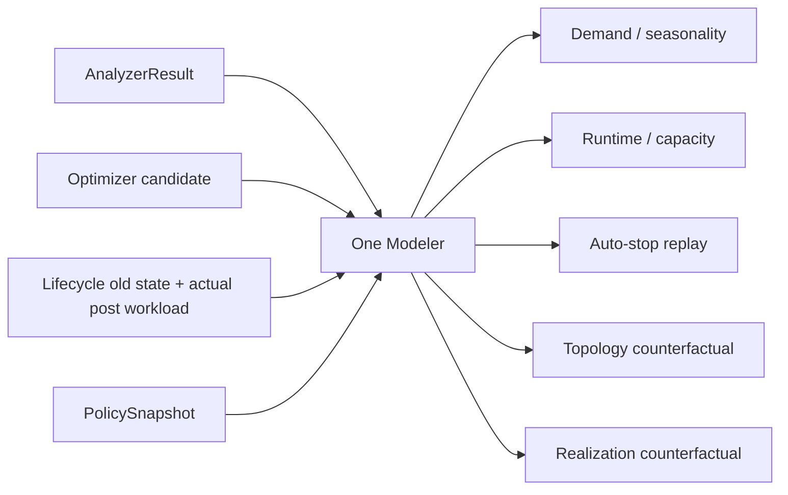
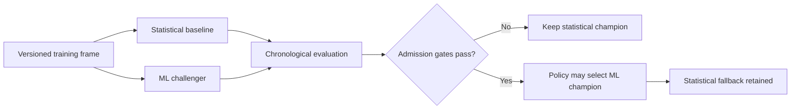

# Databricks Compute Optimization Product
## SQL Warehouse Modeler Detailed Technical Specification — Statistical Phase 1 / ML Phase 2

**Document ID:** `TS-MOD-001`  
**Version:** `2.0.0`
**Date:** 2026-08-14  
**Parent PRD:** `databricks_compute_optimization_product_prd_v2.0.0.md`  
**Parent HLA:** `databricks_compute_optimization_high_level_architecture_v2.0.0.md`  
**Status:** Draft for implementation review

---

# 0. v2.0.0 Architecture Reconciliation

This v2 reconciliation preserves the existing SQL Warehouse business semantics while adopting the Shared Kernel + SQL Warehouse Pack implementation boundary.

- Shared framework/engine code is implemented once under `src/databricks_compute_optimizer/kernel/`.
- SQL Warehouse-specific algorithms, sources, configuration semantics, and providers live under `src/databricks_compute_optimizer/packs/sql_warehouse/`.
- `packs/sql_warehouse/manifest.yaml` points to executable pack capabilities; it is metadata, not duplicate implementation code.
- No future compute pack is implemented by this document.

The Kernel owns the Modeler request/result interface, implementation admission, OOD/calibration/fallback governance, and routing mechanics. SQL Warehouse statistical/ML implementations M01–M08 live under `packs/sql_warehouse/modeler/`.

Tiering may control whether an admitted ML implementation is worth invoking, but required prediction capability remains available through the approved statistical implementation/fallback. Phase 4 uses SQLWH diagnostic features, not deep-diagnostic assumptions.

---

# 1. Purpose

The Modeler is the product's **single projection and counterfactual component**. It estimates workload demand, runtime/capacity outcomes, auto-stop behavior, topology outcomes, and realization counterfactual quantities.

Phase 1 implements deterministic/statistical methods. Phase 2 introduces ML implementations behind the same request/result contracts.

The Modeler MUST NOT select a recommended configuration and MUST NOT calculate authoritative dollars.

> Analyzer owns observed facts. Modeler owns predictions. Optimizer owns configuration decisions. Estimator owns money.

---

# 2. Traceability

| Requirement family | Architecture | Technical requirement |
|---|---|---|
| `PRD-FR-MOD-*` | `ARC-CMP-005` | `TS-MOD-*` |
| deterministic/statistical/ML approach | `ARC-AI-ML-001`, ADR-002 | Sections 5–15 |
| one Modeler, multiple modes | ADR-003 | Sections 4, 16 |
| pandas Phase 1 | `ARC-RUN-001` | Section 20 |
| ML Phase 2 + SQLWH Deep Diagnostic evidence Phase 4 | `ARC-AI-ML-001`, `ADR-012` | Sections 20–21 |

---

# 3. Non-negotiable invariants

| ID | Invariant |
|---|---|
| `TS-MOD-INV-001` | Modeler never emits a recommendation or winner. |
| `TS-MOD-INV-002` | Same source snapshot + policy + implementation/model version + random seed MUST produce the same canonical result. |
| `TS-MOD-INV-003` | Statistical Phase-1 is a fully supported production path, not a temporary stub for ML. |
| `TS-MOD-INV-004` | ML Phase-2 must beat or materially complement the statistical baseline before becoming champion for a capability. |
| `TS-MOD-INV-005` | Out-of-domain/unsupported counterfactuals are blocked rather than invented. |
| `TS-MOD-INV-006` | Serverless IWM behavior is not reverse-engineered or presented as an exact proprietary simulator. |
| `TS-MOD-INV-007` | CPU/memory forecasts cannot be created when no trustworthy source feature exists. |
| `TS-MOD-INV-008` | Uncertainty is explicit for material projections. |
| `TS-MOD-INV-009` | Realization counterfactual uses actual post-change workload features with the old configuration. |
| `TS-MOD-INV-010` | M06/O6 topology logic is dormant before Phase 5; internal workload groups are analytical objects, never top-level product entities. |

---

# 4. Modeler modes

The same component supports three invocation modes.

| Mode | Caller | Question |
|---|---|---|
| `PROACTIVE_PROJECTION` | Orchestrator/Optimizer | What demand/regime is expected and what candidate domains are plausible? |
| `CANDIDATE_COUNTERFACTUAL` | Optimizer | What behavior is expected if candidate C processes the reference workload? |
| `REALIZATION_COUNTERFACTUAL` | Lifecycle | What would the old state have consumed/performed like for actual post-change workload? |



---

# 5. Capability catalog

| Capability ID | Phase 1 statistical implementation | Phase 2 ML candidate | Primary consumers |
|---|---|---|---|
| `M01-DEMAND` | empirical time-bucket distributions + seasonal index + deterministic trend | quantile forecasting/regression | O2, O6, Estimator Forward |
| `M02-CAPACITY` | event/query replay + empirical capacity-response model | supervised capacity/queue outcome model | O2, O6 |
| `M03-RUNTIME` | matched-cohort/config-era normalized estimator | quantile runtime model | O1, O2, O5, O6 |
| `M04-AUTOSTOP` | exact idle-gap/restart replay over candidate timeout | learned restart/latency sensitivity optional | O3 |
| `M05-RELIABILITY` | empirical matched-rate delta with uncertainty | calibrated classification/risk model | O1, O4, O5, O6 |
| `M06-TOPOLOGY` | time-aligned workload-group replay | workload interaction model | O6 |
| `M07-FORWARD` | seasonality + robust/OLS trend projection | time-series/quantile ML | Estimator Forward |
| `M08-REALIZATION` | matched normalized old-state counterfactual | causal/ML counterfactual only after validation | Lifecycle/Estimator |

Phase 2 ML is capability-selective; the product does not need one monolithic model.

---

# 6. Input contract

## 6.1 `ModelerRequest`

```json
{
  "contract_version": "1.0.0",
  "modeler_request_id": "MREQ-...",
  "mode": "CANDIDATE_COUNTERFACTUAL",
  "capability": "M03-RUNTIME",
  "warehouse_id": "WH-123",
  "reference_plan_state_id": "PS-BASE",
  "candidate_plan_state_id": "PS-C17",
  "analyzer_result_refs": ["A03-...", "A05-...", "A12-..."],
  "reference_period": {
    "start_utc": "...",
    "end_utc": "..."
  },
  "forecast_horizon_days": null,
  "policy_snapshot_id": "PSNAP-...",
  "required_quantiles": [0.50, 0.95, 0.99]
}
```

O6 requests additionally carry an internal topology payload:

```json
{
  "topology": {
    "source_warehouse_ids": ["WH-A", "WH-B"],
    "target_warehouses": [{"logical_id": "TARGET-1"}],
    "workload_placements": [
      {"workload_group_id": "WG-001", "target_logical_id": "TARGET-1"}
    ]
  }
}
```

`workload_group_id` is internal to A15/O6 modeling and does not become a product scope type.

---

# 7. Common feature frame

Analyzer produces canonical observed features; Modeler does not reread raw Databricks tables directly in the domain layer.

Minimum common grain options:

| Frame | Grain | Examples |
|---|---|---|
| `query_frame` | statement/query | runtime, capacity wait, provisioning wait, read/spill/shuffle, source, start/end |
| `demand_frame` | 1/5/15-minute bucket | arrivals, request concurrency, completed work, p95 waits |
| `event_frame` | warehouse event/interval | cluster count, start/stop/scale transitions |
| `config_era_frame` | stable config interval | canonical type/size/min/max/photon/spot/autostop |
| `cost_driver_frame` | day/SKU/resource | Modeler quantities only; Estimator prices |
| `regime_frame` | stable A12 regime | seasonality/change-point metadata |

Every frame includes `warehouse_id`, UTC timestamps, `source_snapshot_id`, and feature-schema version.

---

# 8. Statistical Phase-1 principles

1. Prefer **historical replay** over extrapolation when the candidate behavior can be derived exactly from observed timelines.
2. Prefer **matched historical config eras** over synthetic prediction when a comparable configuration was observed.
3. Normalize runtime/cost drivers for workload volume before comparing eras.
4. Use P50/P95/P99 as configured; P95 is generally the primary planning percentile and P99 a risk view.
5. Never infer causal improvement from a simple before/after correlation without controlling for workload regime/volume sufficiently for policy.
6. When no defensible comparator exists, emit `NEEDS_VALIDATION` / blocked candidate rather than a fabricated projection.

---

# 9. `M01-DEMAND` — demand and seasonality

## 9.1 Inputs

A03 demand/concurrency, A12 seasonality/regime, config-era boundaries, workload source mix.

## 9.2 Phase-1 algorithm

### Step A — closed stable regime

Use A12 to select the most recent stable regime. If no stable regime exists and policy requires one, return `MODEL_UNSTABLE_REGIME`.

### Step B — time buckets

Default canonical bucket: policy-configurable 5 minutes.

For each bucket derive:

```text
query_arrivals
active_request_concurrency
finished_queries
sum_task_duration_ms
sum_read_bytes
p95_capacity_wait_ms
p95_runtime_ms
cluster_count where observed
```

### Step C — seasonal profile

Construct deterministic hour-of-week (168-hour) and day-of-week profiles where sample coverage allows:

```text
seasonal_index(bucket_class)
  = median(metric in bucket_class) / median(metric overall)
```

Month-end/quarter-end tags from A12 may define additional regime classes when observed repeatedly.

### Step D — trend

Default Phase-1 trend method:

- aggregate daily workload-volume driver;
- optionally winsorize at policy-defined bounds;
- fit deterministic ordinary least squares over the configured trend window;
- emit slope, R², sample count, residual distribution;
- suppress trend extrapolation when fit-quality or stability policy fails.

A robust alternative such as Theil-Sen MAY be enabled as a policy implementation version; the selected method is persisted.

### Step E — forward projection

```text
ProjectedDemand(t)
  = BaselineLevel × SeasonalIndex(t) + TrendAdjustment(t)
```

Clamp only to physically meaningful lower bounds (for example zero) and record clamping.

## 9.3 Outputs

- P50/P95/P99 arrivals/concurrency by relevant period;
- seasonal indices;
- trend slope/growth rate;
- forecast samples/quantiles for `M07-FORWARD` reuse;
- uncertainty and representativeness flags.

---

# 10. Exact request-concurrency reconstruction

Where query start/end intervals are available, request concurrency is derived through an event sweep rather than sampled approximation:

```text
for every query q:
  (+1, q.start_time)
  (-1, q.end_time)

sort by (timestamp, delta_order)
cumulative sum -> active request count between events
```

Tie ordering MUST be versioned; recommended half-open query interval `[start, end)` means end events are applied before starts at the same timestamp.

Important: `start_time` represents request receipt; this is **request concurrency**, not guaranteed executor concurrency.

---

# 11. `M02-CAPACITY` — capacity counterfactual

## 11.1 Problem

Estimate queue/capacity behavior under a candidate size/min/max/type without claiming exact simulation of proprietary autoscaling.

## 11.2 Pro/Classic Phase-1 method

Use an empirical/replay approach:

1. Build historical demand timeline from A03.
2. Build observed cluster-count timeline from A08.
3. Characterize response during comparable config eras:
   - demand before scale-up;
   - scale-up delay distribution;
   - time at min/max;
   - queue wait distribution by demand/cluster-count bucket.
4. For candidate min/max, constrain/replay observed response envelope.
5. For candidate size changes, combine only with `M03-RUNTIME`/resource-pressure evidence; do not assume linear scale factors unless validated and versioned.
6. Compute projected capacity-wait P50/P95/P99 and time-at-limit.

If the candidate configuration has no comparable support and the extrapolation exceeds policy domain, block it or require canary.

## 11.3 Serverless Phase-1 method

Serverless uses Databricks-managed Intelligent Workload Management. The Modeler MUST NOT pretend to reproduce its exact internal algorithm.

Preferred evidence order:

```text
1. same workload observed historically on Serverless
2. representative canary / benchmark replay
3. policy-approved conservative empirical comparator
4. otherwise NEEDS_VALIDATION / BLOCKED
```

The output labels the evidence method explicitly.

---

# 12. `M03-RUNTIME` — runtime counterfactual

## 12.1 Target metric

Primary guardrail target is normalized P95 total/runtime as configured, with P50 and P99 retained.

## 12.2 Cohort matching

Build workload cohorts from stable, non-sensitive features such as:

- query source/application class;
- statement type;
- parameterized/fingerprint hash where enterprise policy permits;
- read-data volume bucket;
- query text is not required in the Modeler contract;
- temporal/regime class.

## 12.3 Evidence precedence

```text
A. Same workload + same candidate config era observed
B. Same workload + near candidate config observed
C. Similar workload cohort with sufficient overlap
D. Approved statistical extrapolation
E. Canary/validation required
```

## 12.4 Normalized estimator

For matched observations, calculate per-query/cohort normalized runtime ratios, for example:

```text
runtime_rate = execution_duration_ms / max(volume_driver, epsilon)
```

Volume driver selection is deterministic and policy/versioned (`read_bytes`, `read_rows`, `total_task_duration` proxy, or cohort-specific no-volume normalization).

Candidate runtime distribution is produced by replaying candidate-era normalized rates against the reference workload volume distribution.

No generic `runtime ∝ 1 / warehouse_size` assumption is permitted.

---

# 13. `M04-AUTOSTOP` — idle/restart replay

This is the most deterministic Modeler capability.

Inputs:

- reconstructed running/busy/idle intervals from A04;
- query arrival timestamps;
- startup duration distribution A09;
- candidate auto-stop value.

For timeout `T`:

```text
for each busy period ending at t_end:
    next_arrival = first query arrival after t_end
    idle_gap = next_arrival - t_end

    if idle_gap > T:
        avoidable_running_time += idle_gap - T
        additional_restart += 1 if warehouse would have stopped before next arrival
        affected_queries += first query cohort after restart
```

Project startup penalty from matched startup-duration distribution by warehouse type/regime.

Outputs:

- running/idle seconds avoided;
- starts/restarts added/removed;
- affected-query count;
- cold-start latency P50/P95/P99;
- model quantity drivers for Estimator.

---

# 14. `M05-RELIABILITY`

Phase 1 uses empirical matched evidence only.

For comparable cohorts/config eras:

```text
failure_rate = failed / terminal_queries
cancel_rate  = canceled / terminal_queries
retry_rate   = identified_retry_executions / eligible_queries
```

The Modeler may estimate a candidate delta only when there is sufficient candidate/comparator support. It MUST NOT attribute a generic SQL failure to Spot interruption without evidence.

Output quality states:

```text
MEASURED_MATCHED
MEASURED_WEAK_MATCH
NO_DEFENSIBLE_COUNTERFACTUAL
```

O4 may require stronger external interruption evidence via A13.

---

# 15. `M06-TOPOLOGY` — internal multi-warehouse simulation

## 15.1 Scope rule

Beginning in Phase 5, O6 may pass multiple source warehouses, while the SQLWH top-level product entity remains `WAREHOUSE`. The Modeler receives a `topology_evaluation_id` solely for internal lineage. M06 is inactive before Phase 5.

## 15.2 Internal workload groups

A15 creates deterministic analytical groups using configured, non-sensitive features such as source/application, query tags, schedule windows, SLA class, and workload fingerprint families.

These groups can be assigned to hypothetical target warehouses.

## 15.3 Consolidation replay

For candidate consolidation:

```text
MergedDemand(t) = Σ demand_of_assigned_groups(t)
```

Then evaluate:

- merged request-concurrency distribution;
- peak temporal overlap;
- projected queue/capacity via M02;
- runtime/interference risk via M03/A15 evidence;
- combined idle/warm-time reduction;
- security/network/SLO compatibility supplied by Analyzer/Policy.

## 15.4 Split replay

For split candidates:

```text
TargetDemand_j(t) = Σ demand(group_i,t) for groups assigned to target j
```

Each target is then evaluated independently through O1–O5 downstream using its target demand frame.

The Modeler itself does not decide whether to split/consolidate.

---

# 16. `M07-FORWARD` — next-365 projection

Forward projection uses M01 seasonal/trend components and produces a reproducible future demand sample/path.

Default Phase-1 approach:

1. construct empirical residual distribution after seasonal/trend fit;
2. generate deterministic bootstrap scenarios using `seed = hash(run_id, modeler_version, policy_hash, warehouse_id, capability)`;
3. use fixed number of samples from Policy;
4. emit requested quantiles for workload quantity drivers;
5. Estimator prices projected current and target states separately.

If deterministic bootstrap is disabled, use analytical residual intervals where supported.

The output MUST include:

- projection start/end;
- statistical method/version;
- seed;
- sample count;
- lower/expected/upper or P50/P95/P99 quantities;
- trend/seasonality quality.

---

# 17. `M08-REALIZATION` — old-state counterfactual

Inputs:

```text
old PlanState
actual post-change workload feature frame
post-change regime metadata
```

The Modeler predicts what quantities the **old state** would have consumed for the actual post-change workload.

Evidence precedence:

1. matched pre-change historical observations normalized to post-change volume/mix;
2. stable statistical model fitted on old-state era;
3. fallback matched-cohort replay;
4. block realization if no defensible counterfactual exists.

The Modeler does not use observed post-change cost as a feature; the Estimator independently compares counterfactual old cost with observed new cost.

---

# 18. Uncertainty and out-of-domain rules

## 18.1 `ModelQuality`

Every material projection emits:

```json
{
  "support": {
    "sample_size": 1200,
    "coverage_pct": 98.1,
    "candidate_config_observed": false,
    "distance_to_observed_domain": 0.15
  },
  "uncertainty": {
    "interval_pct": 95,
    "lower": 0,
    "expected": 0,
    "upper": 0
  },
  "quality": "HIGH|MEDIUM|LOW|BLOCKED"
}
```

## 18.2 Out-of-domain conditions

Examples:

- candidate size outside observed/supported policy neighborhood;
- projected demand exceeds historical domain by policy threshold;
- topology merges workloads with no comparable overlap regime;
- type migration has no target-type evidence/canary;
- changed workload regime invalidates training/reference period.

Default behavior: `BLOCKED:MODEL_OUT_OF_DOMAIN`, unless a policy-approved conservative fallback exists.

---

# 19. `ModelerResult` contract

```json
{
  "contract_version": "1.0.0",
  "modeler_result_id": "MOD-...",
  "modeler_version": "1.0.0",
  "implementation_type": "STATISTICAL",
  "implementation_id": "m03_matched_cohort_v1",
  "model_version": null,
  "mode": "CANDIDATE_COUNTERFACTUAL",
  "capability": "M03-RUNTIME",
  "warehouse_id": "WH-123",
  "reference_plan_state_id": "PS-BASE",
  "candidate_plan_state_id": "PS-C17",
  "projections": {
    "runtime_ms": {
      "p50": 5000,
      "p95": 11700,
      "p99": 18000
    },
    "capacity_wait_ms": {
      "p50": 0,
      "p95": 400,
      "p99": 1200
    },
    "quantity_drivers": {}
  },
  "support": {},
  "uncertainty": {},
  "quality": "HIGH",
  "seed": null,
  "status": "SUCCESS",
  "blockers": [],
  "warnings": [],
  "policy_snapshot_id": "PSNAP-...",
  "analyzer_result_refs": [],
  "lineage_refs": []
}
```

---

# 20. Phase-2 ML design

## 20.1 Contract compatibility

ML is an implementation option for a capability, not another product component.

```text
ModelerRequest
    ↓
ModelSelector (policy)
    ├── Statistical implementation
    └── ML implementation
    ↓
ModelerResult (same contract)
```

## 20.2 ML admission criteria

An ML implementation may become champion only if:

1. feature contract is versioned and available;
2. training dataset passes A00/A12 quality/regime gates;
3. chronological holdout evaluation passes;
4. model beats or materially complements statistical baseline on policy metrics;
5. guardrail-relevant quantiles are calibrated sufficiently;
6. out-of-domain detection exists;
7. rollback/fallback to statistical path is tested;
8. model artifact/version/feature hash is persisted.

## 20.3 Candidate ML families

The implementation SHOULD begin with interpretable tabular/quantile models rather than deep learning unless evidence supports complexity.

Examples:

| Capability | Initial candidate family |
|---|---|
| demand quantiles | gradient-boosted quantile regression / time-series features |
| runtime quantiles | quantile gradient boosting on workload/config features |
| capacity wait | regression/quantile classification hybrid |
| reliability | calibrated gradient-boosted classifier |

Exact library/model is an implementation choice documented in a model card and `implementation_id`; this spec does not hard-code a vendor model.

## 20.4 Training/evaluation split

Time-aware split only:

```text
train: older stable regimes
validation: subsequent period
test: most recent held-out stable period
```

Random row-level splitting across time is prohibited for authority evaluation because it leaks workload/regime information.

## 20.5 Champion/challenger



## 20.6 Required evaluation metrics

Depending on capability:

- MAE / median absolute error;
- weighted absolute percentage error only where denominator semantics are safe;
- pinball loss for quantiles;
- quantile coverage/calibration;
- false-negative/false-positive rate for reliability risk;
- plan-decision parity / guardrail violation rate on historical backtests;
- economic regret versus oracle within evaluated historical configurations.

A model with slightly better RMSE but worse guardrail calibration MUST NOT automatically win.

## 20.7 OOD and drift

ML `ModelerResult` includes:

```text
feature_schema_version
training_data_end
model_version
feature_distribution_distance
ood_status
calibration_status
```

Lifecycle/A12 detects regime drift; Modeler can also reject a request based on feature-domain distance.

---

# 21. Phase-4 SQL Warehouse Deep Diagnostic Enrichment

SQLWH diagnostic evidence are optional enrichment in Phase 4 and MUST NOT invalidate the Phase-1 system-table-only product.

Potential features:

- operator/stage task timing;
- spill/shuffle detail beyond system-table fields;
- executor-level resource evidence where technically available/appropriate;
- skew indicators;
- execution-plan/operator composition.

Rules:

1. deterministic adapter extracts a versioned feature schema;
2. raw logs/events are not passed directly into deterministic decision rules without normalization;
3. missing deep-diagnostic coverage causes feature fallback, not whole-product failure unless a Phase-2 policy explicitly requires it;
4. Phase-1 golden outputs remain the reference for cases not depending on SQLWH diagnostic evidence.

---

# 21.1 Phase-3 review / statistical fallback seam

`REQUEST_STATISTICAL_FALLBACK` is accepted only after deterministic validation that the cited ML applicability/calibration/OOD/regime concern is material and the fallback implementation is approved. The Modeler then produces a normal versioned `ModelerResult`; the agent never edits prediction values.

If the accepted fallback result replaces a decision-relevant ML result, the Modeler result digest changes the DecisionContext and downstream affected Optimizer/Decision evaluation proceeds through the Orchestrator.

---

# 22. Policy consumed

```yaml
modeler:
  implementation:
    default: statistical
    allow_ml: false

  percentiles: [50, 95, 99]

  demand:
    bucket_minutes: 5
    seasonal_profile: hour_of_week
    trend_method: ols

  forward:
    horizon_days: 365
    bootstrap_samples: 1000
    interval_pct: 95

  domain:
    allow_extrapolation: false

  model_selection:
    fallback_to_statistical: true

  phase2_ml:
    require_statistical_baseline_comparison: true
    require_chronological_holdout: true
```

---

# 23. Service interface

```python
class Modeler(Protocol):
    def project(
        self,
        request: ModelerRequest,
        features: ModelerFeatureBundle,
        policy: ModelerPolicyView,
        *,
        reference_state: PlanState,
        candidate_state: PlanState | None = None,
    ) -> ModelerResult:
        ...
```

Capability implementations are injected via a registry:

```python
registry[(capability, implementation_id)] -> ModelCapability
```

No `if phase2:` branches should be scattered through Optimizers.

---

# 24. Determinism

Statistical implementation MUST pin:

- data sort keys;
- quantile interpolation method;
- tie handling;
- OLS/robust-estimator implementation/version;
- bootstrap seed derivation;
- sample count;
- numeric precision;
- feature-schema version.

ML implementation additionally pins:

- model artifact digest;
- library/runtime version;
- feature order/schema;
- inference parameters;
- any random seeds when inference is stochastic (prefer deterministic inference).

---

# 25. Error taxonomy

| Error | Behavior |
|---|---|
| `MODEL_FEATURE_MISSING` | block affected capability/candidate if material |
| `MODEL_UNSTABLE_REGIME` | block or use policy-approved recent-regime fallback |
| `MODEL_NO_COMPARATOR` | canary/validation required |
| `MODEL_OUT_OF_DOMAIN` | candidate blocked by default |
| `MODEL_INSUFFICIENT_SAMPLE` | downgrade or block per policy |
| `MODEL_UNCALIBRATED` | ML cannot be champion for guardrail use |
| `MODEL_VERSION_MISMATCH` | fail run compatibility gate |
| `MODEL_FALLBACK_USED` | warning + persist statistical fallback reason |

---

# 26. Observability

Metrics:

```text
modeler_requests_total{capability,mode,implementation,status}
modeler_duration_seconds{capability,implementation}
modeler_blocked_total{reason}
modeler_fallback_total{from,to,reason}
modeler_ood_total{capability}
modeler_sample_size{capability}
modeler_projection_interval_width{capability,metric}
modeler_ml_calibration_error{capability,quantile}
```

Logs include run/warehouse/candidate IDs, feature schema, model/implementation version, seed, source snapshot, and blockers without raw sensitive query text.

---

# 27. Unit tests

Statistical minimum:

1. exact request-concurrency event sweep including timestamp ties;
2. seasonal index calculation;
3. deterministic trend fit;
4. fixed-seed bootstrap reproducibility;
5. auto-stop exact replay;
6. runtime cohort matching precedence;
7. volume normalization selection;
8. capacity replay stays inside supported domain;
9. Serverless unsupported extrapolation blocks;
10. reliability does not infer Spot cause from generic failures;
11. topology demand merge/split arithmetic;
12. realization counterfactual uses post-change workload with old state;
13. P50/P95/P99 interpolation is pinned;
14. identical inputs produce identical canonical result.

ML Phase-2 minimum:

1. chronological split;
2. feature-schema mismatch rejection;
3. statistical baseline comparison;
4. quantile calibration gate;
5. OOD detection;
6. champion/challenger outcome;
7. statistical fallback;
8. model artifact hash/version lineage.

---

# 28. Component integration tests

| Test | Integration | Assertion |
|---|---|---|
| `IT-MOD-001` | A03/A12 → M01 | projected demand quantiles reproduce fixture |
| `IT-MOD-002` | A04/A09 → M04 → O3 | timeout replay yields exact starts/idle quantities |
| `IT-MOD-003` | A05/A06 → M03 → O2 | unsafe downsize candidate fails runtime evidence |
| `IT-MOD-004` | A15 → M06 → O6 | internal multiwarehouse topology result has no new top-level scope |
| `IT-MOD-005` | Lifecycle → M08 → Estimator | realized counterfactual normalizes demand change |
| `IT-MOD-006` | ML challenger | failure admission keeps statistical champion |

---

# 29. Phase-1 pandas implementation

- SQL aggregation and filtering happens before Python transfer.
- Modeler accepts typed pandas frames produced by repository/adapters; it does not execute ad hoc SQL.
- Frames MUST be bounded by warehouse and closed observation window.
- All grouping/sorting keys are explicit.
- Avoid row-wise Python loops except deterministic event-sweep/replay algorithms where vectorization would obscure correctness; these algorithms require performance benchmarks.
- Business logic lives in pure capability classes so PySpark replacement does not change Optimizer contracts.

---

# 30. Phase-2 PySpark migration

Implement equivalent feature/replay backends using PySpark/Delta after Phase-1 component and golden gates. Required parity classes:

- quantile results;
- event-sweep concurrency;
- seasonal/trend frames;
- auto-stop replay;
- topology aggregation;
- ModelerResult serialization/hash.

Differences due to approximate Spark percentile functions are **not automatically acceptable** for golden authority. Use exact/pinned algorithms for parity-required fields or explicitly version semantics and reapprove.

---

# 31. Component release plan

| Release | Scope | Exit criteria |
|---|---|---|
| `REL-MOD-0.1.0` | feature contracts, M01 demand/seasonality, exact concurrency, M04 auto-stop replay | deterministic unit fixtures pass |
| `REL-MOD-0.2.0` | M02 capacity + M03 runtime + M05 reliability statistical counterfactuals | O1/O2/O5 integration fixtures pass |
| `REL-MOD-0.3.0` | M07 forward + M08 realization | Estimator/Lifecycle fixtures pass |
| `REL-MOD-1.0.0` | Phase-1 statistical contract freeze, uncertainty/OOD/fallback hardening | full Phase-1 golden scenarios pass |
| `REL-MOD-2.0.0` | Phase-2 PySpark backend parity | pandas/PySpark parity pass |
| `REL-MOD-2.1.0` | Phase-2 ML challenger for selected T1/T2 capabilities | model admission + fallback tests pass |
| `REL-MOD-2.2.0` | Selective admitted ML champion activation for approved SQLWH Modeler capabilities | promoted champions beat/complement statistical baseline and statistical fallback remains available |
| `REL-MOD-4.0.0` | Phase-4 SQLWH diagnostic feature enrichment | feature coverage + no-regression tests pass |
| `REL-MOD-5.0.0` | M06 topology simulation | Phase-5 O6/combined replay fixtures pass |

---

# 32. Definition of Done

Modeler is implementation-ready when:

- Phase-1 statistical capability algorithms are deterministic and testable;
- every projection declares its evidence method/domain/uncertainty;
- unsupported Serverless/type/capacity extrapolation blocks safely;
- no recommendation or cost authority leaks into Modeler;
- M06/O6 internal workload groups remain inactive before Phase 5 and remain internal when activated;
- ML Phase-2 has explicit admission/fallback governance rather than replacing statistical methods by assertion;
- pandas and future PySpark backends can produce the same contract.
