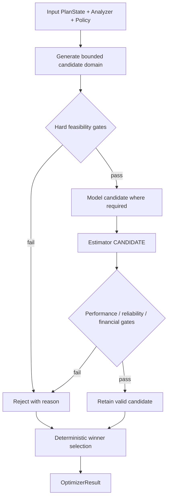

# Databricks Compute Optimization Product
## SQL Warehouse Optimizers O1–O7 Detailed Technical Specification

**Document ID:** `TS-OPT-001`  
**Version:** `2.0.0`
**Date:** 2026-08-14  
**Parent PRD:** `databricks_compute_optimization_product_prd_v2.0.0.md`  
**Parent HLA:** `databricks_compute_optimization_high_level_architecture_v2.0.0.md`  
**Status:** Draft for implementation review

---

# 0. v2.0.0 Architecture Reconciliation

This v2 reconciliation preserves the existing SQL Warehouse business semantics while adopting the Shared Kernel + SQL Warehouse Pack implementation boundary.

- Shared framework/engine code is implemented once under `src/databricks_compute_optimizer/kernel/`.
- SQL Warehouse-specific algorithms, sources, configuration semantics, and providers live under `src/databricks_compute_optimizer/packs/sql_warehouse/`.
- `packs/sql_warehouse/manifest.yaml` points to executable pack capabilities; it is metadata, not duplicate implementation code.
- No future compute pack is implemented by this document.

O1–O7 executable algorithms live only under `packs/sql_warehouse/optimizers/`. The Kernel contains optimizer contracts/framework/search interfaces only.

Every phase-applicable released SQLWH Optimizer executes for its relevant deterministic state/domain. T1–T4 may reduce candidate breadth/beam/modeling depth, but cannot suppress the Optimizer itself. Phase 5 activates O6 for the SQLWH topology domain; tier does not turn it off.

---

# 1. Purpose

This specification defines the seven optimization techniques that convert Analyzer evidence, Modeler projections, Policy, and Estimator candidate economics into deterministic technique-level decisions.

The Optimizer layer does **not** select the final portfolio plan. Each optimizer selects its best valid candidate for a given immutable `PlanState`; the Orchestrator explores compatible paths and the Decision Engine selects the authoritative plan.

---

# 2. Traceability

| Requirement | Architecture | Technical section |
|---|---|---|
| `PRD-FR-OPT-*` | `ARC-CMP-006` | O1–O7 sections |
| `PRD-FR-PROD-010..013` | `ARC-EXEC-001` | candidate/portfolio rules |
| `PRD-FR-PROD-022..028` | `ARC-CMP-007/008` | dependency/search/decision integration |
| O6 scope clarification | `ARC-PLAT-002` | Section 16 |

---

# 3. Optimizer catalog

| ID | Optimizer | Primary decision | Phase-1 top-level entity |
|---|---|---|---|
| `O1` | Warehouse Type | Classic / Pro / Serverless / gated future type | Warehouse |
| `O2` | Capacity Bundle | size + min clusters + max clusters atomically | Warehouse |
| `O3` | Auto-Stop | auto-stop minutes | Warehouse |
| `O4` | Spot Policy | Pro/Classic Spot policy | Warehouse |
| `O5` | Photon | enable/retain/disable Photon only when evidence supports | Warehouse |
| `O6` | Warehouse Topology | split/consolidate/reassign workloads across warehouses | Warehouse-oriented topology exception; multiple IDs inside result |
| `O7` | Statement Timeout Guardrail | protective timeout | Warehouse |

---

# 4. Shared optimizer contract

## 4.1 `OptimizerRequest`

```json
{
  "contract_version": "1.0.0",
  "optimizer_request_id": "OREQ-...",
  "optimizer_id": "O2",
  "warehouse_id": "WH-123",
  "current_plan_state_id": "PS-010",
  "analyzer_result_refs": [],
  "modeler_result_refs": [],
  "policy_snapshot_id": "PSNAP-...",
  "mode": "STANDALONE|PORTFOLIO"
}
```

## 4.2 `OptimizerResult`

```json
{
  "contract_version": "1.0.0",
  "optimizer_result_id": "ORES-...",
  "optimizer_id": "O2",
  "optimizer_version": "1.0.0",
  "warehouse_id": "WH-123",
  "input_plan_state_id": "PS-010",
  "selected_candidate_id": "O2-C17",
  "decision": "CHANGE|NO_CHANGE|BLOCKED|NOT_APPLICABLE",
  "current_config": {},
  "recommended_config": {},
  "atomic": true,
  "modeler_result_refs": [],
  "candidate_estimate_ref": "EST-CAND-...",
  "evidence_refs": [],
  "guardrails": [],
  "blockers": [],
  "rejected_candidate_summary": [],
  "policy_snapshot_id": "PSNAP-...",
  "status": "SUCCESS"
}
```

O6 extends this with `topology_evaluation_id`, `source_warehouse_ids`, `target_warehouses`, and `workload_placements`.

---

# 5. Shared deterministic optimizer algorithm

Every optimizer follows the same skeleton.



Algorithm requirements:

1. `NO_CHANGE` is always an explicit candidate unless the current state itself is invalid by hard platform/policy rules.
2. Candidate generation is deterministic and bounded by Policy.
3. Hard eligibility is evaluated before expensive modeling.
4. Modeler is invoked only for needed counterfactual capabilities.
5. Estimator prices each materially distinct surviving candidate.
6. Invalid candidates retain structured rejection reason(s).
7. Winner is the lowest-cost valid candidate under the optimizer's constraints; near-equal deterministic tie rules are policy-defined.
8. Optimizer does not compare cross-technique portfolio plans.

---

# 6. Shared winner ordering

Default technique-level ordering after hard gates:

```text
1. lowest expected annual economic cost
2. if within candidate materiality tolerance: lower risk proxy
3. higher Modeler/evidence quality
4. smaller config delta / lower technique-local disruption
5. stable canonical candidate ID
```

The Decision Engine later applies the approved portfolio-level lexicographic framework.

---

# 7. Source-query boundary

Optimizers MUST NOT issue raw system-table SQL. They consume Analyzer contracts so source semantics are centralized and golden-testable.

Primary query lineage:

| Optimizer | Analyzer query lineage |
|---|---|
| O1 | `Q-ANA-001..003`, `Q-ANA-009..012` via A00/A01/A02/A03/A05/A09/A10/A11/A12 |
| O2 | `Q-ANA-001..008`, `Q-ANA-003..006` via A02/A03/A05/A06/A07/A08/A09/A12 |
| O3 | `Q-ANA-003`, `Q-ANA-007/008` via A04/A09/A12 |
| O4 | cost/AWS adapter + A11/A13 |
| O5 | A05/A06/A14, config/API evidence |
| O6 | A03–A15 across multiple warehouses |
| O7 | `Q-ANA-003`, `Q-ANA-013` via A05/A11/A16 |

---

# 8. O1 — Warehouse Type Optimizer

## 8.1 Purpose

Select the lowest-cost eligible warehouse type that preserves policy-defined performance, reliability, security/network compatibility, and feature compatibility.

## 8.2 Canonical type mapping

The domain model uses:

```text
CLASSIC
PRO
SERVERLESS
LAKEHOUSE_REALTIME   # gated/disabled by default while Beta
```

API normalization rule:

```text
warehouse_type=CLASSIC -> CLASSIC
warehouse_type=PRO + enable_serverless_compute=false -> PRO
warehouse_type=PRO + enable_serverless_compute=true  -> SERVERLESS
```

The Databricks Warehouses API currently represents Serverless through `PRO` plus `enable_serverless_compute=true`; do not expose that API quirk as a fourth domain ambiguity.

## 8.3 Inputs

| Input | Required use |
|---|---|
| A00 | evidence completeness |
| A01 | current cost basis |
| A02 | effective current config/type |
| A03 | demand/concurrency |
| A05 | runtime/SLA |
| A09 | cold start |
| A10 | type eligibility/security/network/feature compatibility |
| A11 | reliability |
| A12 | regime/seasonality |
| Modeler M01/M02/M03/M05 | candidate demand/capacity/runtime/reliability |
| Estimator | candidate type economics |
| Policy | allowed targets and hard gates |

## 8.4 Candidate domain

```text
{NO_CHANGE} ∪ policy.allowed_warehouse_types ∩ A10.eligible_types
```

Phase-1 default target set SHOULD be Classic/Pro/Serverless as allowed by enterprise policy. Lakehouse Real-Time is feature-gated off by default while Beta unless explicitly enabled.

## 8.5 Hard gates

Reject candidate if any:

- A10 eligibility fails;
- enterprise security/network/compliance constraint fails;
- required workload feature unsupported;
- preview/Beta feature disallowed;
- Modeler cannot produce defensible target behavior and Policy requires evidence;
- projected P95 runtime regression exceeds policy;
- projected reliability regression exceeds policy;
- predicted savings non-positive where `require_positive_savings=true`.

Serverless candidate additionally respects its documented environment/feature limitations; do not infer eligibility solely from current type.

## 8.6 Modeling/economic sequence

```text
candidate type
  -> M02 capacity behavior
  -> M03 runtime
  -> M05 reliability if material
  -> Estimator CANDIDATE
```

For Serverless without representative evidence, use policy-required canary/benchmark rather than fabricated IWM simulation.

## 8.7 Output

```json
{
  "optimizer_id": "O1",
  "decision": "CHANGE",
  "current_config": {"warehouse_type": "PRO"},
  "recommended_config": {"warehouse_type": "SERVERLESS"},
  "migration_required": true,
  "eligible_types": ["PRO", "SERVERLESS"],
  "rejected_types": [
    {"type": "CLASSIC", "reason": "HIGHER_COST"}
  ]
}
```

O1 changes **type only**. O2/O3/O4/O5 are rerun against the target branch as applicable so O1 independent savings remain interpretable.

---

# 9. O2 — Capacity Bundle Optimizer

## 9.1 Purpose

Select `warehouse_size + min_clusters + max_clusters` as one atomic capacity configuration.

Rationale: warehouse size addresses per-cluster/per-query resources while cluster count addresses concurrency/capacity. Tuning these independently can create conflicting recommendations.

## 9.2 Inputs

A02, A03, A05, A06, A07, A08, A09, A12; Modeler M01/M02/M03; Estimator; Policy.

## 9.3 Candidate domain

Canonical warehouse-size ordering:

```text
2X_SMALL < X_SMALL < SMALL < MEDIUM < LARGE < X_LARGE < 2X_LARGE < 3X_LARGE < 4X_LARGE < 5X_LARGE
```

`5X_LARGE` MUST be gated according to current platform/preview availability and policy.

`min_clusters`/`max_clusters` candidates obey platform API constraints and policy maxima. Candidate generation SHOULD start near current/projection-derived capacity rather than Cartesian-product every legal value.

## 9.4 Candidate generation algorithm

1. Calculate protected demand target:

```text
protected_demand = projected_required_capacity_at(policy.decision_percentile)
                   × (1 + headroom_pct)
```

Headroom is applied to **projected requirement**, not current configuration.

2. Generate size candidates in bounded neighborhood around current/model-supported sizes.
3. Generate min-cluster candidates based on steady-demand P50/P95 and cold-start policy.
4. Generate max-cluster candidates based on projected peak concurrency/queue behavior and risk percentile.
5. Add current atomic tuple as `NO_CHANGE`.
6. Remove invalid platform combinations before Modeler calls.

## 9.5 Evidence rules

| Evidence | Implication |
|---|---|
| persistent material spill / large read/shuffle pressure | downsize candidate blocked/downweighted unless matched counterfactual proves safe |
| material capacity wait/time-at-max | evaluate higher max clusters and/or different size |
| low/zero capacity wait + max rarely used | lower max candidates eligible |
| high min + low steady demand | lower min candidates eligible |
| cold-start-sensitive workload | min reduction must pass startup/runtime guardrail |
| seasonal peak | projected protected capacity must cover representative peak/regime |

No rule directly reads fictional CPU/memory utilization from SQL system tables.

## 9.6 Candidate validation

Each tuple:

```text
(size, min, max)
 -> M02 projected queue/capacity
 -> M03 projected runtime
 -> Estimator candidate economics
 -> hard gates
```

Required gates:

- P95 runtime regression <= policy;
- P99 risk acceptable;
- capacity headroom pass;
- reliability pass if material;
- positive savings unless policy permits SLA-driven upsize.

## 9.7 Atomic output

```json
{
  "optimizer_id": "O2",
  "decision": "CHANGE",
  "atomic": true,
  "current_config": {
    "warehouse_size": "LARGE",
    "min_clusters": 2,
    "max_clusters": 8
  },
  "recommended_config": {
    "warehouse_size": "MEDIUM",
    "min_clusters": 1,
    "max_clusters": 5
  }
}
```

Lifecycle MUST classify partial application of this bundle as `PARTIALLY_APPLIED`, not `APPLIED`.

---

# 10. O3 — Auto-Stop Optimizer

## 10.1 Purpose

Minimize idle running cost while respecting restart/cold-start latency and workload performance.

## 10.2 Inputs

A02, A04, A05, A09, A12; Modeler M04; Estimator; Policy.

## 10.3 Legal candidate domain

Candidate timeout values are generated by warehouse type and current platform capability.

Phase-1 default capability interpretation:

- Pro/Classic: 0 (disabled) or >=10 minutes;
- Serverless: 0 or >=1 minute through supported API/bundle paths; UI may impose a higher minimum;
- candidate allowlist SHOULD be configured rather than enumerate every minute.

Example:

```yaml
O3_auto_stop:
  candidates:
    classic_pro: [10, 15, 30, 45, 60]
    serverless: [1, 5, 10, 15, 30]
```

## 10.4 Algorithm

For each legal timeout `T`:

```text
M04 historical replay
 -> idle seconds avoided
 -> restart count change
 -> cold-start affected queries
 -> projected runtime/provisioning wait
 -> running/resource quantity change
 -> Estimator candidate cost
```

Reject when:

- runtime/provisioning wait guardrail fails;
- representative regime coverage insufficient;
- expected net savings <= 0 under cost-saving policy.

Winner maximizes valid net annual economic savings.

---

# 11. O4 — Spot Policy Optimizer

## 11.1 Purpose

For Pro/Classic only, choose an eligible Spot policy when observed AWS economics and reliability evidence support it.

## 11.2 Applicability

```text
SERVERLESS -> NOT_APPLICABLE
PRO/CLASSIC -> evaluate if Policy + platform permit
```

Canonical policy values follow supported API semantics:

```text
POLICY_UNSPECIFIED
COST_OPTIMIZED
RELIABILITY_OPTIMIZED
```

## 11.3 Inputs

A01, A02, A11, A13; Modeler M05; Estimator AWS candidate economics; Policy.

## 11.4 Hard evidence rules

- Do not assume a fixed Spot fraction or savings percentage.
- Use observed CUR/resource economics and, where available, Spot/interruption/retry evidence.
- Do not classify generic query failure as Spot interruption.
- Critical workload policy may forbid `COST_OPTIMIZED` regardless of economics.
- Reliability projection/observed evidence must pass.

## 11.5 Result

```json
{
  "optimizer_id": "O4",
  "decision": "CHANGE",
  "current_config": {"spot_policy": "RELIABILITY_OPTIMIZED"},
  "recommended_config": {"spot_policy": "COST_OPTIMIZED"},
  "aws_evidence_ref": "A13-..."
}
```

If O1 switches branch to Serverless, any O4 result is invalidated and O4 becomes `NOT_APPLICABLE`.

---

# 12. O5 — Photon Optimizer

## 12.1 Purpose

Enable/retain Photon when completed-work price/performance improves while preserving guardrails.

## 12.2 Inputs

A01, A02, A05, A06, A14; Modeler M03; Estimator; Policy.

## 12.3 Evidence precedence

```text
1. matched historical Photon ON/OFF config-era comparator
2. representative canary/benchmark
3. approved cohort-based statistical comparator
4. otherwise NEEDS_VALIDATION / no authoritative change
```

## 12.4 Decision rules

- If Photon enabled and no evidence it is economically harmful: usually `NO_CHANGE`.
- If disabled, evaluate enable candidate.
- Disable candidate is allowed only if policy permits and measured evidence shows lower total cost without performance/reliability violation; do not disable solely because DBU unit rate differs.
- Price/performance is based on total completed-work economics, not raw rate alone.

O5 precedes O2 in portfolio search because runtime/completed-work changes can alter overlapping concurrency and capacity needs.

---

# 13. O6 — Warehouse Topology Optimizer

## 13.1 Purpose

Find higher-order savings by consolidating compatible warehouses or splitting heterogeneous/interfering workloads so each target warehouse can be optimized appropriately.

## 13.2 Phase-5 scope rule

**O6 is inactive before Phase 5. No new top-level scope type is introduced.** Beginning Phase 5, O6 result carries multiple warehouse IDs inside its contract.

```json
{
  "optimizer_id": "O6",
  "topology_evaluation_id": "TOP-001",
  "action": "CONSOLIDATE",
  "source_warehouse_ids": ["WH-A", "WH-B"],
  "target_warehouses": [{"logical_id": "WH-TARGET-01"}],
  "workload_placements": []
}
```

Internal workload groups from A15/M06 are analytical/routing units only.

## 13.3 Inputs

A00/A01/A02, A03–A15 as relevant; M01/M02/M03/M05/M06; Estimator; enterprise security/SLO evidence; Policy.

## 13.4 Candidate discovery

### Consolidation candidate prerequisites

- compatible security/network/data-access environment;
- compatible or separable SLOs;
- evidence of duplicate idle/warm costs or fragmented capacity;
- manageable peak temporal overlap;
- merged demand can pass capacity/runtime guardrails;
- routing/application ownership is known sufficiently to implement.

### Split candidate prerequisites

- materially different workload resource profiles/SLOs/schedules;
- evidence of contention/interference or over-provisioning caused by shared design;
- deterministic routing keys/ownership available;
- two-or-more-target configuration expected to lower total cost or satisfy SLO with lower total economic cost.

## 13.5 Internal candidate representation

```json
{
  "topology_candidate_id": "O6-C2",
  "action": "SPLIT",
  "source_warehouse_ids": ["WH-SHARED"],
  "target_warehouses": [
    {"logical_id": "TARGET-INTERACTIVE"},
    {"logical_id": "TARGET-BATCH"}
  ],
  "workload_placements": [
    {"workload_group_id": "WG-I", "target_logical_id": "TARGET-INTERACTIVE"},
    {"workload_group_id": "WG-B", "target_logical_id": "TARGET-BATCH"}
  ]
}
```

## 13.6 Evaluation sequence

```text
A15 candidate topology
 -> M06 time-aligned demand replay
 -> hard compatibility gates
 -> create target logical PlanStates
 -> rerun downstream O1 -> O5 -> O2 -> O4 -> O3 for each target as applicable
 -> Estimator total topology economics
```

O6 therefore acts as a structural scenario generator. It cannot be accepted merely because consolidation reduces idle time before downstream target configuration is evaluated.

## 13.7 Output

```text
action = CONSOLIDATE | SPLIT | NO_CHANGE | BLOCKED
source_warehouse_ids[]
target_warehouses[]
workload_placements[]
retirements[]
routing_changes[]
dependency/revalidation list
```

Application remains HITL in Phase 1.

---

# 14. O7 — Statement Timeout Protective Guardrail

## 14.1 Purpose

Reduce clearly pathological/runaway-query waste through a warehouse-level statement timeout when false-positive risk is acceptably low.

It is **protective**, not a normal performance-preserving optimizer.

## 14.2 Platform gate

Warehouse-level statement timeout is currently a Beta/API-driven capability and MUST be centrally feature-gated off by default unless enterprise policy enables it.

Timeout semantics are seconds; 0 removes warehouse-level timeout. Supported SQL parameter range and platform capability are validated by Runtime capability registry before application.

## 14.3 Inputs

A02, A05, A11, A16, workload SLO; optional Modeler replay; Estimator `PROTECTIVE`; Policy.

## 14.4 Rules

Candidate timeout is allowed only when:

- Preview/Beta feature policy allows;
- A16 identifies a stable pathological tail rather than legitimate successful long-running workload;
- expected false-positive termination risk passes policy;
- business/SLO owner contract allows;
- timeout is above legitimate P99/risk envelope plus policy margin, or a stronger workload-specific rule exists.

## 14.5 Savings semantics

```text
savings_class = PROTECTIVE_AVOIDED_WASTE
```

Never add O7 independent/protective dollars to `performance_preserving_total_savings`.

---

# 15. Optimizer dependency order

Portfolio default:


Why:

- O6 changes workload placement and invalidates downstream per-warehouse results.
- O1 changes platform/runtime/economic domain.
- O5 can change runtime/completed-work demand and therefore capacity need.
- O2 changes AWS footprint and restart economics.
- O4 applies only after final Pro/Classic capacity context.
- O3 uses nearly-final target running-cost/startup behavior.
- O7 is protective and separated from normal plan economics.

---

# 16. Invalidation matrix

| Applied/selected upstream change | O1 | O5 | O2 | O4 | O3 | O7 |
|---|---|---|---|---|---|---|
| O6 topology | RERUN | RERUN | RERUN | RERUN/N/A | RERUN | RERUN |
| O1 type | — | REVALIDATE | RERUN | RERUN/N/A | RERUN | REVALIDATE |
| O5 Photon | NONE | — | RERUN | REVALIDATE | RERUN | RERUN |
| O2 capacity | NONE | NONE | — | RERUN | RERUN | REVALIDATE |
| O4 Spot | NONE | NONE | NONE | — | REVALIDATE | NONE |
| O3 auto-stop | NONE | NONE | NONE | NONE | — | NONE |
| O7 timeout | NONE | NONE | NONE | NONE | NONE | — |

Semantics:

- `RERUN`: prior result cannot be reused.
- `REVALIDATE`: candidate may remain but Modeler/guardrail/economics must be checked in target state.
- `N/A`: technique no longer applies.
- `NONE`: no direct dependency.

The Orchestrator owns execution of this matrix.

---

# 17. Standalone versus portfolio behavior

## 17.1 Standalone

Each optimizer evaluates the original baseline independently:

```text
IndependentSavings(Oi) = Cost(S0) - Cost(S0 + only Oi)
```

O2 remains atomic. O6 standalone may have multiple warehouse IDs inside its topology result.

## 17.2 Portfolio

Each optimizer evaluates the **current branch PlanState**, not the original baseline. This produces sequenced/incremental economics.

```text
S0 -> O1 -> S1 -> O5 -> S2 -> O2 -> S3 ...
```

The user sees both views; they are not conflated.

---

# 18. Blockers and result semantics

| Result | Meaning |
|---|---|
| `CHANGE` | best valid candidate differs from current technique state |
| `NO_CHANGE` | current technique state is the best valid candidate or no material improvement |
| `BLOCKED` | material evidence/eligibility missing; cannot make authoritative technique decision |
| `NOT_APPLICABLE` | technique does not apply to this target type/state |

`NO_CHANGE` is not a failure and should be retained in lineage.

---

# 19. Candidate rejection codes

Common:

```text
OPT_ELIGIBILITY_FAIL
OPT_POLICY_FORBIDDEN
OPT_PERFORMANCE_GUARDRAIL
OPT_RELIABILITY_GUARDRAIL
OPT_HEADROOM_GUARDRAIL
OPT_MODEL_OUT_OF_DOMAIN
OPT_INSUFFICIENT_EVIDENCE
OPT_NON_POSITIVE_SAVINGS
OPT_DOMINATED_CANDIDATE
OPT_UNSUPPORTED_CONFIG
```

Specific examples:

```text
O1_SERVERLESS_INELIGIBLE
O2_SPILL_DOWNSIZE_BLOCK
O3_COLD_START_REGRESSION
O4_SERVERLESS_NOT_APPLICABLE
O5_NO_PHOTON_COMPARATOR
O6_SECURITY_INCOMPATIBLE
O6_ROUTING_UNKNOWN
O7_FALSE_POSITIVE_RISK
O7_FEATURE_DISABLED
```

---

# 20. Policy example

```yaml
optimizers:
  O1:
    enabled: true
    allowed_targets: [CLASSIC, PRO, SERVERLESS]
    lakehouse_realtime_enabled: false

  O2:
    enabled: true
    atomic_bundle: true
    max_candidate_count: 50
    allow_5x_large_preview: false

  O3:
    enabled: true
    candidate_minutes:
      classic_pro: [10, 15, 30, 45, 60]
      serverless: [1, 5, 10, 15, 30]

  O4:
    enabled: true
    allowed_types: [CLASSIC, PRO]

  O5:
    enabled: true
    require_price_performance_improvement: true

  O6:
    enabled: true
    activation_phase: 5
    max_source_warehouses_per_candidate: 5
    # T1–T4 may change candidate/search budget but cannot suppress O6 once Phase-5 applicability is satisfied

  O7:
    enabled: false
    savings_class: PROTECTIVE
```

Platform capability validation in Runtime/API adapter remains authoritative for currently legal fields/values; policy cannot enable an unsupported platform configuration.

---

# 21. Optimizer registry/service interface

The authoritative Optimizer registry is `TS-CAP-001` backed by `packs/sql_warehouse/manifest.yaml`. There is no second hand-maintained optimizer registry in Orchestrator code. A released O1–O7 implementation is registered exactly once.


```python
class Optimizer(Protocol):
    optimizer_id: str

    def optimize(
        self,
        request: OptimizerRequest,
        evidence: AnalyzerEvidenceBundle,
        policy: OptimizerPolicyView,
        plan_state: PlanState,
        modeler: Modeler,
        estimator: Estimator,
    ) -> OptimizerResult:
        ...
```

Registry:

```python
optimizer_registry = {
    "O1": WarehouseTypeOptimizer(...),
    "O2": CapacityBundleOptimizer(...),
    "O3": AutoStopOptimizer(...),
    "O4": SpotPolicyOptimizer(...),
    "O5": PhotonOptimizer(...),
    "O6": TopologyOptimizer(...),
    "O7": StatementTimeoutOptimizer(...),
}
```

Optimizers receive service interfaces via dependency injection; no global clients.

---

# 22. Determinism

Each optimizer pins:

- candidate ordering;
- candidate ID derivation;
- legal-domain version;
- Modeler capabilities requested;
- Estimator basis;
- tie-break ordering;
- materiality tolerance;
- rejected candidate reasons.

Candidate ID SHOULD be content-derived:

```text
O2-C-<short SHA256(canonical candidate config)>
```

---

# 23. Observability

Metrics:

```text
optimizer_requests_total{optimizer_id,decision}
optimizer_duration_seconds{optimizer_id}
optimizer_candidates_generated{optimizer_id}
optimizer_candidates_modeled{optimizer_id}
optimizer_candidates_rejected{optimizer_id,reason}
optimizer_candidate_cost_calls_total{optimizer_id}
optimizer_change_savings_expected{optimizer_id}
```

O6 additionally reports candidate topology count and participating warehouse count.

---

# 24. Unit tests by optimizer

## O1

- API type normalization;
- ineligible Serverless rejection;
- Serverless no-evidence block/canary path;
- higher-cost valid type loses;
- Beta target disabled.

## O2

- atomic bundle generation;
- protected-demand headroom math;
- spill blocks unsafe downsize;
- queue at max opens higher-capacity candidate;
- no-queue allows lower max candidate;
- exact tie ordering;
- partial fields never emitted as authoritative bundle.

## O3

- legal type-specific timeout domain;
- exact idle/restart replay;
- negative net saving yields NO_CHANGE;
- cold-start guardrail rejects aggressive timeout.

## O4

- Serverless N/A;
- no fixed Spot savings assumption;
- reliability evidence required;
- generic failure not classified as interruption.

## O5

- enabled/no adverse evidence -> NO_CHANGE;
- matched comparator enables decision;
- no comparator requires validation;
- total completed-work economics used.

## O6

- multiwarehouse IDs remain inside result;
- incompatible security blocks consolidation;
- merged temporal overlap replay;
- split workload placement determinism;
- downstream O1–O5 invalidation emitted.

## O7

- feature disabled by default;
- Beta gate enforced;
- legitimate long-running cohort prevents unsafe timeout;
- protective savings class preserved.

---

# 25. Integration tests

| ID | Flow | Expected |
|---|---|---|
| `IT-OPT-001` | A02/A03/A05/A06/A07/A08 + M02/M03 + EST -> O2 | one deterministic atomic winner |
| `IT-OPT-002` | O1 Pro→Serverless | O4 becomes N/A; O2/O3 re-evaluation requested |
| `IT-OPT-003` | O5 Photon change | O2/O3 invalidation emitted |
| `IT-OPT-004` | O6 consolidation | target branch reruns O1–O5; no top-level scope expansion |
| `IT-OPT-005` | standalone all | independent savings calculated against S0 only |
| `IT-OPT-006` | O7 | protective savings not mixed with normal total |

---

# 25.1 Intelligence Review boundary

Phase-3 agents cannot request an existing O1–O7 Optimizer to rerun against the same authoritative context. If review discovers a genuinely missing optimization domain, it emits `OPTIMIZER_CAPABILITY_GAP`. Only a normally designed/tested/released new Optimizer can expand the deterministic capability set.

---

# 26. Phase-1 implementation

- Optimizer logic is pure Python domain code over typed contracts.
- No direct SQL/API calls in optimizers.
- Modeler/Estimator service calls can be in-process interfaces in Phase 1.
- Candidate enumeration is small/bounded; use deterministic lists/generators, not distributed search.
- Every candidate carries a lineage record even if pruned before modeling when diagnostic policy requires it.

---

# 27. Phase-2 PySpark migration

Optimizer business logic SHOULD remain Python driver/domain code because candidate counts are intentionally bounded. Large evidence/model preparation moves to PySpark; optimizer contracts stay unchanged.

O6 multiwarehouse demand aggregation may use Spark through Modeler/A15 backend, but O6 decision semantics stay unchanged.

---

# 28. Phase-2 ML and Phase-4 diagnostic interaction

Optimizers remain deterministic. They can consume `ModelerResult(implementation_type=ML)` only when Policy selected/admitted that ML capability. Phase-4 SQLWH diagnostic signals arrive only through normalized Analyzer/Modeler contracts; Optimizers do not parse raw diagnostic payloads.

---

# 29. Component release plan

| Release | Scope | Exit criteria |
|---|---|---|
| `REL-OPT-0.1.0` | common contract + O2 Capacity + O3 Auto-stop | atomic capacity/autostop fixtures pass |
| `REL-OPT-0.2.0` | O1 Type + O5 Photon | migration/Photon counterfactual integrations pass |
| `REL-OPT-0.3.0` | O4 Spot + O7 protective timeout | applicability/risk/protective semantics pass |
| `REL-OPT-0.4.0` | standalone/portfolio parity + candidate rejection diagnostics | Orchestrator integration passes |
| `REL-OPT-1.0.0` | Phase-1 contract freeze/hardening | complete Phase-1 golden scenarios pass |
| `REL-OPT-2.0.0` | Phase-2 backend/ML compatibility | parity + admitted ML integrations pass |
| `REL-OPT-4.0.0` | Phase-4 normalized diagnostic contract compatibility | diagnostic enrichment no-regression tests pass |
| `REL-OPT-5.0.0` | O6 Topology + full structural invalidation matrix | Phase-5 multiwarehouse topology/downstream reevaluation tests pass |

---

# 30. Definition of Done

- Phase-1 O1–O5/O7 have deterministic bounded candidate algorithms; O6 activates only in Phase 5.
- Every optimizer explicitly uses Analyzer/Modeler/Estimator/Policy rather than duplicating them.
- O2 is atomic.
- O6 has multiwarehouse topology cardinality without a new product scope.
- O7 is separate/protective.
- dependency/invalidation matrix is emitted and consumed by Orchestrator.
- independent and portfolio modes are test-distinct.
- all hard gates and rejection reasons are machine-readable.
