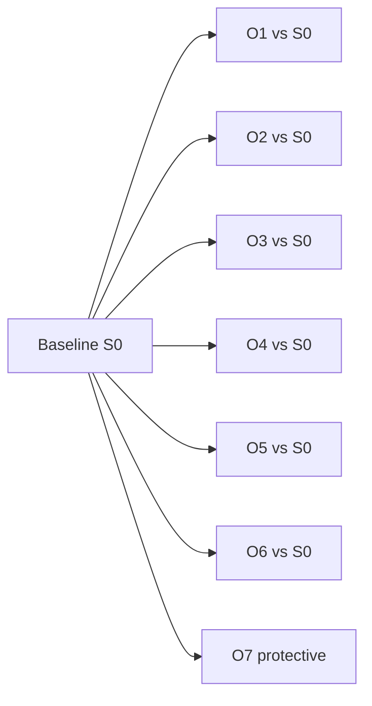
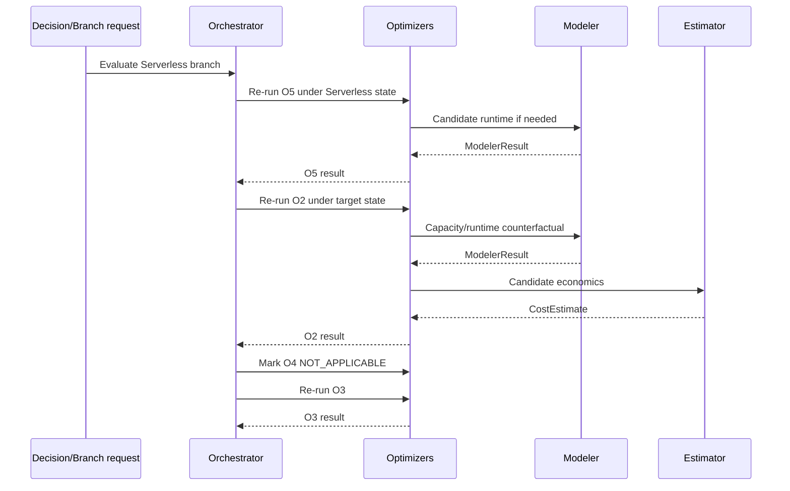
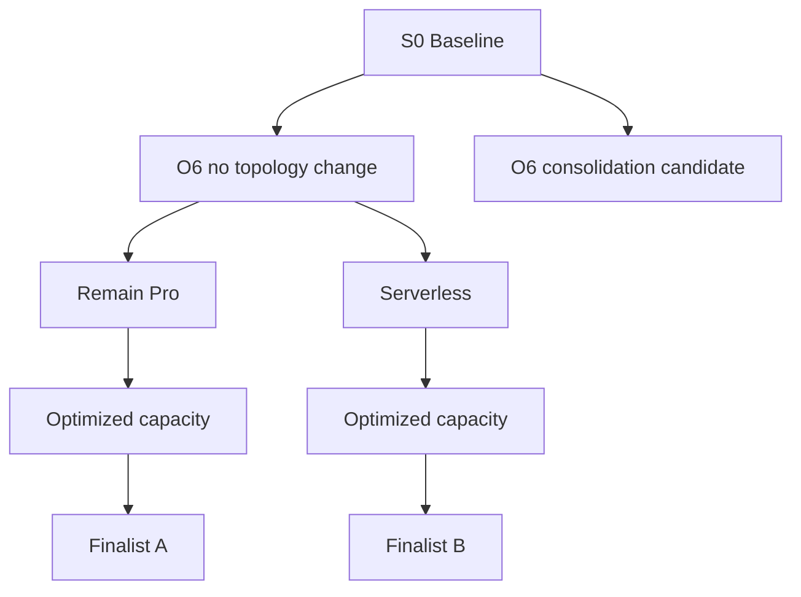

# Databricks Compute Optimization Product
## Optimization Orchestrator + PlanState Detailed Technical Specification

**Document ID:** `TS-ORCH-001`  
**Version:** `2.0.0`
**Date:** 2026-08-14  
**Parent PRD:** `databricks_compute_optimization_product_prd_v2.0.0.md`  
**Parent HLA:** `databricks_compute_optimization_high_level_architecture_v2.0.0.md`  
**Status:** Draft for implementation review

---

# 0. v2.0.0 Architecture Reconciliation

This v2 reconciliation preserves the existing SQL Warehouse business semantics while adopting the Shared Kernel + SQL Warehouse Pack implementation boundary.

- Shared framework/engine code is implemented once under `src/databricks_compute_optimizer/kernel/`.
- SQL Warehouse-specific algorithms, sources, configuration semantics, and providers live under `src/databricks_compute_optimizer/packs/sql_warehouse/`.
- `packs/sql_warehouse/manifest.yaml` points to executable pack capabilities; it is metadata, not duplicate implementation code.
- No future compute pack is implemented by this document.

Orchestrator is implemented once in Kernel. `PlanState` remains its internal immutable candidate/search construct, not a Lifecycle or LLM state.

The Orchestrator resolves executable SQLWH Optimizers from the Capability Registry/pack manifest. It does not maintain a second applicability registry. T1–T4 controls bounded search/candidate/model depth only.

Phase-3 LLM output never calls the Orchestrator directly. Only a validated authoritative context change (`ContextDiff`) or existing Lifecycle/Policy/config change may trigger dependency-directed reevaluation.

---

# 1. Purpose

The Optimization Orchestrator owns **what optimization work runs, in what order, against which immutable state, and what must be rerun when an upstream decision changes the target domain**.

It explores a bounded internal search space. It does not contain optimizer-specific business rules, financial formulas, or final user-facing plan selection.

---

# 2. Traceability

| Requirement | Architecture | Technical section |
|---|---|---|
| `PRD-FR-ORCH-*` | `ARC-CMP-007` | all |
| `PRD-FR-PROD-022..028` | `ARC-EXEC-001`, `ARC-STATE-001` | search + PlanState |
| `PRD-FR-PROD-033` | `ARC-DCTX-001` | selective authoritative reevaluation |
| O6 exception | `ARC-PLAT-002` | topology branch behavior |

---

# 3. Ownership boundary

| Orchestrator owns | Does not own |
|---|---|
| optimizer invocation order | O1–O7 candidate rules |
| standalone vs portfolio execution | cost formulas |
| immutable PlanState graph | final plan choice |
| branch generation/expansion | label presentation |
| pruning coordination | Analyzer calculations |
| dependency/invalidation execution | Modeler algorithms |
| tier-aware search budget | Lifecycle state machine |
| selective authoritative reevaluation planning | Policy/ContextDiff definitions |

Key phrase:

> **Orchestrator explores. Decision Engine ranks/prunes/selects according to approved decision policy.**

The Orchestrator may apply mechanical hard-pruning rules that do not require a portfolio preference judgment.

---

# 4. Runtime inputs

```json
{
  "orchestration_request_id": "ORQ-...",
  "run_id": "RUN-...",
  "warehouse_id": "WH-123",
  "baseline_plan_state_id": "PS-BASE",
  "tier_result_ref": "TIER-...",
  "analyzer_result_refs": [],
  "policy_snapshot_id": "PSNAP-...",
  "modes": ["STANDALONE", "PORTFOLIO"]
}
```

For O6 discovery, a warehouse may be evaluated with neighboring warehouses selected by A15/O6 discovery policy. That multiwarehouse candidate set is carried inside topology branch metadata; the run remains anchored to warehouse-oriented scope.

---

# 5. Immutable `PlanState`

`PlanState` is the fundamental search-state contract.

```json
{
  "contract_version": "1.0.0",
  "plan_state_id": "PS-...",
  "parent_plan_state_id": "PS-...",
  "run_id": "RUN-...",
  "warehouse_id": "WH-123",
  "topology_evaluation_id": null,
  "configuration": {
    "warehouse_type": "PRO",
    "warehouse_size": "LARGE",
    "min_clusters": 2,
    "max_clusters": 8,
    "photon": true,
    "spot_policy": "RELIABILITY_OPTIMIZED",
    "auto_stop_minutes": 45,
    "statement_timeout_seconds": 0
  },
  "topology": null,
  "applied_optimizer_steps": ["O1"],
  "optimizer_result_refs": [],
  "modeler_result_refs": [],
  "candidate_estimate_refs": [],
  "guardrail_status": "PASS",
  "state_hash": "sha256:...",
  "status": "ACTIVE"
}
```

O6 target branch example:

```json
{
  "warehouse_id": "WH-A",
  "topology_evaluation_id": "TOP-001",
  "topology": {
    "source_warehouse_ids": ["WH-A", "WH-B"],
    "target_warehouses": [
      {"logical_id": "TARGET-1", "configuration": {}}
    ],
    "workload_placements": []
  }
}
```

No mutable in-place changes are allowed.

```text
PS-001 --O1--> PS-002 --O5--> PS-003 --O2--> PS-004
```

---

# 6. PlanState construction and hashing

Canonical hash input excludes non-semantic timestamps/tracing metadata.

```text
state_hash = SHA256(canonical_json(
  parent_state_hash,
  warehouse_id,
  topology,
  canonical_configuration,
  ordered_applied_optimizer_steps,
  ordered_optimizer_result_hashes,
  policy_hash,
  source_snapshot_hash
))
```

Rules:

1. canonical JSON keys sorted;
2. arrays order-defined by contract;
3. decimals serialized canonically;
4. no floating/non-deterministic map order;
5. duplicate semantic states deduplicated by `state_hash`.

---

# 7. Two execution lanes

## 7.1 Standalone lane

Purpose: produce an independently actionable result for each optimizer against baseline.



Standalone winners are sent to Estimator `INDEPENDENT` and Recommendation Package. They do not alter the portfolio lane.

## 7.2 Portfolio lane

Purpose: find best compatible sequence of changes against evolving PlanState.

Default structural/tuning order:

```text
O6 -> O1 -> O5 -> O2 -> O4 -> O3
O7 evaluated separately after normal plan
```

---

# 8. Portfolio search algorithm

```text
INPUT: baseline S0, AnalyzerResults, TierResult, PolicySnapshot

frontier = [S0]

for stage in [O6, O1, O5, O2, O4, O3]:
    next_frontier = []

    for state in canonical_sort(frontier):
        if stage not applicable(state, tier, policy):
            next_frontier.append(state)
            continue

        results = invoke_stage(stage, state)

        for result in canonical_sort(results):
            if result.decision in {BLOCKED, NOT_APPLICABLE, NO_CHANGE}:
                if result.decision == NO_CHANGE:
                    next_frontier.append(derive_state_with_lineage(state, result))
                else:
                    record(result)
                continue

            child = derive_immutable_child_state(state, result)
            next_frontier.append(child)

    next_frontier = deduplicate(next_frontier)
    next_frontier = hard_prune(next_frontier)
    next_frontier = decision_engine.rank_partial_and_prune(next_frontier, stage)
    frontier = enforce_beam_width(next_frontier, tier, policy)

final_plans = fully_evaluate(frontier)
return decision_engine.select(final_plans)
```

`DecisionEngine.rank_partial_and_prune` may operate on partial plans only with metrics known at that stage. It MUST NOT fabricate future savings.

---

# 9. Structural branch behavior

## 9.1 O6 first

O6 may produce:

```text
NO_CHANGE topology branch
CONSOLIDATE branch(es)
SPLIT branch(es)
```

Each surviving structural branch is a new target workload-placement domain.

Every changed O6 branch MUST rerun downstream O1–O5/O3 as specified by `TS-OPT`.

## 9.2 O1 type branch

A type change creates a new platform domain.

Example:

```text
PS-Pro
  ├── remain Pro
  └── Serverless
         -> O4 becomes N/A
         -> O5/O2/O3 re-evaluated
```

Stale capacity/Spot/autostop results from the parent MUST NOT be copied as authority.

---

# 10. Pruning

## 10.1 Hard feasibility pruning

Applied before expensive Modeler/Estimator calls where possible:

- security/compliance failure;
- unsupported feature/configuration;
- type ineligibility;
- invalid API parameter relationship;
- material source blocker;
- current Policy feature gate denies candidate.

## 10.2 Evidence-based pruning

Examples:

- A06 material persistent spill eliminates unsupported aggressive downsize candidates;
- zero material idle opportunity can collapse O3 to `NO_CHANGE`;
- O4 skipped on Serverless;
- O6 skipped by tier policy.

The domain-specific rule lives in Optimizer; Orchestrator simply stops further branch expansion after structured rejection.

## 10.3 Dominance pruning

Plan A dominates Plan B at the same stage when A is no worse on every known decision dimension and strictly better on at least one, using only comparable complete values.

Conservative default comparable dimensions:

```text
candidate economic cost
P95 runtime delta
reliability delta/risk
implementation risk proxy
```

If uncertainty intervals overlap materially, Policy may disable dominance between those plans.

## 10.4 Branch-and-bound

If the best possible lower-bound cost of a partial branch cannot beat the current best valid full/partial comparable plan after materiality tolerance, prune it.

A bound MUST be mathematically valid; do not invent “future savings potential.” If no defensible bound exists, do not branch-and-bound that stage.

## 10.5 Beam width

Default illustrative policy:

```yaml
orchestrator:
  beam_width:
    T1: 5
    T2: 3
    T3: 2
    T4: 1
```

Beam ordering is supplied by Decision Engine partial-plan comparator. The exact widths are calibration values, not hard-coded architecture constants.

---

# 11. Search budget by tier

| Tier | Capability execution | Search/model budget |
|---|---|---|
| T1 | all applicable registered Optimizers | widest bounded beam/candidate domain; deepest eligible modeling |
| T2 | all applicable registered Optimizers | moderate beam/candidate domain |
| T3 | all applicable registered Optimizers | narrower beam/candidate domain |
| T4 | all applicable registered Optimizers | minimum safe bounded search; `NO_CHANGE` always represented |

T-tier never makes an otherwise applicable Optimizer disappear. It changes the number/depth of deterministic candidates evaluated inside that optimizer/search lane.

# 12. Dependency/invalidation execution

Orchestrator consumes the matrix defined by `TS-OPT-001`.

```text
RERUN       -> invoke affected optimizer from changed PlanState
REVALIDATE  -> request needed Modeler/Estimator guardrail checks; reuse candidate only if unchanged semantics
N/A         -> emit NOT_APPLICABLE
NONE        -> existing branch result may remain valid
```

### Example: O1 Pro → Serverless



---

# 13. Selective authoritative reevaluation

Reevaluation is driven by `ContextDiff`, PolicyDiff, configuration/lifecycle changes, or released capability changes—not by an LLM asking the same deterministic code to try again.

```json
{
  "reevaluation_request_id": "REEVAL-...",
  "warehouse_id": "WH-123",
  "prior_decision_context_id": "DC-17",
  "new_decision_context_id": "DC-18",
  "authoritative_hash_changed": true,
  "changed_dimensions": ["CONFIG"],
  "changed_fields": ["max_clusters"],
  "reason": "CONFIG_CHANGED"
}
```

Invariant:

```text
if prior_authoritative_context_hash == new_authoritative_context_hash:
    do_not_recompute_authoritative_pipeline
```

| Change | Minimum safe reevaluation |
|---|---|
| auto-stop config/evidence | O3 path |
| size/min/max | affected Analyzers/Modeler → O2 then dependencies |
| Photon | O5 → affected downstream |
| Spot | O4 |
| type | O1 → O5 → O2 → O4/N/A → O3 |
| topology/routing | O6 → downstream target-warehouse sequence |
| major workload regime | refreshed affected Analyzers/Modeler → all applicable optimizer domains whose inputs changed |
| rate-only | Estimator → Tiering if baseline changed → Decision / affected economic winner evaluation |
| presentation-label policy | no authoritative reevaluation |
| newly released applicable capability | new capability + dependency-directed downstream path |
| validated ML statistical fallback | Modeler result → affected Optimizer/Decision |
| LLM finding only | **none** |


---

# 14. Decision Engine interaction

Boundary:

```text
Orchestrator asks: what should be evaluated next?
Decision Engine asks: which valid compatible plan should win?
```

Decision Engine may return:

```json
{
  "partial_plan_action": "KEEP|PRUNE",
  "reason": "DOMINATED|BEAM_LIMIT|HARD_CONSTRAINT|KEEP",
  "rank": 1
}
```

For final selection it returns a `DecisionResult`; see `TS-DEC`.

Decision Engine never directly invokes Optimizers. Any required reevaluation must arrive through a changed authoritative context/invalidation path owned by Orchestrator.

---

# 15. Search result contract

```json
{
  "orchestration_result_id": "OR-...",
  "warehouse_id": "WH-123",
  "baseline_plan_state_id": "PS-BASE",
  "standalone_optimizer_result_refs": [],
  "final_portfolio_plan_state_ids": ["PS-104", "PS-122"],
  "pruned": [
    {"plan_state_id": "PS-090", "reason": "DOMINATED"}
  ],
  "search_stats": {
    "states_created": 34,
    "states_deduplicated": 3,
    "states_pruned": 24,
    "finalists": 2
  },
  "policy_snapshot_id": "PSNAP-...",
  "status": "SUCCESS"
}
```

---

# 16. Capability applicability

Capability applicability is resolved by `TS-CAP-001` from the released SQLWH manifest, phase, resource/service predicates, source availability, feature Policy, and dependencies.

The Orchestrator MUST NOT maintain a duplicate hard-coded dictionary such as:

```text
optimizer_applicability = {...}
```

Instead:

```text
CapabilityRegistrySnapshot
    ↓
applicable SQLWH Optimizer IDs/versions
    ↓
Orchestrator executes each applicable optimizer
    ↓
T1–T4 controls bounded candidate/search budget inside execution
```

O6 is phase-gated by Phase 5 and its service/domain prerequisites—not disabled merely because a warehouse is T3/T4.


---

# 17. Determinism

Deterministic execution requires:

- sorted warehouse/topology candidate IDs;
- sorted optimizer stage sequence;
- canonical PlanState serialization;
- fixed beam width;
- stable Decision comparator;
- deterministic task result collection order even if evaluations run concurrently;
- no wall-clock ordering as a tie-breaker.

Parallel candidate evaluation MAY be used, but results MUST be sorted/canonicalized before state derivation and ranking.

---

# 18. Idempotency and retries

Orchestrator task key:

```text
(run_id, warehouse_id, plan_state_hash, optimizer_id, policy_hash)
```

If a transient Modeler/Estimator call fails, retry under configured backoff without creating a new semantic PlanState. Persistent failure marks affected branch `PARTIAL/BLOCKED`; other warehouse runs continue when policy permits.

---

# 19. Error semantics

| Code | Behavior |
|---|---|
| `ORCH_NO_BASELINE_STATE` | fail warehouse run |
| `ORCH_INVALID_GRAPH` | fail before search |
| `ORCH_STATE_HASH_COLLISION` | critical fail |
| `ORCH_MAX_STATES_EXCEEDED` | stop expansion; mark non-authoritative unless policy-defined safe behavior exists |
| `ORCH_DEPENDENCY_UNRESOLVED` | block affected branch |
| `ORCH_PARTIAL_UPSTREAM` | isolate branch or block authority per materiality |
| `ORCH_NO_VALID_FINALIST` | send no-valid-plan condition to Decision Engine/Recommendation |

---

# 20. Observability

```text
orchestrator_runs_total{status,tier}
orchestrator_duration_seconds{tier}
orchestrator_states_created{tier}
orchestrator_states_pruned{reason}
orchestrator_states_deduplicated
orchestrator_optimizer_calls{optimizer_id}
orchestrator_modeler_calls{capability}
orchestrator_estimator_calls{mode}
orchestrator_beam_width_used{tier}
orchestrator_selective_reruns_total{reason}
```

A debug artifact MAY persist the compact search DAG for T1 under controlled retention.

---

# 21. Search DAG visualization contract



Search DAG is internal evidence, not the normal end-user recommendation UI.

---

# 22. Tests

## Unit

1. immutable child state leaves parent unchanged;
2. state hash deterministic;
3. semantically duplicate states deduplicate;
4. standalone always uses S0;
5. portfolio uses parent evolving state;
6. O6 changed branch reruns downstream;
7. O1 Serverless makes O4 N/A;
8. beam width deterministic;
9. parallel evaluation collection deterministic;
10. invalidation mapping exact;
11. no invented branch-and-bound bound;
12. `NO_CHANGE` retains lineage;
13. T4 cannot silently skip hard guardrails.

## Integration

| ID | Assertion |
|---|---|
| `IT-ORCH-001` | standalone and portfolio results are separately persisted |
| `IT-ORCH-002` | structural branch invalidation produces correct downstream calls |
| `IT-ORCH-003` | Decision partial-prune cannot invoke optimizer directly |
| `IT-ORCH-004` | selective max-cluster drift reruns only safe dependency path |
| `IT-ORCH-005` | same inputs produce same final PlanState IDs/search stats |

---

# 23. Phase-1 implementation

Run in-process Python coordinator with typed domain interfaces. Candidate counts are deliberately bounded; no distributed orchestration framework is required to prove Phase-1 value.

Recommended modules:

```text
orchestrator/
  service.py
  plan_state.py
  graph.py
  applicability.py
  pruning.py
  invalidation.py
  search_budget.py
```

Repositories persist compact PlanStates/results only; no requirement for a Phase-1 Delta state graph.

---

# 24. Phase-2 implementation

Lakeflow Jobs controls stage scheduling; PySpark handles data-intensive evidence/model preparation. Orchestrator can remain driver-side Python using Delta-backed repositories.

Phase-2 scale must not change PlanState semantics or winner outcomes for parity fixtures.

---

# 25. Component release plan

| Release | Phase | Scope | Exit criteria |
|---|---:|---|---|
| `REL-ORCH-0.1.0` | 1 | immutable PlanState/hashing + Capability Registry manifest resolution | state/manifest determinism tests pass |
| `REL-ORCH-0.2.0` | 1 | standalone lane + bounded sequential O1→O5→O2→O4→O3 portfolio search; O7 separate | Phase-1 optimizer integrations pass |
| `REL-ORCH-0.3.0` | 1 | dominance/hash dedupe/beam and candidate-budget pruning | deterministic search fixtures pass |
| `REL-ORCH-0.4.0` | 1 | Policy/config/source dependency invalidation + selective authoritative reevaluation | ContextDiff/Lifecycle reevaluation fixtures pass |
| `REL-ORCH-0.5.0` | 1 | Decision Engine partial/final interaction, retry/idempotency | full workflow integration passes |
| `REL-ORCH-1.0.0` | 1 | Phase-1 contract freeze/hardening | golden E2E scenarios pass |
| `REL-ORCH-2.0.0` | 2 | Delta-backed state repository / PySpark scale + admitted ML result integration | pandas/PySpark workflow parity passes |
| `REL-ORCH-3.0.0` | 3 | validated Review Adapter/context-change handoff; no direct LLM invocation | same-hash/no-op + context-change tests pass |
| `REL-ORCH-4.0.0` | 4 | SQLWH diagnostic-result dependency integration | diagnostic ContextDiff tests pass |
| `REL-ORCH-5.0.0` | 5 | O6 structural branches + downstream target-warehouse reevaluation | topology/search golden fixtures pass |

---

# 26. Definition of Done

- standalone and portfolio lanes are distinct;
- PlanState is immutable/content-addressable;
- Phase-5 O6 and all-phase O1 structural invalidation cannot reuse stale downstream decisions;
- search is bounded and deterministic;
- pruning never hides a hard blocker or relies on invented future savings;
- Decision Engine interaction does not violate component ownership;
- selective authoritative reevaluation follows ContextDiff and the dependency map;
- Phase-1 implementation remains simple enough for fast value realization.
