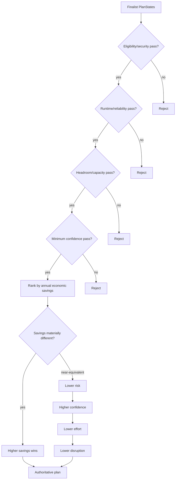

# Databricks Compute Optimization Product
## Decision Engine Detailed Technical Specification

**Document ID:** `TS-DEC-001`  
**Version:** `2.0.0`
**Date:** 2026-08-14  
**Parent PRD:** `databricks_compute_optimization_product_prd_v2.0.0.md`  
**Parent HLA:** `databricks_compute_optimization_high_level_architecture_v2.0.0.md`  
**Status:** Draft for implementation review

---

# 0. v2.0.0 Architecture Reconciliation

This v2 reconciliation preserves the existing SQL Warehouse business semantics while adopting the Shared Kernel + SQL Warehouse Pack implementation boundary.

- Shared framework/engine code is implemented once under `src/databricks_compute_optimizer/kernel/`.
- SQL Warehouse-specific algorithms, sources, configuration semantics, and providers live under `src/databricks_compute_optimizer/packs/sql_warehouse/`.
- `packs/sql_warehouse/manifest.yaml` points to executable pack capabilities; it is metadata, not duplicate implementation code.
- No future compute pack is implemented by this document.

Decision Engine is implemented once in Kernel. SQL Warehouse-specific compatibility/risk/effort factors are supplied through typed SQLWH decision inputs/policy profile; the SQLWH pack does not clone the Decision Engine.

Phase 3 runs **after** this engine selects the authoritative plan. Investigator/Challenger do not directly alter Decision confidence/risk or selected configuration. `REQUEST_BLOCK` has no authoritative effect until existing deterministic Policy/Decision conditions are satisfied by authoritative evidence.

---

# 1. Purpose

The Decision Engine selects the **one authoritative compatible portfolio plan** from valid, fully evaluated PlanStates and identifies only a small set of material alternatives.

It uses a transparent constraint-first, lexicographic framework. It MUST NOT use an opaque weighted composite as the primary selection mechanism.

---

# 2. Traceability

| Requirement | Architecture | Technical section |
|---|---|---|
| `PRD-FR-DEC-*` | `ARC-CMP-008` | all |
| `PRD-FR-PROD-024..028` | decision flow | Sections 5–11 |
| `PRD-FR-PROD-039` | why-not-selected | Section 13 |
| `PRD-NFR-DEC-*` | determinism/explainability | Sections 14–18 |

---

# 3. Ownership boundary

Decision Engine owns:

- hard-plan admissibility based on already-computed evidence/results;
- compatible-plan comparison;
- lexicographic ranking;
- partial-plan ordering support for Orchestrator pruning;
- authoritative winner;
- material alternatives;
- quantitative confidence/risk/effort bases used downstream;
- why-not-selected reason codes.

It does not own:

- optimizer candidate generation;
- Modeler prediction;
- Estimator formulas;
- policy definition;
- user-facing formatting;
- lifecycle.

---

# 4. Inputs

```json
{
  "decision_request_id": "DREQ-...",
  "warehouse_id": "WH-123",
  "baseline_plan_state_id": "PS-BASE",
  "candidate_plan_state_ids": ["PS-104", "PS-122"],
  "authoritative_cost_estimate_refs": ["EST-104", "EST-122"],
  "analyzer_result_refs": [],
  "modeler_result_refs": [],
  "optimizer_result_refs": [],
  "tier_result_ref": "TIER-...",
  "policy_snapshot_id": "PSNAP-..."
}
```

All finalists MUST be financially evaluated on the same comparison basis before final selection.

---

# 5. Decision framework



---

# 6. Hard constraints

Default required hard gates:

| Gate | Source |
|---|---|
| eligibility | A10 / optimizer results |
| security/compliance | enterprise adapter + A10 |
| P95 runtime | A05 + Modeler + Policy |
| reliability | A11 + Modeler + Policy |
| capacity/headroom | O2/M02 + Policy |
| financial validity | Estimator |
| minimum evidence/confidence | A00 + component quality |
| component/version compatibility | runtime compatibility gate |

A plan failing a hard gate cannot win even if it has higher savings.

---

# 7. Primary objective

Among admissible plans:

```text
MAXIMIZE annual_economic_savings
```

where the value comes from Estimator `AUTHORITATIVE_PLAN`, not a sum of independent optimizers.

Policy MAY choose another explicit economic basis in future (for example cash-realizable) but the basis must be named/versioned and all finalists must use the same basis.

---

# 8. Near-equivalent savings

If two plans' annual economic savings differ by less than policy materiality:

```text
abs(Sa - Sb) / max(abs(Sa), abs(Sb), epsilon)
    <= near_equivalent_savings_pct
```

then savings alone does not decide; apply tie-break hierarchy.

Recommended default candidate is 5% but must be calibrated/policy-managed.

---

# 9. Tie-break hierarchy

Approved default:

```text
1. lower risk
2. higher confidence
3. lower effort
4. lower operational disruption
5. canonical plan_state_id lexical order
```

Final lexical ordering is only a determinism tie-breaker when all material decision dimensions are equal.

---

# 10. Confidence basis

The Decision Engine produces a deterministic quantitative/ordinal basis; Recommendation Package maps it to presentation labels.

Confidence SHOULD be conservative. Default composite rule:

```text
plan_confidence = MIN(
    evidence_quality,
    model_quality,
    financial_quality,
    validation_quality_if_available
)
```

This avoids a high average masking one weak critical dimension.

Each dimension uses a policy-defined ordinal scale, for example:

```text
4 = VERY_HIGH
3 = HIGH
2 = MEDIUM
1 = LOW
0 = BLOCKED
```

### Evidence quality inputs

- A00 coverage/freshness;
- sample size/representative regime;
- current-config completeness;
- source quality.

### Model quality inputs

- matched vs extrapolated evidence;
- uncertainty interval width;
- OOD status;
- canary/observed comparator support.

### Financial quality inputs

- negotiated vs list rate;
- billing reconciliation;
- AWS attribution coverage;
- commitment data completeness.

Decision Engine MUST persist dimension values, not just the final label.

---

# 11. Risk basis

Risk is conservative maximum severity across dimensions:

```text
plan_risk = MAX(
  performance_risk,
  reliability_risk,
  migration_risk,
  security_network_risk,
  blast_radius_risk,
  rollback_complexity_risk
)
```

Ordinal scale example:

```text
0 LOW
1 MEDIUM
2 HIGH
3 VERY_HIGH
```

### Deterministic risk rubric examples

| Condition | Minimum risk |
|---|---|
| simple auto-stop config within strong historical replay | LOW |
| capacity bundle change with strong evidence | LOW/MEDIUM policy rubric |
| Photon change requiring canary | MEDIUM |
| Pro→Serverless migration | at least MEDIUM unless enterprise policy says otherwise |
| O6 split/consolidation with routing changes | HIGH by default candidate rubric |
| hard security violation | blocked, not risk-scored |

These are policy-configured rubric rules, not free-form LLM judgments.

---

# 12. Effort and disruption basis

Effort is an implementation-complexity ordinal; disruption is separated because a low-engineering change can still require a disruptive migration window.

### Effort factors

- number of config fields;
- API-only feature enablement;
- new warehouse creation;
- workload/routing changes;
- cross-team coordination;
- validation/canary requirements;
- infrastructure/network/security work.

### Default deterministic examples

| Change | Effort candidate |
|---|---|
| O3 auto-stop only | LOW |
| O2 atomic capacity config | LOW |
| O4 Spot policy | LOW |
| O5 Photon toggle + validation | LOW/MEDIUM |
| O1 type migration | MEDIUM/HIGH |
| O6 topology | HIGH/VERY_HIGH |

Recommendation Package may present `LOW/MEDIUM/HIGH/VERY_HIGH` from these stored bases.

---

# 13. Material alternatives

Alternatives are not “runner-up candidates” by default. A losing plan is material only if it offers a meaningful trade-off.

Default criteria:

```text
valid hard gates
AND one of:
  savings >= recommended_savings × minimum_alternative_savings_ratio
  OR risk materially lower
  OR effort materially lower
  OR disruption materially lower
```

Policy controls:

```yaml
recommendation:
  alternatives:
    max_count: 2
    minimum_savings_ratio_vs_recommended: 0.75
```

Alternative ordering uses the same comparator but may prioritize the distinct trade-off category when explaining inclusion.

---

# 14. Why-not-selected contract

Every finalist/obvious structural alternative receives a reason.

```json
{
  "plan_state_id": "PS-ALT",
  "status": "NOT_SELECTED",
  "reasons": [
    {
      "code": "HIGHER_ANNUAL_COST",
      "detail": {
        "annual_cost_delta_vs_winner": "150000.00"
      }
    }
  ]
}
```

Reason codes:

```text
HARD_GATE_FAILED
HIGHER_ANNUAL_COST
NEAR_EQUIVALENT_HIGHER_RISK
NEAR_EQUIVALENT_LOWER_CONFIDENCE
NEAR_EQUIVALENT_HIGHER_EFFORT
NEAR_EQUIVALENT_HIGHER_DISRUPTION
DOMINATED
POLICY_FORBIDDEN
FEATURE_GATED
INSUFFICIENT_EVIDENCE
```

Do not expose thousands of low-level rejected optimizer candidates; summarize technique-level evidence separately.

---

# 15. Partial-plan comparator for Orchestrator

Decision Engine exposes a restricted comparator for pruning/beam ordering.

It MUST use only values already known for the partial stage.

```python
class PartialPlanRanker(Protocol):
    def rank(
        self,
        states: Sequence[PlanStateSummary],
        policy: DecisionPolicyView,
    ) -> Sequence[PartialPlanDisposition]:
        ...
```

It can:

- reject hard-failed states;
- remove clear dominance;
- sort by current candidate economic cost and known risk/confidence;
- enforce near-equivalent rules.

It cannot assume unexecuted optimizers will provide future savings.

---

# 16. `DecisionResult` contract

```json
{
  "contract_version": "1.0.0",
  "decision_result_id": "DEC-...",
  "warehouse_id": "WH-123",
  "authoritative_plan_state_id": "PS-104",
  "authoritative_estimate_ref": "EST-104",
  "decision": "RECOMMEND|NO_CHANGE|BLOCKED",
  "objective": {
    "basis": "ANNUAL_ECONOMIC_SAVINGS",
    "value": "650000.00"
  },
  "scores": {
    "confidence": {
      "overall": 3,
      "evidence": 4,
      "model": 3,
      "financial": 4
    },
    "risk": {
      "overall": 1,
      "performance": 0,
      "reliability": 0,
      "migration": 1,
      "blast_radius": 1,
      "rollback": 1
    },
    "effort": 1,
    "disruption": 1
  },
  "material_alternative_plan_state_ids": ["PS-122"],
  "not_selected": [],
  "policy_snapshot_id": "PSNAP-...",
  "status": "SUCCESS"
}
```

---

# 17. Decision states

| State | Meaning |
|---|---|
| `RECOMMEND` | valid changed plan has material positive value |
| `NO_CHANGE` | baseline/no-change plan is best under policy or savings immaterial |
| `BLOCKED` | no authoritative selection possible because material evidence/constraints failed |

`NO_CHANGE` is a valid product outcome.

---

# 18. Policy consumed

```yaml
decision:
  hard_constraints:
    eligibility: required
    security: required
    performance: required
    reliability: required
    headroom: required
    minimum_confidence_ordinal: 2

  objective:
    basis: annual_economic_savings

  near_equivalent:
    savings_difference_pct: 5
    tie_break_order:
      - lower_risk
      - higher_confidence
      - lower_effort
      - lower_disruption

  materiality:
    minimum_annual_savings_usd: 0
```

Policy changes to hard gates/objective/tie-breaks invalidate Decision results and may require upstream rerun depending on `PolicyDiff`.

---

# 19. Determinism

Pin:

- candidate PlanState sort order;
- comparison basis;
- materiality formula;
- ordinal rubric versions;
- missing-value behavior;
- exact tie-break order.

No LLM-generated text is part of authoritative ranking.

---

# 20. Error semantics

| Code | Behavior |
|---|---|
| `DECISION_MIXED_COST_BASIS` | reject comparison |
| `DECISION_MISSING_AUTHORITATIVE_ESTIMATE` | block affected finalist |
| `DECISION_INCOMPATIBLE_PLAN_STATE` | reject finalist |
| `DECISION_NO_VALID_PLAN` | result BLOCKED unless baseline itself is valid and NO_CHANGE can be selected |
| `DECISION_SCORE_RUBRIC_MISSING` | fail run |
| `DECISION_NONDETERMINISTIC_TIE` | fail test/run authority |

---

# 21. Observability

```text
decision_requests_total{decision}
decision_duration_seconds
decision_finalists_count
decision_hard_gate_rejections{gate}
decision_alternatives_count
decision_confidence_ordinal
decision_risk_ordinal
decision_effort_ordinal
```

Structured logs include plan IDs and reason codes, not sensitive query text.

---

# 22. Tests

Unit:

1. higher savings wins when materially different;
2. hard runtime failure can never win;
3. near-equal savings chooses lower risk;
4. then higher confidence;
5. then lower effort;
6. then lower disruption;
7. exact ties use stable ID;
8. confidence uses conservative minimum rule;
9. risk uses conservative maximum rule;
10. mixed financial bases rejected;
11. NO_CHANGE can win;
12. alternatives capped/material;
13. partial comparator never assumes future savings.

Integration:

| ID | Assertion |
|---|---|
| `IT-DEC-001` | Orchestrator finalists + Estimator -> one authoritative winner |
| `IT-DEC-002` | Pro optimized lower risk can appear as alternative to higher-saving Serverless |
| `IT-DEC-003` | Recommendation receives why-not-selected reasons |
| `IT-DEC-004` | changed label threshold does not change underlying Decision quantitative bases |

---

# 23. Phase-1 implementation

Pure Python comparator/rubric engine. No direct SQL/API access. All decisions are side-effect free and persist through repositories after success.

Recommended modules:

```text
decision/
  service.py
  constraints.py
  comparator.py
  confidence.py
  risk.py
  effort.py
  alternatives.py
  reasons.py
```

---

# 23.1 Phase-3 Intelligence Review output seam

`DecisionResult` is the authoritative input to AgentReviewRouter. It SHOULD expose structured:

- selected plan;
- material alternatives;
- why-not-selected summaries;
- hard-gate outcomes;
- risk/confidence/effort bases;
- financial estimate refs;
- DecisionContext ID/hash.

Agent findings are not part of this decision result. If validated review causes new authoritative evidence/policy/model context, the normal deterministic pipeline produces a **new** DecisionResult. The old DecisionResult is never mutated by the agent.

---

# 24. Phase-2 compatibility

ML Modeler may affect model-quality inputs but not Decision algorithm ownership. Decision records Modeler/Estimator versions. Spark/PySpark backend does not change decision semantics.

---

# 25. Component release plan

| Release | Phase | Scope | Exit criteria |
|---|---:|---|---|
| `REL-DEC-0.1.0` | 1 | hard constraints + primary savings objective + deterministic comparator | comparator fixtures pass |
| `REL-DEC-0.2.0` | 1 | confidence/risk/effort/disruption rubrics | rubric golden fixtures pass |
| `REL-DEC-0.3.0` | 1 | material alternatives + why-not-selected + partial-plan ranker | Orchestrator/Recommendation integrations pass |
| `REL-DEC-1.0.0` | 1 | Phase-1 contract freeze/hardening | full golden E2E plan-selection scenarios pass |
| `REL-DEC-2.0.0` | 2 | admitted ML-quality input compatibility | statistical/ML result parity rules pass |
| `REL-DEC-3.0.0` | 3 | structured AgentReviewRouter evidence projection + advisory-block/context-change compatibility; decision algorithm unchanged | no-authority-leak/review-seam tests pass |
| `REL-DEC-4.0.0` | 4 | diagnostic evidence lineage compatibility; algorithm unchanged unless authoritative Analyzer/Modeler inputs change | diagnostic no-regression tests pass |
| `REL-DEC-5.0.0` | 5 | topology/multi-warehouse PlanState compatibility | O6 final-selection golden tests pass |

---

# 26. Definition of Done

- hard constraints precede economics;
- objective is transparent;
- no opaque weighted primary score exists;
- near-equivalent plans use approved tie-break sequence;
- confidence/risk/effort have deterministic bases;
- one authoritative plan is selected;
- alternatives are few and meaningful;
- all losing material plans have structured rationale.
