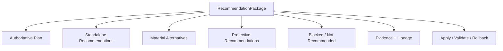
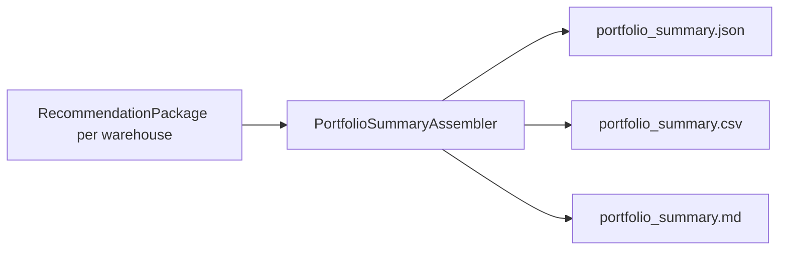

# Databricks Compute Optimization Product
## SQL Warehouse Recommendation Package Detailed Technical Specification

**Document ID:** `TS-REC-001`  
**Version:** `2.0.0`
**Date:** 2026-08-14  
**Parent PRD:** `databricks_compute_optimization_product_prd_v2.0.0.md`  
**Parent HLA:** `databricks_compute_optimization_high_level_architecture_v2.0.0.md`  
**Status:** Draft for implementation review

---

# 0. v2.0.0 Architecture Reconciliation

This v2 reconciliation preserves the existing SQL Warehouse business semantics while adopting the Shared Kernel + SQL Warehouse Pack implementation boundary.

- Shared framework/engine code is implemented once under `src/databricks_compute_optimizer/kernel/`.
- SQL Warehouse-specific algorithms, sources, configuration semantics, and providers live under `src/databricks_compute_optimizer/packs/sql_warehouse/`.
- `packs/sql_warehouse/manifest.yaml` points to executable pack capabilities; it is metadata, not duplicate implementation code.
- No future compute pack is implemented by this document.

Recommendation assembly is a shared Kernel service; the SQLWH pack supplies configuration-delta/application/validation serialization. It does not implement a second Recommendation service.

Phase 3 adds orthogonal `AgentReviewStatus` and separately persisted `NarrativeExtension`. LLM prose and model/prompt versions are not authoritative RecommendationPackage values and cannot mutate money/configuration.

---

# 1. Purpose

The Recommendation Package component transforms authoritative decisions, optimizer results, financial estimates, evidence, projections, policy, and application/validation metadata into one immutable artifact suitable for API/UI/review/lifecycle consumption.

It presents **decisions, not search space**.

---

# 2. Traceability

| Requirement | Architecture | Technical section |
|---|---|---|
| `PRD-FR-REC-*` | `ARC-CMP-009` | all |
| `PRD-FR-PROD-019..021` | financial presentation | Sections 8–9 |
| `PRD-FR-PROD-027..028,039` | authoritative/alternative/why-not | Sections 5–7 |
| `PRD-FR-PROD-036` | lineage | Section 15 |
| `PRD-FR-REC-013` | warehouse entity; O6 exception activates Phase 5 | Section 4 |

---

# 3. Component boundary

Recommendation Package owns:

- immutable package schema;
- authoritative plan presentation;
- standalone optimizer presentation;
- material alternatives;
- protective recommendation section;
- deterministic presentation label mapping from stored quantitative bases;
- evidence assembly/references;
- apply preconditions/payload metadata;
- validation/rollback metadata;
- initial lifecycle metadata;
- full lineage;
- stable references to `decision_context_id` and `authoritative_context_hash`;
- optional link/reference to the latest `AgentReviewRecord` for rendering, without making review prose authoritative;
- deterministic all-warehouse `PortfolioRecommendationSummary` read model/report assembled only from issued/current warehouse packages.

It does not recalculate:

- optimizer decisions;
- model projections;
- cost;
- winner selection;
- realized value.

---

# 4. Warehouse entity rule and Phase-5 O6 extension

The top-level product entity is a **WAREHOUSE**.

Normal package:

```json
{
  "warehouse_id": "WH-123"
}
```

O6 is not active before Phase 5. Beginning in Phase 5, topology is represented as an extension inside the recommendation, not a new scope:

```json
{
  "warehouse_id": "WH-A",
  "topology": {
    "topology_evaluation_id": "TOP-001",
    "source_warehouse_ids": ["WH-A", "WH-B"],
    "target_warehouses": [{"logical_id": "TARGET-1"}],
    "workload_placements": []
  }
}
```

`WORKLOAD_GROUP`, `WAREHOUSE_GROUP`, and `TOPOLOGY_GROUP` MUST NOT appear as top-level `scope_type` values in any phase.

---

# 5. Package hierarchy



Raw optimizer candidate lists are excluded.

---

# 6. Authoritative plan

The authoritative plan is an ordered sequence of technique-level recommendation steps selected by Decision Engine.

Example presentation model:

| Seq | Optimizer | Change | Incremental saving | Cumulative saving |
|---:|---|---|---:|---:|
| 0 | — | Current state | — | — |
| 1 | O1 | Pro → Serverless | $390K | $390K |
| 2 | O2 | capacity target | $170K | $560K |
| 3 | O3 | auto-stop target | $90K | $650K |

Numbers are illustrative. Contract carries exact decimal strings.

Every step includes:

- current and recommended state;
- atomic flag;
- dependencies;
- why/rationale codes;
- evidence references;
- projected performance/reliability;
- independent saving;
- incremental saving;
- cumulative saving;
- confidence/risk/effort bases/labels;
- preconditions;
- validation;
- rollback.

---

# 7. Standalone recommendations

Each optimizer result evaluated against baseline is presented independently.

Required semantics:

```text
standalone savings = IndependentSavings(optimizer against S0)
```

The package MUST prominently state that independent savings are **not additive**.

O2 remains atomic:

```json
{
  "optimizer_id": "O2",
  "atomic": true,
  "changes": {
    "warehouse_size": {"from": "LARGE", "to": "MEDIUM"},
    "min_clusters": {"from": 2, "to": 1},
    "max_clusters": {"from": 8, "to": 5}
  }
}
```

---

# 7.1 Portfolio Recommendation Summary/View

**TS ID:** `TS-REC-PORT-001`

By `P1-R24`, a completed all-warehouse run MUST produce a deterministic portfolio read model over the immutable per-warehouse packages. It is **not** a new Decision Engine output and MUST NOT recalculate optimizer decisions or money.

Conceptual flow:



Canonical row contract:

```json
{
  "warehouse_id": "WH-123",
  "warehouse_name": "BI_PROD_WH",
  "recommendation_package_id": "REC-...",
  "current_warehouse_type": "PRO",
  "current_annual_economic_cost": "1800000.00",
  "recommended_annual_economic_cost": "1150000.00",
  "annual_economic_savings": "650000.00",
  "savings_pct": "36.1111",
  "primary_actions": ["O1:PRO_TO_SERVERLESS", "O2:CAPACITY_BUNDLE", "O3:AUTOSTOP"],
  "confidence_label": "HIGH",
  "risk_label": "LOW",
  "recommendation_status": "READY_FOR_REVIEW",
  "lifecycle_state": "ISSUED",
  "blocker_codes": []
}
```

Required semantics:

1. Include **every warehouse analyzed by the run**, including `NO_CHANGE` and `BLOCKED` warehouses.
2. Monetary fields MUST be copied from authoritative Estimator/RecommendationPackage values; the summary does not recompute money.
3. `recommended_annual_economic_cost`, savings and labels may be null where authority is blocked; blocker codes MUST explain why.
4. Sort rows deterministically by `warehouse_id` unless an explicit presentation sort is requested. Canonical JSON hashing always uses the deterministic canonical order.
5. Portfolio headline totals MAY aggregate authoritative current/target/savings amounts across mutually independent Phase-1 warehouse packages, but MUST exclude blocked/unpriced fields and MUST report coverage counts. This estate aggregation is distinct from summing independent optimizer savings inside a warehouse.
6. Canonical persistence is JSON; CSV and Markdown are deterministic renderings for human inspection.
7. Phase 1 requires a report/view, not a dedicated web UI.

Recommended portfolio header fields: `run_id`, `analysis_end_utc`, `warehouse_count_analyzed`, `warehouse_count_recommended`, `warehouse_count_no_change`, `warehouse_count_blocked`, `current_annual_economic_cost_covered`, `recommended_annual_economic_cost_covered`, `annual_economic_savings_covered`, `coverage_notes`, `policy_snapshot_id`, and `generated_at_utc`.


---

# 8. Material alternatives

At most policy-configured few alternatives are included.

Alternative entry explains the trade-off:

```json
{
  "plan_state_id": "PS-ALT",
  "annual_economic_savings": "500000.00",
  "risk_label": "LOW",
  "effort_label": "LOW",
  "why_not_selected": ["HIGHER_ANNUAL_COST"],
  "why_material": ["LOWER_MIGRATION_RISK", "LOWER_EFFORT"]
}
```

Do not present a low-value alternative merely because it survived search.

---

# 9. Financial presentation contract

The package separates:

## 9.1 Savings type

```text
independent
incremental
cumulative
total_plan
protective
```

## 9.2 Time perspective

```text
TTM_365_REPLAY        # primary Phase-1 evidence-based view
FORWARD_365           # projection, separately labeled
REALIZED              # Lifecycle-produced later, not initial package authority
```

## 9.3 AWS views

```text
aws_economic_savings
aws_cash_realizable_savings
aws_commitment_freed
```

## 9.4 Invariant statement

The package MUST expose:

```text
Total plan savings = baseline cost - final target cost
```

and SHOULD expose sequence reconciliation status.

---

# 10. Labels

Decision Engine provides quantitative/ordinal bases. Recommendation Package maps to presentation labels using `PolicySnapshot`.

Labels:

```text
Confidence: VERY_HIGH | HIGH | MEDIUM | LOW
Risk:       VERY_HIGH | HIGH | MEDIUM | LOW
Effort:     VERY_HIGH | HIGH | MEDIUM | LOW
Savings:    VERY_HIGH | HIGH | MEDIUM | LOW | IMMATERIAL
```

The label mapping MUST persist the policy threshold version.

Changing a pure presentation threshold does not change the underlying DecisionResult.

---

# 11. Evidence block

Every changed recommendation MUST answer “why should this be trusted?” through concrete references/metrics.

Example:

```json
{
  "evidence": {
    "metrics": [
      {"name": "p95_capacity_wait_ms", "value": 800},
      {"name": "p95_runtime_ms", "value": 11400},
      {"name": "query_coverage_pct", "value": 99.7}
    ],
    "signals": ["LOW_QUEUE_PRESSURE"],
    "findings": ["CAPACITY_OVERSIZED"],
    "blockers": [],
    "analyzer_result_refs": ["A07-..."],
    "modeler_result_refs": ["MOD-..."],
    "estimator_result_refs": ["EST-..."]
  }
}
```

The package SHOULD include compact high-value evidence; deep Analyzer results remain retrievable by reference.

No LLM explanation is required for Phase 1. If an explanation layer is later added, it MUST be grounded in these fields and cannot override them.

---

# 12. Recommendation step contract

```json
{
  "recommendation_id": "REC-O2-001",
  "sequence": 2,
  "optimizer_id": "O2",
  "technique": "CAPACITY_BUNDLE",
  "decision": "CHANGE",
  "atomic": true,
  "current_state": {
    "warehouse_size": "LARGE",
    "min_clusters": 2,
    "max_clusters": 8
  },
  "recommended_state": {
    "warehouse_size": "MEDIUM",
    "min_clusters": 1,
    "max_clusters": 5
  },
  "financials": {
    "independent_annual_economic_savings": "260000.00",
    "incremental_annual_economic_savings": "170000.00",
    "cumulative_annual_economic_savings": "560000.00"
  },
  "performance": {
    "p95_runtime_delta_pct": "2.1000",
    "policy_limit_pct": "5.0000",
    "status": "PASS"
  },
  "labels": {
    "confidence": "HIGH",
    "risk": "LOW",
    "effort": "LOW",
    "savings": "HIGH"
  },
  "dependencies": ["REC-O1-001"],
  "evidence_refs": [],
  "modeler_refs": [],
  "estimator_refs": [],
  "application": {},
  "validation": {},
  "rollback": {}
}
```

---

# 13. Apply contract

Phase 1 is HITL, but the package MUST be machine-actionable.

## 13.1 Precondition hash

Every application step includes:

```text
expected_source_config_hash
expected_target_config_hash
```

Before any write:

```text
current_config_hash == expected_source_config_hash
```

or application is rejected as stale/drifted and reoptimization is requested.

## 13.2 O2 example

```json
{
  "resource": "SQL_WAREHOUSE",
  "warehouse_id": "WH-123",
  "expected_source_config_hash": "sha256:abc",
  "atomic": true,
  "changes": {
    "cluster_size": "Medium",
    "min_num_clusters": 1,
    "max_num_clusters": 5
  }
}
```

The Runtime apply adapter owns exact API invocation and current capability validation.

## 13.3 Incremental API warning

The warehouse update API is incremental; unset fields retain existing values. Therefore the package/apply service MUST construct an explicit intended delta, verify source hash immediately before apply, and re-read current state after apply.

---

# 14. Validation contract

```json
{
  "minimum_observation_days": 7,
  "minimum_queries": 100,
  "require_representative_regime": true,
  "performance": {
    "metric": "p95_runtime",
    "max_regression_pct": "5.0000"
  },
  "reliability": {
    "max_regression_pct": "0.0000"
  },
  "financial": {
    "realization_ratio_policy_ref": "..."
  }
}
```

The exact minimum days/query counts are policy values; monthly/rare workloads require representative execution rather than blindly declaring success after an empty calendar window.

---

# 15. Rollback contract

Simple config recommendation:

```json
{
  "rollback": {
    "type": "CONFIG_RESTORE",
    "configuration": {
      "warehouse_size": "LARGE",
      "min_clusters": 2,
      "max_clusters": 8
    }
  }
}
```

O1 can require richer rollback metadata in Phase 1; Phase 5 O6 can also require multi-warehouse routing/identity rollback metadata:

- source warehouse IDs;
- routing state;
- permissions;
- old target configuration;
- dependency order;
- retirement/reactivation instructions.

Recommendation Package stores metadata; Lifecycle/apply workflow controls actual execution.

---

# 16. Blocked and not-recommended opportunities

Do not silently hide blocked/high-value opportunities.

```json
{
  "blocked_opportunities": [
    {
      "optimizer_id": "O1",
      "candidate": "SERVERLESS",
      "blocker_code": "SERVERLESS_NETWORK_INELIGIBLE",
      "evidence_refs": ["A10-..."]
    }
  ]
}
```

`not_recommended` entries capture valid but losing technique-level options when useful.

---

# 17. Full package contract

```json
{
  "contract_version": "1.0.0",
  "recommendation_package_id": "RP-...",
  "package_version": "1.0.0",
  "run_id": "RUN-...",
  "workspace_id": "WS-...",
  "warehouse_id": "WH-123",
  "generated_at_utc": "...",
  "tier": {
    "tier": "T1",
    "annual_economic_cost": "1800000.00"
  },
  "baseline": {
    "plan_state_id": "PS-BASE",
    "config_hash": "sha256:...",
    "ttm_365_cost": {}
  },
  "authoritative_plan": {
    "decision_result_ref": "DEC-...",
    "target_plan_state_id": "PS-104",
    "steps": [],
    "financials": {
      "ttm_365_replay": {},
      "forward_365": {}
    },
    "labels": {},
    "performance": {},
    "reliability": {}
  },
  "standalone_recommendations": [],
  "material_alternatives": [],
  "protective_recommendations": [],
  "blocked_opportunities": [],
  "not_recommended": [],
  "topology": null,
  "validation_contract": {},
  "lineage": {},
  "lifecycle_seed": {
    "state": "GENERATED",
    "source_config_hash": "sha256:...",
    "target_config_hash": "sha256:..."
  }
}
```

---

# 17.1 Agent review and NarrativeExtension

The authoritative package remains deterministic.

Recommended relationship:

```text
RecommendationPackage
  recommendation_package_id
  decision_context_id
  authoritative_context_hash
      │
      ├── AgentReviewRecord (orthogonal status/class/findings)
      └── NarrativeExtension (non-authoritative, separately versioned)
```

`AgentReviewStatus` values are not LifecycleState values. Portfolio/API rendering may join the latest review/narrative records, but issued package financial/configuration fields are immutable.

If review is pending or fails, the deterministic package remains valid subject to normal lifecycle/policy. Later safety-gated releases may control reviewer-readiness separately without changing the package's authoritative computation.

---

# 18. Lineage

Required:

```text
policy_snapshot_id / policy_version / policy_hash
source_snapshot identifiers
analyzer versions/results
modeler implementation/model versions/results
optimizer versions/results
estimator version/results
decision engine version/result
baseline and target PlanState IDs/hashes
current API capability snapshot version
```

The system must be able to answer:

> Exactly what evidence, policy, code/model version, configuration state, and financial basis produced this recommendation?

---

# 19. Immutability and supersession

Once state reaches `ISSUED`, package content is immutable.

A recalculation creates:

```text
new package_id
supersedes_package_id = old package_id
```

Lifecycle tracks the relationship.

No in-place editing of issued savings/configuration is allowed.

---

# 20. Freshness vs validity

Package carries separate fields:

```json
{
  "freshness": {
    "analysis_end_utc": "...",
    "age_hours": 24
  },
  "validity": {
    "status": "VALID",
    "valid_if": [
      "source_config_hash_unchanged",
      "workload_regime_compatible",
      "critical_policy_unchanged",
      "financial_basis_not_materially_changed"
    ]
  }
}
```

Age alone does not determine validity.

---

# 21. Presentation-label policy

Example:

```yaml
recommendation:
  labels:
    confidence:
      very_high_min_ordinal: 4
      high_min_ordinal: 3
      medium_min_ordinal: 2

    savings:
      very_high_min_annual_usd: 500000
      high_min_annual_usd: 100000
      medium_min_annual_usd: 25000

  alternatives:
    max_count: 2
    minimum_savings_ratio_vs_recommended: 0.75
```

Threshold examples are calibratable; schema/ownership are normative.

---

# 22. Error semantics

| Code | Behavior |
|---|---|
| `REC_MISSING_DECISION` | block package generation |
| `REC_FINANCIAL_INVARIANT_FAIL` | block issuance |
| `REC_SOURCE_HASH_MISSING` | block actionable recommendation issuance |
| `REC_LABEL_POLICY_MISSING` | fail presentation generation |
| `REC_LINEAGE_INCOMPLETE` | block authoritative issuance if material |
| `REC_INVALID_O6_SCOPE` | reject any O6 representation that invents unsupported top-level scope |
| `REC_MUTATION_AFTER_ISSUE` | reject write; require superseding package |

---

# 23. Observability

```text
recommendation_packages_generated_total{decision,tier}
recommendation_packages_blocked_total{reason}
recommendation_steps_total{optimizer_id}
recommendation_alternatives_count
recommendation_blocked_opportunities_count{optimizer_id}
recommendation_expected_savings_usd{basis}
recommendation_lineage_validation_failures_total
```

---

# 24. Tests

Unit:

1. package with authoritative plan + standalone + alternatives;
2. independent savings warning/semantics;
3. O2 atomic application payload;
4. O6 multiwarehouse extension with WAREHOUSE top-level entity;
5. no `WORKLOAD_GROUP`/`TOPOLOGY_GROUP` top-level scope emitted;
6. financial sequence invariant validation;
7. presentation labels from policy;
8. config hash preconditions present;
9. issued package immutable;
10. superseding package linkage;
11. O7 protective separate;
12. blocked opportunity preserved;
13. lineage completeness.

Integration:

| ID | Assertion |
|---|---|
| `IT-REC-001` | Decision/Estimator outputs assemble exact plan economics |
| `IT-REC-002` | standalone O2 independent cost differs from sequenced O2 but both are retained |
| `IT-REC-003` | Lifecycle initializes GENERATED/ISSUED with hashes |
| `IT-REC-004` | O6 package can represent split/consolidation without new scope type |

---

# 25. Phase-1 implementation

Pure Python schema assembly/validation. Use Pydantic/dataclass-equivalent typed models (specific library version selected in runtime spec). Serialize canonical JSON and optionally Markdown/UI view models. Local state repository persists compact immutable packages.

No direct source SQL or Databricks API invocation occurs here.

---

# 26. Phase-2 / Phase-3 / Phase-4 / Phase-5 compatibility

Phase 2 replaces local persistence with Delta and may add ML model lineage. Phase 3 may add AgentReview/NarrativeExtension references and Phase 4 may add SQLWH diagnostic evidence lineage. Phase 5 adds the O6 topology extension. None changes the top-level `WAREHOUSE` entity or authoritative financial semantics.

---

# 26.1 Phase-2 Delta Persistence

Recommendation Package persists through `TS-DATA-001`:

| Table | Purpose |
|---|---|
| `sqlwhopt_gold.recommendation_package` | immutable package summary + canonical package JSON/hash |
| `sqlwhopt_gold.recommendation_step` | ordered optimizer steps and independent/incremental/cumulative savings |

Issued rows are immutable. Supersession creates a new package and lifecycle event rather than an in-place rewrite.

---

# 27. Component release plan

| Release | Phase | Scope | Exit criteria |
|---|---:|---|---|
| `REL-REC-0.1.0` | 1 | package schema, authoritative plan, standalone recommendations, financial semantics | schema/unit fixtures pass |
| `REL-REC-0.2.0` | 1 | labels, evidence, blocked/not-recommended, material alternatives | Decision integration passes |
| `REL-REC-0.3.0` | 1 | apply preconditions/config hashes, validation/rollback, lifecycle seed | Lifecycle integration passes |
| `REL-REC-0.4.0` | 1 | full single-warehouse lineage/immutability/supersession + deterministic all-warehouse Portfolio Recommendation Summary/View; **no O6 extension** | auditability + portfolio-report fixtures pass |
| `REL-REC-1.0.0` | 1 | Phase-1 contract freeze/hardening including all-warehouse portfolio summary | Phase-1 recommendation + portfolio-view Golden assertions pass |
| `REL-REC-2.0.0` | 2 | Delta persistence + ML model/evaluation lineage | backend/ML schema tests pass |
| `REL-REC-3.0.0` | 3 | `agent_review_status` reference/join semantics + separate NarrativeExtension linkage; authoritative package values unchanged | review/narrative immutability + echo tests pass |
| `REL-REC-4.0.0` | 4 | SQLWH diagnostic evidence lineage + Phase-4 review extension | enrichment/fallback lineage tests pass |
| `REL-REC-5.0.0` | 5 | O6 topology extension + multi-warehouse apply/rollback representation | topology package Golden tests pass |

---

# 28. Definition of Done

- user/API receives one authoritative plan first;
- standalone opportunities remain independently actionable;
- alternatives are material and capped;
- raw search space is hidden;
- all savings perspectives are unambiguous;
- apply config deltas/hashes are machine-readable;
- validation/rollback contracts exist;
- O6 is not active before Phase 5 and never expands the product scope taxonomy;
- package is immutable/auditable/supersedable.
