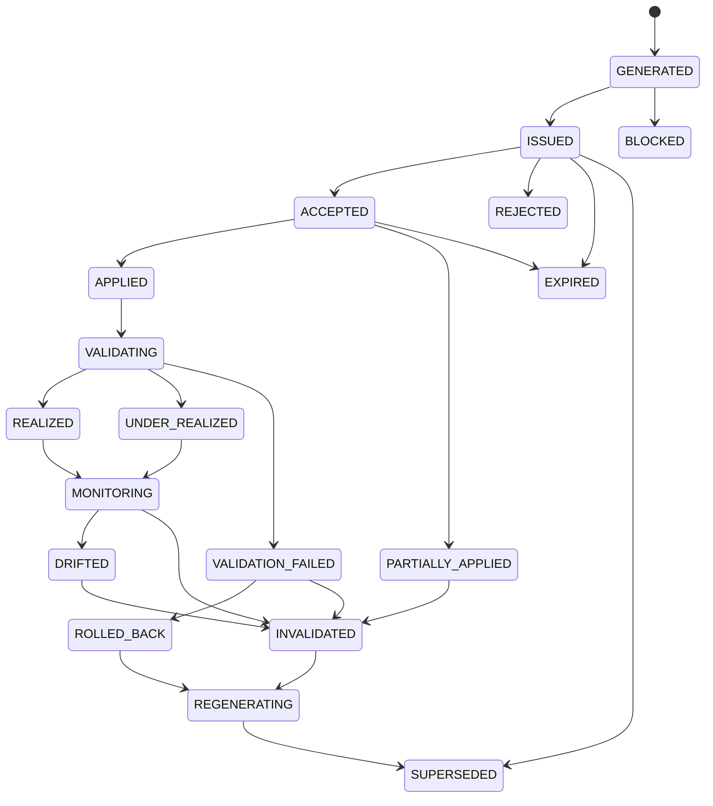
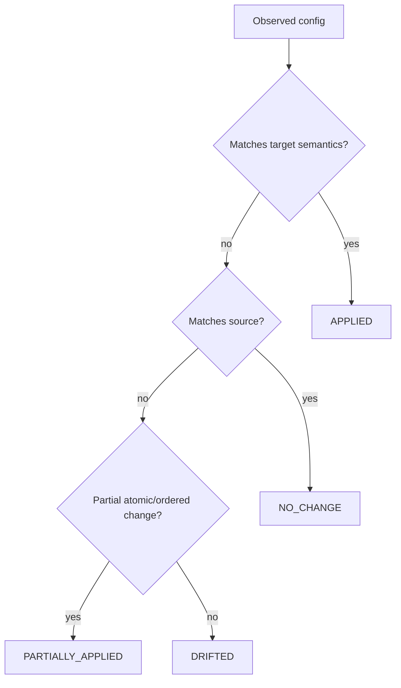
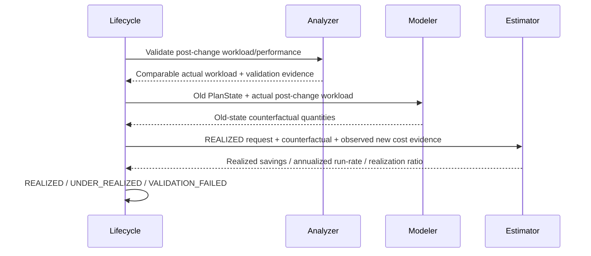
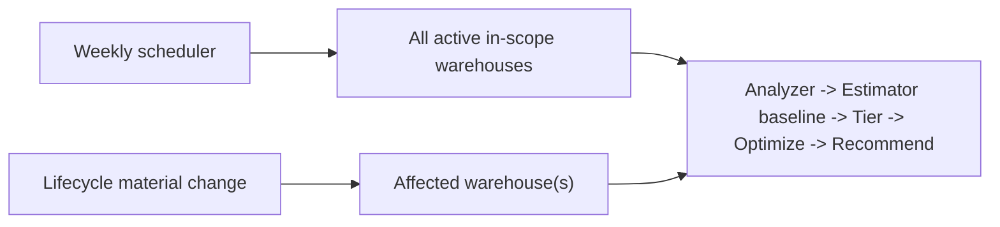

# Databricks Compute Optimization Product
## Lifecycle Manager + Lightweight Change Detection Detailed Technical Specification

**Document ID:** `TS-LIFE-001`  
**Version:** `2.0.0`
**Date:** 2026-08-14  
**Parent PRD:** `databricks_compute_optimization_product_prd_v2.0.0.md`  
**Parent HLA:** `databricks_compute_optimization_high_level_architecture_v2.0.0.md`  
**Status:** Draft for implementation review

---

# 0. v2.0.0 Architecture Reconciliation

This v2 reconciliation preserves the existing SQL Warehouse business semantics while adopting the Shared Kernel + SQL Warehouse Pack implementation boundary.

- Shared framework/engine code is implemented once under `src/databricks_compute_optimizer/kernel/`.
- SQL Warehouse-specific algorithms, sources, configuration semantics, and providers live under `src/databricks_compute_optimizer/packs/sql_warehouse/`.
- `packs/sql_warehouse/manifest.yaml` points to executable pack capabilities; it is metadata, not duplicate implementation code.
- No future compute pack is implemented by this document.

Lifecycle state machine/realization coordination are implemented once in Kernel. The SQLWH pack supplies effective-config matching and SQLWH validation providers.

AgentReviewStatus and CapabilityGap status are **not** LifecycleState. LLM review cannot directly transition lifecycle state. A validated review request affects Lifecycle/optimization only if an authoritative owner accepts new evidence/policy/model state and DecisionContext changes.

---

# 1. Purpose

The Lifecycle Manager turns a recommendation into a closed value-realization loop. It owns recommendation state, lightweight change/application detection, drift classification, validation coordination, realized-value coordination, recommendation stability, and selective authoritative reevaluation requests after context reconstruction.

There is **no separate Source/Data Plane component**. Runtime adapters provide source access; the Lifecycle Manager directly owns the lightweight comparison/change-detection capability as approved.

---

# 2. Traceability

| Requirement | Architecture | Technical section |
|---|---|---|
| `PRD-FR-LIFE-*` | `ARC-CMP-010` | all |
| `PRD-FR-PROD-029..034` | `ARC-DCTX-001` | state/change/refresh |
| `PRD-FR-PROD-030..032` | realized-value loop | Sections 12–14 |
| ADR-005 | lifecycle owns change detection | Sections 6–10 |

---

# 3. Ownership boundary

Lifecycle owns:

- recommendation lifecycle state/history;
- scheduled/current-state polling coordination;
- canonical observed config comparison;
- application matching;
- config drift classification;
- workload/regime drift request/interpretation;
- policy/financial/source-quality invalidation handling;
- validation window readiness;
- calls to Analyzer for post-change validation;
- calls to Modeler for realization counterfactual;
- calls to Estimator `REALIZED`;
- selective authoritative reevaluation requests to DecisionContext/Orchestrator after a material change is confirmed;
- weekly refresh trigger coordination;
- user feedback states/reasons;
- recommendation churn suppression/supersession coordination.

Lifecycle does not own:

- Analyzer metric derivation;
- Modeler prediction;
- Estimator formulas;
- optimizer rules;
- final decision;
- source adapter implementation.

---

# 4. Lifecycle state machine



A newly generated replacement package starts its own `GENERATED` lifecycle and references the superseded package.

---

# 5. State semantics

| State | Meaning |
|---|---|
| `GENERATED` | immutable recommendation created |
| `ISSUED` | available to user/API |
| `ACCEPTED` | user/HITL approved intent |
| `REJECTED` | user explicitly declined |
| `APPLIED` | observed state fully matches recommended target/change semantics |
| `PARTIALLY_APPLIED` | subset of atomic/ordered change observed |
| `VALIDATING` | representative post-change evidence being collected |
| `REALIZED` | performance/reliability pass and realization policy satisfied |
| `UNDER_REALIZED` | safe change but savings below expected realization threshold |
| `VALIDATION_FAILED` | performance/reliability hard guardrail failed |
| `ROLLED_BACK` | prior state restored/rollback confirmed |
| `MONITORING` | valid applied recommendation under continuing observation |
| `DRIFTED` | observed config no longer matches validated target |
| `INVALIDATED` | assumptions/evidence/policy/financial context no longer supports recommendation |
| `EXPIRED` | validity period exceeded per policy |
| `SUPERSEDED` | replaced by a newer package |
| `REGENERATING` | selective/full rerun requested |
| `BLOCKED` | recommendation cannot progress due to a hard blocker |

---

# 6. Lightweight change detection

## 6.1 Principle

Do not rely on user declaration or audit logs as sole truth. Compare observed effective configuration with package hashes/targets.

For core configuration history, use `system.compute.warehouses`; for API-only/current attributes use a fresh Warehouses API/SDK snapshot. Audit events are optional enrichment for who/when/field-change attribution.

## 6.2 `Q-LIFE-001` — latest core warehouse snapshot

```sql
WITH ranked AS (
  SELECT
      workspace_id,
      warehouse_id,
      warehouse_name,
      warehouse_type,
      warehouse_size,
      min_clusters,
      max_clusters,
      auto_stop_minutes,
      channel,
      tags,
      change_time,
      delete_time,
      ROW_NUMBER() OVER (
          PARTITION BY workspace_id, warehouse_id
          ORDER BY change_time DESC
      ) AS rn
  FROM system.compute.warehouses
  WHERE workspace_id = :workspace_id
    AND warehouse_id = :warehouse_id
    AND change_time < :observation_end_ts
)
SELECT * EXCEPT (rn)
FROM ranked
WHERE rn = 1;
```

Note: actual column names/types MUST match the current Analyzer adapter schema; Runtime schema-adaptation tests protect against additive system-table evolution. If source schema differs, the adapter maps to the canonical config rather than scattering source naming into Lifecycle.

## 6.3 API snapshot

Runtime adapter retrieves current warehouse details and normalizes:

```text
warehouse_type + enable_serverless_compute
cluster_size
min_num_clusters
max_num_clusters
auto_stop_mins
enable_photon
spot_instance_policy
statement_timeout when available/enabled
channel
```

Lifecycle does not call raw HTTP directly; it depends on `WarehouseConfigRepository.get_current()`.

---

# 7. Canonical configuration and hash

```json
{
  "warehouse_id": "WH-123",
  "warehouse_type": "SERVERLESS",
  "warehouse_size": "MEDIUM",
  "min_clusters": 1,
  "max_clusters": 5,
  "auto_stop_minutes": 5,
  "photon": true,
  "spot_policy": null,
  "statement_timeout_seconds": 0,
  "channel": "CURRENT"
}
```

Canonical hash:

```text
config_hash = SHA256(canonical_json(policy-governed_config_fields))
```

Non-semantic fields (name/creator/monitor metadata) are excluded unless policy specifically makes them recommendation dependencies.

Package includes:

```text
source_config_hash
target_config_hash
```

---

# 8. Application matching

Deterministic classification:



## 8.1 Target semantics versus exact hash

Exact target hash is preferred. For changes where platform normalizes irrelevant/default fields, the package may define `target_match_fields`; Lifecycle compares those fields plus all protected unchanged fields.

Never ignore an unexpected change to a field that could affect recommendation validity.

## 8.2 O2 partial application

O2 is atomic. Example:

```text
recommended: Medium / 1 / 5
observed:    Medium / 2 / 8
```

=> `PARTIALLY_APPLIED`, then `INVALIDATED`/selective authoritative reevaluation according to policy. Do not validate it as the recommended O2 outcome.

## 8.3 O6 application

O6 application matching can span:

- source warehouse retirement/continued state;
- target warehouse existence/configuration;
- workload routing evidence;
- permissions/network preconditions.

All required topology apply checks must pass before the O6 step is `APPLIED`.

---

# 9. Change events

Lifecycle may persist normalized internal events:

```json
{
  "event_id": "LEV-...",
  "event_type": "WAREHOUSE_CONFIG_CHANGED",
  "workspace_id": "WS-1",
  "warehouse_id": "WH-123",
  "observed_at_utc": "...",
  "source": "WAREHOUSE_CONFIG_REPOSITORY",
  "before_hash": "sha256:...",
  "after_hash": "sha256:...",
  "changed_fields": [
    {"field": "max_clusters", "from": 8, "to": 5}
  ]
}
```

Supported normalized event classes:

```text
WAREHOUSE_CONFIG_CHANGED
WAREHOUSE_CREATED
WAREHOUSE_DELETED
TARGET_APPLICATION_MATCHED
PARTIAL_APPLICATION_DETECTED
WORKLOAD_REGIME_CHANGED
POLICY_CHANGED
FINANCIAL_BASIS_CHANGED
SOURCE_QUALITY_CHANGED
VALIDATION_READY
VALIDATION_FAILED
```

These are internal product events, not a separate architecture component.

---

# 10. Drift classes

| Drift | Detection owner | Lifecycle action |
|---|---|---|
| configuration | Lifecycle config comparison | classify + selective invalidation |
| workload | A12 / Analyzer | invalidate/rerun affected analysis/optimizers |
| regime | A12 | broader reoptimization |
| policy | PolicyDiff | dependency-directed invalidation |
| financial | A01/Estimator basis change | re-estimate; rerank if material |
| source/data quality | A00 | suspend/block authority if material |

Lifecycle does not invent statistical drift thresholds; Policy/A12 define and calculate them.

---

# 11. Validation readiness

After `APPLIED`, state becomes `VALIDATING`.

Validation can run only when all required criteria are met:

```text
minimum elapsed observation period
AND minimum representative query/execution sample
AND required workload regime observed
AND post-change evidence quality passes
```

Example policy candidate:

```yaml
lifecycle:
  validation:
    minimum_days: 7
    minimum_queries: 100
    require_representative_regime: true
```

Rare/monthly workloads may require the next representative execution, not seven calendar days with no meaningful traffic.

---

# 12. Performance and reliability validation

Lifecycle requests Analyzer post-change subset rather than calculating metrics itself.

Inputs include:

- source recommendation/package;
- pre-change baseline/regime refs;
- applied timestamp;
- post-change closed window;
- target configuration.

Analyzer returns normalized before/after comparable evidence.

Primary agreed guardrail:

```text
normalized P95 runtime regression <= policy limit (default 5%)
```

Reliability cannot materially regress beyond policy.

Decision:

```text
if hard performance/reliability fails:
    VALIDATION_FAILED
else:
    proceed to realized-value evaluation
```

Cost savings can never override a performance/reliability validation failure.

---

# 13. Realized-value sequence



Modeler does not feed realized dollars directly. It supplies counterfactual quantities; Estimator prices them and compares with observed new cost.

---

# 14. Realization classification

Estimator returns:

```text
realized_savings_period
annualized_realized_savings
realization_ratio
cash_realized
economic_realized
commitment_freed
```

Lifecycle classification:

```text
performance/reliability fail -> VALIDATION_FAILED
else realization_ratio >= realized threshold -> REALIZED
else realization_ratio >= under-realized threshold -> UNDER_REALIZED
else -> UNDER_REALIZED + REOPTIMIZATION_RECOMMENDED (policy)
```

Threshold values are policy-calibrated. Under-realization is not equivalent to performance failure.

---

# 15. Selective invalidation / authoritative reevaluation matrix

| Observed change | Analyzer refresh | Optimization rerun |
|---|---|---|
| auto-stop | A02/A04/A09 | O3 |
| size/min/max | A02/A03/A05–A08 | O2 then dependent O4/O3 validation/rerun |
| Photon | A02/A05/A06/A14 | O5 → O2 → O4/O3 per matrix |
| Spot | A02/A11/A13 | O4 |
| type | A02/A05/A09–A14 as applicable | O1 → O5 → O2 → O4/N/A → O3 |
| material workload regime | A03–A12 | applicable O1–O6 |
| topology/routing | A03–A15 | O6 → downstream |
| rate-only | A01 | Estimator + Decision; optimizers only if ranking/candidate economics require |
| label-only policy | none | Recommendation Package only |
| source quality | A00 | block or affected refresh |

The exact dependency plan is created from `PolicyDiff` + `TS-OPT` invalidation matrix + Analyzer dependency catalog.

---

# 15.1 DecisionContext rule

Lifecycle may detect a change and request context reconstruction, but Orchestrator reevaluation occurs only after `ContextDiff` establishes a decision-relevant change.

```text
same authoritative_context_hash
    → no authoritative recomputation

changed authoritative_context_hash
    → dependency-directed reevaluation
```

An LLM review finding alone is never a Lifecycle invalidation trigger. A newly released applicable capability, validated source correction, resolved decision policy, or accepted statistical fallback may become one after it changes authoritative context.

---

# 16. Weekly full refresh and selective authoritative refresh

Both are required.



Weekly refresh catches gradual opportunities/seasonality/economic changes even when no explicit event crosses a selective threshold.

Selective refresh reduces time-to-correctness after material change.

---

# 17. Recommendation stability / churn suppression

Weekly recomputation must not oscillate inconsequentially.

A new package supersedes an existing valid recommendation only when one or more:

```text
old package invalid
materially better annual savings
material risk/confidence improvement
material config/workload/policy change
feature capability change
explicit lifecycle reoptimization reason
```

Example policy:

```yaml
lifecycle:
  stability:
    suppress_equivalent_recommendations: true
    minimum_material_savings_delta_pct: 5
```

If new output is materially equivalent, preserve prior issued recommendation and record refresh evidence rather than creating churn.

---

# 17.1 Agent review state separation

Lifecycle does not own:

```text
PENDING / INVESTIGATING / CHALLENGING / REVIEWED / MORE_EVIDENCE / BLOCK_REQUESTED
```

Those are `AgentReviewStatus` values. Lifecycle may expose/join them for UI/portfolio reporting but does not transition them.

---

# 18. User feedback

Supported intent/actions:

```text
ACCEPT
REJECT
DEFER
APPLY_REQUESTED
ROLLBACK_REQUESTED
```

Reason codes:

```text
NETWORK_CONSTRAINT
CHANGE_WINDOW
PERFORMANCE_CONCERN
OWNER_REJECTED
MIGRATION_EFFORT
SAVINGS_TOO_LOW
BUSINESS_DEPENDENCY
OTHER
```

Feedback is persisted as evidence. Repeated structured reasons MAY later improve deterministic eligibility/policy inputs, but Lifecycle must not autonomously rewrite policy based on feedback.

---

# 19. Lifecycle record contract

```json
{
  "contract_version": "1.0.0",
  "lifecycle_id": "RL-...",
  "recommendation_package_id": "RP-...",
  "warehouse_id": "WH-123",
  "state": "VALIDATING",
  "state_version": 5,
  "state_history": [
    {"state": "GENERATED", "at_utc": "..."},
    {"state": "ISSUED", "at_utc": "..."},
    {"state": "ACCEPTED", "at_utc": "..."},
    {"state": "APPLIED", "at_utc": "..."},
    {"state": "VALIDATING", "at_utc": "..."}
  ],
  "expected": {
    "source_config_hash": "sha256:...",
    "target_config_hash": "sha256:..."
  },
  "observed": {
    "current_config_hash": "sha256:...",
    "application_match": "FULL"
  },
  "validation": {
    "status": "IN_PROGRESS",
    "observation_days": 4,
    "sample_size": 86
  },
  "realization": {
    "status": "NOT_READY",
    "estimator_result_ref": null
  },
  "drift": {
    "detected": false,
    "type": null
  },
  "rerun": {
    "required": false,
    "request_ref": null
  }
}
```

---

# 20. Transition validation

Transitions use optimistic state version/check-and-set:

```text
UPDATE lifecycle
IF lifecycle_id = X AND state_version = expected
SET state = next, state_version = expected + 1
```

Phase-1 local repository emulates atomic compare-and-set through file locking/transactional local metadata. Phase-2 Delta repository uses appropriate concurrency semantics.

Invalid transitions are rejected; state history is append-only.

---

# 21. Idempotency

Event processing key:

```text
(event_id, lifecycle_id, handler_version)
```

A repeated poll that observes the same config hash must not create duplicate state transitions or rerun requests.

Validation and realized-estimation requests include deterministic request IDs based on package/window/source snapshot.

---

# 22. Audit enrichment

Audit events can enrich:

```text
actor
change timestamp
changed field values
API/UI source where exposed
```

But Lifecycle authority uses observed configuration because audit-system availability/preview status must not be a hard product dependency.

---

# 23. Freshness and validity

Tracked separately:

```text
freshness_age
validity_status
validity_reason_codes[]
```

Possible validity reasons:

```text
CONFIG_MATCH
CONFIG_DRIFT
WORKLOAD_REGIME_CHANGED
POLICY_INVALIDATED
FINANCIAL_BASIS_CHANGED
SOURCE_QUALITY_BLOCKED
EXPIRED_BY_POLICY
```

---

# 24. Portfolio value funnel

Lifecycle aggregates recommendation states without changing per-warehouse economics:

```text
Identified -> Issued -> Accepted -> Applied -> Validated -> Realized
```

Portfolio metrics derive from immutable recommendation/realization estimates and MUST avoid double counting superseded/overlapping packages.

For O6, warehouse membership overlaps are reconciled by topology evaluation/package IDs so the same savings are not attributed separately to each source warehouse.

---

# 25. Policy consumed

```yaml
lifecycle:
  refresh:
    full_cadence: weekly
    selective_enabled: true

  validation:
    minimum_days: 7
    minimum_queries: 100
    require_representative_regime: true
    max_p95_runtime_regression_pct: 5

  realization:
    counterfactual_normalization: true
    realized_min_ratio: 0.80
    under_realized_min_ratio: 0.50

  drift:
    workload_material_change_pct: 20
    financial_material_change_pct: 10

  stability:
    suppress_equivalent_recommendations: true
    minimum_material_savings_delta_pct: 5

  expiration:
    maximum_age_days: 14
```

Except the already agreed runtime guardrail default, numerical examples require calibration before production approval.

---

# 26. Service interfaces

```python
class LifecycleManager(Protocol):
    def ingest_package(self, package: RecommendationPackage) -> RecommendationLifecycle: ...
    def poll_and_detect(self, lifecycle_id: str) -> Sequence[LifecycleEvent]: ...
    def handle_event(self, event: LifecycleEvent) -> RecommendationLifecycle: ...
    def validate_if_ready(self, lifecycle_id: str) -> RecommendationLifecycle: ...
    def request_reevaluation_if_needed(self, lifecycle_id: str) -> ReevaluationRequest | None: ...
```

Dependencies:

```text
WarehouseConfigRepository
AnalyzerService
Modeler
Estimator
OrchestrationFacade
PolicyService/PolicySnapshotRepository
LifecycleRepository
RecommendationRepository
Clock (injectable for tests)
```

---

# 27. Error semantics

| Code | Behavior |
|---|---|
| `LIFECYCLE_INVALID_TRANSITION` | reject, preserve state |
| `LIFECYCLE_STALE_STATE_VERSION` | retry/read current |
| `LIFECYCLE_CONFIG_READ_FAILED` | transient retry; validity unknown after threshold |
| `LIFECYCLE_PARTIAL_APPLICATION` | invalidate atomic recommendation |
| `LIFECYCLE_VALIDATION_INSUFFICIENT_SAMPLE` | remain VALIDATING |
| `LIFECYCLE_VALIDATION_FAILED` | state VALIDATION_FAILED |
| `LIFECYCLE_COUNTERFACTUAL_BLOCKED` | cannot claim realized value; keep validation outcome separately |
| `LIFECYCLE_DUPLICATE_EVENT` | idempotent no-op |
| `LIFECYCLE_SUPERSESSION_CONFLICT` | preserve authoritative lineage, retry transaction |

---

# 28. Observability

```text
lifecycle_records_total{state}
lifecycle_transitions_total{from,to}
lifecycle_invalid_transitions_total
lifecycle_config_polls_total{status}
lifecycle_change_events_total{event_type}
lifecycle_drift_total{type}
lifecycle_validation_duration_days
lifecycle_validation_failures_total{reason}
lifecycle_realization_ratio
lifecycle_realized_savings_usd{basis}
lifecycle_selective_reruns_total{reason}
lifecycle_churn_suppressed_total
```

---

# 29. Tests

Unit:

1. exact state-transition table;
2. same config hash no-op;
3. source→target full match = APPLIED;
4. O2 partial bundle = PARTIALLY_APPLIED;
5. unrelated material config = DRIFTED;
6. monthly workload remains VALIDATING without representative execution;
7. P95 runtime > limit = VALIDATION_FAILED regardless of savings;
8. realized vs under-realized threshold;
9. duplicate event idempotency;
10. optimistic state-version conflict;
11. churn suppression;
12. policy label-only change does not rerun optimizer;
13. rate change requests re-estimation;
14. O6 topology apply matching.

Integration:

| ID | Assertion |
|---|---|
| `IT-LIFE-001` | Recommendation target is detected from observed config without user confirmation |
| `IT-LIFE-002` | validation invokes Analyzer then M08 then Estimator REALIZED |
| `IT-LIFE-003` | max-cluster drift creates dependency-directed rerun |
| `IT-LIFE-004` | weekly equivalent recommendation is suppressed |
| `IT-LIFE-005` | rollback creates ROLLED_BACK -> REGENERATING path |
| `IT-LIFE-006` | O6 realization avoids multiwarehouse double counting |

---

# 30. Phase-1 implementation

- Lightweight polling scheduled by Python runner/cron/job invocation.
- Current core config can be fetched through bounded SQL + API adapter.
- Local lifecycle repository persists append-only history + current version.
- Analyzer validation uses the same SQL warehouse/pandas path as weekly analysis.
- No Kafka/event bus required for Phase-1 proof of value.

---

# 31. Phase-2 implementation

Lifecycle state and events move to Unity Catalog Delta tables. Lakeflow Jobs schedules full/selected refresh tasks. Business transition semantics remain identical.

---

# 32. Phase-2 ML / Phase-4 diagnostic interaction

ML Modeler can improve realization counterfactual only after admission gates. Phase-4 SQLWH diagnostic evidence can enrich validation. Statistical/system-table path remains fallback and historical parity baseline.

---

# 33. Component release plan

| Release | Phase | Scope | Exit criteria |
|---|---:|---|---|
| `REL-LIFE-0.1.0` | 1 | state machine, package ingest, config polling/hash/application detection | transition/config fixtures pass |
| `REL-LIFE-0.2.0` | 1 | validation readiness + Analyzer post-change validation | runtime/reliability validation integration passes |
| `REL-LIFE-0.3.0` | 1 | M08 + Estimator REALIZED loop; realization states | normalized realized-value fixtures pass |
| `REL-LIFE-0.4.0` | 1 | drift classes, PolicyDiff/financial/source invalidation + ContextDiff reevaluation request | dependency/context fixtures pass |
| `REL-LIFE-0.5.0` | 1 | weekly refresh, churn suppression, user feedback, portfolio lifecycle | portfolio lifecycle tests pass |
| `REL-LIFE-1.0.0` | 1 | Phase-1 contract freeze/hardening | full recommendation→realization golden scenarios pass |
| `REL-LIFE-2.0.0` | 2 | Delta repository/Lakeflow scheduling + admitted ML compatibility | Phase-2 parity/integration pass |
| `REL-LIFE-3.0.0` | 3 | AgentReviewStatus join/visibility; no LLM lifecycle transitions | review-state separation tests pass |
| `REL-LIFE-4.0.0` | 4 | SQLWH diagnostic change/validation compatibility | diagnostic lifecycle no-regression tests pass |
| `REL-LIFE-5.0.0` | 5 | O6 topology application/validation/rollback lifecycle extension | topology lifecycle golden tests pass |

---

# 34. Definition of Done

- change detection is inside Lifecycle Manager;
- observed state is authority for application detection;
- audit logs remain optional enrichment;
- partial atomic application is not falsely validated;
- performance/reliability gates dominate realization classification;
- realized dollars come only from Estimator;
- selective authoritative reevaluation is context-change and dependency-directed;
- weekly refresh and churn suppression coexist;
- lifecycle history is append-only/idempotent/auditable.
