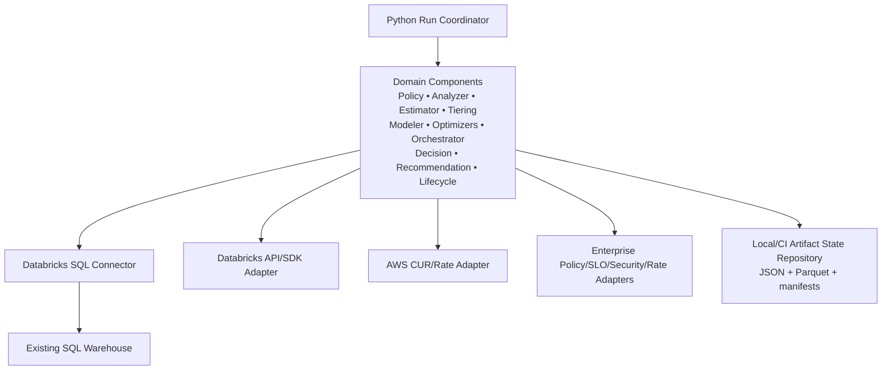
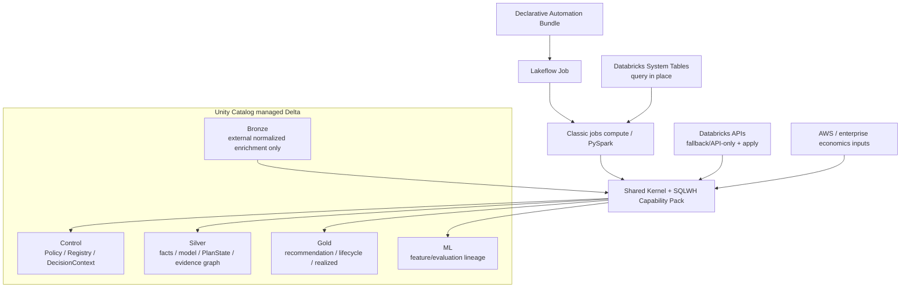

# Databricks Compute Optimization Product
## Shared Kernel + SQL Warehouse Capability Pack Runtime, Adapters, Persistence, Repository and Deployment Technical Specification

**Document ID:** `TS-RUNTIME-001`  
**Version:** `2.0.1`
**Date:** 2026-08-14  
**Parent PRD:** `databricks_compute_optimization_product_prd_v2.0.0.md`  
**Parent HLA:** `databricks_compute_optimization_high_level_architecture_v2.0.0.md`  
**Status:** Draft for implementation review

---

# 0. v2.0.1 Implementation Hardening

This runtime implements **one Shared Kernel plus one SQL Warehouse Capability Pack**. It MUST NOT implement parallel copies of the same product service.

```text
Kernel
  = reusable engines/contracts implemented once

SQL Warehouse Pack
  = SQLWH-specific adapters/analyzers/modeler/optimizers/providers
```

Normative rules:

- `src/databricks_compute_optimizer/kernel/` owns reusable Registry, DecisionContext, Policy mechanics, Orchestrator, Decision, Lifecycle mechanics, Intelligence Review runtime, and common contracts/frameworks.
- `src/databricks_compute_optimizer/packs/sql_warehouse/` owns SQLWH-specific A00–A16/O1–O7 implementations, SQL/API/AWS adapters, statistical/ML implementations, service profiles/providers, and Phase-4 diagnostics.
- `packs/sql_warehouse/manifest.yaml` is the **sole released SQLWH executable capability manifest**. It points to pack implementations; it is metadata, not duplicate code.
- One `(capability_id, semantic_version)` resolves to exactly one executable implementation.
- Kernel business modules MUST NOT statically import concrete SQLWH classes; the composition root resolves the active pack from the released manifest/Capability Registry.
- Future compute packs are not created or implemented by this specification.

`CapabilityRegistrySnapshot` is a **product capability inventory snapshot** from `TS-CAP-001`. Runtime platform-feature detection uses a differently named `PlatformCapabilitySnapshot`; these concepts MUST NOT be conflated.

---

# 1. Purpose

This specification defines the implementation/runtime shell around the logical business components. It covers source adapters, SQL execution, typed normalization, persistence, dependency composition, CLI/runtime entry points, security, observability, CI/CD, and the Phase-1 → Phase-2 execution-backend transition.

It is deliberately infrastructure-focused. Business rules remain in their owning `TS-*` components.

---

# 2. Traceability

| Requirement | Architecture | Runtime section |
|---|---|---|
| Phase-1 fast value | `ARC-RUN-001`, ADR-001 | Sections 4–11 |
| repository layout | `ARC-REPO-003`, `ARC-REPO-004` | Section 5 |
| source/persistence boundaries | `ARC-SRC-001`, `ARC-DATA-003` | Sections 6–10 |
| CI/CD | `ARC-RUN-002` | Section 20 |
| Phase 2 PySpark/Delta | `ARC-RUN-002` | Sections 21–25 |
| Phase-2 ML | `ARC-RUN-002` | Sections 21–26 |
| Phase-3 Intelligence Review | `ADR-011`, `TS-LLM-001` | Section 26 |
| Phase-4 Deep Diagnostic Intelligence | `ADR-012`, `TS-DIAG-001` | Section 26 |
| product NFRs | `PRD-NFR-PROD-*` | Sections 14–20 |

---

# 3. Runtime principles

1. **Phase 1 proves value before platform complexity.**
2. Source filtering/aggregation is pushed into SQL; pandas receives bounded results.
3. No persisted intermediary Delta layer is required in Phase 1.
4. Domain components depend on interfaces/typed contracts, not Databricks/AWS clients.
5. Phase 2 is a backend/runtime scale-out, not a business-logic redesign.
6. Phase 2 starts only after all Phase-1 component releases and E2E golden gates pass.
7. The Databricks SQL Connector Phase-1 path connects to SQL warehouse-compatible compute; it is not the jobs-compute runtime for Phase 2. Phase 2 executes native PySpark inside Lakeflow Jobs classic jobs compute.
8. Phase-2 ML, Phase-3 Intelligence Review, and Phase-4 Deep Diagnostic Intelligence are later capabilities behind existing contracts.
9. Phase-3 agents have zero callable tools; model access is outbound through the approved model-client route only.
10. SQL Warehouse Phase 4 uses approved SQLWH diagnostics; Spark-event telemetry is not assumed.

---

# 4. Phase-1 deployment topology



Phase-1 target may run on a developer/controlled execution host, CI runner, or lightweight scheduled runtime with network/auth access to the SQL warehouse and supported APIs.

---

# 5. Repository layout

This tree is normative. It intentionally prevents Kernel/Pack duplication.

```text
databricks-compute-optimizer/
├── README.md
├── CLAUDE.md
├── pyproject.toml
├── databricks.yml
│
├── config/
│   ├── policy/
│   └── environments/
│
├── src/databricks_compute_optimizer/
│   ├── kernel/
│   │   ├── contracts/
│   │   ├── capability_registry/
│   │   ├── decision_context/
│   │   ├── policy/
│   │   ├── analyzer_framework/
│   │   ├── financial/
│   │   ├── tiering/
│   │   ├── modeler_framework/
│   │   ├── optimizer_framework/
│   │   ├── orchestrator/
│   │   ├── decision/
│   │   ├── recommendation/
│   │   ├── lifecycle/
│   │   ├── intelligence_review/
│   │   └── evaluation/
│   │
│   ├── packs/
│   │   └── sql_warehouse/
│   │       ├── manifest.yaml
│   │       ├── contracts/
│   │       ├── adapters/
│   │       │   ├── databricks_sql/
│   │       │   ├── databricks_warehouse_api/
│   │       │   ├── query_history_api/
│   │       │   ├── aws_cur/
│   │       │   ├── aws_price_registry/
│   │       │   ├── commercial_rates/
│   │       │   ├── security/
│   │       │   └── slo/
│   │       ├── analyzers/
│   │       ├── modeler/
│   │       │   ├── statistical/
│   │       │   └── ml/                 # Phase 2
│   │       ├── optimizers/
│   │       ├── financial/
│   │       ├── policy/
│   │       ├── recommendation/
│   │       ├── lifecycle/
│   │       ├── diagnostics/            # Phase 4
│   │       └── intelligence_review/    # evidence/profile only, no duplicate agents
│   │
│   ├── repositories/
│   │   ├── interfaces.py
│   │   ├── local/
│   │   └── delta/
│   └── runtime/
│       ├── composition.py
│       ├── run_context.py
│       ├── platform_capabilities.py
│       ├── scheduler.py
│       └── cli.py
│
├── contracts/
│   ├── capability/
│   ├── decision_context/
│   └── intelligence_review/
│
├── sql/sql_warehouse/
├── tests/
│   ├── architecture/
│   ├── unit/
│   ├── component/
│   ├── contract/
│   ├── integration/
│   ├── golden/
│   ├── adversarial/
│   └── parity/
│
└── deploy/databricks/
    ├── databricks.yml
    └── resources/
```

Required architecture tests fail the build for Kernel → concrete-pack imports, pack → pack imports, duplicate capability implementations, unresolved manifest symbols, or SQLWH A/O implementations outside the SQLWH pack.

---

# 6. Adapter interfaces

## 6.1 Databricks SQL query adapter

```python
class SqlQueryExecutor(Protocol):
    def query_arrow(self, query: BoundSqlQuery) -> "pa.Table": ...
    def query_pandas(self, query: BoundSqlQuery) -> "pd.DataFrame": ...
```

Responsibilities:

- authenticate using approved Databricks mechanism;
- execute only parameterized/bound query templates;
- enforce statement timeout/retry policy for analysis queries;
- fetch Arrow where supported;
- record query ID/duration/row count;
- reject unbounded templates in production mode;
- map transient/permanent errors into `SOURCE_*` taxonomy.

The Databricks SQL Connector for Python is the Phase-1 reference client.

## 6.2 Warehouse API adapter

```python
class WarehouseApi(Protocol):
    def get(self, warehouse_id: str) -> WarehouseApiSnapshot: ...
    def edit(self, warehouse_id: str, delta: WarehouseConfigDelta) -> None: ...
    def create(self, request: WarehouseCreateRequest) -> WarehouseCreateResult: ...
```

Writes are disabled unless HITL/application mode explicitly authorizes them.

**System-table-first read rule:** analytical/historical reads of warehouse type/size/min/max/auto-stop/tags/change history come from `system.compute.warehouses`. `WarehouseApi.get()` is used only for API-only fields or just-in-time pre-apply verification that cannot be satisfied from the system-table snapshot. Runtime MUST NOT create a redundant API dependency for fields already resolved by the approved system-table source contract.

Apply service MUST revalidate API-only capabilities/current state immediately before write.

## 6.3 AWS CUR adapter

```python
class AwsCostEvidenceRepository(Protocol):
    def get_warehouse_cost_lines(
        self, warehouse_id: str, start_utc, end_utc
    ) -> Sequence[AwsCostLine]: ...
```

The adapter translates chosen CUR 2.0/Data Exports schema into normalized `AwsCostLine`; Estimator never reads raw CUR column names directly.

## 6.3.1 AWS source-controlled price registry adapter

When CUR/Data Exports are unavailable, Phase 1/2 may use a reviewed source-controlled AWS price registry for **planning estimates** if Policy permits.

```python
class AwsPriceRegistryRepository(Protocol):
    def effective_prices(
        self,
        *,
        region: str,
        resource_keys: Sequence[AwsResourcePriceKey],
        start_utc,
        end_utc
    ) -> Sequence[AwsPricePeriod]: ...
```

Repository source:

```text
config/pricing/aws_ec2_price_registry.yaml
```

Runtime requirements:

- validate the registry against its JSON Schema before use;
- require effective-dated, non-overlapping lookup rows;
- persist registry version, Git SHA and SHA-256 digest in source/financial evidence;
- fail closed on ambiguous/missing material price keys unless Policy permits DBX-only output;
- expose `PRICE_REGISTRY_ESTIMATE`, never `CUR_ACTUAL`;
- never mark AWS realized/cash/commitment actual from registry-derived pricing.

The registry is a runtime lookup, not a second Estimator. The Estimator remains the owner of money/formulas.

A maintenance process may update On-Demand entries using official AWS Price List data and Spot estimate inputs using approved Spot price-history evidence. Those public pricing APIs are refresh-time tooling, not a mandatory optimization-runtime dependency.

## 6.4 Commercial rate adapter

```python
class CommercialRateRepository(Protocol):
    def effective_rates(self, sku_names, start_utc, end_utc) -> Sequence[RatePeriod]: ...
```

Contract/invoice rate data is commercially sensitive and receives restricted logging/storage controls.

## 6.5 Enterprise adapters

```text
SecurityEligibilityRepository
WorkloadSloRepository
WorkloadCriticalityRepository
```

If enterprise sources do not yet exist, Phase-1 supports versioned configuration files/manual authoritative input with explicit provenance; unknown material eligibility/SLO information becomes a blocker rather than an assumption.

---

# 7. Bounded SQL requirements

Every system-table query MUST include the narrowest available predicates:

```text
workspace_id where applicable
warehouse_id
closed time window
relevant compute type/status/SKU filters
selected columns only
```

System-table schemas can evolve additively. Adapter parsing MUST:

- select explicit known columns rather than `SELECT *` in production queries;
- tolerate unknown additive columns;
- fail clearly when a required column is removed/type-incompatible;
- version canonical normalization schema.

---

# 8. SQL query registry

```python
@dataclass(frozen=True)
class SqlTemplate:
    query_id: str
    version: str
    sql: str
    required_parameters: tuple[str, ...]
    expected_schema: SchemaContract
    max_expected_rows: int | None
```

Example registry keys:

```text
Q-ANA-001 ... Q-ANA-013
Q-EST-001 ... Q-EST-002
Q-LIFE-001
```

Every result lineage persists query ID/version and bound time-window/warehouse identifiers, not necessarily full SQL text.

---

# 9. Phase-1 pandas/Arrow boundary

## 9.1 Rule

```text
Databricks SQL: filter + aggregate + bounded event/query extraction
Arrow: transport
pandas: component-level derived calculations/replay/modeling
```

Do not download an account-year of raw query history and then filter locally.

## 9.2 Memory guard

Runtime policy:

```yaml
runtime:
  pandas:
    max_rows_per_query: 2000000
    max_arrow_bytes: 1073741824
    fail_on_limit: true
```

Numbers are environment-calibrated examples. Exceeding guard either invokes a more aggregated query/batched execution or blocks the run; it does not silently swap to an unapproved execution mode.

## 9.3 Batched query history

For high-volume warehouses, split a closed analysis window into deterministic UTC intervals:

```text
[day/hour window 1)
[day/hour window 2)
...
```

then concatenate in canonical order with duplicate statement-ID detection.

---

# 10. Persistence interfaces

Domain components do not depend on filesystem/Delta directly.

```python
class ArtifactRepository(Protocol):
    def put(self, artifact: ContractArtifact) -> ArtifactRef: ...
    def get(self, ref: ArtifactRef) -> ContractArtifact: ...
    def exists(self, ref: ArtifactRef) -> bool: ...
```

Specialized repositories:

```text
PolicySnapshotRepository
AnalyzerResultRepository
ModelerResultRepository
PlanStateRepository
OptimizerResultRepository
CostEstimateRepository
DecisionResultRepository
RecommendationRepository
LifecycleRepository
```

---

# 11. Phase-1 local state repository

Recommended working-state layout:

```text
.state/
└── runs/
    └── RUN-20260812-001/
        ├── manifest.json
        ├── policy/
        │   └── PSNAP-....json
        ├── warehouses/
        │   └── WH-123/
        │       ├── analyzer/
        │       ├── modeler/
        │       ├── estimator/
        │       ├── optimizers/
        │       ├── plan_states/
        │       ├── decision/
        │       ├── recommendation/
        │       └── lifecycle/
        └── logs/
```

Storage format:

- JSON for contracts/metadata;
- Parquet for bounded frames/evidence samples when needed;
- checksummed manifest;
- atomic write via temp file + fsync/rename where filesystem semantics permit.

Do not commit runtime state/secrets to source control.

---

# 12. `RunContext`

```json
{
  "run_id": "RUN-...",
  "run_type": "WEEKLY_FULL|SELECTIVE|ADHOC|VALIDATION",
  "started_at_utc": "...",
  "analysis_end_utc": "...",
  "workspace_id": "WS-...",
  "warehouse_ids": ["WH-123"],
  "policy_snapshot_id": "PSNAP-...",
  "component_versions": {},
  "platform_capability_snapshot_id": "PLATCAP-...",
  "capability_registry_snapshot_id": "CRS-...",
  "decision_context_contract_version": "1.0.0"
}
```

`analysis_end_utc` is frozen at run start; all temporal queries use it to avoid moving-window non-determinism.

---

# 13. Product Capability Registry vs Platform Capability Detection

These are distinct concepts.

## 13.1 `CapabilityRegistrySnapshot` — product capability authority

Defined by `TS-CAP-001`. It pins the released executable product capabilities for the run, including SQLWH Analyzer/Optimizer/Modeler/evidence capability IDs, versions, applicability metadata, dependencies, and release digests.

Runtime loads `packs/sql_warehouse/manifest.yaml`, verifies it against the release artifact and operational Registry, and creates/pins one immutable `CapabilityRegistrySnapshot`. Only released capabilities in that snapshot may execute.

## 13.2 `PlatformCapabilitySnapshot` — environment feature support

Databricks/AWS platform features evolve and are detected separately:

```json
{
  "platform_capability_snapshot_id": "PLATCAP-...",
  "databricks_platform": "AWS",
  "validated_at_utc": "...",
  "warehouse": {
    "types": ["CLASSIC", "PRO", "SERVERLESS"],
    "sizes": ["2X_SMALL", "X_SMALL", "SMALL", "MEDIUM", "LARGE", "X_LARGE", "2X_LARGE", "3X_LARGE", "4X_LARGE", "5X_LARGE"],
    "statement_timeout_warehouse": {"available": true, "maturity": "BETA"}
  }
}
```

This snapshot is produced from versioned adapters/documented API/schema integration tests. It informs Analyzer/Policy capability checks but cannot create executable product code. Preview/Beta enablement still requires Policy.

**Do not name the platform snapshot `CapabilitySnapshot` or `CapabilityRegistrySnapshot`; that would conflate platform support with product executable capability authority.**

---

# 14. Authentication and secrets

Requirements:

- use Databricks OAuth/service principal or approved workload identity where available; avoid long-lived personal access tokens for production;
- AWS access uses approved IAM role/identity and least privilege;
- commercial rate source credentials separated from general analytics access;
- secrets loaded from environment/secret manager, never policy YAML/repo;
- redact tokens/authorization headers in logs;
- API write permissions separated from read-analysis permissions where feasible.

Phase-1 proof can operate read-only until HITL application integration is explicitly enabled.

---

# 15. Data minimization/privacy

- query text is not required for core Phase-1 optimization; avoid persisting it unless a specific analyzer needs approved fingerprint extraction;
- derive stable query fingerprints/tags where possible and discard raw text from artifacts;
- only persist user identity fields when necessary for ownership/routing and policy permits;
- commercial rates are restricted;
- lifecycle/user feedback may contain business metadata and follows enterprise retention policy.

---

# 16. Error/retry policy

## 16.1 Transient source errors

Retry:

```text
SQL warehouse transient connectivity/throttle
API 429/5xx
AWS query transient error
```

Use bounded exponential backoff + jitter; record attempts. Random jitter does not affect semantic outputs.

## 16.2 Permanent/material source errors

Examples:

```text
permission denied
missing system table
required schema field incompatible
warehouse not found/deleted
commercial rate unavailable when authoritative required
```

Map to structured `SOURCE_*`/`DATA_*` blocker. Continue other warehouses when isolation policy permits.

## 16.3 No silent degradation

Fallbacks (Databricks list price, AWS `PRICE_REGISTRY_ESTIMATE`, statistical Modeler, DBX-only cost) are only used when Policy explicitly permits and MUST be visible in result quality/warnings. Registry-estimated AWS cost is never labeled actual/realized.

---

# 17. CLI/runtime entry points

Recommended Phase-1 commands:

```text
sqlwhopt validate-config
sqlwhopt analyze --workspace-id <id> --warehouse-id <id>
sqlwhopt analyze --workspace-id <id> --all-warehouses
sqlwhopt optimize --warehouse-id <id>
sqlwhopt optimize --all-warehouses
sqlwhopt refresh --weekly
sqlwhopt refresh --warehouse-id <id> --reason <reason>
sqlwhopt validate-recommendation --recommendation-package-id <id>
sqlwhopt lifecycle poll --warehouse-id <id>
sqlwhopt show-recommendation --warehouse-id <id>
```

Writes:

```text
sqlwhopt apply --recommendation-package-id <id> --step <n>
```

MUST require explicit application feature enablement/HITL authorization and precondition hash check.

---

# 18. Dependency composition

The central composition root is the only place permitted to resolve concrete pack implementations.

```python
def build_application(settings: RuntimeSettings) -> Application:
    manifest = load_and_verify_pack_manifest(
        "packs/sql_warehouse/manifest.yaml"
    )
    capability_registry = CapabilityRegistry.from_manifest_and_store(manifest, ...)
    registry_snapshot = capability_registry.create_snapshot(...)

    platform_caps = PlatformCapabilityDetector(...).snapshot()
    repositories = build_repositories(settings)
    policy = PolicyEngine(...)
    context_builder = DecisionContextBuilder(...)

    pack = SqlWarehousePackProvider(manifest=manifest, platform_caps=platform_caps, ...)
    analyzers = resolve_capabilities(registry_snapshot, type="ANALYZER", provider=pack)
    optimizers = resolve_capabilities(registry_snapshot, type="OPTIMIZER", provider=pack)
    modeler = ModelerService(framework=..., implementations=pack.modeler_implementations())
    estimator = EstimatorService(provider=pack.financial_provider())

    orchestrator = Orchestrator(optimizers=optimizers, ...)
    decision = DecisionEngine(profile=pack.decision_profile(), ...)
    recommendation = RecommendationAssembler(provider=pack.recommendation_provider(), ...)
    lifecycle = LifecycleManager(provider=pack.lifecycle_provider(), ...)

    return Application(...)
```

Kernel business modules do not import concrete SQLWH implementation classes. Pack modules do not instantiate infrastructure clients directly unless they are source-adapter implementations explicitly wired by the composition root.

---

# 19. Observability

## 19.1 Required common log context

```text
run_id
run_type
workspace_id
warehouse_id
topology_evaluation_id (O6 only)
policy_snapshot_id/hash
capability_registry_snapshot_id
decision_context_id/authoritative_context_hash
agent_review_id/status (Phase 3 when applicable)
component_id/version
source_snapshot/analysis_end
artifact/result ID
```

## 19.2 Runtime metrics

```text
runtime_runs_total{run_type,status}
runtime_run_duration_seconds{run_type}
runtime_warehouse_duration_seconds
sql_queries_total{query_id,status}
sql_query_duration_seconds{query_id}
sql_rows_returned{query_id}
sql_arrow_bytes{query_id}
api_calls_total{operation,status}
source_retry_total{source,reason}
artifact_writes_total{type,status}
contract_validation_failures_total{contract}
```

## 19.3 Tracing

Optional OpenTelemetry-style tracing is recommended. Trace IDs cannot become deterministic result inputs.

---

# 20. CI/CD and quality gates

## 20.1 Pull-request gates

```text
format/lint
static typing
unit tests
contract/schema tests
SQL-template tests
component tests
determinism tests
security/dependency scan
Mermaid/document lint (docs changes)
architecture import-boundary tests
capability manifest uniqueness/symbol resolution tests
DecisionContext canonicalization/hash tests
```

## 20.2 Integration environment gates

Against a non-production workspace/serverless SQL warehouse suitable for test queries:

- system table read query compatibility;
- warehouse API read normalization;
- no-write default;
- fixture vs live schema contract;
- bounded query execution.

## 20.3 Release gate

A component release is not “done” until its `REL-*` exit criteria and mapped golden/component tests pass.

---

# 21. Phase 2 entry gate

**Do not start Phase 2 implementation as runtime authority until:**

1. all Phase-1 in-scope logical components have reached their approved Phase-1 release;
2. standalone and portfolio E2E golden scenarios pass;
3. lifecycle/realized-value loop works E2E;
4. financial invariants pass;
5. contracts are version-frozen for scale-out;
6. reference pandas outputs exist for parity;
7. current Databricks compute/deployment options are revalidated before implementation.

---

# 22. Phase 2 deployment topology and DAB contract

Phase 2 is a source-controlled **Declarative Automation Bundle** deployment using Lakeflow Jobs, classic jobs compute/PySpark for the planned runtime, and Unity Catalog managed Delta product state.



System tables are not copied wholesale. APIs are used only when system tables cannot resolve a required field/operation or for authorized apply-time semantics.

The persistence model is a medallion design with companion governance/ML schemas:

```text
Control = Policy / Capability Registry / DecisionContext / source manifests
Bronze  = external/raw-normalized evidence (AWS CUR or price-registry snapshot, commercial rates)
Silver  = canonical config/evidence/analyzer/modeler/optimizer/PlanState/financial results
Gold    = recommendation/lifecycle/realized/portfolio value
ML      = feature/model/evaluation lineage
```

Databricks system tables remain query-in-place sources rather than default Bronze copies.

## 22.1 Normative bundle layout

```text
databricks.yml
resources/
├── jobs.yml
├── permissions.yml
└── schemas.yml                 # optional when schema creation is centrally governed
sql/migrations/
├── V002_000__phase2_core.sql
├── V002_100__phase2_ml.sql
├── V003_000__phase3_review.sql
├── V004_000__phase4_diagnostics.sql
└── V005_000__phase5_topology.sql
```

The bundle validates/deploys job/resources; versioned idempotent migration tasks create/evolve product-owned tables. If enterprise governance owns catalog/schema creation, the bundle validates prerequisites rather than creating them.

## 22.2 Phase-2 Lakeflow task DAG

```text
validate_platform_and_sources
        ↓
migrate_phase2_schema
        ↓
build_capability_registry_snapshot
        ↓
build_source_snapshot
        ↓
analyze
        ↓
baseline_estimate_and_tier
        ↓
model_and_optimize
        ↓
decision_and_recommendation
        ↓
lifecycle_refresh
        ↓
portfolio_snapshot
```

`migrate_phase2_schema` is a hard dependency for every Phase-2 task that reads/writes product Delta state.

---

# 23. Phase 2 Delta data design

`TS-DATA-001` is the canonical physical DDL. Runtime MUST use its exact schema/table names and MUST NOT invent parallel feature/result tables.

### Phase-2 core Bronze

- `sqlwhopt_bronze.aws_cost_line` when CUR/Data Exports are available;
- `sqlwhopt_bronze.aws_price_registry_snapshot` when the source-controlled registry fallback is active;
- `sqlwhopt_bronze.commercial_rate_snapshot` for approved enterprise/commercial rate snapshots.

System tables are not replicated into Bronze by default.

### Phase-2 core Control

- `sqlwhopt_control.policy_snapshot`
- `sqlwhopt_control.policy_diff`
- `sqlwhopt_control.source_snapshot_manifest`
- `sqlwhopt_control.registered_capability`
- `sqlwhopt_control.capability_dependency`
- `sqlwhopt_control.capability_registry_snapshot`
- `sqlwhopt_control.decision_context`
- `sqlwhopt_control.decision_context_dimension`
- `sqlwhopt_control.context_diff`

### Phase-2 core Silver

- `sqlwhopt_silver.warehouse_config_snapshot`
- `sqlwhopt_silver.analyzer_result`
- `sqlwhopt_silver.analyzer_metric`
- `sqlwhopt_silver.cost_evidence`
- `sqlwhopt_silver.tier_result`
- `sqlwhopt_silver.modeler_result`
- `sqlwhopt_silver.modeler_projection`
- `sqlwhopt_silver.plan_state`
- `sqlwhopt_silver.optimizer_result`
- `sqlwhopt_silver.cost_estimate`
- `sqlwhopt_silver.decision_result`
- `sqlwhopt_silver.evidence_node`
- `sqlwhopt_silver.evidence_edge`

### Phase-2 core Gold

Use the exact recommendation, portfolio, lifecycle/validation, and realized-value tables defined in `TS-DATA-001`.

### Phase-2 ML

Use the exact feature/evaluation/model-lineage tables from `TS-DATA-001`; do not create generic `warehouse_feature_daily` / `warehouse_feature_bucket` tables unless a later approved TSD adds them.

### Later phases

- Phase 3: CapabilityGap + Agent Review/Narrative/Evaluation extensions.
- Phase 4: generic SQLWH diagnostic evidence envelope/features.
- Phase 5: topology evaluation extension.

Repository interfaces keep pandas/PySpark-specific transforms out of domain contracts.


---

# 24. Backend-neutral repository strategy

```text
Query/Feature Repository interfaces
        ↓
Phase 1: SQL + Arrow/pandas + local artifacts
Phase 2: SQL/PySpark + Delta repositories
```

Do not attempt to create a universal DataFrame abstraction across pandas/PySpark. Keep business components on typed contracts and isolate dataframe-specific transformations inside Analyzer/Modeler backend implementations.

---

# 25. pandas ↔ PySpark parity gate

Required parity fixtures:

- A00–A16 canonical outputs/signals/blockers;
- exact/P50/P95/P99 semantics used for authority;
- corrected billing quantities;
- Modeler statistical outputs where parity required;
- O1–O7 winners;
- PlanState hashes after canonical contract serialization;
- Estimator decimals/savings invariants;
- Decision winner/alternatives;
- Recommendation package;
- lifecycle transitions/realized-value fixture.

If Spark uses approximate percentile functions, those cannot silently replace exact Phase-1 golden semantics for authoritative fields. Either use exact deterministic implementation or version/reapprove semantics.

---

# 26. Phase-2 ML, Phase-3 Intelligence Review, and Phase-4 Diagnostics

## 26.1 Phase 2 — governed ML

ML implementations remain behind the Kernel Modeler framework and are registered as SQLWH pack implementations. Models/artifacts use MLflow/Unity Catalog governance as specified by the Modeler/Data TSDs. Statistical fallback remains available.

## 26.2 Phase 3 — Intelligence Review

Recommended DAB/Lakeflow tasks:

```text
build_agent_routing_decisions
build_agent_evidence_packets
run_investigator_batch
run_challenger_batch
validate_and_adjudicate_reviews
persist_capability_gap_submissions
build_narrative_extensions
run_agent_eval_sampling
```

Phase-3 agents have **no callable tools**. Runtime permits only outbound calls through `AgentModelClient` to approved model routes plus MLflow trace/evaluation persistence. No SQL/API/MCP/tool service principal is granted to the agents.

The deterministic portfolio run MUST complete/persist independently of LLM availability.

## 26.3 Phase 4 — SQL Warehouse Deep Diagnostic Intelligence

The SQLWH pack adds `diagnostics/` adapters/extractors. Approved programmatic core inputs include versioned Query History/system-table/API surfaces that the Phase-4 TSD validates. Query Profile may be used only through an approved acquisition contract; UI download availability alone is not treated as a production API.

Diagnostic evidence is normalized before Analyzer/Modeler/LLM use. Spark-event ingestion is not a SQL Warehouse Phase-4 assumption.

---

# 27. Environment strategy

```text
local   -> mock/fixture + optional dev SQL warehouse
 dev    -> test workspace, real system tables/API, no production writes
 stage  -> production-like policy/contracts, controlled warehouses
 prod   -> read/optimize + separately authorized HITL write path
```

Policy/environment files resolve to immutable PolicySnapshot. Secrets are not stored in environment YAML.

---

# 28. Package/version compatibility

Runtime compatibility manifest:

```json
{
  "product_contract_version": "2.0.0",
  "compute_pack": "SQL_WAREHOUSE",
  "pack_manifest_version": "2.0.0",
  "pack_manifest_digest_sha256": "<sha256>",
  "capability_registry_contract_version": "1.0.0",
  "decision_context_contract_version": "1.0.0",
  "active_component_releases": {
    "policy": "REL-POL-2.1.0",
    "capability_registry": "REL-CAP-2.0.0",
    "decision_context": "REL-CTX-2.0.0",
    "runtime": "REL-RUNTIME-2.0.0",
    "data": "REL-DATA-2.1.0"
  }
}
```

Exact component release IDs are resolved from the deployed release manifest. Legacy component semvers are not hard-coded as product compatibility authority.

Compatibility rules are checked before an authoritative run. Mixed contracts outside supported range fail with `COMPAT_*`.

---

# 29. Testing strategy

## Unit

Infrastructure adapters mocked; domain components tested separately.

## Contract

JSON/Python schema round trips, backward/forward compatibility according to version policy.

## SQL

- template parse/parameter binding;
- required predicate lint;
- expected schema mapping;
- fixture/live integration.

## Integration

Real read-only Databricks/AWS adapters in controlled environment.

## Golden

Full deterministic product scenarios produced after this technical-spec review.

## Parity

Phase-2 pandas vs PySpark.

---

# 30. Runtime release plan

| Release | Phase | Scope | Exit criteria |
|---|---:|---|---|
| `REL-RUNTIME-0.1.0` | 1 | repository skeleton, Kernel/Pack composition root, contracts, architecture-test harness | imports/contracts/manifest-resolution boot tests pass |
| `REL-RUNTIME-0.2.0` | 1 | Databricks SQL Connector + warehouse/API read adapters | bounded read/schema/predicate tests pass |
| `REL-RUNTIME-0.3.0` | 1 | AWS CUR adapter when available + source-controlled AWS price-registry planning fallback + enterprise rate/security/SLO adapters | normalized provenance/quality contracts pass; registry basis cannot masquerade as actual |
| `REL-RUNTIME-0.4.0` | 1 | weekly/selective/all-warehouse local coordinator + persisted portfolio report | local E2E/portfolio/report-read tests pass |
| `REL-RUNTIME-1.0.0` | 1 | Phase-1 local/pandas runtime + SQLWH pack manifest composition hardening | deterministic/golden/local portfolio pass |
| `REL-RUNTIME-2.0.0` | 2 | DAB + Lakeflow Jobs + PySpark + Delta + ML runtime | parity/ML fallback gates pass |
| `REL-RUNTIME-3.0.0` | 3 | AgentReview orchestration/model client/MLflow tracing; **zero agent tools** | Phase-3 adversarial/evaluation gates pass |
| `REL-RUNTIME-4.0.0` | 4 | SQLWH diagnostic adapter runtime | diagnostic source/schema/fallback tests pass |
| `REL-RUNTIME-5.0.0` | 5 | topology/multi-warehouse orchestration extensions | O6 E2E pass |
| `REL-RUNTIME-6.0.0` | 6 | optional Copilot/bounded tool runtime, separately gated | tool security/evaluation approval |

---

# 31. Definition of Done

- Phase-1 can run E2E using SQL warehouse queries + bounded pandas without Delta intermediaries;
- adapters isolate platform/source specifics from domain components;
- all source queries are bounded/versioned/schema-checked;
- read-only optimization is default and HITL writes are gated;
- artifacts/contracts are reproducible/auditable;
- no secrets/sensitive pricing leaks into logs;
- CI enforces deterministic/contract tests;
- Phase 2 cannot bypass the explicit entry/parity gates;
- Phase 2 ML, Phase 3 Intelligence Review, and Phase 4 SQLWH diagnostics remain later extensions behind stable contracts.
