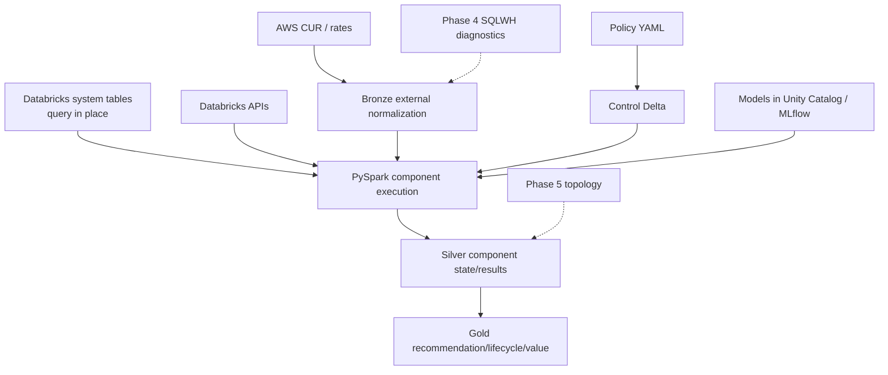

# Databricks Compute Optimization Product
## Phase-2 Delta Data Model Detailed Technical Specification

**Document ID:** `TS-DATA-001`  
**Version:** `2.0.1`
**Date:** 2026-08-14  
**Parent PRD:** `databricks_compute_optimization_product_prd_v2.0.0.md`  
**Parent HLA:** `databricks_compute_optimization_high_level_architecture_v2.0.0.md`  
**Product Release Authority:** SQL Warehouse Product Release Plan v2.0.1 implementation patch  
**Status:** Draft for review

---

# 0. v2.0.1 Implementation Hardening

This specification remains the **SQL Warehouse product-state Delta model** beginning in Phase 2. It now also defines explicit later-phase extensions for Shared Kernel state introduced by `TS-CAP-001`, `TS-CTX-001`, and `TS-LLM-001`.

Important boundaries:

1. Phase-3 tables are **not Phase-2 runtime prerequisites**.
2. Source-controlled `packs/sql_warehouse/manifest.yaml` remains executable capability authority; Delta `registered_capability` is an operational/audit projection and cannot make code executable.
3. `DecisionContext`/ContextDiff are Shared Kernel records, while SQLWH component results remain in their existing SQLWH Silver/Gold tables.
4. Phase 4 uses generic SQLWH `diagnostic_evidence_envelope` / `diagnostic_feature`, not Spark-event-specific tables.
5. Query Profile data may only populate Phase-4 tables after an approved programmatic/manual-ingestion contract; its UI existence does not by itself authorize automated extraction.

---

# 1. Purpose

This specification defines the **normative Unity Catalog managed Delta schemas introduced in Phase 2** when the proven Phase-1 SQL Warehouse + pandas runtime migrates to Declarative Automation Bundles, Lakeflow Jobs classic jobs compute, PySpark, and Delta-backed repositories.

The Delta model persists **product-owned state and results**. It does **not** create a default raw copy of Databricks system tables. System tables remain query-in-place sources unless an explicit replay/compliance requirement later approves a snapshot table.

The product uses a **medallion data model** with companion governance/ML schemas:

```text
Control = policy/registry/context/source manifests
Bronze  = external/raw-normalized evidence
Silver  = validated/canonical analytical and decision evidence
Gold    = recommendation/lifecycle/realized/portfolio outputs
ML      = feature/model/evaluation lineage
```

This is intentionally not “copy every source into Bronze.” Databricks system tables remain authoritative query-in-place sources; Bronze is used where the product owns an external normalization/reproducibility boundary.

Official platform basis validated 2026-08-14:

- Unity Catalog managed tables are Databricks' default/recommended managed table type: https://docs.databricks.com/aws/en/tables/managed
- Delta best practices recommend Unity Catalog managed tables: https://docs.databricks.com/aws/en/delta/best-practices
- Medallion architecture separates data quality/state layers: https://docs.databricks.com/aws/en/lakehouse/medallion
- Declarative Automation Bundles: https://docs.databricks.com/aws/en/dev-tools/bundles/
- Classic jobs compute: https://docs.databricks.com/aws/en/jobs/compute
- Models in Unity Catalog: https://docs.databricks.com/aws/en/machine-learning/manage-model-lifecycle/

---

# 2. Traceability

| Requirement | Architecture | Technical authority |
|---|---|---|
| `PRD-FR-PROD-041` | `ARC-RUN-002`, `ARC-DATA-003` | all Phase-2 schemas in this document |
| `PRD-FR-PROD-042` | `ARC-AI-ML-001` | ML lineage/evaluation tables + Models in Unity Catalog |
| Phase-2 persistence | HLA Sections 28/33 | `TS-DATA-*` |
| Phase-2 Shared Kernel core persistence + Phase-3 Intelligence Review extension | `ADR-009..011` | Section 12 |
| Phase-4 Deep Diagnostic extension | `ADR-012` | Section 16 |
| Phase-5 topology extension | Phase-5 topology architecture | Section 17 |

---

# 3. Data architecture



---

# 4. Catalog and schema layout

The deployment MUST parameterize the Unity Catalog catalog name. Example logical names:

| Schema | Purpose | Activation |
|---|---|---|
| `${catalog}.sqlwhopt_control` | run/source/Policy state; Phase-3 RegistrySnapshot/DecisionContext/ContextDiff | Phase 2 / Phase 3 extension |
| `${catalog}.sqlwhopt_bronze` | normalized external financial inputs including CUR or source-controlled AWS price-registry snapshots; Phase-4 SQLWH diagnostic envelope | Phase 2 / Phase 4 extension |
| `${catalog}.sqlwhopt_silver` | canonical config/evidence/model/optimizer/plan/financial results; Phase-3 gaps/review/narrative/evaluation | Phase 2 / Phase 3 extension |
| `${catalog}.sqlwhopt_gold` | recommendation, lifecycle, realized/portfolio value | Phase 2 |
| `${catalog}.sqlwhopt_ml` | model evaluation/feature manifests; model artifacts themselves live in Models in Unity Catalog | Phase 2 |

Names are configurable but the logical table contracts and columns are normative. Deployment tooling MUST resolve `${catalog}` to an environment-specific Unity Catalog catalog before executing DDL.

### Phase-2 schema bootstrap DDL

```sql
CREATE SCHEMA IF NOT EXISTS ${catalog}.sqlwhopt_control;
CREATE SCHEMA IF NOT EXISTS ${catalog}.sqlwhopt_bronze;
CREATE SCHEMA IF NOT EXISTS ${catalog}.sqlwhopt_silver;
CREATE SCHEMA IF NOT EXISTS ${catalog}.sqlwhopt_gold;
CREATE SCHEMA IF NOT EXISTS ${catalog}.sqlwhopt_ml;
```

Because no `LOCATION` is declared for the tables in this specification, the deployed tables are Unity Catalog managed tables when created in these Unity Catalog schemas. Catalog/schema creation and grants MAY be managed outside the bundle when enterprise platform governance owns those resources; in that case the DAB validates the required prerequisites rather than recreating them.

---

# 5. Common table rules

| ID | Rule |
|---|---|
| `TS-DATA-RULE-001` | Tables MUST be Unity Catalog managed Delta tables unless an approved ADR documents an exception. |
| `TS-DATA-RULE-002` | Stable application IDs (`run_id`, `result_id`, `plan_state_id`, etc.) are generated by domain components; Delta identity columns are not authoritative IDs. |
| `TS-DATA-RULE-003` | UTC timestamps are stored as `TIMESTAMP`; analysis windows use closed-open semantics `[start,end)`. |
| `TS-DATA-RULE-004` | Authoritative monetary values use `DECIMAL(38,8)` internally; presentation rounding occurs in the Estimator/Recommendation contract. |
| `TS-DATA-RULE-005` | Issued Recommendation Packages and lifecycle events are immutable/append-only; corrections create superseding rows/events. |
| `TS-DATA-RULE-006` | Mutable convenience tables such as `lifecycle_current` are derived/current-state projections over append-only history and use idempotent `MERGE`. |
| `TS-DATA-RULE-007` | Schema auto-merge is OFF by default for authoritative tables; contract/schema migration is explicit and versioned. |
| `TS-DATA-RULE-008` | `payload_json` is retained where complete canonical contract replay is required, but frequently filtered/reportable fields are stored as typed columns. |
| `TS-DATA-RULE-009` | Direct query text is not persisted by default. Approved fingerprints/tags may be persisted; raw SQL requires separate data-governance approval. |
| `TS-DATA-RULE-010` | Liquid clustering SHOULD be evaluated for high-volume result/event tables; clustering keys are deployment-tunable and not business semantics. |
| `TS-DATA-RULE-011` | Databricks system tables are not copied into Bronze by default. Product-derived canonical snapshots are not considered raw-system-table duplication. |
| `TS-DATA-RULE-012` | Every component-result table carries `contract_version`, component/version lineage, `policy_snapshot_id`, and `source_snapshot_id` either typed or inside canonical payload. |

---

# 6. Control schema

## 6.1 `run_manifest`

```sql
CREATE TABLE IF NOT EXISTS ${catalog}.sqlwhopt_control.run_manifest (
  run_id STRING NOT NULL,
  run_type STRING NOT NULL,
  trigger_type STRING NOT NULL,
  backend STRING NOT NULL,
  environment STRING NOT NULL,
  analysis_start_utc TIMESTAMP NOT NULL,
  analysis_end_utc TIMESTAMP NOT NULL,
  policy_snapshot_id STRING,
  source_snapshot_id STRING,
  component_versions_json STRING NOT NULL,
  status STRING NOT NULL,
  started_at_utc TIMESTAMP NOT NULL,
  completed_at_utc TIMESTAMP,
  error_code STRING,
  error_message STRING,
  created_at_utc TIMESTAMP NOT NULL
) USING DELTA;
```

Primary logical key: `run_id`.

## 6.2 `source_snapshot_manifest`

```sql
CREATE TABLE IF NOT EXISTS ${catalog}.sqlwhopt_control.source_snapshot_manifest (
  source_snapshot_id STRING NOT NULL,
  run_id STRING NOT NULL,
  analysis_start_utc TIMESTAMP NOT NULL,
  analysis_end_utc TIMESTAMP NOT NULL,
  sources_json STRING NOT NULL,
  watermarks_json STRING,
  schema_versions_json STRING,
  closed_window BOOLEAN NOT NULL,
  source_hash STRING NOT NULL,
  created_at_utc TIMESTAMP NOT NULL
) USING DELTA;
```

## 6.3 `policy_snapshot`

```sql
CREATE TABLE IF NOT EXISTS ${catalog}.sqlwhopt_control.policy_snapshot (
  policy_snapshot_id STRING NOT NULL,
  policy_version STRING NOT NULL,
  policy_hash STRING NOT NULL,
  environment STRING,
  workspace_id STRING,
  warehouse_id STRING,
  warehouse_type STRING,
  cost_tier STRING,
  workload_criticality STRING,
  applied_layers ARRAY<STRING>,
  policy_json STRING NOT NULL,
  validation_status STRING NOT NULL,
  warnings ARRAY<STRING>,
  resolved_at_utc TIMESTAMP NOT NULL
) USING DELTA;
```

A `policy_snapshot_id` is immutable once issued.

## 6.4 `policy_diff`

```sql
CREATE TABLE IF NOT EXISTS ${catalog}.sqlwhopt_control.policy_diff (
  policy_diff_id STRING NOT NULL,
  old_policy_snapshot_id STRING NOT NULL,
  new_policy_snapshot_id STRING NOT NULL,
  changed_paths ARRAY<STRING> NOT NULL,
  invalidated_components ARRAY<STRING>,
  invalidated_optimizer_ids ARRAY<STRING>,
  requires_reanalysis BOOLEAN NOT NULL,
  diff_json STRING NOT NULL,
  created_at_utc TIMESTAMP NOT NULL
) USING DELTA;
```

---

# 7. Bronze/external normalization schema

## 7.1 `aws_cost_line`

```sql
CREATE TABLE IF NOT EXISTS ${catalog}.sqlwhopt_bronze.aws_cost_line (
  cost_line_id STRING NOT NULL,
  source_export_id STRING,
  usage_start_utc TIMESTAMP NOT NULL,
  usage_end_utc TIMESTAMP,
  account_id STRING,
  workspace_id STRING,
  warehouse_id STRING,
  service STRING NOT NULL,
  resource_id STRING,
  usage_quantity DECIMAL(38,8),
  usage_unit STRING,
  unblended_cost DECIMAL(38,8),
  amortized_or_effective_cost DECIMAL(38,8),
  net_effective_cost DECIMAL(38,8),
  savings_plan_covered BOOLEAN,
  reservation_covered BOOLEAN,
  attribution_method STRING,
  attribution_confidence DECIMAL(9,6),
  tags MAP<STRING,STRING>,
  source_row_hash STRING NOT NULL,
  ingested_at_utc TIMESTAMP NOT NULL
) USING DELTA;
```

## 7.2 `aws_price_registry_snapshot`

Used only when CUR/Data Exports are unavailable and Policy permits AWS planning estimates.

```sql
CREATE TABLE IF NOT EXISTS ${catalog}.sqlwhopt_bronze.aws_price_registry_snapshot (
  price_snapshot_id STRING NOT NULL,
  registry_version STRING NOT NULL,
  registry_git_sha STRING NOT NULL,
  registry_sha256 STRING NOT NULL,
  cloud STRING NOT NULL,
  service STRING NOT NULL,
  region STRING NOT NULL,
  availability_zone STRING,
  resource_type STRING NOT NULL,
  instance_type STRING,
  operating_system STRING,
  tenancy STRING,
  purchase_option STRING NOT NULL,
  currency_code STRING NOT NULL,
  usage_unit STRING NOT NULL,
  unit_price DECIMAL(38,8) NOT NULL,
  effective_start_utc TIMESTAMP NOT NULL,
  effective_end_utc TIMESTAMP,
  estimation_method STRING,
  observation_start_utc TIMESTAMP,
  observation_end_utc TIMESTAMP,
  source_type STRING NOT NULL,
  source_reference STRING NOT NULL,
  source_retrieved_at_utc TIMESTAMP NOT NULL,
  source_row_hash STRING NOT NULL,
  captured_at_utc TIMESTAMP NOT NULL
) USING DELTA;
```

Logical uniqueness is the effective rate key plus `effective_start_utc` and registry version. Overlapping effective periods for the same rate key are invalid.

`purchase_option=SPOT` requires an explicit `estimation_method` and observation window when the value is an estimate. This table never turns registry pricing into CUR actuals.

## 7.3 `commercial_rate_snapshot`

```sql
CREATE TABLE IF NOT EXISTS ${catalog}.sqlwhopt_bronze.commercial_rate_snapshot (
  rate_snapshot_id STRING NOT NULL,
  sku_name STRING NOT NULL,
  usage_unit STRING NOT NULL,
  currency_code STRING NOT NULL,
  effective_start_utc TIMESTAMP NOT NULL,
  effective_end_utc TIMESTAMP,
  rate DECIMAL(38,8) NOT NULL,
  rate_basis STRING NOT NULL,
  contract_reference STRING,
  source_hash STRING NOT NULL,
  captured_at_utc TIMESTAMP NOT NULL
) USING DELTA;
```

Databricks `system.billing.list_prices` remains query-in-place fallback and is not duplicated here unless Policy explicitly requires a reproducibility snapshot.

---

# 8. Silver canonical/evidence tables

## 8.1 `warehouse_config_snapshot`

```sql
CREATE TABLE IF NOT EXISTS ${catalog}.sqlwhopt_silver.warehouse_config_snapshot (
  config_snapshot_id STRING NOT NULL,
  run_id STRING NOT NULL,
  source_snapshot_id STRING NOT NULL,
  workspace_id STRING NOT NULL,
  warehouse_id STRING NOT NULL,
  observed_at_utc TIMESTAMP NOT NULL,
  config_hash STRING NOT NULL,
  warehouse_type STRING NOT NULL,
  warehouse_size STRING,
  min_clusters INT,
  max_clusters INT,
  auto_stop_minutes INT,
  photon_enabled BOOLEAN,
  serverless_enabled BOOLEAN,
  spot_policy STRING,
  statement_timeout_seconds BIGINT,
  channel STRING,
  tags MAP<STRING,STRING>,
  source_fields_json STRING,
  contract_version STRING NOT NULL,
  created_at_utc TIMESTAMP NOT NULL
) USING DELTA;
```

## 8.2 `analyzer_result`

```sql
CREATE TABLE IF NOT EXISTS ${catalog}.sqlwhopt_silver.analyzer_result (
  analyzer_result_id STRING NOT NULL,
  run_id STRING NOT NULL,
  workspace_id STRING NOT NULL,
  warehouse_id STRING NOT NULL,
  analyzer_id STRING NOT NULL,
  analyzer_version STRING NOT NULL,
  contract_version STRING NOT NULL,
  policy_snapshot_id STRING NOT NULL,
  source_snapshot_id STRING NOT NULL,
  status STRING NOT NULL,
  quality STRING,
  sample_size BIGINT,
  signals ARRAY<STRING>,
  findings ARRAY<STRING>,
  blockers ARRAY<STRING>,
  warnings ARRAY<STRING>,
  confidence_inputs_json STRING,
  data_quality_json STRING,
  payload_json STRING NOT NULL,
  output_hash STRING NOT NULL,
  generated_at_utc TIMESTAMP NOT NULL
) USING DELTA;
```

Phase 5 A15 rows may carry `topology_evaluation_id` and participating IDs in `payload_json`; Section 16 defines the dedicated searchable extension table.

## 8.3 `analyzer_metric`

```sql
CREATE TABLE IF NOT EXISTS ${catalog}.sqlwhopt_silver.analyzer_metric (
  analyzer_metric_id STRING NOT NULL,
  analyzer_result_id STRING NOT NULL,
  workspace_id STRING NOT NULL,
  warehouse_id STRING NOT NULL,
  analyzer_id STRING NOT NULL,
  metric_id STRING NOT NULL,
  unit STRING,
  metric_value DECIMAL(38,8),
  p50 DECIMAL(38,8),
  p95 DECIMAL(38,8),
  p99 DECIMAL(38,8),
  sample_size BIGINT,
  calculation_method STRING,
  dimensions MAP<STRING,STRING>,
  generated_at_utc TIMESTAMP NOT NULL
) USING DELTA;
```

## 8.4 `cost_evidence`

```sql
CREATE TABLE IF NOT EXISTS ${catalog}.sqlwhopt_silver.cost_evidence (
  cost_evidence_id STRING NOT NULL,
  run_id STRING NOT NULL,
  workspace_id STRING NOT NULL,
  warehouse_id STRING NOT NULL,
  period_start_utc TIMESTAMP NOT NULL,
  period_end_utc TIMESTAMP NOT NULL,
  databricks_rate_basis STRING,
  billing_coverage_pct DECIMAL(9,6),
  aws_applicable BOOLEAN NOT NULL,
  aws_cost_basis STRING,
  aws_actual_available BOOLEAN,
  aws_attribution_pct DECIMAL(9,6),
  billing_reconciled BOOLEAN NOT NULL,
  blockers ARRAY<STRING>,
  usage_summary_json STRING NOT NULL,
  commercial_rate_refs_json STRING,
  aws_summary_json STRING,
  payload_json STRING NOT NULL,
  evidence_hash STRING NOT NULL,
  created_at_utc TIMESTAMP NOT NULL
) USING DELTA;
```

## 8.5 `tier_result`

```sql
CREATE TABLE IF NOT EXISTS ${catalog}.sqlwhopt_silver.tier_result (
  tier_result_id STRING NOT NULL,
  run_id STRING NOT NULL,
  workspace_id STRING NOT NULL,
  warehouse_id STRING NOT NULL,
  annual_economic_cost DECIMAL(38,8) NOT NULL,
  tier STRING NOT NULL,
  tier_rule_version STRING NOT NULL,
  execution_depth_json STRING NOT NULL,
  policy_snapshot_id STRING NOT NULL,
  result_hash STRING NOT NULL,
  generated_at_utc TIMESTAMP NOT NULL
) USING DELTA;
```

---

# 9. Silver modeling/search tables

## 9.1 `modeler_result`

```sql
CREATE TABLE IF NOT EXISTS ${catalog}.sqlwhopt_silver.modeler_result (
  modeler_result_id STRING NOT NULL,
  run_id STRING NOT NULL,
  workspace_id STRING NOT NULL,
  warehouse_id STRING NOT NULL,
  mode STRING NOT NULL,
  capability STRING NOT NULL,
  implementation_type STRING NOT NULL,
  implementation_id STRING NOT NULL,
  model_name STRING,
  model_version STRING,
  reference_plan_state_id STRING,
  candidate_plan_state_id STRING,
  quality STRING NOT NULL,
  seed STRING,
  policy_snapshot_id STRING NOT NULL,
  source_snapshot_id STRING NOT NULL,
  support_json STRING,
  uncertainty_json STRING,
  projections_json STRING NOT NULL,
  blockers ARRAY<STRING>,
  warnings ARRAY<STRING>,
  output_hash STRING NOT NULL,
  generated_at_utc TIMESTAMP NOT NULL
) USING DELTA;
```

## 9.2 `modeler_projection`

```sql
CREATE TABLE IF NOT EXISTS ${catalog}.sqlwhopt_silver.modeler_projection (
  modeler_projection_id STRING NOT NULL,
  modeler_result_id STRING NOT NULL,
  metric_id STRING NOT NULL,
  unit STRING,
  p50 DECIMAL(38,8),
  p95 DECIMAL(38,8),
  p99 DECIMAL(38,8),
  lower_value DECIMAL(38,8),
  expected_value DECIMAL(38,8),
  upper_value DECIMAL(38,8),
  interval_pct DECIMAL(9,4),
  dimensions MAP<STRING,STRING>,
  generated_at_utc TIMESTAMP NOT NULL
) USING DELTA;
```

## 9.3 `plan_state`

```sql
CREATE TABLE IF NOT EXISTS ${catalog}.sqlwhopt_silver.plan_state (
  plan_state_id STRING NOT NULL,
  parent_plan_state_id STRING,
  run_id STRING NOT NULL,
  workspace_id STRING NOT NULL,
  warehouse_id STRING NOT NULL,
  sequence_depth INT NOT NULL,
  config_json STRING NOT NULL,
  config_hash STRING NOT NULL,
  applied_optimizer_ids ARRAY<STRING>,
  optimizer_result_refs ARRAY<STRING>,
  modeler_result_refs ARRAY<STRING>,
  estimator_result_refs ARRAY<STRING>,
  policy_snapshot_id STRING NOT NULL,
  source_snapshot_id STRING NOT NULL,
  guardrail_status STRING,
  status STRING NOT NULL,
  state_hash STRING NOT NULL,
  created_at_utc TIMESTAMP NOT NULL
) USING DELTA;
```

Phase 5 multi-warehouse topology lineage is represented through the dedicated `topology_evaluation` table plus canonical topology payload fields referenced from the O6 PlanState.

## 9.4 `optimizer_result`

```sql
CREATE TABLE IF NOT EXISTS ${catalog}.sqlwhopt_silver.optimizer_result (
  optimizer_result_id STRING NOT NULL,
  run_id STRING NOT NULL,
  workspace_id STRING NOT NULL,
  warehouse_id STRING NOT NULL,
  optimizer_id STRING NOT NULL,
  optimizer_version STRING NOT NULL,
  input_plan_state_id STRING NOT NULL,
  output_plan_state_id STRING,
  selected_candidate_id STRING,
  decision STRING NOT NULL,
  atomic BOOLEAN NOT NULL,
  current_config_json STRING,
  recommended_config_json STRING,
  candidate_estimate_ref STRING,
  modeler_result_refs ARRAY<STRING>,
  evidence_refs ARRAY<STRING>,
  blockers ARRAY<STRING>,
  guardrails_json STRING,
  rejected_candidate_summary_json STRING,
  policy_snapshot_id STRING NOT NULL,
  result_hash STRING NOT NULL,
  generated_at_utc TIMESTAMP NOT NULL
) USING DELTA;
```

## 9.5 `cost_estimate`

```sql
CREATE TABLE IF NOT EXISTS ${catalog}.sqlwhopt_silver.cost_estimate (
  estimate_id STRING NOT NULL,
  run_id STRING NOT NULL,
  workspace_id STRING NOT NULL,
  warehouse_id STRING NOT NULL,
  mode STRING NOT NULL,
  period_basis STRING NOT NULL,
  period_start_utc TIMESTAMP,
  period_end_utc TIMESTAMP,
  baseline_plan_state_id STRING,
  target_plan_state_id STRING,
  optimizer_id STRING,
  baseline_databricks_cost DECIMAL(38,8),
  baseline_aws_economic_cost DECIMAL(38,8),
  baseline_aws_cash_cost DECIMAL(38,8),
  baseline_total_economic_cost DECIMAL(38,8),
  target_databricks_cost DECIMAL(38,8),
  target_aws_economic_cost DECIMAL(38,8),
  target_aws_cash_cost DECIMAL(38,8),
  target_total_economic_cost DECIMAL(38,8),
  annual_economic_savings DECIMAL(38,8),
  annual_cash_realizable_savings DECIMAL(38,8),
  commitment_freed DECIMAL(38,8),
  incremental_savings DECIMAL(38,8),
  cumulative_savings DECIMAL(38,8),
  savings_pct DECIMAL(18,8),
  savings_class STRING,
  projection_json STRING,
  quality_json STRING,
  policy_snapshot_id STRING NOT NULL,
  status STRING NOT NULL,
  blockers ARRAY<STRING>,
  warnings ARRAY<STRING>,
  estimate_hash STRING NOT NULL,
  generated_at_utc TIMESTAMP NOT NULL
) USING DELTA;
```

## 9.6 `decision_result`

```sql
CREATE TABLE IF NOT EXISTS ${catalog}.sqlwhopt_silver.decision_result (
  decision_result_id STRING NOT NULL,
  run_id STRING NOT NULL,
  workspace_id STRING NOT NULL,
  warehouse_id STRING NOT NULL,
  winning_plan_state_id STRING,
  decision STRING NOT NULL,
  authoritative_estimate_id STRING,
  confidence_score DECIMAL(9,4),
  risk_score DECIMAL(9,4),
  effort_score DECIMAL(9,4),
  disruption_score DECIMAL(9,4),
  material_alternatives_json STRING,
  rejected_plan_summary_json STRING,
  policy_snapshot_id STRING NOT NULL,
  result_hash STRING NOT NULL,
  generated_at_utc TIMESTAMP NOT NULL
) USING DELTA;
```

---

# 10. Gold recommendation/value tables

## 10.1 `recommendation_package`

```sql
CREATE TABLE IF NOT EXISTS ${catalog}.sqlwhopt_gold.recommendation_package (
  recommendation_package_id STRING NOT NULL,
  package_version STRING NOT NULL,
  run_id STRING NOT NULL,
  workspace_id STRING NOT NULL,
  warehouse_id STRING NOT NULL,
  decision STRING NOT NULL,
  tier STRING,
  baseline_plan_state_id STRING,
  target_plan_state_id STRING,
  authoritative_estimate_id STRING,
  ttm_baseline_cost DECIMAL(38,8),
  ttm_target_cost DECIMAL(38,8),
  ttm_savings DECIMAL(38,8),
  ttm_savings_pct DECIMAL(18,8),
  forward_expected_savings DECIMAL(38,8),
  confidence_label STRING,
  risk_label STRING,
  effort_label STRING,
  savings_label STRING,
  source_config_hash STRING,
  target_config_hash STRING,
  policy_snapshot_id STRING NOT NULL,
  lineage_json STRING NOT NULL,
  package_json STRING NOT NULL,
  package_hash STRING NOT NULL,
  lifecycle_initial_state STRING NOT NULL,
  valid_until_utc TIMESTAMP,
  issued_at_utc TIMESTAMP NOT NULL
) USING DELTA;
```

Issued package rows are immutable. A new package supersedes rather than updates the prior package.

## 10.2 `recommendation_step`

```sql
CREATE TABLE IF NOT EXISTS ${catalog}.sqlwhopt_gold.recommendation_step (
  recommendation_package_id STRING NOT NULL,
  recommendation_id STRING NOT NULL,
  step_sequence INT NOT NULL,
  optimizer_id STRING NOT NULL,
  technique STRING NOT NULL,
  atomic BOOLEAN NOT NULL,
  current_config_json STRING,
  recommended_config_json STRING,
  independent_annual_savings DECIMAL(38,8),
  incremental_annual_savings DECIMAL(38,8),
  cumulative_annual_savings DECIMAL(38,8),
  confidence_label STRING,
  risk_label STRING,
  effort_label STRING,
  savings_label STRING,
  dependencies ARRAY<STRING>,
  validation_json STRING,
  rollback_json STRING,
  evidence_refs ARRAY<STRING>,
  created_at_utc TIMESTAMP NOT NULL
) USING DELTA;
```

## 10.3 `lifecycle_current`

```sql
CREATE TABLE IF NOT EXISTS ${catalog}.sqlwhopt_gold.lifecycle_current (
  lifecycle_id STRING NOT NULL,
  recommendation_package_id STRING NOT NULL,
  recommendation_id STRING,
  workspace_id STRING NOT NULL,
  warehouse_id STRING NOT NULL,
  state STRING NOT NULL,
  source_config_hash STRING,
  target_config_hash STRING,
  observed_config_hash STRING,
  application_match STRING,
  validation_status STRING,
  realization_status STRING,
  realized_estimate_id STRING,
  drift_detected BOOLEAN NOT NULL,
  drift_type STRING,
  reoptimization_required BOOLEAN NOT NULL,
  updated_at_utc TIMESTAMP NOT NULL,
  row_version BIGINT NOT NULL
) USING DELTA;
```

`lifecycle_current` is a current-state projection and is updated idempotently with optimistic/version checks. Authoritative history remains `lifecycle_event`.

## 10.4 `lifecycle_event`

```sql
CREATE TABLE IF NOT EXISTS ${catalog}.sqlwhopt_gold.lifecycle_event (
  lifecycle_event_id STRING NOT NULL,
  lifecycle_id STRING NOT NULL,
  recommendation_package_id STRING NOT NULL,
  recommendation_id STRING,
  workspace_id STRING NOT NULL,
  warehouse_id STRING NOT NULL,
  event_type STRING NOT NULL,
  from_state STRING,
  to_state STRING,
  reason_code STRING,
  event_payload_json STRING,
  source STRING,
  event_at_utc TIMESTAMP NOT NULL,
  created_at_utc TIMESTAMP NOT NULL
) USING DELTA;
```

Append-only.

## 10.5 `realized_value`

```sql
CREATE TABLE IF NOT EXISTS ${catalog}.sqlwhopt_gold.realized_value (
  realized_value_id STRING NOT NULL,
  recommendation_package_id STRING NOT NULL,
  recommendation_id STRING,
  workspace_id STRING NOT NULL,
  warehouse_id STRING NOT NULL,
  observation_start_utc TIMESTAMP NOT NULL,
  observation_end_utc TIMESTAMP NOT NULL,
  counterfactual_old_cost DECIMAL(38,8) NOT NULL,
  observed_new_cost DECIMAL(38,8) NOT NULL,
  realized_savings_period DECIMAL(38,8) NOT NULL,
  annualized_realized_savings DECIMAL(38,8),
  original_estimated_annual_savings DECIMAL(38,8),
  realization_ratio DECIMAL(18,8),
  aws_economic_realized DECIMAL(38,8),
  aws_cash_realized DECIMAL(38,8),
  commitment_freed DECIMAL(38,8),
  performance_status STRING NOT NULL,
  reliability_status STRING NOT NULL,
  lifecycle_classification STRING NOT NULL,
  estimator_result_id STRING NOT NULL,
  modeler_result_id STRING,
  result_hash STRING NOT NULL,
  generated_at_utc TIMESTAMP NOT NULL
) USING DELTA;
```

## 10.6 `portfolio_value_snapshot`

```sql
CREATE TABLE IF NOT EXISTS ${catalog}.sqlwhopt_gold.portfolio_value_snapshot (
  snapshot_date DATE NOT NULL,
  workspace_id STRING,
  tier STRING,
  warehouse_type STRING,
  warehouse_count BIGINT NOT NULL,
  current_ttm_cost DECIMAL(38,8),
  identified_opportunity DECIMAL(38,8),
  issued_opportunity DECIMAL(38,8),
  accepted_opportunity DECIMAL(38,8),
  applied_opportunity DECIMAL(38,8),
  validated_opportunity DECIMAL(38,8),
  annualized_realized_savings DECIMAL(38,8),
  generated_at_utc TIMESTAMP NOT NULL
) USING DELTA;
```

---

# 11. ML metadata tables

Model artifacts MUST be registered/governed through Models in Unity Catalog/MLflow. These Delta tables store product evaluation/feature lineage rather than duplicate model artifacts.

## 11.1 `feature_set_manifest`

```sql
CREATE TABLE IF NOT EXISTS ${catalog}.sqlwhopt_ml.feature_set_manifest (
  feature_set_id STRING NOT NULL,
  capability STRING NOT NULL,
  feature_schema_version STRING NOT NULL,
  source_snapshot_id STRING,
  training_start_utc TIMESTAMP,
  training_end_utc TIMESTAMP,
  feature_columns ARRAY<STRING> NOT NULL,
  feature_contract_json STRING NOT NULL,
  feature_hash STRING NOT NULL,
  created_at_utc TIMESTAMP NOT NULL
) USING DELTA;
```

## 11.2 `model_evaluation`

```sql
CREATE TABLE IF NOT EXISTS ${catalog}.sqlwhopt_ml.model_evaluation (
  model_evaluation_id STRING NOT NULL,
  capability STRING NOT NULL,
  registered_model_name STRING NOT NULL,
  model_version STRING NOT NULL,
  feature_set_id STRING NOT NULL,
  statistical_baseline_implementation_id STRING NOT NULL,
  evaluation_start_utc TIMESTAMP NOT NULL,
  evaluation_end_utc TIMESTAMP NOT NULL,
  metrics_json STRING NOT NULL,
  calibration_status STRING NOT NULL,
  ood_status STRING NOT NULL,
  admission_status STRING NOT NULL,
  rejection_reasons ARRAY<STRING>,
  policy_snapshot_id STRING NOT NULL,
  evaluation_hash STRING NOT NULL,
  evaluated_at_utc TIMESTAMP NOT NULL
) USING DELTA;
```

---

# 12. Shared Kernel Core Persistence (Phase 2) and Intelligence Review Extension (Phase 3)

This section has two activation bands and the distinction is normative:

1. **Phase-2 Shared Kernel core persistence** — `registered_capability`, `capability_dependency`, `capability_registry_snapshot`, `decision_context`, `decision_context_dimension`, `context_diff`, `evidence_node`, and `evidence_edge`. These persist capabilities/context/lineage that already exist logically in Phase 1 and are required by `REL-CAP-2.0.0`, `REL-CTX-2.0.0`, and `P2-R01`.
2. **Phase-3 Intelligence Review / capability-gap persistence** — `capability_gap`, `capability_gap_observation`, `capability_gap_resolution`, routing/packet/agent/review/narrative/evaluation tables. These MUST NOT become Phase-2 prerequisites.

The source-controlled SQLWH manifest remains executable authority. System tables remain query-in-place sources and are not duplicated into Bronze by default.

## 12.1 `registered_capability`

Operational projection of the released source-controlled capability manifest. This table is **not executable authority by itself**.

```sql
CREATE TABLE IF NOT EXISTS ${catalog}.sqlwhopt_control.registered_capability (
  capability_id STRING NOT NULL,
  capability_alias STRING NOT NULL,
  capability_type STRING NOT NULL,
  service_type STRING NOT NULL,
  semantic_version STRING NOT NULL,
  status STRING NOT NULL,
  applicability_json STRING NOT NULL,
  dependencies_json STRING,
  implementation_ref STRING,
  release_id STRING NOT NULL,
  source_commit_sha STRING NOT NULL,
  artifact_digest_sha256 STRING NOT NULL,
  manifest_digest_sha256 STRING NOT NULL,
  contract_version STRING NOT NULL,
  released_at_utc TIMESTAMP NOT NULL,
  recorded_at_utc TIMESTAMP NOT NULL
) USING DELTA;
```

Logical key: `(capability_id, semantic_version)`. Runtime MUST verify the row against the source-controlled release manifest before execution.

## 12.2 `capability_dependency`

Normalized dependency/conflict/applicability edges from the released pack manifest. This avoids requiring every consumer to parse opaque dependency JSON when resolving the execution DAG.

```sql
CREATE TABLE IF NOT EXISTS ${catalog}.sqlwhopt_control.capability_dependency (
  capability_id STRING NOT NULL,
  capability_semantic_version STRING NOT NULL,
  related_capability_id STRING NOT NULL,
  related_capability_semantic_version STRING,
  relationship_type STRING NOT NULL,
  required BOOLEAN NOT NULL,
  service_type STRING NOT NULL,
  phase_start INT,
  phase_end INT,
  dependency_digest_sha256 STRING NOT NULL,
  registry_snapshot_id STRING,
  recorded_at_utc TIMESTAMP NOT NULL
) USING DELTA;
```

Logical key: `(capability_id, capability_semantic_version, related_capability_id, relationship_type)`. `relationship_type` is a governed enum such as `REQUIRES`, `OPTIONAL`, `CONFLICTS_WITH`, or `DOWNSTREAM_INVALIDATES`.

## 12.3 `capability_registry_snapshot`

```sql
CREATE TABLE IF NOT EXISTS ${catalog}.sqlwhopt_control.capability_registry_snapshot (
  registry_snapshot_id STRING NOT NULL,
  run_id STRING NOT NULL,
  service_type STRING NOT NULL,
  phase INT NOT NULL,
  capability_refs ARRAY<STRING> NOT NULL,
  capability_set_digest_sha256 STRING NOT NULL,
  open_material_gap_refs ARRAY<STRING>,
  registry_schema_version STRING NOT NULL,
  snapshot_json STRING NOT NULL,
  created_at_utc TIMESTAMP NOT NULL
) USING DELTA;
```

## 12.4 `decision_context`

```sql
CREATE TABLE IF NOT EXISTS ${catalog}.sqlwhopt_control.decision_context (
  decision_context_id STRING NOT NULL,
  run_id STRING NOT NULL,
  workspace_id STRING NOT NULL,
  warehouse_id STRING NOT NULL,
  service_type STRING NOT NULL,
  observation_end_utc TIMESTAMP NOT NULL,
  source_snapshot_id STRING NOT NULL,
  effective_config_ref STRING NOT NULL,
  effective_config_digest STRING NOT NULL,
  policy_snapshot_id STRING NOT NULL,
  authoritative_policy_view_digest STRING NOT NULL,
  rendering_policy_view_digest STRING,
  registry_snapshot_id STRING NOT NULL,
  capability_set_digest STRING NOT NULL,
  analyzer_authoritative_digest STRING NOT NULL,
  financial_input_digest STRING NOT NULL,
  model_input_digest STRING NOT NULL,
  candidate_domain_digest STRING NOT NULL,
  authoritative_context_hash STRING NOT NULL,
  rendering_context_hash STRING,
  resulting_decision_result_id STRING,
  contract_version STRING NOT NULL,
  context_json STRING NOT NULL,
  created_at_utc TIMESTAMP NOT NULL
) USING DELTA;
```

`resulting_decision_result_id` is lineage only and MUST be excluded from `authoritative_context_hash` input projection.

## 12.5 `decision_context_dimension`

Dimension-level digests support selective reevaluation without reparsing the complete context JSON.

```sql
CREATE TABLE IF NOT EXISTS ${catalog}.sqlwhopt_control.decision_context_dimension (
  decision_context_id STRING NOT NULL,
  workspace_id STRING NOT NULL,
  warehouse_id STRING NOT NULL,
  dimension_name STRING NOT NULL,
  dimension_digest_sha256 STRING NOT NULL,
  source_artifact_refs ARRAY<STRING>,
  contract_version STRING NOT NULL,
  created_at_utc TIMESTAMP NOT NULL
) USING DELTA;
```

Logical key: `(decision_context_id, dimension_name)`. Required Phase-2 dimensions include `SOURCE`, `CONFIG`, `POLICY_DECISION`, `POLICY_RENDERING`, `CAPABILITY`, `ANALYZER`, `FINANCIAL`, `MODEL`, and `CANDIDATE_DOMAIN`.

## 12.6 `context_diff`

```sql
CREATE TABLE IF NOT EXISTS ${catalog}.sqlwhopt_control.context_diff (
  context_diff_id STRING NOT NULL,
  workspace_id STRING NOT NULL,
  warehouse_id STRING NOT NULL,
  prior_decision_context_id STRING NOT NULL,
  new_decision_context_id STRING NOT NULL,
  prior_authoritative_context_hash STRING NOT NULL,
  new_authoritative_context_hash STRING NOT NULL,
  authoritative_hash_changed BOOLEAN NOT NULL,
  changed_dimensions ARRAY<STRING> NOT NULL,
  change_reasons_json STRING NOT NULL,
  affected_component_start_points ARRAY<STRING>,
  recommended_scope_json STRING,
  contract_version STRING NOT NULL,
  created_at_utc TIMESTAMP NOT NULL
) USING DELTA;
```

## 12.7 `evidence_node`

Logical Evidence Graph nodes reference authoritative component records without duplicating their full payloads.

```sql
CREATE TABLE IF NOT EXISTS ${catalog}.sqlwhopt_silver.evidence_node (
  evidence_node_id STRING NOT NULL,
  run_id STRING,
  workspace_id STRING,
  warehouse_id STRING,
  node_type STRING NOT NULL,
  artifact_ref STRING NOT NULL,
  artifact_digest_sha256 STRING,
  source_type STRING,
  decision_context_id STRING,
  metadata_json STRING,
  lineage_version STRING NOT NULL,
  created_at_utc TIMESTAMP NOT NULL
) USING DELTA;
```

Logical key: `evidence_node_id`. `artifact_ref` points to the owning source/component record.

## 12.8 `evidence_edge`

```sql
CREATE TABLE IF NOT EXISTS ${catalog}.sqlwhopt_silver.evidence_edge (
  evidence_edge_id STRING NOT NULL,
  from_evidence_node_id STRING NOT NULL,
  edge_type STRING NOT NULL,
  to_evidence_node_id STRING NOT NULL,
  decision_context_id STRING,
  lineage_version STRING NOT NULL,
  edge_digest_sha256 STRING NOT NULL,
  created_at_utc TIMESTAMP NOT NULL
) USING DELTA;
```

Logical identity is deterministic from `(from_ref, edge_type, to_ref, lineage_version)`.

## 12.9 Phase-3 Capability Gap and Intelligence Review persistence

The tables from 12.10 onward activate in Phase 3 and MUST NOT be required by a Phase-2 run.

## 12.10 `capability_gap`

```sql
CREATE TABLE IF NOT EXISTS ${catalog}.sqlwhopt_silver.capability_gap (
  gap_id STRING NOT NULL,
  gap_signature STRING,
  gap_type STRING NOT NULL,
  service_type STRING NOT NULL,
  primary_decision_domain STRING NOT NULL,
  canonical_signal_or_decision_key STRING,
  affected_capability_ids ARRAY<STRING>,
  affected_decision_dimensions ARRAY<STRING>,
  problem_statement STRING NOT NULL,
  desired_input_types ARRAY<STRING>,
  desired_output_semantics ARRAY<STRING>,
  severity STRING NOT NULL,
  could_reverse_current_decision BOOLEAN NOT NULL,
  annual_value_at_risk DECIMAL(38,8),
  affected_resource_count BIGINT NOT NULL,
  observation_count BIGINT NOT NULL,
  first_seen_utc TIMESTAMP NOT NULL,
  last_seen_utc TIMESTAMP NOT NULL,
  status STRING NOT NULL,
  linked_resolution_ref STRING,
  contract_version STRING NOT NULL,
  row_version BIGINT NOT NULL,
  gap_json STRING NOT NULL,
  updated_at_utc TIMESTAMP NOT NULL
) USING DELTA;
```

Open mapped gaps MUST have deterministic signature uniqueness enforced by repository logic. `DISCOVERED_UNMAPPED` gaps may have `gap_signature IS NULL` until governance assigns a canonical semantic key.

## 12.11 `capability_gap_observation`

```sql
CREATE TABLE IF NOT EXISTS ${catalog}.sqlwhopt_silver.capability_gap_observation (
  gap_observation_id STRING NOT NULL,
  gap_id STRING NOT NULL,
  run_id STRING,
  warehouse_id STRING,
  origin_type STRING NOT NULL,
  agent_review_id STRING,
  evidence_refs ARRAY<STRING> NOT NULL,
  materiality_json STRING,
  observation_hash STRING NOT NULL,
  observed_at_utc TIMESTAMP NOT NULL
) USING DELTA;
```

## 12.12 `capability_gap_resolution`

```sql
CREATE TABLE IF NOT EXISTS ${catalog}.sqlwhopt_silver.capability_gap_resolution (
  gap_id STRING NOT NULL,
  resolution_version STRING NOT NULL,
  resolution_type STRING NOT NULL,
  resolved_capability_id STRING,
  resolved_capability_semantic_version STRING,
  resolved_policy_snapshot_id STRING,
  release_id STRING,
  resolution_evidence_refs ARRAY<STRING>,
  resolution_status STRING NOT NULL,
  resolution_digest_sha256 STRING NOT NULL,
  resolved_at_utc TIMESTAMP,
  recorded_at_utc TIMESTAMP NOT NULL
) USING DELTA;
```

Logical key: `(gap_id, resolution_version)`. Analyzer/Optimizer/Source gaps resolve to released capability/source contracts; Policy gaps resolve to approved Policy artifacts, not executable capability rows.

## 12.13 `agent_routing_decision`

```sql
CREATE TABLE IF NOT EXISTS ${catalog}.sqlwhopt_silver.agent_routing_decision (
  routing_decision_id STRING NOT NULL,
  run_id STRING NOT NULL,
  warehouse_id STRING NOT NULL,
  decision_result_id STRING NOT NULL,
  decision_context_id STRING NOT NULL,
  review_class STRING NOT NULL,
  deep_review_required BOOLEAN NOT NULL,
  routing_reasons ARRAY<STRING> NOT NULL,
  workload_value_tier STRING,
  progressive_trust_mode STRING NOT NULL,
  budget_profile STRING,
  policy_snapshot_id STRING NOT NULL,
  router_version STRING NOT NULL,
  routing_hash STRING NOT NULL,
  created_at_utc TIMESTAMP NOT NULL
) USING DELTA;
```

## 12.14 `agent_evidence_packet`

```sql
CREATE TABLE IF NOT EXISTS ${catalog}.sqlwhopt_silver.agent_evidence_packet (
  packet_id STRING NOT NULL,
  run_id STRING NOT NULL,
  warehouse_id STRING NOT NULL,
  decision_context_id STRING NOT NULL,
  authoritative_context_hash STRING NOT NULL,
  decision_result_id STRING NOT NULL,
  routing_decision_id STRING NOT NULL,
  packet_digest_sha256 STRING NOT NULL,
  packet_builder_version STRING NOT NULL,
  redaction_policy_version STRING NOT NULL,
  packet_json STRING NOT NULL,
  created_at_utc TIMESTAMP NOT NULL
) USING DELTA;
```

## 12.15 `investigation_result`

```sql
CREATE TABLE IF NOT EXISTS ${catalog}.sqlwhopt_silver.investigation_result (
  investigation_id STRING NOT NULL,
  run_id STRING NOT NULL,
  warehouse_id STRING NOT NULL,
  packet_id STRING NOT NULL,
  review_class STRING NOT NULL,
  status STRING NOT NULL,
  prompt_version STRING NOT NULL,
  model_route_id STRING NOT NULL,
  model_version STRING,
  output_schema_version STRING NOT NULL,
  trace_id STRING,
  result_json STRING NOT NULL,
  result_hash STRING NOT NULL,
  created_at_utc TIMESTAMP NOT NULL
) USING DELTA;
```

## 12.16 `challenge_result`

```sql
CREATE TABLE IF NOT EXISTS ${catalog}.sqlwhopt_silver.challenge_result (
  challenge_id STRING NOT NULL,
  run_id STRING NOT NULL,
  warehouse_id STRING NOT NULL,
  packet_id STRING NOT NULL,
  investigation_id STRING NOT NULL,
  review_class STRING NOT NULL,
  status STRING NOT NULL,
  prompt_version STRING NOT NULL,
  model_route_id STRING NOT NULL,
  model_version STRING,
  output_schema_version STRING NOT NULL,
  trace_id STRING,
  result_json STRING NOT NULL,
  result_hash STRING NOT NULL,
  created_at_utc TIMESTAMP NOT NULL
) USING DELTA;
```

## 12.17 `review_action_request`

```sql
CREATE TABLE IF NOT EXISTS ${catalog}.sqlwhopt_silver.review_action_request (
  request_id STRING NOT NULL,
  run_id STRING NOT NULL,
  warehouse_id STRING NOT NULL,
  investigation_id STRING,
  challenge_id STRING,
  request_type STRING NOT NULL,
  severity STRING NOT NULL,
  affected_decision_dimensions ARRAY<STRING>,
  could_reverse_decision BOOLEAN,
  evidence_refs ARRAY<STRING> NOT NULL,
  request_json STRING NOT NULL,
  request_hash STRING NOT NULL,
  created_at_utc TIMESTAMP NOT NULL
) USING DELTA;
```

`request_type` MUST reject generic rerun and existing-Analyzer/Optimizer-run semantics.

## 12.18 `review_adjudication_result`

```sql
CREATE TABLE IF NOT EXISTS ${catalog}.sqlwhopt_silver.review_adjudication_result (
  review_adjudication_id STRING NOT NULL,
  run_id STRING NOT NULL,
  warehouse_id STRING NOT NULL,
  investigation_id STRING,
  challenge_id STRING,
  accepted_request_ids ARRAY<STRING>,
  rejected_request_ids ARRAY<STRING>,
  authoritative_context_effect STRING NOT NULL,
  adjudication_json STRING NOT NULL,
  adjudication_hash STRING NOT NULL,
  created_at_utc TIMESTAMP NOT NULL
) USING DELTA;
```

The only allowed immediate `authoritative_context_effect` values are `NONE` or `PENDING_EXTERNAL_VALIDATION`. The Review Adapter does not declare the context changed.

## 12.19 `agent_review_status_history`

```sql
CREATE TABLE IF NOT EXISTS ${catalog}.sqlwhopt_silver.agent_review_status_history (
  agent_review_event_id STRING NOT NULL,
  run_id STRING NOT NULL,
  warehouse_id STRING NOT NULL,
  decision_result_id STRING NOT NULL,
  routing_decision_id STRING NOT NULL,
  status STRING NOT NULL,
  reason_code STRING,
  event_hash STRING NOT NULL,
  occurred_at_utc TIMESTAMP NOT NULL
) USING DELTA;
```

This is orthogonal to Recommendation LifecycleState.

## 12.20 `narrative_extension`

```sql
CREATE TABLE IF NOT EXISTS ${catalog}.sqlwhopt_silver.narrative_extension (
  narrative_extension_id STRING NOT NULL,
  warehouse_id STRING NOT NULL,
  decision_result_id STRING NOT NULL,
  recommendation_package_id STRING,
  prompt_version STRING NOT NULL,
  model_route_id STRING NOT NULL,
  model_version STRING,
  trace_id STRING,
  authoritative_value_echo_json STRING NOT NULL,
  narrative_json STRING NOT NULL,
  echo_validation_status STRING NOT NULL,
  narrative_hash STRING NOT NULL,
  created_at_utc TIMESTAMP NOT NULL
) USING DELTA;
```

Narrative is persisted only when deterministic exact-value echo validation passes.

## 12.21 `agent_outcome_feedback` and `agent_evaluation_result`

```sql
CREATE TABLE IF NOT EXISTS ${catalog}.sqlwhopt_silver.agent_outcome_feedback (
  feedback_id STRING NOT NULL,
  agent_review_id STRING NOT NULL,
  decision_result_id STRING NOT NULL,
  recommendation_package_id STRING,
  validation_result_ref STRING,
  realized_value_measurement_ref STRING,
  feedback_json STRING NOT NULL,
  feedback_hash STRING NOT NULL,
  created_at_utc TIMESTAMP NOT NULL
) USING DELTA;

CREATE TABLE IF NOT EXISTS ${catalog}.sqlwhopt_silver.agent_evaluation_result (
  evaluation_result_id STRING NOT NULL,
  agent_review_id STRING NOT NULL,
  evaluation_suite_version STRING NOT NULL,
  hard_scorer_results_json STRING NOT NULL,
  quality_scorer_results_json STRING,
  unsafe_pass BOOLEAN,
  false_block_request BOOLEAN,
  total_agent_cost_usd DECIMAL(38,8),
  evaluation_hash STRING NOT NULL,
  evaluated_at_utc TIMESTAMP NOT NULL
) USING DELTA;
```

---

# 13. Component → Delta ownership map

| Component | Writes | Reads |
|---|---|---|
| Capability Registry | `control.registered_capability`, `control.capability_dependency`, `control.capability_registry_snapshot`; Phase-3 `silver.capability_gap*` | source-controlled SQLWH manifest + prior Registry state |
| DecisionContext | `control.decision_context`, `control.decision_context_dimension`, `control.context_diff`; `silver.evidence_node`, `silver.evidence_edge` | source/config/Policy/Registry/Analyzer/Modeler/financial digests and artifact refs |
| Policy Engine | `control.policy_snapshot`, `control.policy_diff` | policy source + prior snapshots |
| SQLWH Analyzer | `silver.warehouse_config_snapshot`, `silver.analyzer_result`, `silver.analyzer_metric`, `silver.cost_evidence` | system tables, API, Bronze external inputs, Phase-4 diagnostic features |
| Estimator | `silver.cost_estimate` | `silver.cost_evidence`, Modeler/PlanState, Bronze rates/AWS |
| Tiering | `silver.tier_result` | `silver.cost_estimate` BASELINE |
| Modeler | `silver.modeler_result`, `silver.modeler_projection`; ML evaluation uses `sqlwhopt_ml` | Analyzer results/features; Phase-4 diagnostic features |
| SQLWH Optimizer | `silver.optimizer_result` | Analyzer/Modeler/Estimator/Policy/PlanState |
| Orchestrator | `silver.plan_state` | Registry-resolved optimizers, tier/policy/context |
| Decision Engine | `silver.decision_result` | surviving PlanStates + authoritative estimates |
| Intelligence Review | `silver.agent_*`, `silver.investigation_result`, `silver.challenge_result`, `silver.review_*`, `silver.narrative_extension` | Decision/Context/Registry/Policy/Modeler summaries |
| Recommendation Package | `gold.recommendation_package`, `gold.recommendation_step` | Decision/Estimator/evidence lineage + review/narrative refs for presentation |
| Lifecycle Manager | `gold.lifecycle_current`, `gold.lifecycle_event` | Recommendation, config snapshots, validation/realized outputs; may join AgentReviewStatus for UI only |
| Realized Estimator path | `gold.realized_value` through Lifecycle-owned persistence transaction | observed new cost + M08 counterfactual |
| Runtime | `control.run_manifest`, `control.source_snapshot_manifest`; owns repository/DDL deployment | all as infrastructure adapter |

---

# 14. Write semantics and idempotency

| Table class | Write semantic |
|---|---|
| `run_manifest` | insert once; terminal status update by `run_id` allowed |
| Policy/source/Registry/DecisionContext snapshots | immutable by stable ID/hash |
| `registered_capability` | released-manifest projection; idempotent by capability/version/digest; row cannot authorize code |
| Capability gap | current lifecycle row may use guarded `MERGE`; observations append immutable |
| Component results | insert immutable; retry with same stable ID must compare canonical hash and no-op if identical |
| PlanState | insert immutable; same `state_hash` may be deduplicated within run |
| Agent results/packets/requests/adjudication | immutable by stable ID/hash; retry no-op if identical |
| Agent review status | append-only event history |
| NarrativeExtension | immutable/versioned; never update authoritative RecommendationPackage values |
| RecommendationPackage | append immutable; supersession represented in lifecycle/event lineage |
| lifecycle_event | append-only |
| lifecycle_current | idempotent `MERGE` keyed by `lifecycle_id` with `row_version` guard |
| realized_value | append immutable per closed observation window/result ID |
| portfolio snapshot | idempotent overwrite/merge by snapshot dimensions/date |

---

# 15. Retention, clustering, and optimization guidance

Retention is deployment Policy. Minimum guidance:

| Data | Retention guidance |
|---|---|
| issued Recommendation Packages / Lifecycle / realized value / DecisionContext | long-lived according to enterprise audit/financial policy |
| capability release projections and Registry snapshots used by issued decisions | retain for replay/audit lifetime |
| capability gaps/observations/resolutions | long-lived product-learning/audit record subject to privacy policy |
| agent packets/results/evaluation | governed AI retention; raw/minimized payload policy applies |
| candidate-only transient results | configurable shorter retention when no issued lineage depends on them |
| Phase-4 raw diagnostic envelope | shortest governed retention compatible with reproducibility/security; prefer normalized features long-term |

Recommended clustering candidates include `workspace_id`, `warehouse_id`, `run_id`, relevant time fields, and recommendation/review IDs. Physical clustering may evolve without changing contract semantics.

---

# 16. Phase-4 SQL Warehouse Deep Diagnostic Delta extension

These tables are inactive before Phase 4.

## 16.1 `diagnostic_evidence_envelope`

```sql
CREATE TABLE IF NOT EXISTS ${catalog}.sqlwhopt_bronze.diagnostic_evidence_envelope (
  diagnostic_evidence_id STRING NOT NULL,
  source_type STRING NOT NULL,
  source_record_id STRING,
  workspace_id STRING NOT NULL,
  warehouse_id STRING NOT NULL,
  statement_id STRING,
  execution_id STRING,
  evidence_time_utc TIMESTAMP,
  source_schema_version STRING NOT NULL,
  acquisition_contract_version STRING NOT NULL,
  acquisition_mode STRING NOT NULL,
  structured_payload_json STRING,
  bounded_raw_payload_json STRING,
  redaction_status STRING NOT NULL,
  payload_hash STRING NOT NULL,
  ingested_at_utc TIMESTAMP NOT NULL
) USING DELTA;
```

`source_type` may include approved values such as `QUERY_HISTORY`, `QUERY_HISTORY_API`, `WAREHOUSE_EVENT`, `QUERY_PROFILE_JSON`, or future versioned SQLWH diagnostic source IDs. `QUERY_PROFILE_JSON` requires an approved acquisition contract; it is not assumed merely because the UI can display/download a profile.

## 16.2 `diagnostic_feature`

```sql
CREATE TABLE IF NOT EXISTS ${catalog}.sqlwhopt_silver.diagnostic_feature (
  diagnostic_feature_id STRING NOT NULL,
  source_snapshot_id STRING,
  workspace_id STRING NOT NULL,
  warehouse_id STRING NOT NULL,
  statement_id STRING,
  execution_id STRING,
  feature_schema_version STRING NOT NULL,
  feature_name STRING NOT NULL,
  feature_value_decimal DECIMAL(38,8),
  feature_value_string STRING,
  unit STRING,
  dimensions MAP<STRING,STRING>,
  source_evidence_refs ARRAY<STRING> NOT NULL,
  evidence_coverage_json STRING,
  feature_hash STRING NOT NULL,
  generated_at_utc TIMESTAMP NOT NULL
) USING DELTA;
```

Phase-4 Analyzer/Modeler/LLM paths consume normalized feature/evidence contracts and preserve source lineage. They do not redefine pre-Phase-4 metric semantics without a version bump.

---

# 17. Phase-5 topology Delta extension

Defined for contract planning but inactive before Phase 5.

## 17.1 `topology_evaluation`

```sql
CREATE TABLE IF NOT EXISTS ${catalog}.sqlwhopt_silver.topology_evaluation (
  topology_evaluation_id STRING NOT NULL,
  run_id STRING NOT NULL,
  workspace_id STRING NOT NULL,
  source_warehouse_ids ARRAY<STRING> NOT NULL,
  target_warehouses_json STRING,
  workload_placements_json STRING,
  a15_analyzer_result_refs ARRAY<STRING>,
  m06_modeler_result_refs ARRAY<STRING>,
  o6_optimizer_result_ref STRING,
  combined_baseline_cost DECIMAL(38,8),
  combined_target_cost DECIMAL(38,8),
  combined_savings DECIMAL(38,8),
  compatibility_status STRING,
  status STRING NOT NULL,
  topology_hash STRING NOT NULL,
  generated_at_utc TIMESTAMP NOT NULL
) USING DELTA;
```

`WAREHOUSE` remains the SQLWH top-level product entity.

---

# 18. DAB deployment responsibilities

Phase 2 is deployed as a **Declarative Automation Bundle (DAB)**. DAB owns source-controlled job/resource definitions and deploy-time wiring; versioned migration code owns idempotent table creation/evolution.

Recommended bundle layout:

```text
databricks.yml
resources/
├── jobs.yml
├── permissions.yml
└── schemas.yml                 # only when enterprise governance delegates schema creation to this product
src/databricks_compute_optimizer/...
sql/migrations/
├── V002_000__phase2_core.sql   # includes Bronze AWS price-registry snapshot table
├── V002_100__phase2_ml.sql
├── V003_000__phase3_review.sql
├── V004_000__phase4_diagnostics.sql
└── V005_000__phase5_topology.sql
```

If enterprise platform governance owns catalog/schema creation, `schemas.yml` is omitted and the bundle validates those prerequisites instead of recreating them.

## 18.1 Phase-2 job dependency DAG

The Phase-2 weekly/selective job MUST preserve this dependency order:

```text
validate_platform_and_sources
        ↓
migrate_phase2_schema
        ↓
build_capability_registry_snapshot
        ↓
build_source_snapshot
        ↓
analyze
        ↓
baseline_estimate_and_tier
        ↓
model_and_optimize
        ↓
decision_and_recommendation
        ↓
lifecycle_refresh
        ↓
portfolio_snapshot
```

Rules:

1. `migrate_phase2_schema` creates/evolves the complete **Phase-2 core** schema, including Registry, DecisionContext dimensions, ContextDiff, and Evidence Graph tables, before any dependent task.
2. System tables are queried in place; the migration does **not** create Bronze copies of Databricks system tables.
3. Bronze remains for external/enrichment inputs such as normalized AWS/commercial-rate data when product persistence is justified.
4. Phase-3/4/5 migrations are independently phase-gated and are not Phase-2 prerequisites.
5. Every migration is versioned, idempotent, checksum/audit logged, and fails closed on incompatible schema drift.
6. `databricks bundle validate` and deployment smoke tests verify job/task/resource references before promotion.
7. Local/pandas and PySpark/Delta backends must produce the same canonical Registry/DecisionContext/financial semantics for Golden fixtures.

## 18.2 Phase-gated resources

| Resource | Earliest phase | Purpose |
|---|---:|---|
| control/bronze/silver/gold/ml schemas | 2 | product state/data |
| Phase-2 Registry/DecisionContext/Evidence Graph tables | 2 | executable-capability snapshot, context hashing/diff, lineage |
| weekly/selective Lakeflow Jobs | 2 | portfolio + selective runs |
| lifecycle validation/realization tasks | 2 | post-change loop |
| ML training/evaluation jobs | 2 | admitted ML |
| CapabilityGap/Intelligence Review tables/tasks/model route permissions | 3 | packet-only LLM review |
| diagnostic ingestion/feature tasks | 4 | SQLWH deep diagnostics |
| topology tasks | 5 | O6 |
| bounded tool/Copilot resources | 6 | separately approved tools |


---

# 19. Migration/parity/integration tests

| Test ID | Assertion |
|---|---|
| `IT-DATA-001` | Phase-2 normative DDL creates exact expected columns/types. |
| `IT-DATA-002` | Same Phase-1 fixture produces equal Analyzer canonical results after Delta round-trip. |
| `IT-DATA-003` | Decimal Estimator outputs remain exact after Delta persistence/read. |
| `IT-DATA-004` | PlanState hash is persistence-backend invariant. |
| `IT-DATA-005` | DecisionContext canonical hash is local/Delta/PySpark invariant. |
| `IT-DATA-006` | Recommendation package canonical hash is unchanged except approved backend lineage fields. |
| `IT-DATA-007` | Lifecycle append/current projection reconstructs the same state history as Phase 1. |
| `IT-DATA-008` | Direct system-table query path works without Bronze system-table copy. |
| `IT-DATA-009` | retry/idempotency does not duplicate immutable IDs/events/agent records. |
| `IT-DATA-010` | ML evaluation points to governed model/version and statistical baseline. |
| `IT-DATA-011` | Delta `registered_capability` cannot authorize an implementation absent from the released manifest. |
| `IT-DATA-012` | duplicate gap observation attaches to existing gap/signature. |
| `IT-DATA-013` | Review Adapter result cannot directly set DecisionContext changed. |
| `IT-DATA-014` | Phase-3 agent/gap, Phase-4 diagnostic, and Phase-5 topology extension tables are not prerequisites for Phase-2 jobs; Phase-2 Registry/DecisionContext/Evidence Graph tables ARE prerequisites. |
| `IT-DATA-015` | Phase-4 diagnostic evidence round-trip preserves source/acquisition/redaction lineage. |
| `IT-DATA-016` | `capability_dependency` reproduces manifest dependency/conflict semantics and cannot authorize code. |
| `IT-DATA-017` | `decision_context_dimension` digests reconstruct the expected ContextDiff impact classification. |
| `IT-DATA-018` | Evidence Graph node/edge round-trip preserves deterministic lineage identity without payload duplication. |
| `IT-DATA-019` | CapabilityGap resolution links to a released capability or approved Policy artifact with immutable provenance. |
| `IT-DATA-020` | DAB `migrate_phase2_schema` completes before any Phase-2 task that reads/writes Phase-2 core tables. |
| `IT-DATA-021` | Source-controlled AWS price registry validates against schema, snapshots deterministically into Bronze, rejects overlapping effective periods, and preserves version/Git SHA/SHA-256 provenance. |
| `IT-DATA-022` | `PRICE_REGISTRY_ESTIMATE` cost evidence sets `aws_actual_available=false` and cannot populate realized AWS actual/cash fields. |

---

# 20. Component release plan

| Release | Phase | Scope | Exit criteria |
|---|---:|---|---|
| `REL-DATA-2.0.0` | 2 | Control + Bronze/Silver/Gold + ML schemas, including AWS price-registry snapshot fallback, Shared-Kernel Registry/DecisionContext/Evidence Graph core tables, DDL migrations, Delta repository contracts | exact DDL + DAB migration ordering + registry provenance + pandas↔PySpark persistence/hash parity pass |
| `REL-DATA-2.1.0` | 2 | ML feature/evaluation metadata + model lineage | ML admission/fallback integration passes |
| `REL-DATA-3.0.0` | 3 | CapabilityGap lifecycle + agent routing/packet/review/narrative/evaluation tables | Phase-3 schema/idempotency/security tests pass |
| `REL-DATA-4.0.0` | 4 | diagnostic evidence envelope/feature extension | diagnostic ingestion/enrichment/fallback tests pass |
| `REL-DATA-5.0.0` | 5 | topology evaluation extension | O6 persistence/deduplication tests pass |

---

# 21. Definition of Done

- all Phase-2 normative DDL is version-controlled and deployable through DAB migrations;
- Phase-2 Shared Kernel Registry/DecisionContext/Evidence Graph tables match `TS-CAP-001` and `TS-CTX-001`; Phase-3 gap/review tables match `TS-CAP-001` and `TS-LLM-001`;
- table ownership is reflected in component TSDs;
- source-controlled pack manifest remains executable capability authority;
- direct system-table reads remain the default source pattern;
- pandas↔PySpark/Delta parity passes for the frozen Phase-1 Golden corpus;
- DecisionContext canonical hashes are backend invariant;
- monetary values retain exact Decimal semantics;
- immutable/append/current-table write rules are implemented/tested;
- governed model lineage is used for admitted ML models;
- AgentReviewStatus remains separate from LifecycleState;
- NarrativeExtension remains separate from immutable authoritative package values;
- Phase-4 diagnostic schemas are compute-specific and not Spark-event-specific;
- Phase-3 gap/review, Phase-4 diagnostic, and Phase-5 topology schemas are not runtime prerequisites before their phases; Phase-2 Registry/DecisionContext/Evidence Graph core schemas are Phase-2 prerequisites.
