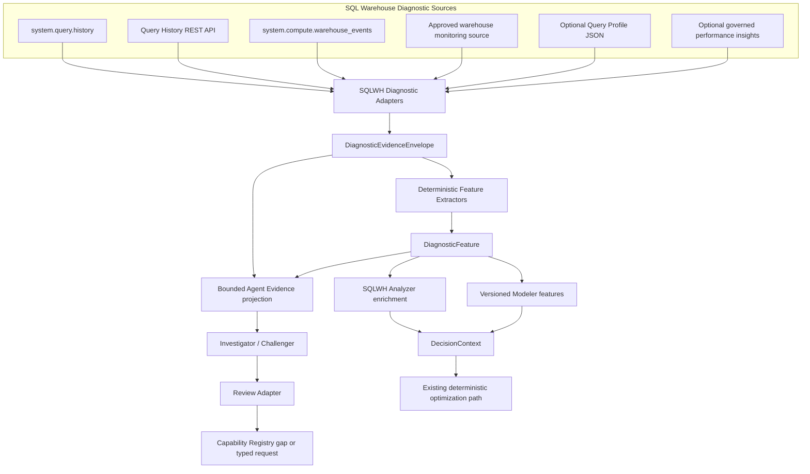
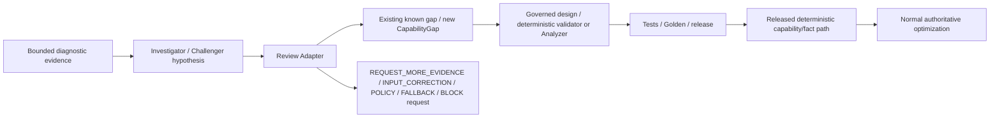

# Databricks Compute Optimization Product
## SQL Warehouse Phase-4 Deep Diagnostic Intelligence Technical Specification

**Document ID:** `TS-DIAG-001`  
**Version:** `2.0.0`  
**Date:** 2026-08-14  
**Status:** Draft for implementation review  
**Parent PRD:** `databricks_compute_optimization_product_prd_v2.0.0.md`  
**Parent HLA:** `databricks_compute_optimization_high_level_architecture_v2.0.0.md`  
**Architecture ADR:** `ADR-012-deep-diagnostic-intelligence.md`  
**Data model:** `TS-DATA-001` Phase-4 diagnostic extension  
**LLM dependency:** `TS-LLM-001` v2.0.0  
**Capability Registry:** `TS-CAP-001`  
**DecisionContext:** `TS-CTX-001`  
**Normative implementation pack:** SQL Warehouse

---

# 1. Purpose

Phase 4 adds deeper SQL Warehouse execution evidence **without changing the authority model or assuming Spark-event telemetry exists for SQL Warehouses**.

The phase has three goals:

1. collect additional supported SQL Warehouse diagnostic evidence through governed adapters;
2. normalize that evidence deterministically into versioned facts/features that can enrich existing Analyzers/Modeler capabilities; and
3. allow the approved Investigator/Challenger to reason over bounded diagnostic evidence while ensuring an LLM hypothesis never becomes an authoritative fact or recommendation by itself.

Core invariant:

> **Deep diagnostics may improve evidence quality; they do not create a new recommendation authority. Deterministic Analyzer/Optimizer/Estimator/Decision boundaries remain unchanged.**

---

# 2. Scope

## 2.1 In scope

- `system.query.history` diagnostic fields and statement-level evidence;
- Query History REST API **only as fallback** when the required supported evidence cannot be resolved from `system.query.history` because of approved access/retention/environment constraints;
- `system.compute.warehouse_events` lifecycle/scaling evidence;
- current SQL Warehouse monitoring evidence obtainable through an approved programmatic contract;
- optional governed Query Profile JSON augmentation;
- optional governed performance-insight evidence only when the source/acquisition contract is explicitly approved and feature maturity is policy-allowed;
- deterministic `DiagnosticEvidenceEnvelope`;
- deterministic `DiagnosticFeature` extraction;
- evidence coverage/attribution/redaction;
- A06/A11/A14 enrichment and future versioned Analyzer enrichments;
- approved statistical/ML feature enrichment;
- bounded Phase-4 LLM evidence projection;
- CapabilityGap discovery when a needed diagnostic fact/adapter is missing;
- DecisionContext diagnostic-dimension integration;
- local/Delta persistence and golden/integration tests.

## 2.2 Out of scope

- treating Spark event logs as a SQL Warehouse source contract;
- scraping unsupported private UI/browser endpoints;
- assuming Query Profile has a stable automated API merely because it is visible/downloadable in the UI;
- SQL/query rewrite optimization;
- allowing Databricks performance insights or Genie Code recommendations to become authoritative product recommendations;
- direct LLM access to SQL/REST/MCP/tools in Phase 4;
- LLM-to-recommendation direct flow;
- fabricating CPU/executor telemetry not supplied by a validated source;
- changing existing metric meaning without a versioned Analyzer/Modeler contract change.

---

# 3. Architecture placement



There is no edge `LLM → Recommendation`.

---

# 4. Source contract and maturity matrix

| Source ID | Source | Programmatic status for v2 design | Phase-4 use | Authority note |
|---|---|---|---|---|
| `DIAG-QH-ST` | `system.query.history` | supported system-table contract, subject to Preview/runtime capability gate | statement timing, wait, task, I/O/spill/shuffle, status, source/client metadata | deterministic source evidence after schema/coverage checks |
| `DIAG-QH-API` | Query History REST API | documented API fallback | targeted retrieval **only when `system.query.history` cannot resolve the required supported evidence in the environment/retention/access scope and Policy permits fallback** | normalized to the same semantic evidence model; duplicate evidence must reconcile; API preference for convenience alone is prohibited |
| `DIAG-WE-ST` | `system.compute.warehouse_events` | documented system-table contract | start/stop/scale state and cluster-count event evidence | deterministic source evidence |
| `DIAG-MON` | SQL Warehouse monitoring | supported product surface; exact programmatic source must be separately validated | optional activity/monitoring enrichment | no automated ingestion until source contract is pinned |
| `DIAG-QP-JSON` | Query Profile JSON | supported UI download/import workflow | targeted operator-level evidence for approved investigations | optional augmentation; manual/governed ingestion initially unless supported automation is proven |
| `DIAG-PERF-INSIGHT` | Query performance insights | Beta product surface | optional contextual diagnostic evidence | never authoritative by itself; feature-gated; programmatic acquisition must be validated |

The implementation MUST record `source_type`, `source_schema_version`, `acquisition_contract_version`, and `acquisition_mode` for every evidence record.

---

## 4.1 Diagnostic source precedence

`DIAG-QH-ST` is the default Query History source. The product MUST NOT select `DIAG-QH-API` merely because the API is operationally convenient. Before API fallback, record a deterministic `system_table_resolution_status` with the reason the system table cannot satisfy the evidence contract.

Examples of acceptable API fallback reasons are governed access/retention/environment limitations or a required supported field/operation absent from the system-table contract. Query Profile remains optional governed augmentation and is not an assumed automated dependency.


---

# 5. Acquisition modes

Allowed controlled enum:

```text
SYSTEM_TABLE
REST_API
GOVERNED_FILE_IMPORT
APPROVED_PROGRAMMATIC_ADAPTER
```

Rules:

1. `SYSTEM_TABLE` is preferred when the required evidence is available and source semantics are sufficient.
2. `REST_API` may be used for supported Query History API retrieval; adapter behavior is versioned and tested.
3. `GOVERNED_FILE_IMPORT` supports explicitly supplied/downloaded Query Profile JSON for targeted analysis; it MUST preserve provenance and cannot masquerade as automatically complete estate coverage.
4. `APPROVED_PROGRAMMATIC_ADAPTER` requires an explicitly validated source/API contract and release approval.
5. Private/undocumented endpoints are prohibited.
6. The adapter MUST NOT scrape browser state or UI DOM.

---

# 6. DiagnosticEvidenceEnvelope contract

```yaml
contract:
  name: diagnostic_evidence_envelope
  version: 1.0.0

diagnostic_evidence_id: DIAG-EVID-...
source_type: QUERY_HISTORY | QUERY_HISTORY_API | WAREHOUSE_EVENT |
             WAREHOUSE_MONITORING | QUERY_PROFILE_JSON | PERFORMANCE_INSIGHT
source_record_id: ... | null
workspace_id: ...
warehouse_id: ...
statement_id: ... | null
execution_id: ... | null
evidence_time_utc: ... | null

source:
  schema_version: ...
  acquisition_contract_version: ...
  acquisition_mode: SYSTEM_TABLE | REST_API | GOVERNED_FILE_IMPORT | APPROVED_PROGRAMMATIC_ADAPTER
  source_ref: ...

coverage:
  status: COMPLETE | PARTIAL | UNKNOWN
  covered_window: ... | null
  limitations: []

payload:
  structured: {...}
  bounded_raw: null | {...}

redaction:
  status: NOT_REQUIRED | REDACTED | SUPPRESSED
  policy_version: ...

payload_hash: sha256:...
ingested_at_utc: ...
```

`bounded_raw` MUST be null by default and is permitted only where the deterministic extractor or approved Phase-4 evidence packet requires a bounded excerpt/object that cannot be represented structurally.

---

# 7. DiagnosticFeature contract

```yaml
contract:
  name: diagnostic_feature
  version: 1.0.0

diagnostic_feature_id: DIAG-FEAT-...
workspace_id: ...
warehouse_id: ...
statement_id: ... | null
execution_id: ... | null
feature_schema_version: 1.0.0
feature_name: OPERATOR_TIME_SHARE | MEMORY_PEAK | ROW_EXPANSION_RATIO | ...
value:
  decimal: "0.73000000" | null
  string: null
unit: RATIO | MILLISECONDS | BYTES | ROWS | CATEGORY | ...
dimensions: {}
source_evidence_refs: [DIAG-EVID-...]
coverage: {...}
feature_hash: sha256:...
generated_at_utc: ...
```

Feature names are a released Registry vocabulary. An LLM cannot mint a feature name that becomes authoritative.

---

# 8. Deterministic normalization rules

Every adapter/extractor MUST:

- bind source schema version;
- validate resource attribution;
- normalize timestamps to UTC;
- preserve statement/warehouse/workspace IDs when available;
- distinguish absent from zero;
- use deterministic Decimal/typed parsing where applicable;
- reject unsupported/unknown schema fields needed by a feature;
- retain source record/evidence refs;
- produce stable canonical hashes;
- apply redaction before any LLM projection;
- expose coverage and data-quality limitations.

A source parse failure affects only the relevant diagnostic capability unless Policy marks it mandatory.

---

# 9. Query History diagnostic mapping

The Phase-4 adapter reuses authoritative fields already consumed earlier and may expose richer normalized statement evidence, including documented fields such as:

- statement identity/status/type/source;
- total/execution/compilation/provisioning/capacity wait durations where available;
- total task duration;
- read/write/spill/shuffle-related quantities where documented;
- query tags/source/client metadata;
- cache-origin information;
- workload/error evidence subject to privacy/redaction policy.

Rules:

1. fields used by Phase-1/2 Analyzers retain their prior semantic IDs;
2. Phase-4 features receive new IDs/source labels unless a versioned contract explicitly merges them;
3. raw statement text is excluded by default;
4. customer-managed-key or privacy behavior that removes text/error detail must be respected as source reality, not reconstructed by the model.

---

# 10. Query Profile augmentation

Query Profile can provide operator-level metrics and DAG structure useful for targeted diagnosis. v2.0.0 treats it as **optional augmentation**, not mandatory estate-wide input.

## 10.1 Initial supported ingestion

```text
reviewer/admin downloads Query Profile JSON
        ↓
approved secure import location / CLI
        ↓
GOVERNED_FILE_IMPORT adapter
        ↓
validate statement/workspace/warehouse provenance
        ↓
redact/minimize
        ↓
DiagnosticEvidenceEnvelope
```

The product MUST NOT infer that every statement has a Query Profile. Cached queries may not have one, and profile availability/permissions are validated at acquisition time.

## 10.2 Future automated ingestion

If Databricks later exposes or the enterprise validates a supported programmatic Query Profile acquisition contract:

1. create/version a SQLWH evidence-adapter capability;
2. document permissions/rate limits/schema;
3. add contract/integration/golden tests;
4. release it through Capability Registry;
5. only then enable automated collection.

---

# 11. Performance insights boundary

Query performance insights are treated as **non-authoritative contextual evidence** because:

- the feature is policy/maturity gated;
- an insight may recommend SQL/table/compute actions outside the current optimizer authority;
- the SQLWH product must independently prove any supported compute recommendation through its existing deterministic evidence/model/optimizer path.

If an insight suggests a material compute scenario not represented by current O1–O7, the LLM/deterministic review may create an `OPTIMIZER_CAPABILITY_GAP`; the insight is not automatically converted into a new optimizer action.

---

# 12. Analyzer integration

Initial Phase-4 enrichment targets:

| Analyzer | Phase-4 enrichment | Existing fallback |
|---|---|---|
| A06 Resource Pressure | richer statement/operator pressure evidence, row/IO/spill/shuffle/operator composition where source supports it | `system.query.history` pre-Phase-4 metrics |
| A11 Reliability | richer failure/error/context evidence where attributable and permitted | query status + existing API/evidence |
| A14 Photon Effectiveness | operator/execution evidence useful for comparable Photon price/performance reasoning | config-era/query/billing matched evidence |

Future enrichment may target other Analyzers only through a versioned capability release.

### 12.1 Authoritative conversion rule

```text
DiagnosticEvidenceEnvelope
      ↓ deterministic extractor
DiagnosticFeature
      ↓ registered Analyzer logic
AnalyzerResult
      ↓
DecisionContext
```

An LLM finding cannot skip the deterministic extractor/Analyzer step.

---

# 13. Modeler integration

Statistical/ML capabilities may consume Phase-4 diagnostic features only if:

1. feature schema is versioned;
2. training/serving feature semantics match;
3. missing-diagnostic fallback is defined;
4. OOD/coverage behavior is tested;
5. model admission remains satisfied;
6. the feature improves or materially supports the capability under evaluation.

A model is not retrained merely because new diagnostic data exists; training/promotion remains governed by the Phase-2 Modeler lifecycle.

---

# 14. Intelligence Review integration

Phase-4 Investigator/Challenger remain packet-only and tool-less.

Evidence Packet may contain:

- deterministic diagnostic summaries;
- selected DiagnosticFeature records;
- source/coverage refs;
- a very small redacted bounded diagnostic excerpt/object only if Policy and packet budget allow it.

The LLM may return normal Phase-3 typed requests/gaps. No Phase-4-specific authority is added.

---

# 15. LLM diagnostic hypothesis rule

A hypothesis derived from diagnostic evidence is **non-authoritative**.

Allowed flow:



Prohibited:

```text
raw diagnostic text → LLM → recommended warehouse configuration
```

---

# 16. Capability Registry integration

Registry aliases may include:

```text
SQLWH-EVID-QUERY-HISTORY
SQLWH-EVID-QUERY-HISTORY-API
SQLWH-EVID-WAREHOUSE-EVENTS
SQLWH-EVID-QUERY-PROFILE-JSON
SQLWH-DIAG-FEAT-<semantic>
```

Rules:

- source/evidence adapter capability is released/versioned;
- source availability does not equal capability applicability unless required permissions/schema are validated;
- Query Profile automated adapter remains absent until an approved acquisition contract exists;
- a `SOURCE_EVIDENCE_GAP` may record a needed diagnostic acquisition capability;
- release of a new applicable diagnostic capability may produce a new Registry snapshot and future DecisionContext for affected warehouses.

---

# 17. DecisionContext integration

Phase 4 adds a decision-relevant `diagnostic_digest` dimension when the active Analyzer/Modeler capability actually consumes diagnostic facts.

```text
no diagnostic capability applicable/consumed
    → diagnostic evidence arrival alone does not necessarily change authoritative context

new/changed diagnostic fact consumed by authoritative Analyzer/Modeler
    → affected Analyzer/Modeler digest changes
    → authoritative_context_hash changes
    → dependency-directed reevaluation
```

Agent prose itself never enters the hash.

---

# 18. Persistence

Normative Phase-4 tables from `TS-DATA-001`:

```text
sqlwhopt_bronze.diagnostic_evidence_envelope
sqlwhopt_silver.diagnostic_feature
```

Raw/bounded payload retention must be shorter than normalized feature/evidence lineage where enterprise Policy permits.

Do not create SQLWH `spark_event_envelope` / `spark_execution_feature` tables in v2.0.0.

---

# 19. Security, privacy, and permissions

- least-privilege read permissions to source system tables/APIs;
- Query Profile access follows Databricks query/warehouse permissions and enterprise approval;
- imported Query Profile JSON is treated as sensitive execution evidence;
- raw SQL text omitted by default;
- user identity minimized when unnecessary;
- diagnostic raw payload redacted before LLM use;
- no Phase-4 LLM tool credentials;
- imported files undergo integrity/type/size/schema checks;
- no undocumented endpoint tokens/cookies/browser session extraction.

---

# 20. Failure and fallback behavior

| Condition | Required behavior |
|---|---|
| programmatic core diagnostic source unavailable | fall back to existing Phase-1/2 system-table evidence where sufficient; warn/block per capability Policy |
| partial diagnostic coverage | persist coverage; use only supported features; do not extrapolate missing evidence |
| unknown source schema | quarantine/block affected diagnostic capability; unrelated optimization continues |
| warehouse/statement attribution ambiguous | do not attach evidence authoritatively |
| Query Profile JSON unavailable | no failure for core Phase-4 programmatic path unless specific gated investigation requires it |
| Query Profile JSON provenance mismatch | reject import |
| performance insight feature unavailable/Beta disabled | omit; no authority loss |
| LLM unavailable | deterministic diagnostic Analyzer/Modeler path remains valid |
| LLM hypothesis has no registered validator/capability | record/reuse CapabilityGap; do not change current recommendation |
| same authoritative context hash after review | no authoritative recomputation |

---

# 21. Observability

Metrics include:

```text
diagnostic_acquisition_total{source_type,status}
diagnostic_acquisition_duration_seconds{source_type}
diagnostic_evidence_records_total{source_type}
diagnostic_feature_total{feature_name}
diagnostic_coverage_ratio{source_type}
diagnostic_attribution_failures_total{source_type}
diagnostic_schema_failures_total{source_type}
diagnostic_redaction_total{status}
query_profile_import_total{status}
diagnostic_agent_packet_inclusions_total{type}
diagnostic_capability_gap_total{type}
```

Logs include source contract version and evidence/feature IDs, never secrets/raw query text unless explicitly authorized.

---

# 22. Idempotency and determinism

Stable evidence key should include the applicable combination of:

```text
source_type
source_record_id / statement_id / execution_id
evidence_time/source version
payload_hash
adapter version
```

Feature key includes:

```text
sorted source evidence refs
feature name/version
dimensions
extractor version
```

Same inputs/version produce byte-equivalent canonical feature fields excluding trace timestamps.

---

# 23. Testing

## 23.1 Unit

- each source adapter schema parser;
- acquisition-mode validation;
- statement/warehouse attribution;
- UTC normalization;
- deterministic feature extraction;
- coverage semantics;
- redaction;
- Query Profile JSON provenance/schema validation;
- payload/feature hash stability;
- feature-vocabulary rejection for unknown authoritative feature IDs.

## 23.2 Contract

- DiagnosticEvidenceEnvelope schema;
- DiagnosticFeature schema;
- Query History API/system-table semantic reconciliation;
- Phase-4 Delta round-trip;
- Capability Registry manifest resolution;
- DecisionContext diagnostic-dimension behavior.

## 23.3 Adversarial LLM

- prompt injection embedded in diagnostic text;
- raw SQL instruction attempts;
- fabricated operator metric;
- unsupported source claim;
- LLM attempts to turn a performance insight directly into a new configuration;
- LLM attempts to request existing Analyzer/Optimizer rerun;
- duplicate diagnostic CapabilityGap wording.

## 23.4 Integration

- current `system.query.history` schema/permission test;
- Query History REST API targeted retrieval test when enabled;
- warehouse-events schema test;
- approved Query Profile JSON import fixture;
- no undocumented endpoint calls;
- Phase-1/2 fallback when diagnostics are unavailable;
- DAB diagnostic task persistence;
- Analyzer/Modeler enrichment no-regression.

---

# 24. Golden scenarios to add at Gate 5

- SQLWH diagnostic sources absent → earlier deterministic path remains valid;
- richer diagnostic feature changes A06 evidence and relevant downstream decision context only;
- Query Profile JSON manual import is linked to correct statement/warehouse;
- invalid/mismatched profile JSON is rejected;
- no automated Query Profile acquisition is attempted without registered source capability;
- performance insight is contextual only and cannot become authoritative action;
- LLM diagnostic hypothesis creates/reuses a gap but cannot change recommendation;
- released deterministic diagnostic capability later changes relevant context and triggers dependency-directed reevaluation;
- diagnostic prompt injection is ignored;
- same diagnostic evidence/version is idempotent.

---

# 25. Component release plan

| Release | Phase | Scope | Exit criteria |
|---|---:|---|---|
| `REL-DIAG-4.0.0` | 4 | core programmatic diagnostic adapters + envelope | schema/permission/idempotency/fallback tests pass |
| `REL-DIAG-4.1.0` | 4 | deterministic diagnostic feature extractors + A06/A11/A14 enrichment | no-regression/golden tests pass |
| `REL-MOD-4.0.0` | 4 | admitted diagnostic features for selected Modeler capabilities | feature parity/OOD/fallback tests pass |
| `REL-LLM-4.0.0` | 4 | bounded diagnostic evidence in approved Intelligence Review | adversarial/grounding/budget tests pass |
| `REL-DIAG-4.2.0` | 4 | optional governed Query Profile JSON targeted augmentation | provenance/privacy/import golden tests pass |
| future | 4+ | automated Query Profile acquisition | only after supported acquisition contract + ADR/TSD update |

---

# 26. Definition of Done

Phase 4 is implementation-ready when:

- SQL Warehouse source contracts are explicit and tested;
- Spark-event telemetry is not assumed;
- core programmatic path works without Query Profile automation;
- Query Profile JSON augmentation is provenance-controlled and optional;
- no private/undocumented endpoint is required;
- deterministic normalization precedes Analyzer/Modeler/LLM use;
- existing Analyzer metrics retain prior semantics unless explicitly versioned;
- LLM remains packet-only/tool-less and non-authoritative;
- LLM diagnostic hypothesis cannot directly become an Analyzer fact or recommendation;
- CapabilityGap/Registry learning path is explicit;
- DecisionContext integration is dependency-directed;
- diagnostic absence/failure has a safe earlier-phase fallback;
- Delta schemas and runtime adapters align with `TS-DATA-001`/`TS-RUNTIME-001`;
- Gate-5 Golden scenarios cover the diagnostic authority boundary.

---

# 27. Official implementation references

Revalidate at release time:

1. https://docs.databricks.com/aws/en/admin/system-tables/query-history
2. https://docs.databricks.com/api/workspace/queryhistory
3. https://docs.databricks.com/api/workspace/queryhistory/list
4. https://docs.databricks.com/aws/en/admin/system-tables/warehouse-events
5. https://docs.databricks.com/aws/en/compute/sql-warehouse/monitor/
6. https://docs.databricks.com/aws/en/sql/user/queries/query-profile
7. https://docs.databricks.com/aws/en/sql/user/queries/performance-insights

The Query Profile documentation currently describes UI access and JSON download/import. This TSD therefore does not assume a supported automated Query Profile extraction API unless later validated.

---

# 28. Traceability

| Upstream | Implementation |
|---|---|
| `PRD-FR-PROD-044`, `068` | entire TSD |
| `PRD-NFR-PROD-025`, `045` | source minimization/diagnostic correctness |
| `ADR-012` | compute-specific diagnostic adapter design |
| `TS-CAP-001` | evidence/diagnostic capability registration and gaps |
| `TS-CTX-001` | diagnostic evidence → authoritative context rules |
| `TS-LLM-001` | bounded Phase-4 LLM review extension |
