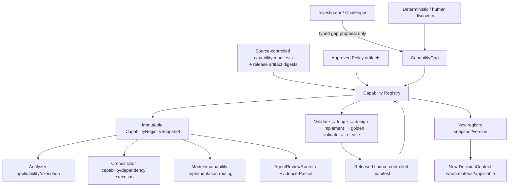
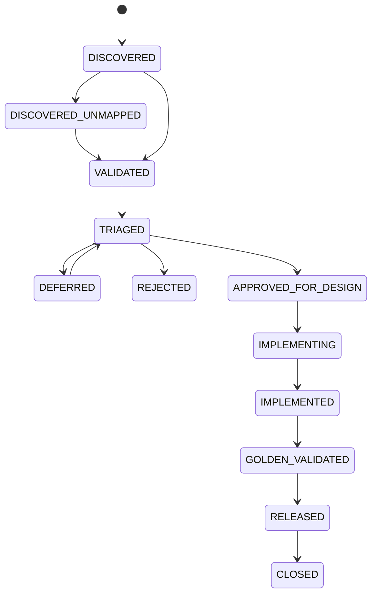

# TS-CAP-001 — Capability Registry Technical Specification

**Document ID:** `TS-CAP-001`  
**Version:** `2.0.0`  
**Status:** Reconciled design baseline — Gate 6 final review candidate  
**Date:** 2026-08-14  
**Product:** Databricks Compute Optimization Product  
**Architecture scope:** Shared Optimization Kernel  
**Normative implementation pack:** SQL Warehouse Capability Pack  
**Upstream PRD:** `PRD-DBX-COMPUTE-OPT` v2.0.0  
**Upstream architecture:** HLA v2.0.0; `ADR-008`, `ADR-009`, `ADR-010`, `ADR-011`  
**Primary PRD trace:** `PRD-FR-PROD-046..052`, `061..062`; `PRD-FR-CAP-001..009`; `PRD-NFR-PROD-031..033`, `043..045`

---

## 1. Purpose

The Capability Registry is the governed inventory of what the optimization product **can execute**, what it **cannot yet represent**, and how missing capabilities become released product intelligence.

It has three responsibilities:

1. enumerate every released executable capability and its exact applicability/version/dependencies;
2. persist non-executable capability gaps discovered by deterministic processing, human review, or the Phase-3 Intelligence Review Plane; and
3. provide the governance bridge that converts a validated recurring gap into a designed, tested, released `RegisteredCapability`.

The Registry is a **control-plane component**. It does not calculate metrics, choose configurations, price savings, run models, or make recommendations.

Core invariant:

> **Only source-controlled, released, registry-verified capabilities may execute. A capability-gap record is never executable.**

---

## 2. Scope

### 2.1 In scope

- released analyzer capability registration;
- released optimizer capability registration;
- Modeler capability registration and implementation availability metadata;
- evidence/diagnostic adapter capability registration;
- explicit compute-service applicability;
- capability dependencies/conflicts;
- capability release provenance and integrity digest;
- immutable `CapabilityRegistrySnapshot` for authoritative runs;
- capability-gap persistence;
- deterministic gap signature/deduplication;
- gap recurrence/materiality/value-at-risk aggregation;
- gap lifecycle;
- linking a closed gap to the released capability or approved policy artifact that resolves it;
- triggering selective reevaluation when the applicable released capability set changes;
- known-open-gap delivery to Phase-3 Evidence Packets;
- reusable Shared-Kernel contract with SQL Warehouse as the only normative implementation pack.

### 2.2 Out of scope

The Registry does not:

- execute Analyzer, Modeler, Optimizer, Estimator, Decision, or LLM logic;
- authorize executable code merely because a Delta row exists;
- accept LLM prose as an executable definition;
- allow agents to generate production analyzer/optimizer code;
- treat policy text as an executable compute capability;
- infer cross-compute applicability;
- automatically approve a roadmap item;
- mutate the current recommendation directly;
- replace source control, release review, CI, or golden tests.

---

## 3. Architecture placement



The Registry participates **before** deterministic execution by declaring the valid/applicable capability set and **after** agent review by durably recording gaps.

---

## 4. Core domain model

```text
Capability Registry
├── RegisteredCapability
│   ├── ANALYZER
│   ├── OPTIMIZER
│   ├── MODELER_CAPABILITY
│   └── EVIDENCE_ADAPTER
│
├── CapabilityRegistrySnapshot
│
└── CapabilityGap
    ├── ANALYZER
    ├── OPTIMIZER
    ├── SOURCE_EVIDENCE
    └── POLICY
```

A `POLICY` gap resolves to an approved/versioned Policy artifact. It does **not** become a `RegisteredCapability` merely because the gap is closed.

---

## 5. Capability identity and namespace

### 5.1 Stable identity

Every capability has:

- immutable `capability_id` — globally stable opaque ID;
- human-readable `alias`;
- capability `type`;
- declared `service_types`;
- semantic version;
- release artifact digest;
- lifecycle status.

Example aliases:

```text
SQLWH-A07
SQLWH-O03
SQLWH-M03
SQLWH-EVID-QUERY-PROFILE
```

Existing SQL Warehouse IDs (`A00..A16`, `O1..O7`, `M01..M08`) remain valid implementation aliases for backward traceability. The reusable Registry SHOULD expose namespaced aliases to avoid future cross-pack collision.

### 5.2 Service types

Initial enum:

```text
SQL_WAREHOUSE
JOB_COMPUTE
ALL_PURPOSE
LAKEFLOW_PIPELINE
SERVERLESS_JOB_NOTEBOOK
```

Only `SQL_WAREHOUSE` is normative in the v2.0.0 implementation package. Other values exist for schema forward compatibility and MUST NOT imply implementation support.

---

## 5.3 Kernel/Pack implementation boundary

The Capability Registry engine is implemented once under Kernel. It does not contain SQL Warehouse Analyzer/Optimizer implementations.

```text
Kernel Registry
    ↓ reads
packs/sql_warehouse/manifest.yaml
    ↓ resolves
packs/sql_warehouse/<capability implementation>
```

The manifest is metadata, not a second implementation. One `(capability_id, semantic_version)` resolves to one executable implementation. Runtime composition may resolve that symbol dynamically; Kernel business modules do not import SQLWH concrete classes directly.

## 6. RegisteredCapability contract

```yaml
contract:
  name: registered_capability
  version: 1.0.0

capability_id: cap-uuid
alias: SQLWH-A07
name: Queue and Capacity Analyzer
capability_type: ANALYZER
service_types: [SQL_WAREHOUSE]

semantic_version: 1.2.0
status: RELEASED

applicability:
  phases: [1, 2, 3, 4, 5, 6]
  resource_predicates:
    warehouse_types: [SERVERLESS, PRO, CLASSIC]
  required_source_capabilities:
    - SQLWH-EVID-QUERY-HISTORY
    - SQLWH-EVID-WAREHOUSE-EVENTS
  policy_feature_gate: null

decision_dimensions:
  - CAPACITY
  - QUEUEING

dependencies:
  required_capability_ids: []
  optional_capability_ids: []
  conflicts_with: []

execution:
  implementation_ref: "src/.../a07_queue_capacity.py"
  entrypoint: "..."
  contract_version: "1.0.0"

release_provenance:
  release_id: REL-ANA-1.0.0
  source_commit_sha: "..."
  artifact_digest_sha256: "..."
  test_manifest_digest_sha256: "..."
  released_at_utc: "2026-08-14T00:00:00Z"
```

### 6.1 Status enum

```text
DRAFT
APPROVED_FOR_IMPLEMENTATION
RELEASED
DEPRECATED
RETIRED
```

Only `RELEASED` capabilities may enter an authoritative `CapabilityRegistrySnapshot`.

### 6.2 Applicability rule

Applicability is deterministic:

```text
applicable =
    capability.status == RELEASED
AND service_type matches
AND phase is enabled
AND required sources are available
AND resource predicates match
AND policy feature gate permits
AND dependencies are satisfied
AND no hard conflict is active
```

An applicable registered Analyzer or Optimizer MUST execute according to the Orchestrator/Analyzer dependency contract. T1–T4 may reduce search/candidate/model depth but MUST NOT silently skip an otherwise applicable registered Analyzer or Optimizer.

---

## 7. CapabilityRegistrySnapshot

Every authoritative run pins one immutable Registry snapshot.

```yaml
contract:
  name: capability_registry_snapshot
  version: 1.0.0

registry_snapshot_id: CRS-...
created_at_utc: ...
service_type: SQL_WAREHOUSE
phase: 3

capabilities:
  - capability_id: ...
    semantic_version: ...
    artifact_digest_sha256: ...
    applicability_digest_sha256: ...

policy_artifact_refs:
  - policy_schema_version: ...
    policy_release_ref: ...

open_material_gap_refs:
  - GAP-...

capability_set_digest_sha256: ...
registry_schema_version: 1.0.0
```

`capability_set_digest_sha256` is part of the authoritative DecisionContext input projection.

---

## 8. CapabilityGap contract

### 8.1 Gap proposal

A gap is evidence-backed missing product capability. It is not executable.

```yaml
contract:
  name: capability_gap
  version: 1.0.0

gap_id: GAP-...
gap_type: ANALYZER | OPTIMIZER | SOURCE_EVIDENCE | POLICY
service_type: SQL_WAREHOUSE

decision_domain:
  primary: AUTO_STOP
  affected_capability_ids: [SQLWH-O03]
  affected_decision_dimensions: [RECONNECT_RELIABILITY]

missing_semantics:
  canonical_signal_or_decision_key: BI_RECONNECT_RELIABILITY
  desired_input_types:
    - structured_reconnect_failure_summary
  desired_output_semantics:
    - reconnect reliability evidence usable by O3 safety guardrail

problem_statement: >
  Current registered capabilities do not establish BI reconnect reliability
  for aggressive Auto Stop decisions.

evidence_refs:
  - EVID-...

materiality:
  severity: HIGH
  could_reverse_current_decision: true
  annual_value_at_risk_usd: "52000.00"

affected_resources:
  count: 1
  resource_refs: [WH-...]

recurrence:
  observation_count: 1
  first_seen_utc: ...
  last_seen_utc: ...

status: DISCOVERED
gap_signature: "sha256:..."
origin:
  source: INVESTIGATOR | CHALLENGER | DETERMINISTIC | HUMAN
  review_id: ARV-... | null
```

### 8.2 Allowed gap types

| Gap type | Meaning | Resolution target |
|---|---|---|
| `ANALYZER` | required deterministic fact/signal is not represented | released Analyzer capability |
| `OPTIMIZER` | material decision domain/technique is not represented | released Optimizer capability |
| `SOURCE_EVIDENCE` | required evidence source/adapter is unavailable/unmodeled | released evidence adapter and/or source contract |
| `POLICY` | deterministic rule/threshold/approval domain is undefined or conflicting | approved Policy schema/artifact/version |

---

## 9. Deterministic gap signature and deduplication

### 9.1 Principle

The system MUST NOT depend on identical LLM wording to recognize the same unresolved gap.

The canonical gap signature is computed only from structured controlled fields:

```text
gap_signature =
SHA256(
  schema_version
  + service_type
  + gap_type
  + primary_decision_domain
  + canonical_signal_or_decision_key
  + sorted(affected_capability_ids)
  + sorted(affected_decision_dimensions)
)
```

Free-form title, rationale, and prose are excluded.

### 9.2 Unknown semantic key

If the proposed `canonical_signal_or_decision_key` is not in the governed semantic-key vocabulary:

1. Registry stores the record as `DISCOVERED_UNMAPPED`;
2. no automatic semantic merge is performed;
3. governance triage assigns or creates an approved canonical semantic key;
4. the deterministic signature is then calculated;
5. duplicates are merged by governed operation with lineage preserved.

The LLM cannot mint a new authoritative semantic key merely by naming one.

### 9.3 Duplicate observation behavior

If the signature already exists in an open state:

```text
do not create new gap
append evidence/occurrence
update affected-resource set
recompute recurrence/materiality aggregates
retain original gap_id
```

---

## 10. Gap lifecycle



### 10.1 Lifecycle rules

- `DISCOVERED` means evidence exists, not that the gap is accepted.
- `VALIDATED` means evidence and missing-capability claim are confirmed.
- `TRIAGED` establishes owner, priority, materiality, recurrence, and resolution path.
- `APPROVED_FOR_DESIGN` requires human/product/governance approval.
- `GOLDEN_VALIDATED` requires relevant contract/unit/integration/golden tests.
- `RELEASED` requires a source-controlled release artifact or approved Policy release.
- `CLOSED` links the gap to its resolution.
- `REJECTED` must include reason code.
- `DEFERRED` remains visible and may continue to accumulate recurrence/value exposure.

---

## 11. Gap resolution

### 11.1 Analyzer/Optimizer/Source gap

```text
CapabilityGap
  ↓ approved design
implementation
  ↓
tests/golden
  ↓
release artifact
  ↓
RegisteredCapability
  ↓
new CapabilityRegistrySnapshot
  ↓
new capability_set_digest
  ↓
affected DecisionContext changes
  ↓
selective authoritative reevaluation
```

### 11.2 Policy gap

```text
POLICY CapabilityGap
  ↓
policy decision/design
  ↓
Policy schema/artifact update
  ↓
approved Policy release
  ↓
new PolicySnapshot
  ↓
affected DecisionContext changes
  ↓
selective authoritative reevaluation
```

A policy gap MUST NOT be represented as an executable Analyzer/Optimizer.

---

## 12. Interaction with weekly runs and agent review

Known open gaps are durable product state.

For each relevant warehouse/recommendation, the Evidence Packet Builder receives:

```yaml
known_open_capability_gaps:
  - gap_id: GAP-0017
    gap_type: ANALYZER
    canonical_signal_or_decision_key: BI_RECONNECT_RELIABILITY
    status: VALIDATED
    severity: HIGH
    affected_capability_ids: [SQLWH-O03]
    evidence_refs: [...]
```

Rules:

1. Agents MUST reference an existing relevant `gap_id` instead of creating a duplicate.
2. New material evidence may be appended as a new observation.
3. An unchanged known gap does not require probabilistic rediscovery.
4. Policy MAY suppress repeat deep review when an existing open material gap already deterministically explains the review outcome and no relevant context/review fingerprint changed.
5. The Explainer may state an authoritative blocker/known limitation only when that structured state is supplied in its context.

---

## 13. Execution authority and release integrity

### 13.1 Source control is executable authority

The production release contains the active pack manifest co-located with its implementation:

```text
src/databricks_compute_optimizer/
├── kernel/
│   └── capability_registry/           # Registry engine only
└── packs/
    └── sql_warehouse/
        ├── manifest.yaml              # released metadata
        ├── analyzers/                 # A00–A16 executable implementations
        ├── optimizers/                # O1–O7 executable implementations
        ├── modeler/
        ├── adapters/
        └── diagnostics/
```

There is no parallel `capabilities/sql_warehouse/` implementation tree. `manifest.yaml` points to the actual implementation symbol under the SQLWH pack and each released manifest is hashed.

At startup/run initialization:

```text
load release manifest
→ verify manifest digest
→ load operational registry
→ verify RELEASED rows match source-controlled manifest
→ reject incompatible/drifted entries
→ construct CapabilityRegistrySnapshot
```

### 13.2 Operational Delta cannot authorize code

A direct database update such as:

```text
status = RELEASED
```

is insufficient unless the capability exists in the signed/approved release artifact and digest validation succeeds.

---

## 14. Persistence

### 14.1 Phase 1

Local compact state:

```text
.state/
└── capability_registry/
    ├── released_capabilities.json
    ├── registry_snapshot_<id>.json
    └── gaps.json
```

Gap lifecycle may be limited to fixture/local validation before Phase 3, but released capability registration exists from Phase 1.

### 14.2 Phase 2+

Recommended managed Delta logical tables:

```text
control.capability_registry_snapshot
control.registered_capability
control.capability_dependency
silver.capability_gap
silver.capability_gap_observation
silver.capability_gap_resolution
```

Physical names are finalized in the Data TSD.

### 14.3 Keys

- `registered_capability`: `(capability_id, semantic_version)`
- `capability_registry_snapshot`: `registry_snapshot_id`
- `capability_gap`: `gap_id`, unique active `gap_signature` per service scope
- `capability_gap_observation`: `gap_observation_id`
- `capability_gap_resolution`: `gap_id + resolution_version`

Writes MUST be idempotent.

---

## 15. Selective reevaluation trigger

A new release does not imply estate-wide recomputation by itself.

The Registry emits:

```yaml
capability_registry_diff:
  prior_snapshot_id: CRS-17
  new_snapshot_id: CRS-18
  added:
    - SQLWH-A17@1.0.0
  changed: []
  removed: []
  affected:
    service_types: [SQL_WAREHOUSE]
    decision_domains: [AUTO_STOP]
    capability_ids: [SQLWH-O03]
```

Lifecycle/DecisionContext/Orchestrator determine affected warehouses and downstream scope.

If the newly released capability is not applicable to a warehouse, its authoritative context need not change.

---

## 16. APIs / service interface

Logical interface:

```python
class CapabilityRegistry:
    def create_snapshot(run_context, policy_snapshot) -> CapabilityRegistrySnapshot: ...
    def get_capability(capability_id, version=None) -> RegisteredCapability: ...
    def list_applicable(resource_context, phase, policy_snapshot) -> list[RegisteredCapability]: ...
    def diff(prior_snapshot_id, new_snapshot_id) -> CapabilityRegistryDiff: ...

    def submit_gap(proposal) -> GapSubmissionResult: ...
    def append_gap_observation(gap_id, observation) -> CapabilityGap: ...
    def get_open_gaps(resource_context, decision_domains) -> list[CapabilityGap]: ...
    def transition_gap(gap_id, transition, actor, evidence) -> CapabilityGap: ...
```

The Registry does not call domain execution code.

---

## 17. Security and governance

- Registry mutation is least-privilege.
- Executable release registration is CI/release-controlled.
- Gap submission may be broader than gap transition/approval permissions.
- Agents can propose gaps but cannot approve/transition them beyond submission.
- Evidence refs are validated before accepted gap creation.
- Sensitive text is minimized in gap descriptions.
- Registry and release digests are auditable.
- Cross-service applicability changes require explicit review and tests.
- Retired capabilities remain historically resolvable for replay.

---

## 18. Observability

Metrics include:

- registered capabilities by type/service/version;
- registry snapshot creation failures;
- release-manifest drift;
- capability applicability counts;
- open gaps by type/status/severity;
- duplicate-gap suppression rate;
- recurrence;
- affected resource count;
- annual value/risk exposure;
- median gap age;
- median validated-gap → released-capability time;
- gap reopen rate;
- selective reevaluation count caused by capability releases.

---

## 19. Failure behavior

| Failure | Required behavior |
|---|---|
| manifest digest mismatch | reject authoritative run |
| registry row references missing executable artifact | reject capability; fail run if required |
| duplicate active gap signature | merge observation/idempotently return existing gap |
| unmapped semantic key | store as unmapped proposal; no automatic executable effect |
| gap evidence ref invalid | reject gap observation |
| dependency missing | capability not applicable; required capability may block run |
| incompatible capability versions | reject authoritative run/scope |
| operational registry unavailable | use only explicitly approved immutable cached snapshot if policy allows; otherwise block |
| gap lifecycle write fails | do not lose authoritative recommendation; mark governance persistence failure for retry |

---

## 20. Testing

### 20.1 Unit

- manifest schema validation;
- service/phase applicability;
- dependency resolution;
- deterministic signature;
- duplicate merge;
- state transitions;
- source-control/registry digest verification;
- policy-gap resolution type;
- snapshot digest stability.

### 20.2 Contract

- stable JSON canonicalization;
- backward-compatible manifest parsing;
- RegistrySnapshot schema;
- Gap schema;
- RegistryDiff schema.

### 20.3 Golden

Required scenarios to be added at Gate 5 include:

- all expected SQLWH Phase-1 capabilities registered;
- T1–T4 does not suppress applicable analyzers/optimizers;
- same release manifest creates same capability-set digest;
- duplicate LLM gap wording maps to one existing controlled signature;
- unknown semantic key cannot self-register;
- new SQLWH-A17 release changes only affected decision contexts;
- policy gap closes through Policy artifact, not RegisteredCapability;
- direct Delta mutation cannot create executable capability;
- cross-compute reuse blocked without explicit applicability.

---

## 21. Component release plan

Provisional component releases; Gate-5 product release plan will reconcile exact ordering.

| Release | Phase | Scope |
|---|---:|---|
| `REL-CAP-1.0.0` | 1 | source-controlled SQLWH capability manifest + RegistrySnapshot |
| `REL-CAP-2.0.0` | 2 | managed Delta persistence + distributed snapshot/read parity |
| `REL-CAP-3.0.0` | 3 | CapabilityGap lifecycle, signatures, known-gap review integration |
| `REL-CAP-4.0.0` | 4 | diagnostic evidence capability registration |
| `REL-CAP-5.0.0` | 5 | topology capability registration/applicability |
| `REL-CAP-6.0.0` | 6 | governed tool/evidence capability descriptors where approved |

---

## 22. Repository target

```text
src/databricks_compute_optimizer/
├── kernel/
│   └── capability_registry/
│       ├── contracts.py
│       ├── manifest.py
│       ├── registry.py
│       ├── applicability.py
│       ├── snapshot.py
│       ├── gap_signature.py
│       ├── gap_lifecycle.py
│       └── diff.py
└── packs/
    └── sql_warehouse/
        └── manifest.yaml

contracts/capability/
├── registered-capability.schema.json
├── registry-snapshot.schema.json
└── capability-gap.schema.json

tests/
├── architecture/
│   ├── test_capability_manifest_uniqueness.py
│   ├── test_manifest_symbols_resolve.py
│   └── test_no_duplicate_capability_implementation.py
├── unit/capability_registry/
├── contract/capability_registry/
└── golden/capability_registry/
```

---

## 23. Acceptance criteria

`TS-CAP-001` is accepted when:

1. executable authority is source-control/release based;
2. Registry exists from Phase 1;
3. SQL Warehouse is the only normative implementation pack;
4. capability type/applicability/dependency/version contracts are explicit;
5. all applicable registered analyzers/optimizers execute deterministically;
6. T1–T4 cannot silently suppress applicable analyzers/optimizers;
7. gap types and lifecycle are explicit;
8. deterministic dedupe does not depend on LLM wording;
9. agents cannot create executable capabilities;
10. policy gaps resolve through Policy artifacts;
11. released new capabilities produce RegistryDiff and affected selective reevaluation;
12. known open gaps are durable and reusable across weekly reviews;
13. cross-compute applicability is never implicit; and
14. tests cover registry drift, duplicate gaps, gap resolution, and capability release.

---

## 24. Traceability

| Upstream | Implementation |
|---|---|
| `PRD-FR-CAP-001..009` | Sections 4–15 |
| `PRD-FR-PROD-047..050` | Sections 5–7, 13 |
| `PRD-FR-PROD-061..062` | Sections 9–12, 15 |
| `PRD-NFR-PROD-031..032` | Sections 9, 13, 17 |
| `ADR-009` | entire specification |
| `ADR-010` | RegistrySnapshot and context-diff integration |
| `ADR-011` | gap submission / known-gap agent integration |
