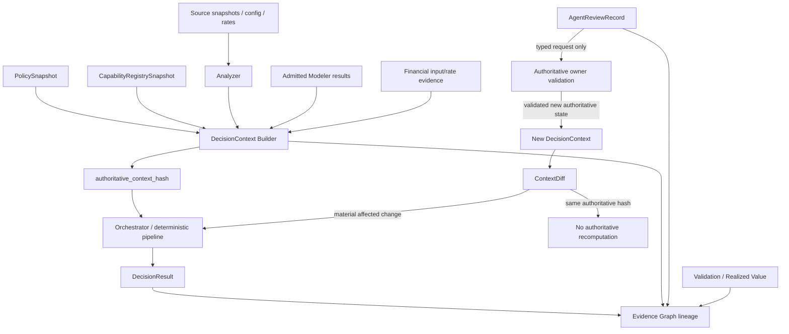
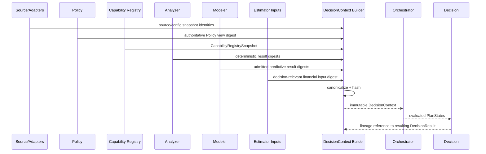
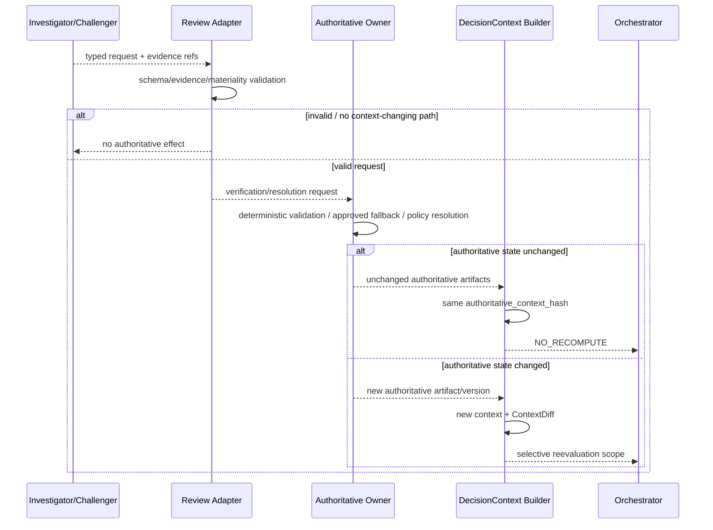

# TS-CTX-001 — DecisionContext and Evidence Graph Technical Specification

**Document ID:** `TS-CTX-001`  
**Version:** `2.0.0`  
**Status:** Reconciled design baseline — Gate 6 final review candidate  
**Date:** 2026-08-14  
**Product:** Databricks Compute Optimization Product  
**Architecture scope:** Shared Optimization Kernel  
**Normative implementation pack:** SQL Warehouse Capability Pack  
**Upstream PRD:** `PRD-DBX-COMPUTE-OPT` v2.0.0  
**Upstream architecture:** HLA v2.0.0; `ADR-010` primary; `ADR-008`, `ADR-009`, `ADR-011` related  
**Primary PRD trace:** `PRD-FR-PROD-033`, `036`, `040`, `049..052`, `060..064`; `PRD-FR-CTX-001..006`; `PRD-NFR-PROD-001..003`, `008..011`, `033`, `043`

---

## 1. Purpose

`DecisionContext` is the canonical, versioned, authoritative context used to determine whether a compute optimization decision can be reproduced, reused, or must be selectively reevaluated.

It solves four problems:

1. **reproducibility** — identify the exact authoritative inputs/versions that produced a decision;
2. **no-op suppression** — prevent recomputation when nothing decision-relevant changed;
3. **selective reevaluation** — identify which downstream components are affected by a material change; and
4. **evidence lineage** — link source evidence through facts, projections, candidate states, decision, review, validation, and realized outcome.

Core invariant:

> **An LLM finding is never itself an authoritative DecisionContext input. Only validated evidence, approved policy, admitted model output, released capability state, configuration, financial inputs, and other deterministic authoritative artifacts may enter the authoritative input projection.**

---

## 2. Terminology

| Term | Meaning |
|---|---|
| `DecisionContext` | immutable envelope describing authoritative decision inputs plus references to the produced decision lineage |
| `authoritative_input_projection` | the canonical subset of DecisionContext whose digest determines whether authoritative recomputation is required |
| `authoritative_context_hash` | SHA-256 digest of canonical authoritative input projection |
| `EvidenceGraph` | logical lineage linking evidence and product artifacts; graph database is not required |
| `dimension_digest` | digest of one decision-relevant context dimension used for impact classification |
| `agent_review_fingerprint` | separate digest for review reuse; never controls authoritative decision validity |
| `rendering_context_hash` | optional separate digest for presentation-only changes such as labels |
| `ContextDiff` | deterministic comparison of two DecisionContexts/digests with affected dimensions/components |

---

## 3. Architectural placement



The Review Adapter never writes authoritative context directly.

---

## 4. DecisionContext boundary

### 4.1 Avoiding circularity

The `DecisionContext` envelope may reference the resulting `DecisionResult` for lineage, but `DecisionResult` itself is **excluded** from `authoritative_input_projection`.

Likewise, the following are excluded from the authoritative hash:

- selected `PlanState`;
- final Recommendation Package;
- LLM findings;
- NarrativeExtension;
- lifecycle state;
- validation result;
- realized value;
- volatile timestamps;
- run IDs that do not alter semantics;
- trace IDs;
- display-only labels.

This prevents the hash from depending on its own output.

### 4.2 Authoritative input projection

The hash projection includes only decision-relevant authoritative inputs:

```text
resource identity + compute service
effective configuration
closed source/evidence snapshot identity
decision-relevant Analyzer results/digests
Policy decision-view digest
CapabilityRegistrySnapshot capability-set digest
financial/rate/commitment input digest
admitted Modeler implementation/result digests
candidate-domain / optimizer-version digests
phase + compatibility contract versions
```

---

## 5. DecisionContext contract

```yaml
contract:
  name: decision_context
  version: 1.0.0

decision_context_id: DC-...
service_type: SQL_WAREHOUSE
resource:
  resource_type: WAREHOUSE
  resource_id: WH-123
  workspace_id: ...
  region: us-east-1

analysis:
  observation_end_utc: ...
  evidence_windows:
    recent_days: 7
    operating_days: 30
    trend_days: 90
    financial_days: 365

source_snapshot:
  source_snapshot_id: SS-...
  source_schema_versions:
    system.compute.warehouses: ...
    system.compute.warehouse_events: ...
    system.query.history: ...
    system.billing.usage: ...
  source_query_digests: [...]
  source_result_digests: [...]
  data_quality_digest: ...

configuration:
  effective_config_ref: CFG-...
  effective_config_digest: ...

policy:
  policy_snapshot_id: PS-...
  authoritative_policy_view_digest: ...
  rendering_policy_view_digest: ...

capabilities:
  registry_snapshot_id: CRS-...
  capability_set_digest: ...
  applicable_capabilities:
    analyzers: [...]
    optimizers: [...]
    modeler_capabilities: [...]
    evidence_adapters: [...]

analyzer_evidence:
  analyzer_result_refs: [...]
  analyzer_authoritative_digest: ...

financial_inputs:
  cost_evidence_ref: CE-...
  rate_snapshot_ref: RATE-...
  commitment_snapshot_ref: COMMIT-... | null
  financial_input_digest: ...

model_inputs:
  modeler_result_refs: [...]
  admitted_implementation_refs: [...]
  model_input_digest: ...

candidate_domain:
  optimizer_versions: [...]
  candidate_domain_digests: [...]
  dependency_graph_version: ...
  candidate_domain_digest: ...

hashes:
  authoritative_context_hash: "sha256:..."
  rendering_context_hash: "sha256:..."

lineage:
  run_id: ...
  resulting_decision_result_ref: DEC-... | null
  created_at_utc: ...
```

---

## 6. Canonical hashing

### 6.1 Algorithm

Use:

```text
SHA-256(canonical_json(authoritative_input_projection))
```

### 6.2 Canonical JSON rules

- UTF-8;
- JSON object keys lexicographically sorted;
- no insignificant whitespace;
- arrays sorted only when contract semantics declare them unordered;
- semantically ordered arrays retain order;
- UTC timestamps normalized to RFC3339 with explicit `Z`;
- Decimal quantities serialized as normalized decimal strings;
- no binary floating-point serialization for authoritative money;
- explicit `null` retained where contract distinguishes null from omitted;
- schema version included;
- volatile metadata excluded.

### 6.3 Example projection

```json
{
  "schema_version": "1.0.0",
  "service_type": "SQL_WAREHOUSE",
  "resource_id": "WH-123",
  "source_snapshot_digest": "sha256:...",
  "effective_config_digest": "sha256:...",
  "authoritative_policy_view_digest": "sha256:...",
  "capability_set_digest": "sha256:...",
  "analyzer_authoritative_digest": "sha256:...",
  "financial_input_digest": "sha256:...",
  "model_input_digest": "sha256:...",
  "candidate_domain_digest": "sha256:..."
}
```

---

## 7. Dimension digests

To support selective reevaluation, DecisionContext stores/derives separate digests:

```text
source_digest
config_digest
policy_decision_digest
policy_rendering_digest
capability_digest
analyzer_digest
financial_digest
model_digest
candidate_domain_digest
diagnostic_digest
```

The full authoritative hash does not replace dimension-level comparison.

---

## 8. ContextDiff contract

```yaml
contract:
  name: context_diff
  version: 1.0.0

context_diff_id: CDIFF-...
prior_decision_context_id: DC-17
new_decision_context_id: DC-18

prior_authoritative_context_hash: sha256:old
new_authoritative_context_hash: sha256:new
authoritative_hash_changed: true

changed_dimensions:
  - CONFIG
  - ANALYZER_EVIDENCE

change_reasons:
  - code: EFFECTIVE_CONFIG_CHANGED
    evidence_refs: [CFG-NEW]

affected_component_start_points:
  - ANALYZER:A02
  - OPTIMIZER:O2

recommended_scope:
  mode: SELECTIVE
  resource_refs: [WH-123]
```

`recommended_scope` is deterministic metadata, not an LLM recommendation.

---

## 9. No-recompute invariant

```text
if prior.authoritative_context_hash == current.authoritative_context_hash:
    do not rerun authoritative optimization
```

Allowed consequences with unchanged authoritative hash:

- reuse DecisionResult/Recommendation validity subject to lifecycle freshness rules;
- rerender presentation if `rendering_context_hash` changed;
- regenerate/review NarrativeExtension if `agent_review_fingerprint` changed;
- update observability metadata;
- append non-authoritative review/evaluation data.

---

## 10. Change taxonomy and selective reevaluation

| Change | Authoritative hash? | Earliest affected owner | Typical downstream scope |
|---|---:|---|---|
| workload/source telemetry materially changes | yes | Analyzer | affected Analyzer → Modeler/Optimizer/Estimator/Decision |
| effective warehouse config changes | yes | Analyzer/Config resolver | affected Analyzer + full dependency-directed optimization |
| corrected billing usage | yes | Analyzer A01 / Estimator inputs | Estimator BASELINE → Tiering → affected decisions |
| commercial rate only | yes | Estimator | Estimator → Tiering/Decision; Analyzer facts unchanged |
| commitment economics only | yes if decision-relevant | Estimator | financial decisions only |
| decision Policy threshold changes | yes | Policy owner | component-specific PolicyDiff downstream |
| presentation-label threshold only | no authoritative; rendering hash yes | Recommendation | rerender only |
| new released applicable Analyzer | yes | Analyzer | new Analyzer → affected downstream |
| new released applicable Optimizer | yes | Orchestrator/Optimizer | optimizer evaluation → Decision |
| new evidence adapter but not applicable | no | none | none |
| ML implementation/result changes and is admitted | yes | Modeler | affected Optimizer/Decision |
| validated request to use approved statistical fallback | yes when fallback result replaces decision input | Modeler | affected Optimizer/Decision |
| LLM model/prompt/schema changes | no | Intelligence Review | review/explanation only |
| new LLM finding only | no | none | Review Adapter validation only |
| new validated source evidence requested by LLM | yes after authoritative owner accepts it | relevant owner | dependency-directed |
| open gap recurrence only | generally no | Registry/review | gap/evaluation only unless Policy makes gap state decision-relevant |
| capability gap is implemented/released and applicable | yes | Registry + capability owner | dependency-directed |
| validation/realized outcome changes | no for historical decision; may affect future context if policy/inputs explicitly consume it | Lifecycle / next run | next DecisionContext as specified |

---

## 11. Agent review fingerprint

The review fingerprint is deliberately separate:

```text
agent_review_fingerprint =
SHA256(
  decision_result_digest
  + evidence_packet_digest
  + agent_routing_policy_digest
  + known_relevant_gap_digest
  + prompt_version
  + model_route/version
  + output_schema_version
)
```

Properties:

- changing it does not invalidate authoritative recommendation;
- same fingerprint may allow cached/reused review per Policy;
- a new prompt/model may trigger shadow re-evaluation without authoritative recomputation;
- Review and Narrative may have distinct fingerprints if desired.

---

## 12. Evidence Graph

### 12.1 Purpose

The Evidence Graph answers:

> “Why did this recommendation exist, what reviewed it, what changed, and what happened after application?”

### 12.2 Logical node types

```text
SourceSnapshot
SourceArtifact
EffectiveConfig
PolicySnapshot
CapabilityRegistrySnapshot
AnalyzerResult
CostEvidence
ModelerResult
OptimizerResult
PlanState
CostEstimate
DecisionContext
DecisionResult
AgentRoutingDecision
EvidencePacket
InvestigationResult
ChallengeResult
ReviewAdjudicationResult
CapabilityGap
NarrativeExtension
RecommendationPackage
LifecycleEvent
ValidationResult
RealizedValueMeasurement
```

### 12.3 Logical edge types

```text
DERIVED_FROM
GOVERNED_BY
EXECUTED_WITH
DEPENDS_ON
EVALUATED_AS
PRICED_BY
SELECTED_FROM
REJECTED_BY
ROUTED_TO
REVIEWED_BY
REQUESTED_EVIDENCE_FOR
DISCOVERED_GAP
SUPERSEDES
APPLIED_AS
VALIDATED_BY
REALIZED_AS
```

A relational/Delta implementation is sufficient. A graph database is not required.

---

## 13. Phase-1 persistence

Compact local artifacts:

```text
.state/
└── runs/
    └── RUN-.../
        └── warehouses/
            └── WH-.../
                ├── decision_context.json
                ├── context_diff.json
                └── evidence_lineage.json
```

The local implementation MUST preserve canonical JSON required to replay hash computation.

---

## 14. Phase-2+ persistence

Recommended logical Delta tables:

```text
control.decision_context
control.decision_context_dimension
control.context_diff
silver.evidence_node
silver.evidence_edge
```

Existing component result tables remain authoritative for their own contracts; the Evidence Graph stores references/edges rather than duplicating all payloads.

### 14.1 Idempotency keys

- `decision_context_id` immutable;
- unique `(resource_id, authoritative_context_hash, contract_version)` may be reused/deduped according to run semantics;
- `context_diff_id` deterministic from prior/new context IDs;
- evidence edge identity deterministic from `(from_ref, edge_type, to_ref, lineage_version)`.

---

## 15. Context build sequence



Appending the DecisionResult reference does not alter the authoritative input hash.

---

## 16. Review-request resolution sequence



---

## 17. Selective reevaluation dependency semantics

The DecisionContext TSD identifies **what changed**. Existing component dependency specifications identify **how far downstream to recompute**.

Examples for SQL Warehouse:

- A new/revised A09 cold-start fact may affect O3 and any decision branch depending on O3.
- Financial-rate change can start at Estimator rather than rerunning source telemetry analyzers.
- Newly released SQLWH-A17 relevant only to O3 must not force unrelated optimizer source recomputation.
- O1 effective configuration/domain change invalidates dependent O5/O2/O4/O3 evaluations according to the existing dependency matrix.
- Phase-5 O6 structural changes cause downstream target-warehouse reevaluation.

The Orchestrator remains owner of execution order.

---

## 18. Relationship to PlanState

`PlanState` is internal Orchestrator candidate/search state.

It is not the DecisionContext.

```text
DecisionContext
= authoritative inputs/versions for a decision evaluation

PlanState
= one complete candidate effective configuration evaluated within that context
```

Multiple PlanStates can exist under one DecisionContext.

A new PlanState does not imply a new authoritative context hash; it is a deterministic output of the same context/candidate domain.

---

## 19. Relationship to Lifecycle

Lifecycle status is excluded from the historical DecisionContext hash.

However, a later weekly/selective run may consume authoritative post-application facts, validation evidence, or configuration state that create a **new** DecisionContext.

Thus:

```text
Lifecycle event
≠ mutate old DecisionContext

Lifecycle/validation facts
→ may become source input to a future DecisionContext
```

---

## 20. Security and privacy

- no credentials/secrets in context payloads;
- raw SQL/log text minimized and referenced rather than embedded unless explicitly approved;
- evidence refs obey source permissions;
- context records inherit data classification from referenced evidence;
- hashes are integrity identifiers, not a substitute for access control;
- agent-readable packets are a minimized projection, not full DecisionContext dumping;
- historical contexts are immutable/auditable.

---

## 21. Observability

Track:

- context build count/failure;
- hash computation failures;
- same-hash recomputation suppression;
- ContextDiff dimensions;
- selective vs full reevaluation;
- context → DecisionResult latency;
- dimension churn rates;
- capability-release-triggered context changes;
- LLM-requested context changes accepted/rejected;
- false context changes caused by non-semantic ordering/serialization (target zero).

---

## 22. Failure behavior

| Failure | Required behavior |
|---|---|
| required digest cannot be produced | block authoritative decision |
| noncanonical serialization detected | fail context construction |
| hash projection schema mismatch | fail closed |
| unknown capability version | block/reconcile Registry |
| missing PolicySnapshot | block |
| missing required source snapshot identity | block/qualify according to source contract |
| LLM finding supplied as authoritative input | reject |
| DecisionResult accidentally included in input projection | schema/test failure |
| changed ordering only alters hash | canonicalization defect; release blocker |
| same hash attempts full recomputation | suppress and emit invariant metric unless forced diagnostic test mode |

---

## 23. Testing

### 23.1 Canonicalization tests

- JSON key ordering does not alter hash;
- unordered capability lists canonicalize stably;
- ordered optimizer sequence remains order-sensitive;
- Decimal `"1.0"` normalization follows schema rule;
- UTC equivalent timestamps normalize consistently;
- volatile timestamps/run IDs do not alter hash.

### 23.2 Mutation tests

Every decision-relevant field must have a golden mutation test asserting expected hash change or no change.

Examples:

| Mutation | Expected |
|---|---|
| current warehouse size | hash changes |
| A07 queue P95 | hash changes |
| relevant headroom Policy | hash changes |
| label threshold only | authoritative hash unchanged; rendering hash changes |
| LLM prompt version | authoritative hash unchanged |
| agent narrative | authoritative hash unchanged |
| admitted ML result | hash changes |
| unreleased CapabilityGap recurrence | usually authoritative hash unchanged |
| released applicable SQLWH-A17 | hash changes |
| trace ID only | unchanged |

### 23.3 Golden scenarios

Gate 5 should include:

- exact same context suppresses reoptimization;
- rate-only change starts at Estimator;
- label-only change rerenders only;
- prompt-only change re-reviews only;
- validated new evidence changes hash and selectively reevaluates;
- agent request without accepted authoritative change remains same hash;
- capability release changes affected contexts only;
- hash canonicalization is backend-parity stable between pandas/local and PySpark/Delta.

---

## 24. Component release plan

Provisional until Gate-5 product release reconciliation.

| Release | Phase | Scope |
|---|---:|---|
| `REL-CTX-1.0.0` | 1 | canonical SQLWH DecisionContext + local hash/lineage |
| `REL-CTX-2.0.0` | 2 | Delta persistence + pandas/PySpark hash parity |
| `REL-CTX-3.0.0` | 3 | AgentReview fingerprint + typed review/context-change seam |
| `REL-CTX-4.0.0` | 4 | deep-diagnostic evidence dimension |
| `REL-CTX-5.0.0` | 5 | topology/multi-warehouse context extensions |
| `REL-CTX-6.0.0` | 6 | governed tool evidence references where approved |

---

## 25. Repository target

`DecisionContextBuilder`, canonicalization, hashing, diffing, and Evidence Graph logic exist only in Kernel. The SQLWH pack may contribute typed SQLWH-specific fields through the published context-contribution contract; it MUST NOT implement a second builder/hash algorithm.


```text
src/databricks_compute_optimizer/
├── kernel/
│   └── decision_context/
│       ├── contracts.py
│       ├── builder.py
│       ├── canonicalize.py
│       ├── hash.py
│       ├── diff.py
│       ├── impact.py
│       └── evidence_graph.py
└── packs/
    └── sql_warehouse/
        └── contracts/
            └── context_contribution.py

contracts/decision_context/
├── decision-context.schema.json
├── context-diff.schema.json
├── evidence-node.schema.json
└── evidence-edge.schema.json

tests/
├── architecture/
├── unit/decision_context/
├── contract/decision_context/
├── parity/decision_context/
└── golden/decision_context/
```

---

## 26. Acceptance criteria

`TS-CTX-001` is accepted when:

1. DecisionContext and PlanState are clearly distinct;
2. the authoritative input projection is explicit and non-circular;
3. SHA-256 canonicalization rules are complete/testable;
4. LLM output is excluded from authoritative context;
5. `agent_review_fingerprint` is separate;
6. unchanged authoritative hash suppresses authoritative recomputation;
7. ContextDiff supports dependency-directed selective reevaluation;
8. label-only/prompt-only changes do not invalidate recommendations;
9. accepted new evidence/policy/fallback/capability release can legitimately change context;
10. Evidence Graph is logical and does not require duplicate payload storage or graph technology;
11. local and Delta backends can produce identical canonical hashes; and
12. golden mutation tests cover every material context dimension.

---

## 27. Traceability

| Upstream | Implementation |
|---|---|
| `PRD-FR-CTX-001..006` | Sections 4–12 |
| `PRD-FR-PROD-049..052` | Sections 8–10 |
| `PRD-FR-PROD-060..064` | Sections 10–11, 16 |
| `PRD-NFR-PROD-001..003` | Sections 5–6, 23 |
| `PRD-NFR-PROD-008`, `033` | Sections 9–11 |
| `ADR-010` | entire specification |
| `ADR-009` | capability snapshot/diff integration |
| `ADR-011` | review fingerprint and request-resolution seam |
